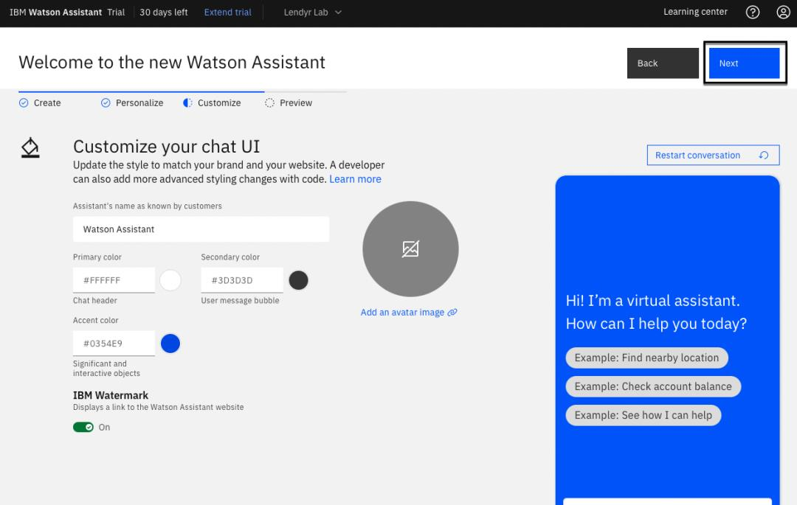
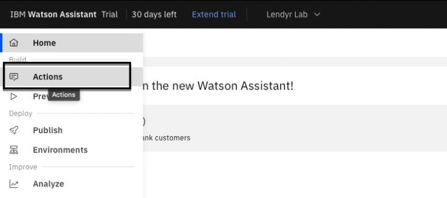

# 101: IBM Watson Assistant Hands-on Lab

## In this section

Explore what a virtual assistant built with Watson Assistant looks like from various persona 
perspectives.

## End user's perspective

Imagine you are an end user, and explore this virtual assistant build with Watson Assistant:

[Lendyr.com](http://lendyr.com/)

Try running through some of these conversations with the assistant:

| Conversation #1                                                                                                                     | Conversation #2                                                                                                  | Conversation #3                                                                                                                        | Conversation #4            |
| ----------------------------------------------------------------------------------------------------------------------------------- | ---------------------------------------------------------------------------------------------------------------- | -------------------------------------------------------------------------------------------------------------------------------------- | -------------------------- |
| **Send:** I want to apply for a student loan **Send:** What's the limit on loan amount? **Send:** I'm coming from high school | **Send:** Hey, I want to use the mortgage calculator **Send:** 400,000 **Send:** actually make it $300,000 | **Send:** hey I want to send a million dollars to myself **Send:** tomorrow **Send:** ugh just let me talk to a real person!!!!! | **Send:** loan application |

Take note of the features and functionality you see in the assistant:

- Asking questions as an end user
- Identifying the question that the end user is asking, or the action they want to take
- Allowing the end user to interrupt the conversation
- Doing something different if the end user answers "yes" versus answering "no"
- Starting over when something goes wrong
- A panel where the end user has the conversation with the assistant
- Synonyms and context (loan coming from high school = will be an undergraduate
  student)

## Setting up Watson Assistant

Starting by navigating to [IBM Cloud](https://cloud.ibm.com)

If you already have a Trial, Plus, or Enterprise instance of Watson Assistant, open it up and
create a new assistant. If you don’t have an instance of Watson Assistant, follow these
instructions to create a free Trial instance.

To create a free Trial instance, Search for "Watson Assistant" in the top search bar and click
**Watson Assistant** under **Catalog Results**.

Now we can create our assistant by:

1. Select the region that's closest to your location.
2. Select the **Trial** pricing plan. (This is the trial version of the Plus pricing plan.)
3. Agree to the **Terms and Conditions**.
4. Click on the **Create** button in the lower-right area of the page.

Now let's validate the creation of our new assistant:

1. Click the **Resource list** icon on the left-side navigation.
2. Expand the **AI/Machine Learning** section
3. You should now be able to see your newly created Watson Assistant

> Note: The service you create may have a suffix, like “Watson Assistant-hu.” These names are
> identifiers for you to distinguish between the multiple services you may create. You can change
> them if you like.

To launch Watson Assistant, click on the new service you created. From here, clicking the **Launch Watson Assistant** button will launch to the Watson Assistant homepage.

1. Input a name you like into the **Assistant name** field.
2. Provide a short description in the **Description field** (this is optional).
3. Click the **Next** button in the top-right corner of the page.

On the following screen, make these selections:

1. Select **Web** as this assistant will be accessed via a web browser.
2. Select **Banking and financial services** as the industry.
3. Select **Developer** as our builder persona.
4. Select **I want to provide confident answers to common questions** as the main purpose of the assistant.
5. Now click the **Next** button on the top-right

The next screen will now allow you to customize the look and feel of your assistant. Customize now or feel free to just click the **Next** button again in the top-right.

This screen allows you to preview the web chat of the assistant. Feel free to click the **Create** button in the top-right.

Finally, as shown on the image below, you will see the Home page of your new assistant.

## Builder's perspective

Let's explore the persona of the Builder.

To explore this perspective, you will create a copy of the Lendyr demo assistant in the new assistant that's been created.

From the Home page, click on the **Actions** tab on the left-side. This is where content is written that the virtual assistant will be trained to answer.

> Actions are a representation of the tasks you want your assistant to help your customers with.
> Each action contains a series of steps that represent individual exchanges with a customer.
> Actions allow you to build an Assistant that can easily converse with a customer with **no
> coding** knowledge needed!

Now click the **Global settings** cog icon in the top-right. We will add some predefined actions by:

1. Clicking the **Upload/Download** tab.
2. Down [this json file](https://raw.githubusercontent.com/CloudPak-Outcomes/Watson-Asst-Lab/main/action-skills/LendyrActions_v17_Live_lastchecked03Jan2023.json).
3. Then proceed to upload it into the web page by selecting the file or dropping it in.
4. Then click the **Upload** button.
5. If a modal displays click **Upload and replace**.

A toast notification should now display confirming your upload. Finally, close the global settings window.

Your assistant is now a copy of the Lendyr.com assistant!

## Developer's perspective

Developers can work in the Actions page too, but they often focus on more technical features. From the **Home** page, open the left menu and click **Integrations** on the bottom-left.

Watson Assistant Integrations add various channels, extensions, and third-party integrations to easily configure and deploy your assistant. Spend a few minutes exploring the Integrations page.

Earlier, we noted that developers spend more time on technical features than on the Actions page, where builders create new conversational flows. Why is that? Since Watson Assistant is purposefully designed to make it easy for non-technical builders to author conversational flows, developers can focus in on the parts of a virtual assistant that require their technical expertise, like integrations with other applications.

## Product manager's perspective

Finally, let's explore the perspective of a product manager.

Product managers can work in the Actions and Integrations pages, but they typically focus on overall success, continuous improvement, and expansion. Using the left menu explore the **Publish**, **Environments**, and **Analyze** pages.

