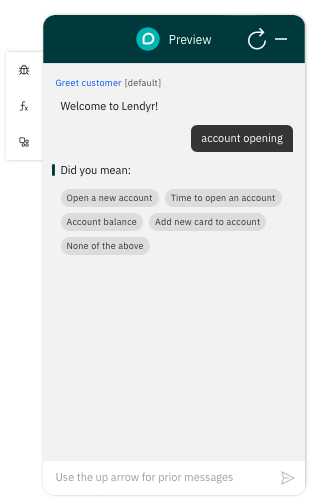
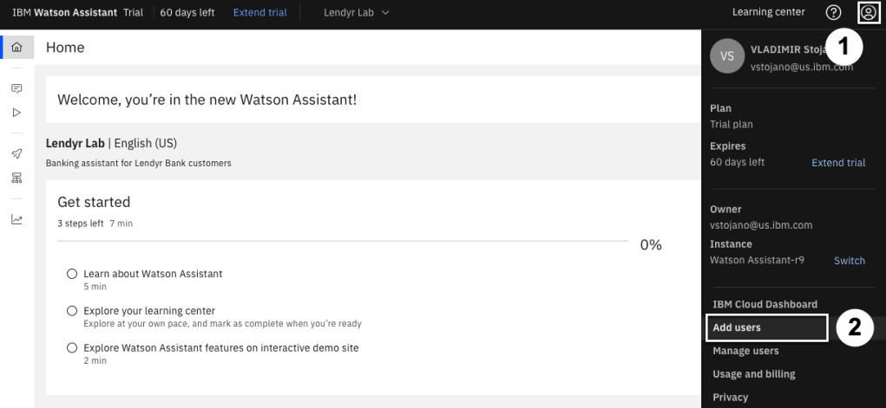
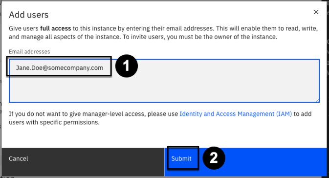

# 103: Out-the-box Artificial Intelligence

## See Disambiguation at work

To see the confidence scores, you must be in the Preview window within the Actions page of your assistant. Go back to your assistant's **Actions** page, and open the **Preview**.

Say "account opening", and note the clarifying question that your assistant asks in response to 
the input.

To view the confidence scores in your assistant:

1. Click the **Debug mode** icon.
2. Hover your mouse over the **dial icon** next to the "account opening" message.
3. This will display the confidence scores as percentages.

## Autolearning

When end users interact with your assistant, they provide the assistant with a lot of data on their behavior. Watson Assistant pays attention to this, and it learns from such behaviors over time. 

Consider disambiguation. When your assistant asks a clarifying question and shows a list of suggested actions, if end users most often click the same on (option #2, for example), then your assistant should (and does!) learn from that experience.

It learns that option #2 is likely to be the best answer to that type of question. Next time, it may list option #2 as the first choice, so end users can get to it more quickly.

And, if the pattern persists over time, your assistant can change its behavior even further. Instead of asking the customer to choose from a list of options, it will choose option #2 as the answer, rather than asking for clarification.As Watson Assistant learns, end users get the best answer more often, in fewer clicks, and their experience improves!

## Digression / Change conversation topic

### What is a digression?

We, as people, often get distracted or change the subject during a conversation. For example, 
imagine I was telling you an incredibly interesting story about seeing my friend Arvind with 
binoculars. To you, this might be far from the most interesting story you had ever heard. You 
might interrupt and say, "Wow! Also, before I forget, I got some cheap tickets to see the Jets 
next month. Want to come with me?""

End users also want to be able to change the topic when they interact with a virtual assistant. 
Watson Assistant is flexible: it can seamlessly switch between actions when the end user wants a 
change.

### See Digression at work

Here is an example of digression where Watson Assistant moves between different actions:

1. In the **Preview** type "I'm thinking about applying for a student loan".
2. Note the assistant recognizes the **Applying for a student loan** action.
3. Now type "How much can we get in loans?".
4. Note that the assistant will digress to the **Student loan amounts** action.
5. Then, once you complete the **Student loan amounts** action by selecting "Undergraduate", the assistant returns to the original "Applying for a student loan" action.

## Slot-filling

Slot-filling is a term that refers to storing information that the end user shares with the assistant. 
You can think of the assistant as storing each piece of information in a slot.

To see this in action:

1. Open a **Preview** of the assistant from the **Actions** page.
    - If you have an active preview open click the refresh button.
2. Click the `fx` button to see the slots the assistant maintains.
3. Enter some of these utterances:
    - "I want to open a new account"
    - "Investment"
    - "837479088"
4. Note how data is filled in on the **Action variable** window

This, by itself, is not an artificial intelligence feature. Artificial intelligence comes in when the 
end user corrects themselves or provides information out of order or ahead of time.

Click **Refresh** and say "I want to open a new account and my investor account is 8875888", and then select "investment" for the type of account. Note that Watson Assistant puts the investor number in its slot, even though you told Watson Assistant previously to expect it in a subsequent step.

