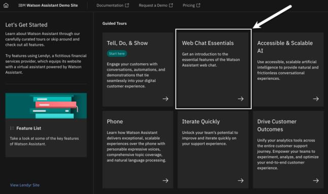
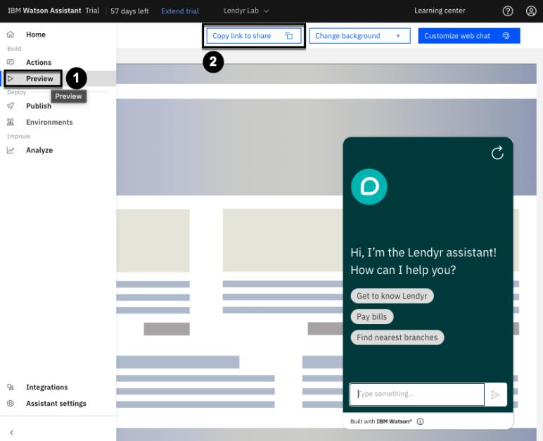

# 104: Analytics

## Introducing Analytics

### Landing on the Analytics page

Unless you thoroughly tested or experimented with your assistant as you completed previous sections of this lab, your assistant will not have a lot of data to populate its analytics. To see them:

1. Click the **Analyze** option in the left-hand menu.
2. Once there ensure you looking at the **Draft** environment.

The Analyze page displays high-level metrics on the performance of your assistant. These metrics and their underlying data are populated in real time. Take a moment to look around – you will see metrics such as number of unique users, conversations, and requests handled by the assistant in the specified date range.

### Adding data to the Analyze page via Lendyr

Open your assistant on the Lendyr using the link you created in the previous section to embed you assistant. Try out a few different conversations. To engage in an additional separate conversation with your assistant there should be a **Restart** button in upper-left menu.

After this return to the **Analyze** page. Click the **Refresh** button in the top-right corner to pull in the latest data from the conversation you just had with the assistant.

When the page refreshes, you should now see a slightly higher request and conversation count.

### Adding data to the Analyze page via Preview

Imagine you are a builder who has finished writing a set of actions that address a new use case.

You need a way to share your assistant with a testing or quality assurance (QA) team, so they can go test the updated actions before you deploy them to a live or production environment. In order to do so:

1. Go the the **Preview** page for your assistant.
2. Then click the **Copy link to share** button.
3. Open this link in a new tab.
   - As a builder or product manager, you can copy this shared link and send it to a testing team. The testing team can then use this shared link to access and test the assistant.

Once the testers access the system, you will be able to see the testing team’s conversation data appear in the Analyze page. Since you opened a new tab, imagine you are one of the testers. Go ahead and have a conversation with the assistant. Then, return to the Analyze page in your assistant, then refresh it again to pull in the data from your latest conversation.

> Note that conversations with the assistant via a Preview link generate data in the Draft environment. You can change the Analyze page to filter between Draft and Live environment data. The Draft environment data comes from the Preview page, and the Live environment data comes from the assistant in front of real end users.
