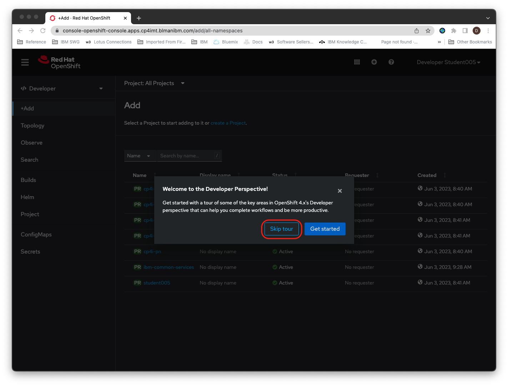
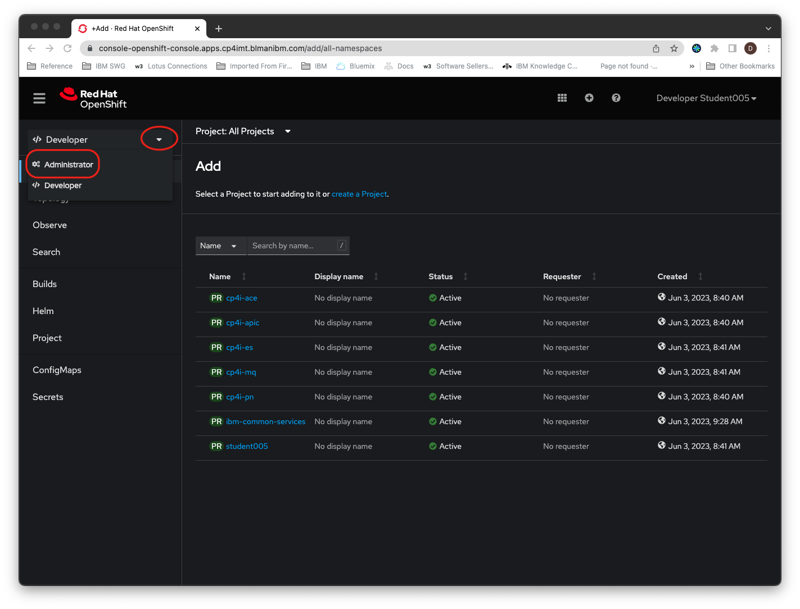
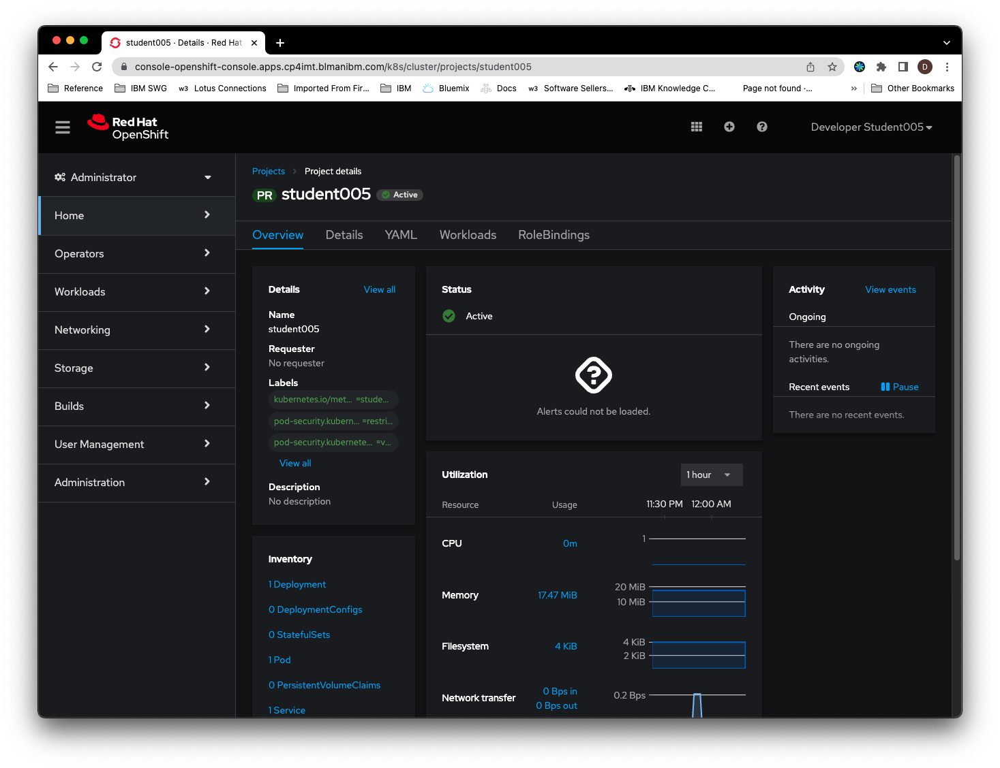

# 100: Environment Setup

> **Note:** API Connect is installed with self-signed certificates that are incompatible with some versions of the Chrome browser. We recommend that you complete these labs using Firefox, Safari, or Edge.

## Cloud Pak for Integration Platform Navigator

The Cloud Pak for Integration Platform Navigator is a web-based application that allows you to access all the components in CP4I. Your instructor will provider you with a URL for the CP4I Platform Navigator and a username and password. You will need this link to access all the CP4I components that you will use in the labs. We recommend that you keep it open in a separate tab.

To log in to the Platform Navigator do the following:

1.  Click on the link provided to you by your instructor for the Platforn Navigator:

1.  Select the **Enterprise LDAP** user repository, enter your username and password and click on **Log in**

    

    > **Note:** You may have some browser warnings about self-signed certificates. If this happens, continue to the Platform Navigator page anyway.

1.  The will launch the CP4I Platform Navigator with links to all the various CP4I components. Keep this tab open for the rest of the workshop as it has all the information and links needed for you to complete the lab exercises.

    

## OpenShift Cluster Console

You will need to access the OpenShift console to install applications used in the lab to interact with the CP4I components. Your instructor will provide you with a link. Click on the link for the OpenShift console.

1. Select the **ldapidp** user repository

1. Enter the same username and password you used in the previous step and click on **Log in**.

1. Click on **Skip tour** when prompted

   

1. Switch to the **Administrator** view

   

1. Click on the link for the project with the same name as your username.

   

1. The OpenShift console should now look like the following image. Keep this browser tab open as you will need to use the OpenShift console during the labs

   

> **Note:** You can click on any image in the instructions below to zoom in and see more details. When you do that just click on your browser's back button to return to the previous state.
