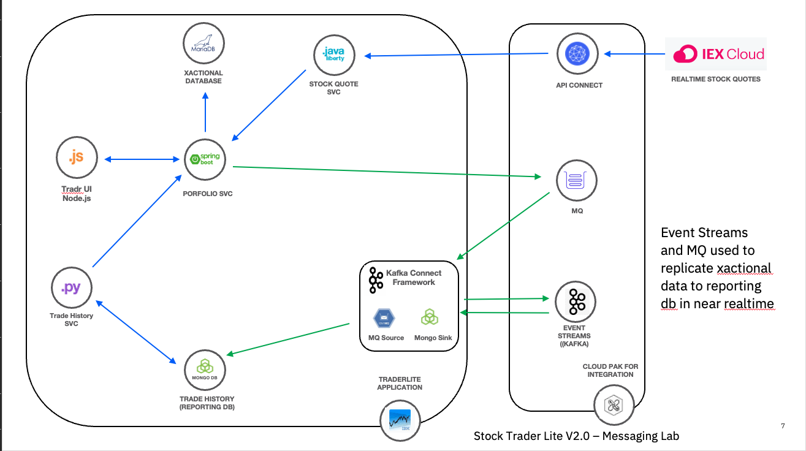
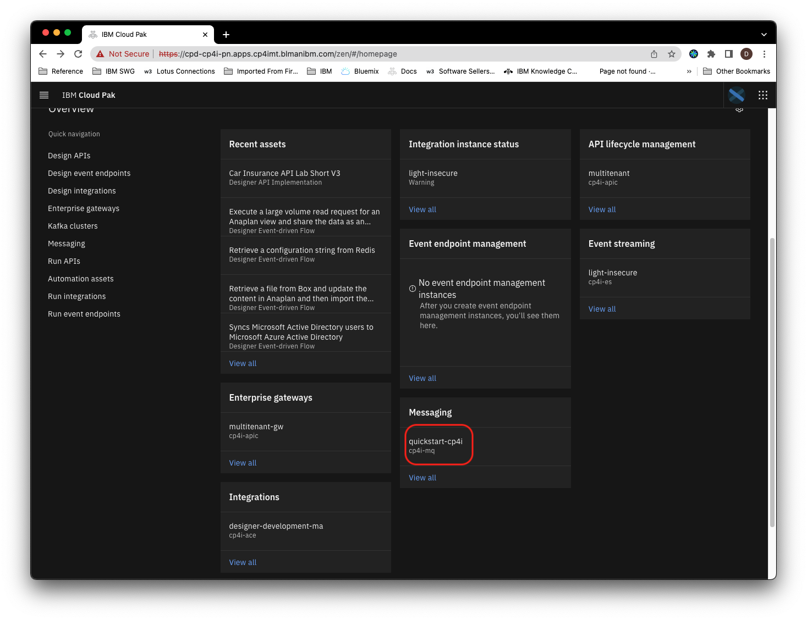
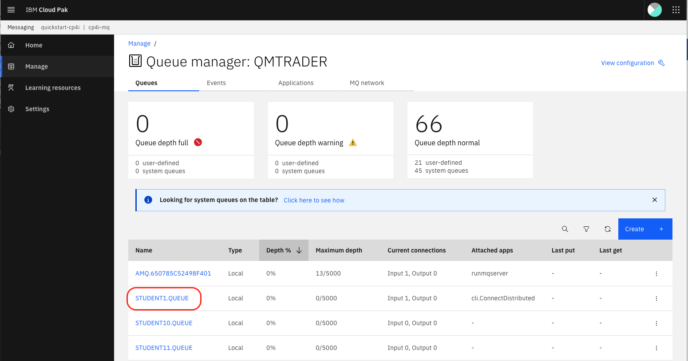
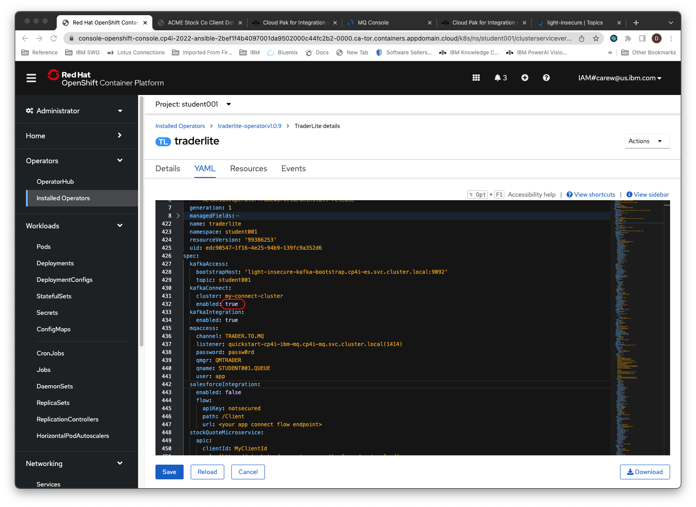
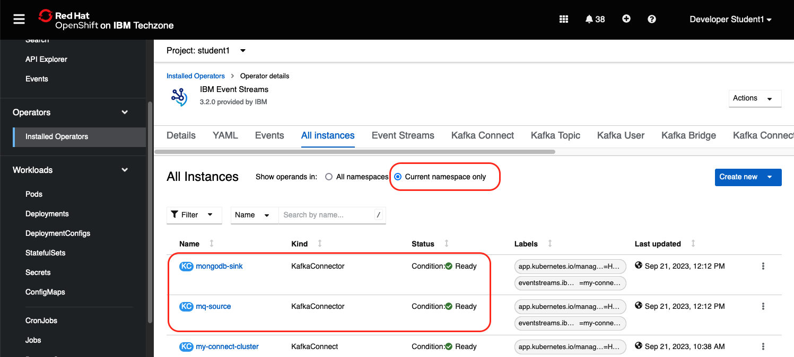
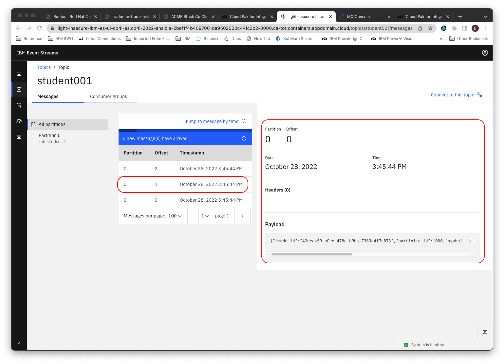

# 102: Using IBM MQ and IBM Event Streams for near realtime data replication

In this lab you will use IBM MQ and IBM Event Streams to replicate data from a transactional database to a reporting database. The pattern used allows for seamless horizontal scaling to minimize the latency between the time the transaction is committed to the transactional database and when it is available to be queried in the reporting database.

The architecture of the solution you will build is shown below:

- The **portfolio** microservice sits at the center of the application. This microservice:

  - sends completed transactions to an IBM MQ queue.
  - calls the **trade-history** service to get aggregated historical trade data.

- The **Kafka Connect** source uses the Kafka Connect framework and an IBM MQ source to consume the transaction data from IBM MQ and sends it to a topic in IBM Event Streams. By scaling this service horizontally you can decrease the latency between the time the transaction is committed to the transactional database and when it is available to be queried in the reporting database,

- The **Kafka Connect** sink uses the Kafka Connect framework and a Mongodb sink to receive the transaction data from IBM Event Streams and publishes it to the reporting database. By scaling this service horizontally you can decrease the latency between the time the transaction is committed to the transactional database and when it is available to be queried in the reporting database.

This lab is broken up into the following steps:

1. [Uninstall the TraderLite app](#step-1-uninstall-the-traderlite-app)

1. [Create a topic in the Event Streams Management Console](#step-2-create-a-topic-in-the-event-streams-management-console)

1. [Add messaging components to the Trader Lite app](#step-3-add-messaging-components-to-the-trader-lite-app)

1. [Generate some test data with the Trader Lite app](#step-4-generate-some-test-data-with-the-traderlite-app)

1. [Verify your trades have been sent as messages to IBM MQ](#step-5-view-messages-in-ibm-mq)

1. [Start Kafka Replication](#step-6-start-kafka-replication)

1. [Verify transaction data was replicated to the Trade History database](#step-7-verify-transaction-data-was-replicated-to-the-trade-history-database)

1. [Examine the messages sent to your Event Streams topic](#step-8-examine-the-messages-sent-to-your-event-streams-topic)

1. [Summary](#summary)

> **Note:** You can click on any image in the instructions below to zoom in and see more details. When you do that just click on your browser's back button to return to the previous state.

## Step 1: Uninstall the TraderLite app

If you've completed the API Connect and/or the Salesforce integration labs then you will have the app running already. For this lab it's easier to install the app from scratch so you can use the OpenShift GUI environment (as opposed to editing the YAML file of an existing instance) to select all the options needed for this app. If the app is _NOT_ installed skip to **Step 2**.

1.1 Go to the OpenShift console of your workshop cluster. Select your **_studentn_** project. In the navigation on the left select **Installed Operators** in the **Operators** section and select the **TraderLite Operator**

1.2 Click on the **TraderLite app** tab

1.3 Select current namespace only. Click on the 3 periods to the right of the existing TraderLite CRD and select Delete TraderLite from the context menu.

1.4 In the navigation area on the left select **Pods** in the **Workloads** section. You should see that the _traderlite-xxxxx-yyyyy_ pods are terminated.

> _Note: You can enter `traderlite` in the search by name input field to filter the pods._

## Step 2: Create a topic in the Event Streams Management Console

2.1 Go to the CP4I Platform Navigator browser tab or open a new one using the URL and credentials provided.

2.2 Click on the link to the Event Streams instance

2.3 If prompted to login select the **Enterprise LDAP** user registry and log in with your credentials.

2.4 Click on the **Create a topic** tile

2.5 Use your username for the name of the topic. For example, if your username is `student5` then name the topic `student5`. Click **Next**.

2.6 Leave the default for message retention and click **Next**.

2.7 Leave the default for replicas and click **Create topic**.

2.8 You should see your new topic listed.

## Step 3: Add messaging components to the Trader Lite app

In this section you will install the TraderLite app to start storing transactions as MQ messages, without setting up the KafkaConnect part that will move the transactions out of MQ, into Event Streams and then into MongoDB. This demonstrates how MQ can serve as a reliable store and forward buffer especially during temporary network disruption.

3.1 Go to the OpenShift console of your workshop cluster. Select your **_studentnn_** project.

3.2 Click on **Installed Operators** (in the **Operators** section) in the left navigation and then click on the **TraderLite Operator** in the list.

3.3 Click the **Create Instance** to start the installation of the TraderLite app.

3.4 Name the instance _traderlite_

3.5 Set the following values:

- Under **Kafka Access** select the **studentn** topic

- Enable **KafkaIntegration**

- Under **Mqaccess** select the **STUDENTN.QUEUE** queue that corresponds to your username.

3.6 Scroll down and click **Create**

3.7 In the left navigation select **Pods** (in the **Workloads** section) and then wait for all the TraderLite pods to have a status of **Running** and be in the **Ready** state.
mkdocs

> _Note: You will know the traderlite-xxxxx pods are in a ready state when the `Ready` column shows `1/1`._

## Step 4: Generate some test data with the TraderLite app

4.1 In your OpenShift console click on **Routes** in the left navigation under the **Networking** section and then click on the icon next to the url for the **tradr** app (the UI for TraderLite)

4.2 Log in using the username `stock` and the password `trader`

4.3 Click **Add Client** fill in the form. You must use valid email and phone number formats to avoid validation errors.

4.4 Click **Save**

4.5 Click on the **Portfolio ID** of the new client to see the details of the portfolio

4.6 Buy some shares of 2 or 3 different companies and then sell a portion of one of the shares you just bought. To buy shares, click the `Buy Stock` button, then select a company and enter a share amount. To sell shares, click the `Sell stock` button, then select the company symbol and enter the number of shares to sell.

> **Note:** Your ROI will be wrong because we are not yet replicating the historical trade data that goes in to the calculation of the ROI.

## Step 5: View messages in IBM MQ

5.1 Go to the CP4I Platform Navigator browser tab or open a new tab with the provided URL and credentials.

5.2 Click on the link to the MQ instance.

5.3 If prompted to login select the **Enterprise LDAP** user registry and log in with your credentials.

5.4 Click on the **Manage QMTRADER** tile

5.5 Click on the **STUDENTN.QUEUE** queue that corresponds to your username.

5.5 You should see messages for the trades you just executed. The number of messages in the queue will vary based on the number of buy/sell transactions you performed in the previous steps.

5.6 Keep the browser tab with the MQ web interface open as you'll need it later in the lab.

## Step 6: Start Kafka Replication

In this section you will configure the TraderLite app to start moving the transaction data out of MQ, into Kafka and then into the MongoDB reporting database.

6.1 Go to the OpenShift console of your assigned cluster. In the navigation on the left select **Installed Operators** and select the **TraderLite Operator**

6.2 Click on the **TraderLite app** tab

6.3 Click on the 3 periods to the right of the existing TraderLite CRD and select **Edit TraderLite** from the context menu.

6.4 Scroll down to line 432 and set **Kafka Connect enabled** to **true** (leave all the other values unchanged).

6.5 Click **Save**.

6.6 In the navigation on the left select **Installed Operators** and select the **Event Streams** operator.

6.7 Click on the **All instances** tab and choose **Current namespace only** and wait for the _mq-source_ and _mongodb-sink_ connectors to be in the _Ready_ state before continuing.

6.8 Go back to the browser tab with the MQ Console and verify that all the messages have been consumed by the _mq-source_ connector. _(Note: You may need to reload this browser tab to see that the messages have been consumed.)_

## Step 7: Verify transaction data was replicated to the Trade History database

7.1 Go to the OpenShift console of your workshop cluster. In the navigation on the left select **Routes** in the **Networking** section.

7.2 Copy the link for the _trade-history_ microservice and paste it into a new browser tab.

> **Note:** You will get a 404 (Not Found) message if you try to access this URL as is. This is because the _trade-history_ microservice requires extra path information.

7.3 Append the string `/trades/1000` to the address you pasted - you should get back some JSON with the test transactions that you ran earlier.

## Step 8: Examine the messages sent to your Event Streams topic

8.1 Go to the CP4I Platform Navigator browser tab or open a new one with the URL and credentials provided.

8.2 Click on the link to the Event Streams instance

8.3 If prompted to login select the **Enterprise LDAP** user registry and log in with your credentials.

8.4 Click on the topics icon on the left hand side.

8.5 Click on th topic that corresponds to your username.

8.6 Select a message to see it's details

## Summary

Congratulations! You successfully completed the following key steps in this lab:

- Configured the Trader Lite app to use MQ
- Deployed Kafka Connect with IBM Event Streams
- Generated transactions in the Trader Lite app and verified that the data is being replicated via MQ and Event Streams
