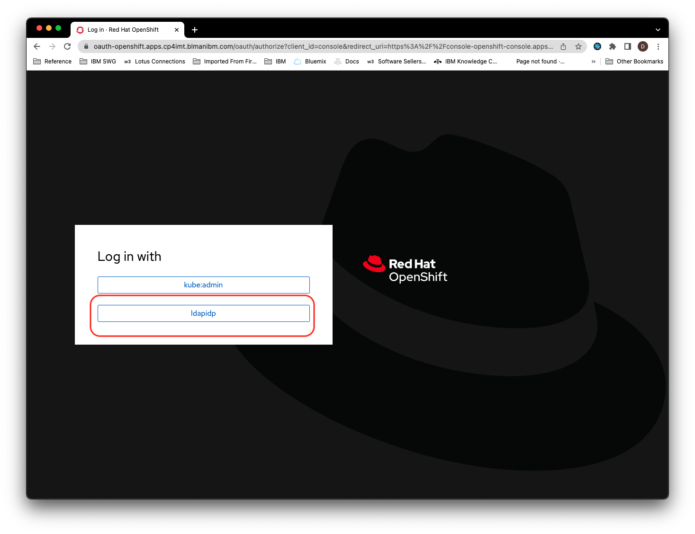
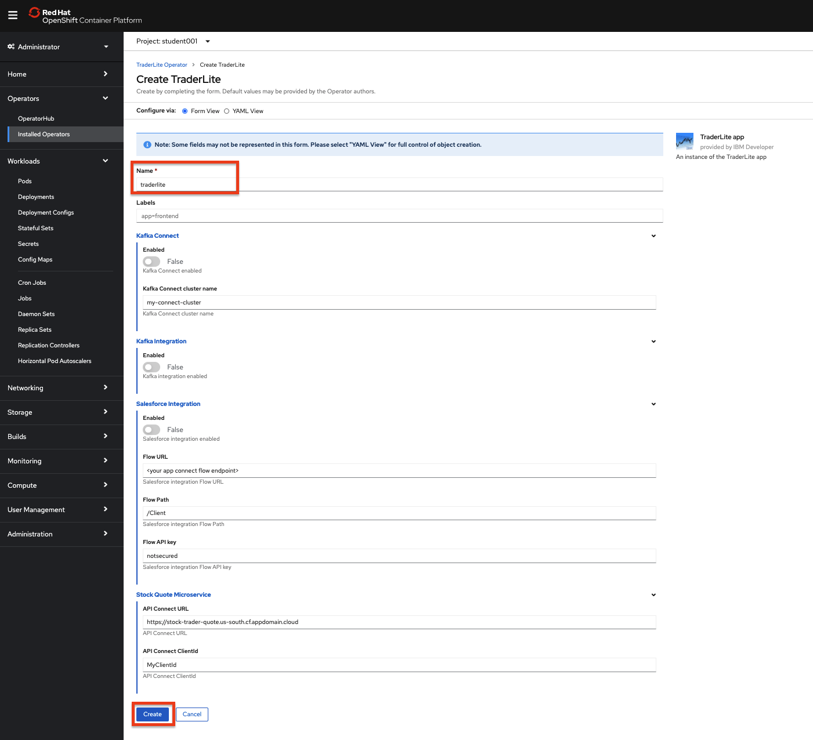

# 105: Preguntas frecuentes

1.  [¿Cómo se accede a la consola del taller de OpenShift?](#your-workshop-openshift-cluster-console)
2.  [¿Cómo puedo acceder al navegador de la plataforma CP4I?](#cp4i-platform-navigator)
3.  [No tengo la aplicación TraderLite, ¿cómo puedo instalarla?](#traderlite-application-installation)

> **Nota:** Puede hacer clic en cualquier imagen de las siguientes instrucciones para ampliarla y ver más detalles. Cuando lo hagas, haz clic en el botón Atrás de tu navegador para volver al estado anterior.

---

## La consola del clúster OpenShift de su taller

Usted tendrá que acceder a la consola OpenShift para instalar aplicaciones utilizadas en el laboratorio para interactuar con los componentes CP4I . Su instructor le proporcionará un enlace . Haga clic en el enlace de la consola OpenShift.

1.  Seleccione el repositorio de usuarios **ldapidp**

    

2.  Introduzca el mismo nombre de usuario y contraseña que utilizó en el paso anterior y haga clic en **Iniciar sesión**.

3.  Haga clic en **Saltar recorrido** cuando se le solicite

    

4.  Cambiar a la vista **Administrador**

    

5.  Haga clic en el enlace del proyecto con el mismo nombre que su nombre de usuario.

    

6.  La consola de OpenShift debería parecerse ahora a la siguiente imagen. Mantenga esta pestaña del navegador abierta ya que necesitará utilizar la consola de OpenShift durante los laboratorios

    

## Navegador de la plataforma CP4I

El Cloud Pak for Integration Platform Navigator es una aplicación web que le permite acceder a todos los componentes de CP4I. Su instructor le proporcionará una URL para el CP4I Platform Navigator y un nombre de usuario y contraseña. Usted necesitará este enlace para acceder a todos los componentes de CP4I que utilizará en los laboratorios. Le recomendamos que lo mantenga abierto en una pestaña separada.

Para iniciar sesión en el Navegador de la Plataforma haga lo siguiente:

1.  Haga clic en el enlace que le ha proporcionado su instructor para el Navegador Platforn:

2.  Seleccione el repositorio de usuarios **Enterprise LDAP**, introduzca su nombre de usuario y contraseña y haga clic en **Iniciar sesión**

    

    > **Nota:** Es posible que aparezcan advertencias del navegador sobre certificados autofirmados. Si esto ocurre, continúe de todos modos con la página Navegador de la plataforma.

3.  Se abrirá el Navegador de la Plataforma CP4I con enlaces a todos los componentes de CP4I. Mantenga esta pestaña abierta durante el resto del taller, ya que contiene toda la información y los enlaces necesarios para completar los ejercicios de laboratorio.

    

## Instalación de la aplicación Traderlite

La aplicación traderlite utilizada en este taller se instala como parte de los laboratorios de integración API Connect y/o Salesforce. Si no ha completado ese laboratorio, siga estos pasos para instalar una instancia de la aplicación.

1.  En otra pestaña del navegador, vaya a la consola OpenShift del clúster de su taller.

2.  Haga clic en **Proyectos** en el menú de navegación de la izquierda y, a continuación, haga clic en su proyecto **_student001_** de la lista.

    

3.  Haga clic en **Operadores instalados** en el menú de navegación de la izquierda y, a continuación, haga clic en el **operador TraderLite** de la lista.

    

4.  Haga clic en **Crear Instancia** para iniciar la instalación de la aplicación TraderLite.

    

5.  Nombre la instancia _traderlite_ y deje todo lo demás con sus valores por defecto. Haga clic en **Crear**

    

6.  En el menú de navegación de la izquierda, seleccione **Pods** en la sección **Workloads** y espere a que todos los pods TraderLite tengan el estado **Running** y estén en el estado **Ready**.

    > _Nota: Puede introducir `traderlite` en el campo de búsqueda por nombre para filtrar los pods._

    
