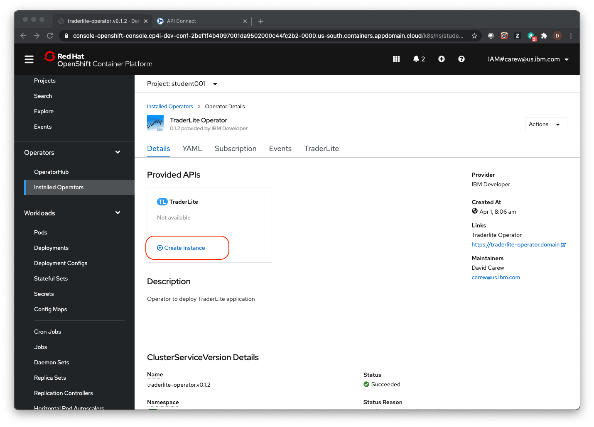

# Exercise - Sync Salesforce data using IBM App Connect Enterprise

In this lab you will create App Connect flows to sync client data in the  **IBM Trader Lite** app to Salesforce. This will occur whenever a user of the  **IBM Trader Lite** app creates a  portfolio for a new client or accesses the data of an existing client.

In order to accomplishment this at a minimum 2 flows are needed:

1. A URL driven flow to push a new client to a Salesforce contact when the **IBM Trader Lite** app creates a portfolio for a new client

2. An Event driven flow to push changes to the  **IBM Trader Lite** app whenever a contact's data is updated in Salesforce

The architecture of the app is shown below:

The **portfolio** microservice invokes the REST endpoint of the new flow whenever a new client is created or read by the app and this results in a new contact being created in, or read from  Salesforce.

This lab is broken up into the following sections. Salesforce instance creation and connection will typically be done by an instructor prior to the workshop. All steps are documented here

1. [Prerequisites](#prerequisites)

2. [INSTRUCTOR - Sign up for Salesforce Developer Edition](#section-1-sign-up-for-salesforce-developer-edition)

3. [INSTRUCTOR - Create a Salesforce Connected App](#section-2-create-a-salesforce-connected-app)

4. [INSTRUCTOR - Setup connectivity to Salesforce in App Connect Designer](#section-3-setup-connectivity-to-salesforce-in-app-connect-designer)

5. [Create the flows in App Connect Designer](#section-4-create-the-flows-in-app-connect-designer)

6. [Create an Integration Server instance and deploy your flows](#section-5-create-an-integration-server-instance-and-deploy-your-flows)

7. [Get the REST endpoint of your App Connect Flow](#section-6-get-the-rest-endpoint-of-your-app-connect-flow)

8. [Test your App Connect Flow with Trader Lite](#section-7-test-your-app-connect-flows-with-trader-lite)

9. [Summary](#summary)

## Prerequisites

The *TraderLite* application needs to be up and running on your cluster. If you've completed the API Connect and/or the event streaming labs then you will have the app running already. If you have not completed either of those labs, follow these instructions to install the TraderLite application before continuing

1. In a separate browser tab log in to the OpenShift console using the URL and credentials assigned to you for the workshop.

2. Click on **Projects** in the left navigation and then click on your **_studentn_** project in the list

3. Click on **Installed Operators** (in the **Operators** section) in the left navigation and then click on the **TraderLite Operator** in the list.

4. Click the **Create Instance** to start the installation of the TraderLite app.

5. Name the instance _traderlite_ and leave everything else with default values.  Click **Create**

6. In the left navigation select **Pods** (in the **Workloads** section) and then wait for all the TraderLite pods to have a status of **Running** and be in the **Ready** state.

> _Note: You will know the traderlite-xxxxx pods are in a ready state when the `Ready` column shows `1/1`._

## Section 1: Sign up for Salesforce Developer Edition

1.1 In your browser go to the following URL to sign up for Salesforce Developer Edition - a full featured version of the Salesforce Lightning Platform.

> **Note:** If you already have access to the Salesforce Developer Edition or a paid version of Salesforce, skip to **Step 1.2**.

   [Salesforce Developer Edition signup](https://developer.salesforce.com/signup)

1.2 Enter the required information and follow the prompts to complete the signup process.

## Section 2: Create a Salesforce Connected App

In this section you'll create a *Connected App* in Salesforce so that the App Connect flows that you create later will be able to access your Salesforce data.

2.1 Login to [Salesforce](https://www.salesforce.com)  

2.2 Click on your avatar (top right) and select **Switch to Salesforce Classic** from the context menu.

  

2.3 Click on **Setup**.

  

2.4 In the left navigation area, scroll down to the **Build** section, expand **Create** and click on **Apps**

  

2.5 Scroll down to the **Connected Apps** section and click on **New**

  

2.6 Fill in the required values for a new Connected App

   a. Set the **Connected App Name** property to `IBM App Connect`

   b. Set the **API Name** to `IBM_App_Connect`

   c. Enter your email address as the **Contact Email**

  

2.7 Configure the OAuth settings

   + Select the **Enable OAuth Setting** check box.

   + Set the **Callback URL** to `https://www.ibm.com`

   + Under **Selected OAuth Scopes** select  **Manage user data via APIs (api)** and click the arrow under the **Add** label

  

2.8 Scroll down to the bottom of the web page and click **Save**.  You should see a message indicting that the Connected App can take up to 10 minutes to take effect. Click **Continue**.

2.9 In the **API (Enable OAuth Settings)** section click on **Manage Consumer Details**

  

2.10 You should be prompted for a Two-Factor Authentication prompt for a Verification code. Ener the code you received and click **Verify**

  

2.11 Copy the **Consumer Key** and **Consumer Secret** to a text file.  You will need them later to connect to Salesforce.

  

2.12 Click on your user name and select **My Settings**. On the left under the **Personal** section click on **Reset My Security Token**. Click on the **Reset Security Token** button.

  

2.13 Check your email for the email address that you use as your Salesforce username. You should receive an email from  Salesforce with the subject **Your new Salesforce security token**. Copy the **Security Token** to the same text file that you used for the  **Consumer Key** and **Consumer Secret**

  

> **Note:** Please wait 5-10 minutes before continuing to the next section.

## Section 3: Setup connectivity to Salesforce in App Connect Designer

App Connect Designer is a component of Cloud Pak for Integration that provides an authoring environment in which you can create, test, and share flows for an API. You can share your flows by using the export and import functions, or by adding them to an Asset Repository for reuse.

3.1 Go to the CP4I Platform Navigator browser tab or open a new one with the URL and credentials provided for the workshop.

3.2 Click on the _designer-development-ma_ in the Integrations tile to navigate to the App Connect Designer page.

3.2 If prompted to login select the Enterprise LDAP user registry and log in with your workshop credentials.

3.3 Click the **Catalog** icon

   

3.4 Expand **Salesforce**  and then click **Connect** 

   

3.5 For **Authorization method**  select **Provide a username, password, and client credentials (OAUTH2...** and click **Continue**

3.6 Enter the following values referring to the text file from  the previous section where you saved your Salesforce credentials.

   + For the **Login URL** enter `https://login.salesforce.com`

   + For the **Username** enter the email you use to login to Salesforce

   + For the **Password** enter the password you use to login to Salesforce. Then append the value of the  **Security Token**  (that you saved in the previous section) to the password. For example if your password is `foo` and your security token is `bar` you would enter `foobar` into the password field.

   + For the **Client Id** copy and past the value of the  **Consumer Key** (that you saved in the previous section).

   + For the **Client Secret** copy and past the value of the  **Consumer Secret** (that you saved in the previous section).

   

> **NOTE**: If you receive an error that the connection to Salesforce failed, then it is recommended to re-check the credentials and try again. You can re-enter the credentials for this account by clicking on the three dots next to the account name and clicking **Update Account** from the subsequent menu. The previous details are cleared, so you will need to enter them all again.   

3.7 Click on **Connect**.

## Section 4: Create the flows in App Connect Designer

4.1 In App Connect Designer, click the **Dashboard** icon.

  

4.2 Click  **New** and select **Flows for an API**

  

4.3 Name the flow using your unique student number for the workshop. For example `sfpush1` for _student1_.  Name the model `Client`

  

4.4 Click **Create Model**

4.5 Next you will add the properties of the input data for your flow.

> **Note**: Name them exactly as instructed (including matching case) so that your flow will work with the *TraderLite* app.

   + Enter `ClientId` as the first property and then click **Add property +**

   + Enter `FirstName` as the next property and then click **Add property +**

   + Enter `LastName` as the next property and then click **Add property +**

   + Enter `Email` as the next property and then click **Add property +**

   + Enter `MobilePhone` as the next property

   When you're done the screen should look like the following:

   

4.6 Click  **Operations** and then select **Create Client**

   

4.7 Click **Implement flow**

4.8 Click on the **+** icon.

   + Scroll down to Salesforce

   + Select your account from the dropdown

   + Expand **Contacts**

   + Click **Create Contact**

   

4.9 Next you'll map the properties from  your model to the Salesforce Contact properties. The properties have the same names as their Salesforce equivalents so click on **Preview 6 mapping suggestions** and then **Apply suggestions** to complete the mapping.

  

4.10 Click on **Response** to configure what will be returned by the flow. Click in the text box for the **Client Id** property and then click on the suggested mapping  to  **Contact ID**.

  

4.11 Next you'll test the flow to make sure it works. Click on Salesforce icon (the middle part of the flow) and then click on the edit icon.

  

4.12 Click on **Request body parameters** and then edit the input parameters that will be used in the test.

> **Note**: Salesforce does enforce formatting for telephone numbers and email addresses so use valid formatting for those.

  + Set the **Client Id** to blank. This value will be generated by Salesforce and returned.

  + Enter a **FirstName** value.

  + Enter a **LastName** value.

  + Enter an **Email** in a valid email format

  + Enter a **MobileNumber** in a valid format

  

4.13 Click the "Try It" icon shown in the above screenshot. Click **Continue** when prompted and then verify that the operation returns a 200 HTTP status code.

   

4.14 Click **View details** to see the raw data returned from  the call to Salesforce.

4.15 Click **Done** (top right of screen)

4.16 Next you'll build a reverse flow. One that will call an API in the TraderLite app whenever a Salesforce contact is updated Click on the **Catalog** icon and then click on **+** to add your API. 

  

4.17 In your browser right click on the following link, right click and select **Save Link As ...** from the context menu. Save the file *sfsync.json* to  your local system. This is an OpenAPI definition of the API in TraderLite that will update client data.

   [sfsync.json](https://raw.githubusercontent.com/ibm-build-lab/VAD-VAR-Workshop/main/static/cp4i/sfsync.json)

4.18  Open sfsync.json in an editor and make sure the host property on line 7 includes your **studentn** login value. The file is set up to work for student1, so other students will need to update the host value with their unique value. **Save** the updated file to use in the next step.

  

4.19  Select **OpenAPI** as the **Document type** and drag or select the  *sfsync.json* file you just downloaded and updated.

  

4.20 Click **Next** and edit the Name field to include your **studentn** identifier.  This will help you distinguish your connector from others in the workshop.

  

4.21 click **Import API**

4.22 Scroll down to your imported API (**Studentn SF for Trader Lit**), click on the down arrow and then on **Connect**

  

4.23 Accept the default values and click  **Connect** again

4.24 Click on the **Dashboard** icon

  

4.25 Click **New** and select **Event-driven flow**

4.26 Name the flow with your unique student number (i.e. `sfevent1` for `student1`)                    

4.27  Expand the Salesforce section and select the salesforce account being used for the workshop.  This will be set up before the workshop by your instructor. Under **Contacts** select **Updated contact**

  

4.28 Click the **+** icon. Expand your **Studentn SF Sync for Trader** API and click on **PUT /salesforce/contacts**

  

4.29 Click **Preview 4 mapping suggestions** to start  the field mappings between the Salesforce contact and your API.

4.28 Place your cursor in the **ClientId** field and select the Salesforce **Contact ID** field

  

4.29 Click on the **Dashboard** icon at the left

4.30 Export your `sfevent1` flow by clicking on the 3 period icon and selecting **Export..** from the context menu.

  

4.31 Select **Runtime flow asset (BAR)** and click **Export**

4.32 Click **Save**

4.33 Repeat for your  `sfpush1` flow, also selecting **Runtime flow asset (BAR)** and saving to your local system.

## Section 5: Create an Integration Server instance and deploy your flows

In this step you'll create an Integration Server instance and deploy your flows to it.

5.1 Navigate to the App Connect Dashboard app by opening the Platform Navigator and clicking on the _db-01-quickstart_ link.

  

5.2 If prompted to login select the **Enterprise LDAP** user registry and log in with your credentials.

5.3 Click **Deploy integrations**

  

5.4 Select the **Quick start integration** tile and click **Next**

  

5.5 Upload your `sfevent1.bar` file and click **Next**

  

5.6 Wait until you see an existing configuration loaded (it can take a few seconds during which time it asks you to create a new config - ignore that) .  Once the config loads, select the **Accounts** type and leave the others unchecked. Click **Next**

  

> **Note**: Without *Accounts* checked, your flow will  not work when deployed . This allows the secret with your Salesforce credentials to be accessible to the deployed flow.

5.7 Name the server `sfevent1`.

5.8 Ensure that the **Designer flows mode** is set to **local**, the  **Designer flows type** is set to **event-driven-or-api-flows** and click  **Create** .

  

5.9 It will take a while for the server to provision so you can continue deploying the other flow. Click **Deploy integrations**

  

5.10 Select the **Quick start integration** tile and click **Next**

5.11 Upload your `sfpush1.bar` file and click **Next**

5.12 Select the **Accounts** type and leave the others unchecked. Click **Next**

> **Note**: Without *Accounts* checked, your flow will  not work when deployed . This allows the secret with your Salesforce credentials to be accessible to the deployed flow.

5.13 Name the server `sfpush1`.

5.14 Ensure that the **Designer flows mode** is set to **local**, the  **Designer flows type** is set to **api-flows** and click  **Create** .

  

5.15 Wait for both servers be in the **Ready** state. They will take about 2 or 3 minutes.

> **Note:** You may have to refresh the page to get the latest server status

  

## Section 6: Get the REST endpoint of your App Connect Flow

6.1 In the App Connect Dashboard click on the tile for your `sfpush1` server

6.2 Click on the API tile to see the details of the flow's API

  

6.3 You should see the details of your flow's API

  

6.4 Copy the **Endpoint** and save it in a text file.

## Section 7: Test your App Connect Flows with Trader Lite

7.1 Go to the OpenShift console of your assigned cluster. Select the **student001** project. In the navigation on the left select **Installed Operators** and select the **TraderLite Operator**

  

7.2 Click on the **TraderLite app** tab

  

7.3 Click on the 3 periods to the right of the existing TraderLite CRD and select **Edit TraderLite** from the context menu.

  

7.4 Scroll down to around line 211 and change the **enabled** field value to *true* and paste the endpoint of your API flow that you saved earlier as the **url** value around line 215.

  

7.5 Click **Save**.

7.6 In the navigation area on the left select **Pods** in the **Workloads** section. You should see that a new instance of the Portfolio pod has been started.

  

7.7 Wait until the new pod is in the  **Ready** state and the previous pod has terminated before continuing.

> **Note**: You will know the traderlite-portfolio-xxxxx pod is in a ready state when the `Ready` column shows `1/1`. You will also see that the created column will have a recent timestamp value.

7.8 In  the left navigation  click on **Routes** (in the **Networking** category) and then click on the icon next to the url for the **tradr** app (the UI for TraderLite)

  

7.9 Log in using the username `stock` and the password `trader`

  

7.10 Click **Add Client** and fill in the form. You must use valid email and phone number formats to avoid  errors.

  

7.11 Click **Save**

7.12 Click on the **Portfolio ID** of the new client to see the details of the portfolio

  

7.13 Click on the **Client Details** tab. Because the TraderLite app is now calling your *sfpushn* flow whenever a new client is created, you should see a Salesforce Contact Id in the form of a link.

  

7.14 Right click on the Contact Id link and select **Open Link in New Tab** to see the contact in Salesforce (you may be prompted for your Salesforce credentials, your instructor can provide these for the account that was previously created)

> **Note**: If the link does not work because of geo specific URLs for Salesforce, login in to Salesforce by yourself and look at the new contact. The easiest way to find the new contact is to enter the first and last name in the search bar in Salesforce.

  

7.15 Now test your reverse flow (i.e. when a contact is modified in Salesforce). Click on the **Edit** button for the contact and change  the mobile number. Click **Save**.

  

7.16 Go back to the tab with the TraderLite app and refresh the page with the Client Details. Click on the **Client Details** tab and verify that the phone number has been updated with the new value you added in Salesforce.

  

## Summary

Congratulations ! You successfully completed the following key tasks in this lab:

* Connected to Salesforce
* Created an App Connect designer flow to push client data to Salesforce contacts.
* Created an Event Driven flow to push Salesforce contact updates to the TraderLite App via an API call
* Deployed the flows as Integration Servers in App Connect Dashboard
* Tested the flow with the Trader Lite app.
