# 101: Demonstration of Dataflow

## Initial set-up

### Register for the Business Partner Databand demo environment

Open a session in your preferred web browser at [https://ibm-bp-demo.databand.ai/](https://ibm-bp-demo.databand.ai/) and click on **Registration**. Complete the form and click on **Register**. Provide the e-mail address you used to register in the workshop slack so the workshop team can activate your registration.

## Databand Overview

Databand provides an overview of an organization's data pipelines that are running in multiple workflow environments. To help you understand the key features of Databand, this lab will walk through several parts of the user interface. Starting from the main dashboard, you will see how to view the overall health of the pipelines and see the top errors and failing pipelines. Then the lab continues through analyzing alerts, looking at pipeline and data quality issues. Then the tour continues over the Pipeline and Datasets panels showing how to use these to investigate issues and understand impacts of failures. The run metadata shown in the demonstration environment comes from pipeline runs in an Airflow cluster. Several of the examples you will observe are based on a hypothetical processing pipeline of live 311 (city customer service requests) data for New York City. The code for the pipelines is intentinoally configured to throw various types of errors at specific times to provide examples of typical failures in a production environment.

1. If you have not already done so, [Log in to the Business Partner Databand demo environment](https://ibm-bp-demo.databand.ai/). This will bring you to the main Databand dashboard

   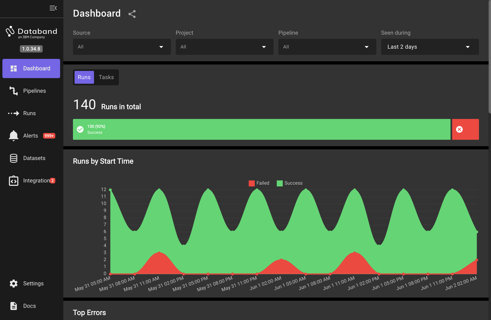

   The dashboard shows an overview of pipeline runs that have been observed during a time window specified by the filter in the upper right. Other dashboard filters allow selection of specific sources (for example an Airflow cluster or DataStage instance) and the projects or specific pipelines of interest. Scroll down on the dashboard view to show the top errors and pipeline statistics. The pipeline statisitics include failures and errors, a count of runs, their average runtime and total pipeline runtime.

## Alerts

1. Alerts are one of the main features that data engineers will find valuable in Databand. Click on the left hand **Alerts** item to bring up the alerts display

   

1. Investigate a specific critical alert by setting up a filter. Click on the **Filter** button to bring up a list of filtering criteria.

   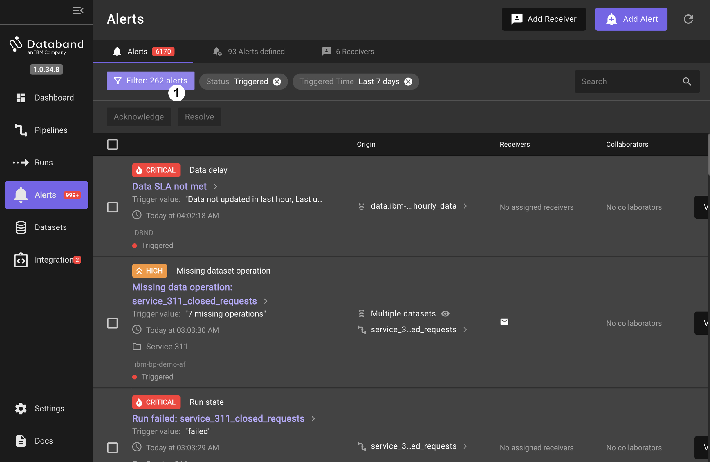

1. Select a **Severity** type of **Critical**, then expand **Assets**, followed by **Project** and search for and select the **Global Sales** project.

   

1. Click on the **Save** button to apply the filter.

   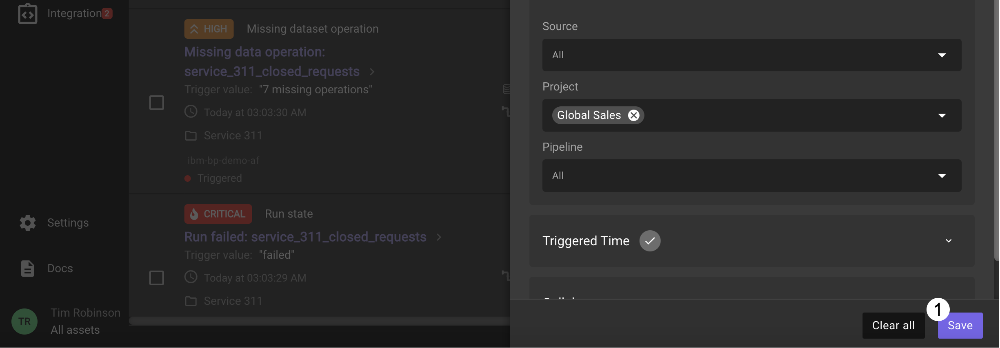

1. Click on the first critical alert **Run failed: Global Sales DAG**

   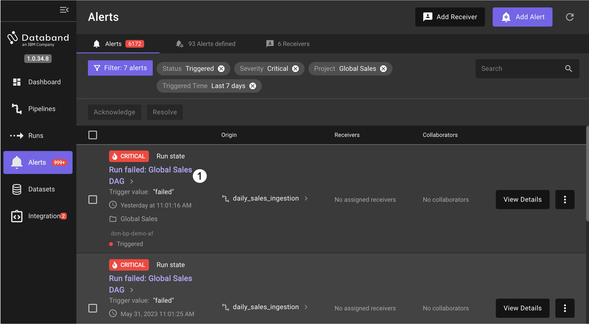

   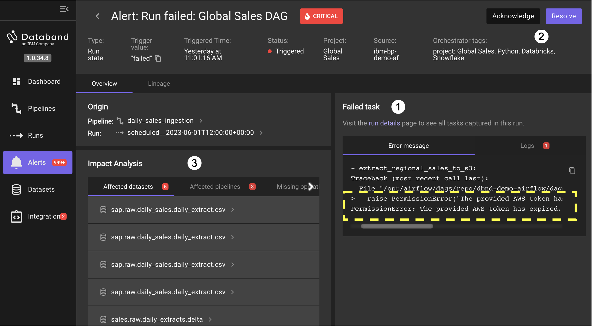

   Look at the **Failed task** panel on the right. This panel zooms right in to the specific error message from the logs of the failing task of the pipeline. This accelerates detection of the root cause, an expired AWS token being used by the task in the pipeline.

   When an engineer is going to work on correcting this issue they can first **Acknowledge** the issue, then perform activities to address the root cause in the error. Then after resolving the problem, they mark the alert notification handled by clicking on the **Resolve** button.

   The Impact Analysis shows the affected datasets, affected pipelines and missing operations as a result of the issue from the alert. Select each tab to see a list of what is affected.

1. Click on the **Lineage** tab in the Alert view to open a flow-like view showing the failure in the pipeline and the affected datasets

   

   

1. A more detailed view of downstream pipelines, their tasks and datasets can be shown by clicking on the **Downstream pipelines** button. After switching to this view, may need to scale and drag the view to see the pipeline causing the alert, and then see all of the related pipelines that process the output from the alerting pipeline.

   

   This view shows that each of the downstream pipelines: `na_sales_processing`, `eu_sales_processing`, and `as_sales_processing` will not be able to correctly process the latest data due to the failed task. Also in this **Lineage** view you can click on tasks and datasets and see how they are related to each other.

1. Switch to another alert by going back to the **Alerts** panel and setting a filter for **Severity** of **Medium** then expand **Assets**, followed by **Project** and search for and select the **Service 311** project.

   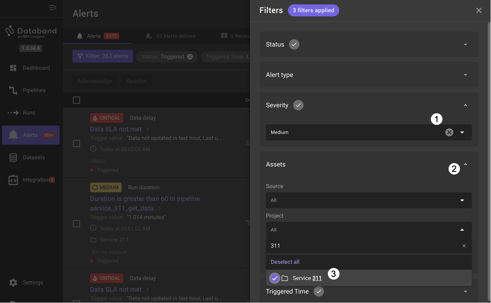

1. Click on the **Save** button to apply the filter.

   

1. Click on one of the items that has a trigger time close to 11:00 PM UTC (tip: hover over the trigger time to see the entry in UTC)

   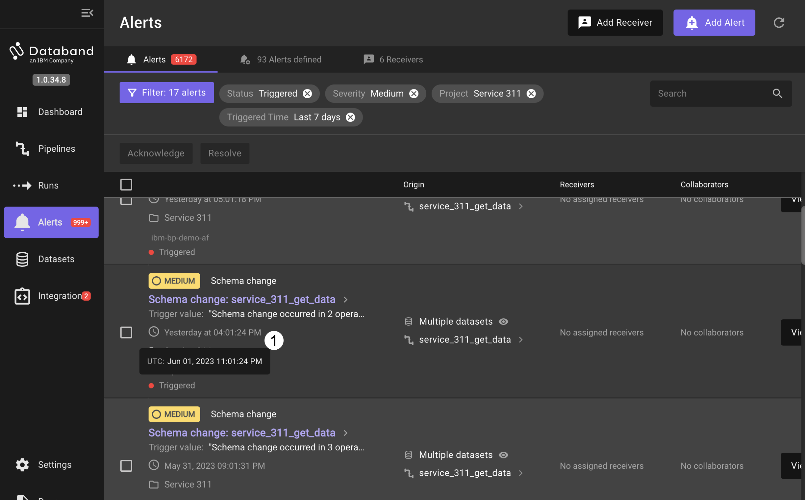

   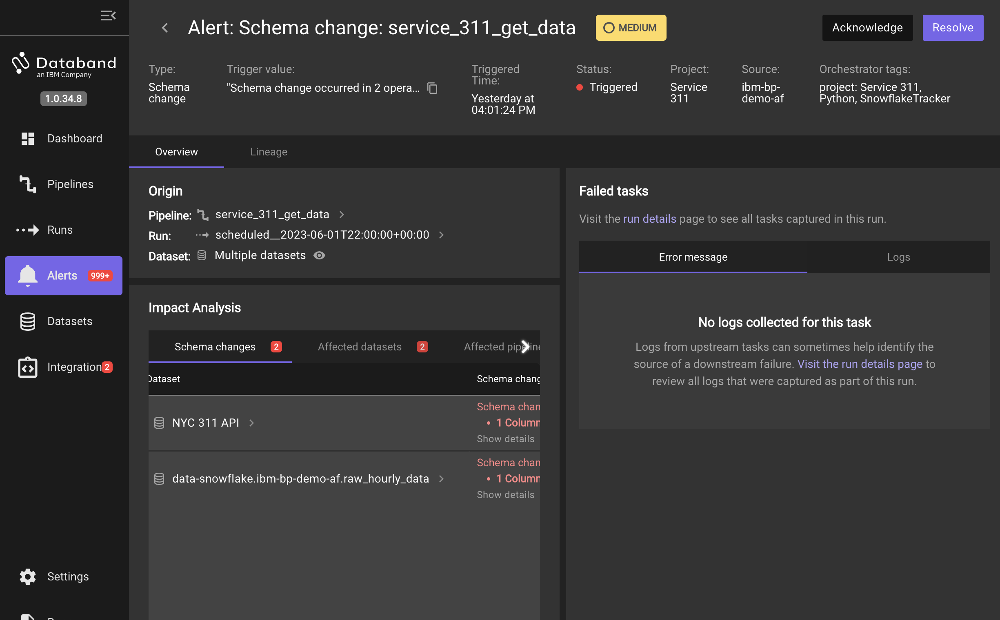

   Observe that this pipeline does not have any failed tasks. Databand has detected a change in the schema being handled in the pipeline and the specifics are displayed in the **Impact Analysis**. The analysis has different information than the previous alert which now includes the schema changes and the affected datasets and pipelines.

1. Click on **Show details** over one of the schema change messages to see the actual change. In this case, the `incident_address` data is no longer appearing in the `NYC 311 API` dataset as read by the pipeline in the `get_hourly_data` task. This is an alteration of the schema from the previous pipeline run.

   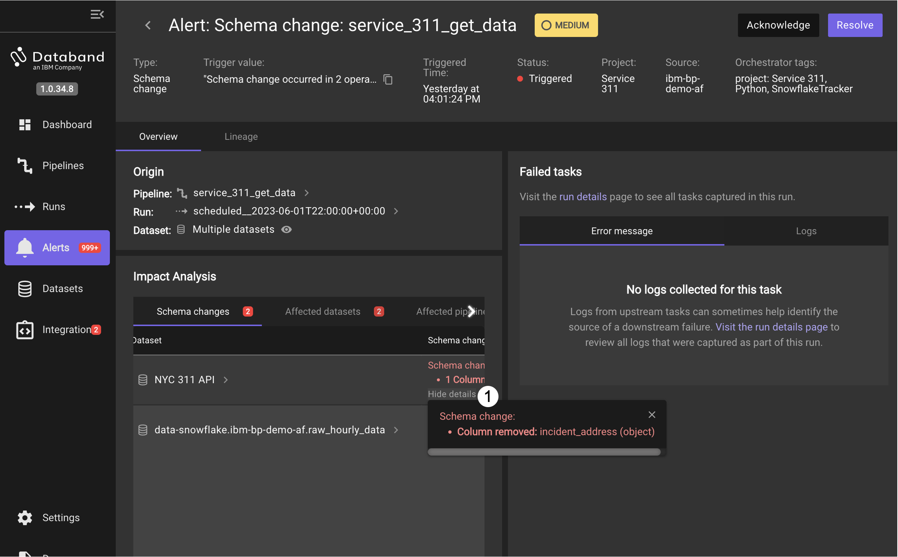

1. Click on **Lineage** to investigate this issue. This view shows the flow of data from the source dataset `NYC 311 API` to downstream datasets and tasks in the pipeline. Note again that technically there are no failures or errors thrown by the tasks in the pipeline.

   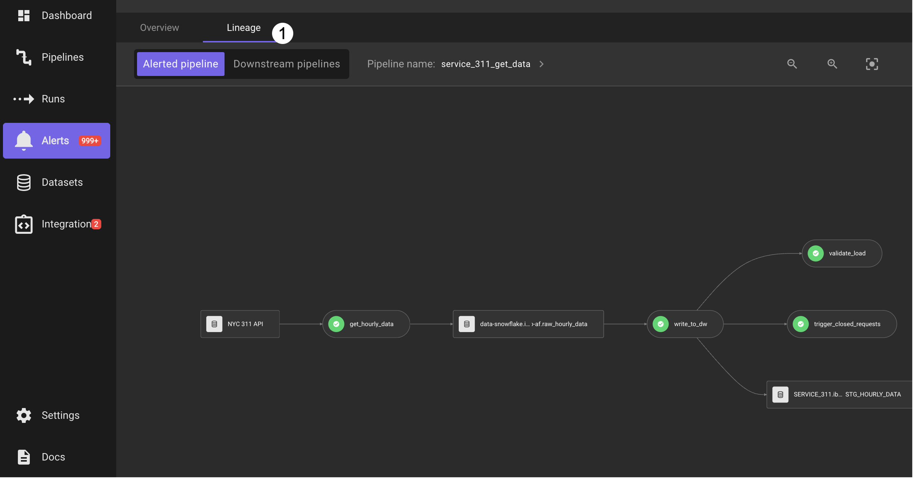

1. The **Downstream pipelines** view is a little less complicated than the previous example - making it straightforward to follow:

   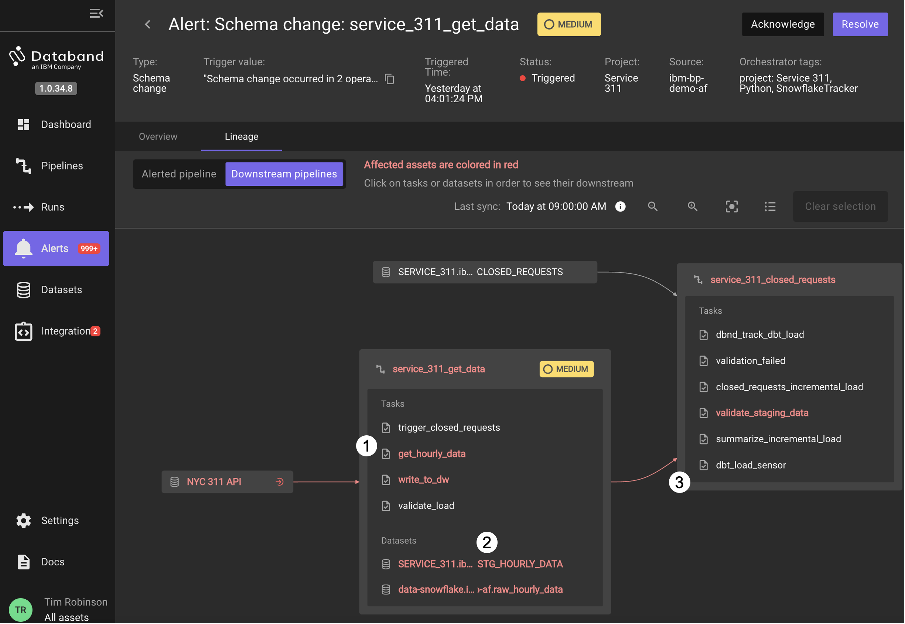

   1. The NYC 311 API dataset read by `get_hourly_data` now has a column removed

   1. When processed by the `service_311_get_data` pipeline, this results in the column also being removed from the downstream datasets.

   1. One of these datasets, `data-snowflake.ibm-bp-demo-af.raw_hourly_data` is read by a task in another pipeline, `service_311_closed_requests`

   Unexpected schema changes can cause problems for downstream tasks like performing automatic updates to machine learning models. Data engineers being able to identify changes going on in the processing pipeline is very important to providing reliable data for use as inputs to ML and AI tasks.

1. To see an example for how to add an alert for data in a column where the values do not match what is expected, start by clicking on **Alerts** and the **Add Alert** button

   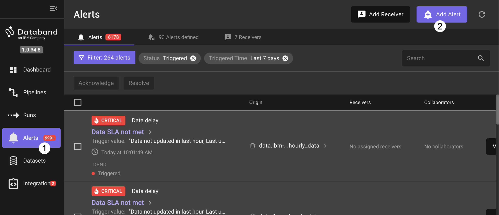

1. Locate the **Data Quality - Pipelines** tile and click **Set up**

   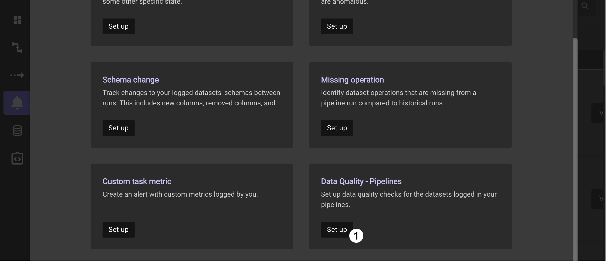

1. Choose by typing in the search options the `NYC 311 API` dataset. Then, select from the validation column pull-down list the `borough` column and click **Apply**. In New York City, there are 5 boroughs so to identify cases where there are unexpected values, we would set a validation condition where the `Unique count` is greater than `5`.

   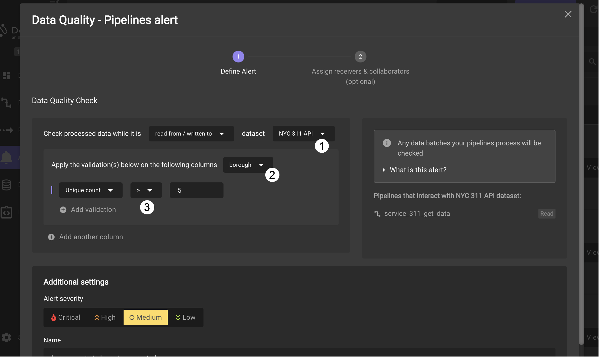

   The alert defaults to a medium severity, but this can be changed to higher or lower levels and the name and description can be customized for the alert. In a later lab you will define some alerts so please cancel by clicking on the **X** in the upper right corner to return to the Alerts panel.

   > As a side note, inspection of the dataset will show cases where the `borough` value in a row is `UNSPECIFIED`, but it is a very rare occurrance compared to all of the other records sent to the 311 service.

## Pipelines

Data engineers can use the pipelines view to see more information about pipeline execution for both successful and unsuccessful runs

1. Click on **Pipelines** label on the left side to open the pipelines view.

   

   This view shows the name of each pipeline, the associated project, run statistics, when the last run was completed and the source workflow engine for the pipeline. In the demonstration Databand instance, the majority of the pipeline runs are from the `ibm-bp-demo-af` Airflow cluster.

1. Select the `service_311_get_data` row from the pipelines view. This will show all runs which are scheduled at every hour to extract 311 data from the dataset corresponding to all entries in the previous hour.

   

   

1. From this view, select the run (by clicking near the timestamp) of the critical alert with the **Error Type** that contains `<class 'requests.exceptions.HTTPError'>`. This will open a side-by-side view of pipeline run details and a flow-based view of the DAG for the tasks in the pipeline.

   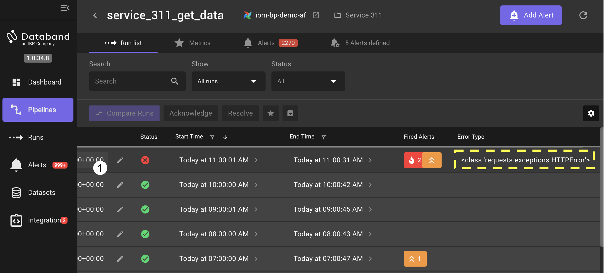

1. Click on the failed `get_hourly_data` task in either the details or flow view to open up more details on this failed task.

   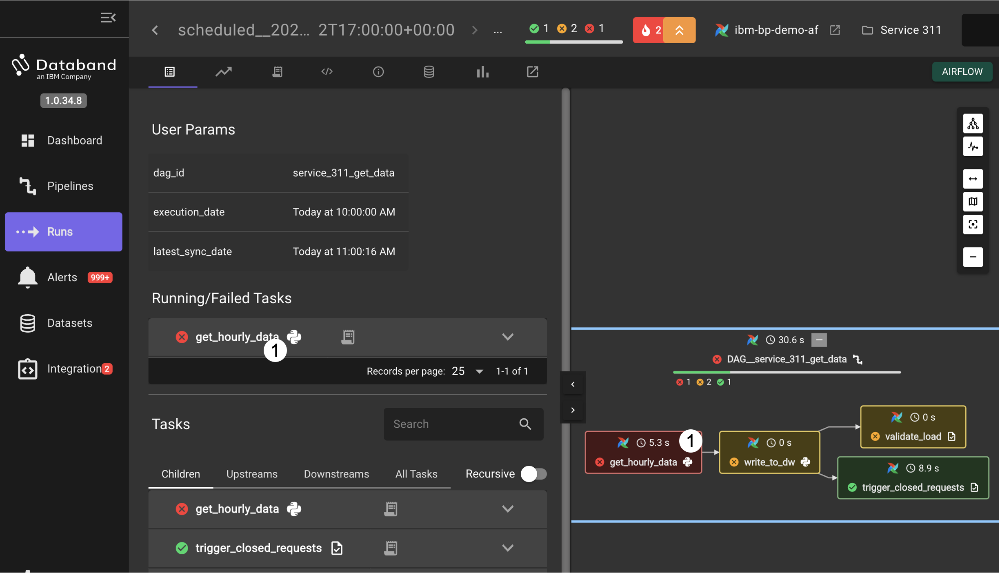

   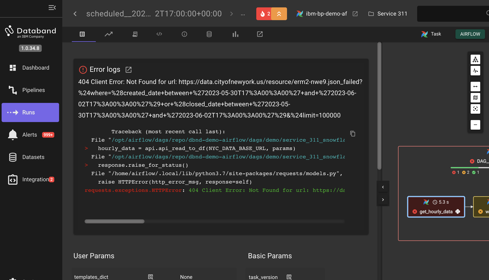

   The most relevant error information from the overall task logs is extracted and shown. This makes easy to determine that the task failure is related to the request to the source dataset. Other tabs next to **Details** allow the inspection of metrics, full log data, the source code for the tasks and other details. (This is a case where an intentional typo in the url is created by the code of the pipeline to simulate a real error.)

1. Click on the **Data Interactions** tab to see a graph of the historical activity from runs as well as operations that failed as a result of the failure in the task. In the table below the history chart, issues with data operations are shown. Horizontally scrolling in this table will show the history trend of the operations from this task, including the current pipeline run gap from the failure.

   

   

For failing tasks in pipelines, similar information can be found by analysis starting from the **Pipeline** view or the **Alerts** view, but each view has different benefits as well. From the **Pipelines** view it is clearer to see the full range of data processing, both for successful and unsuccessful runs while the **Alerts** view has a focus on failures and issues. In a later lab there will be more coverage of pipelines so to finish this demonstration/lab, let's turn to **Datasets**

## Datasets

When workflows observed by Databand interact with datasets, they are automatically discovered and added to the UI. This allows data engineers to monitor datasets in motion. The **Datasets** page can be used to view historical operations for known datasets.

1. Click on **Datasets** label on the left side to open the datasets view.

   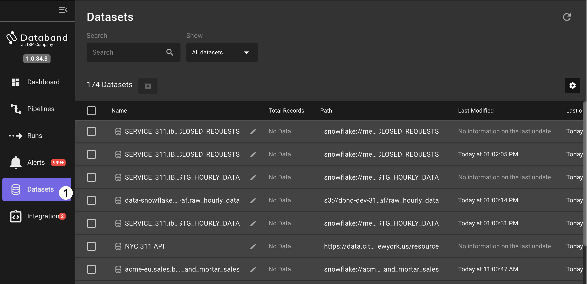

1. Select from the dataset list the `data-snowflake.ibm-bp-demo-af.raw_hourly_data` entry.

   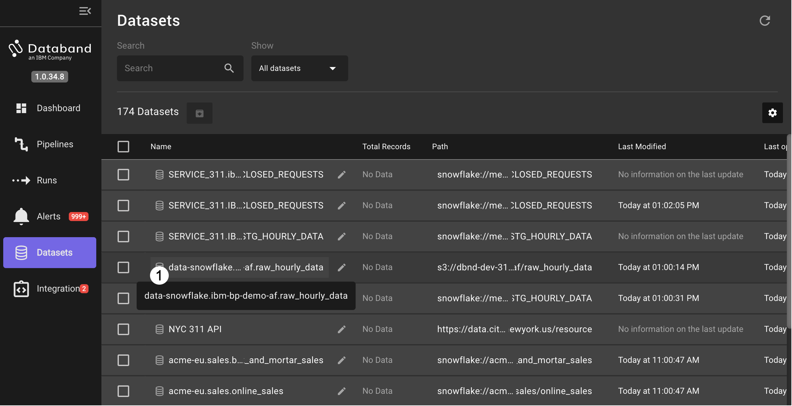

1. This will open a view with the number of rows read and written as well as the total data operations on a daily basis. On the right, any issues or failures from the pipelines interacting with the dataset are shown. Review the information displayed on this view. Then, click on a number next to the `service_311_get_data` pipeline listed in the **Issue Summary** to open a view of just the pipeline runs with issues.

   

1. In the **History** tab that is opened with the pipeline runs, you can narrow the list to read or writes and view details on the issues. Click on the record count in one of the rows to bring up a data preview (data preview is an optional feature that can be enabled in the Databand configuration).

   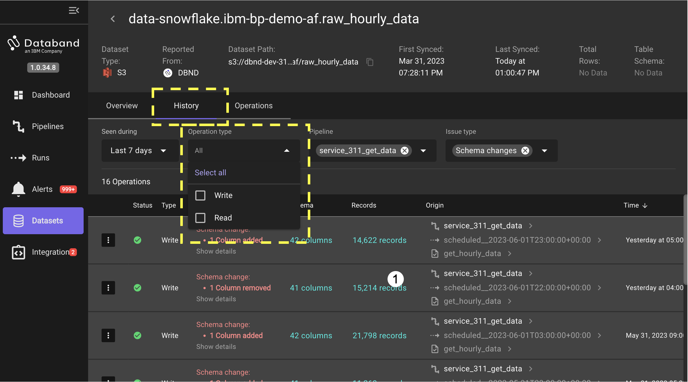

   

   click on the **X** in the upper right corner to dismiss the preview.

1. Clicking on the number of columns in the **Schema** column brings up a display of the actual columns at the time of the run.

   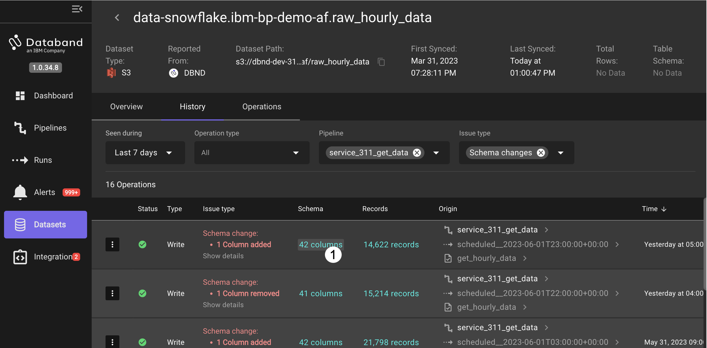

   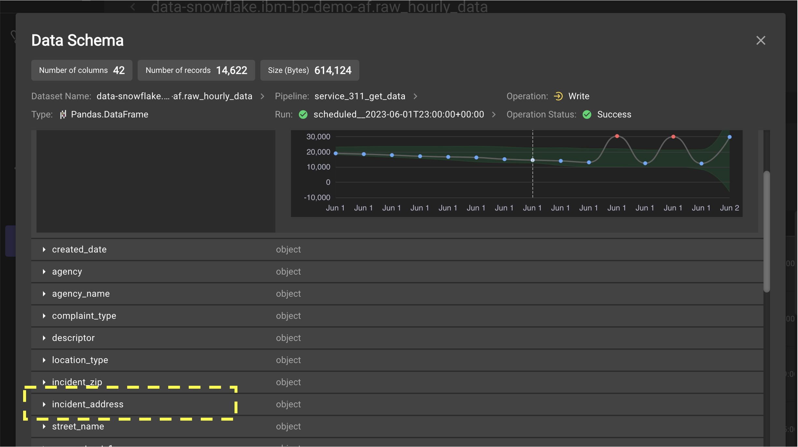

   Compare the column list between one of the runs with a column removed vs. a column added to see that the `incident_address` column is being removed from the data in the pipeline (it appears right after the `incident_zip` column when present.)

1. Click on the **Operations** tab to go to the operations view.

   

1. In the Operations view choose the `get_hourly_data` task and the `Write` operation item to see statistics by that task and operation to the Dataset.

   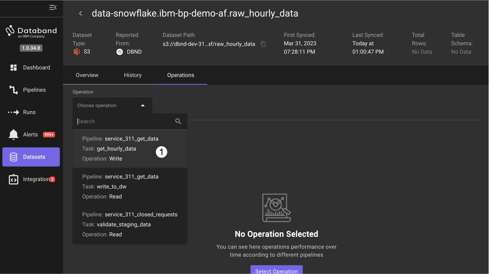

1. From the view of current and prior runs of the pipeline, hover the pointer over one of the metric points to see the details of the metric as well as the range used for potential anomaly detection.

   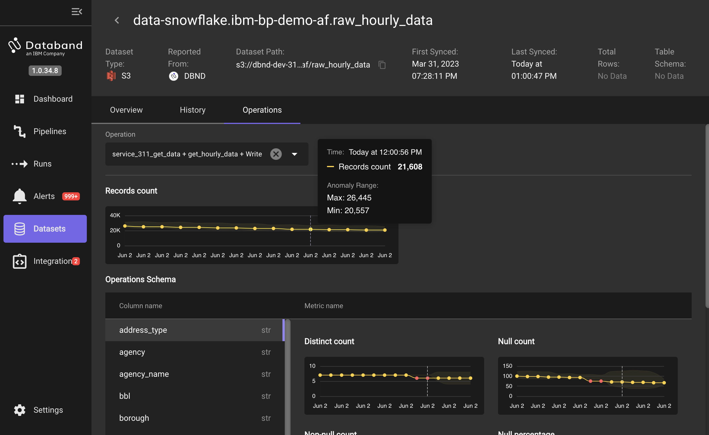

1. Select another column name, for example `borough` to see the metrics for that column.

   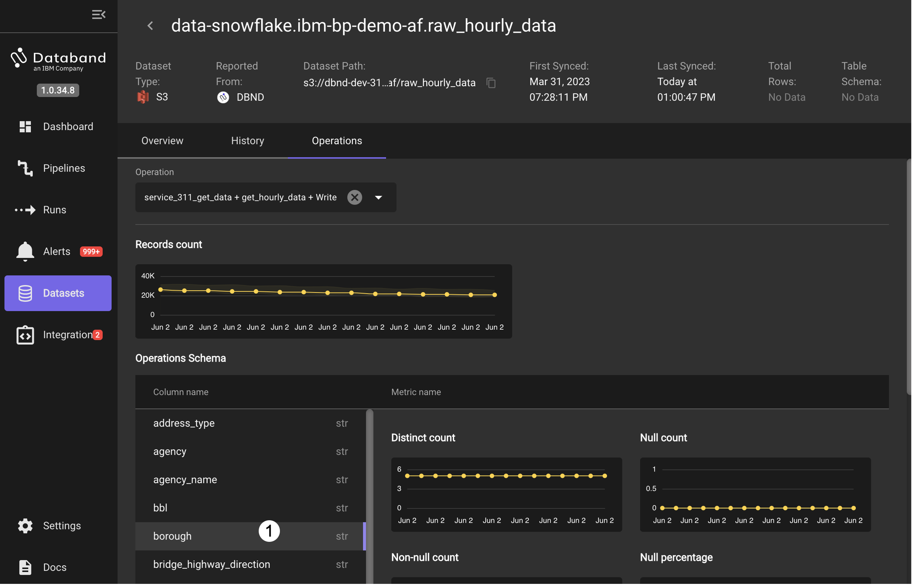

1. Hover the pointer over the latest point in the **Distinct count** metric to see that in the dataset, the recent and prior run history shows that the data has entries from 5 (and only 5) boroughs.

   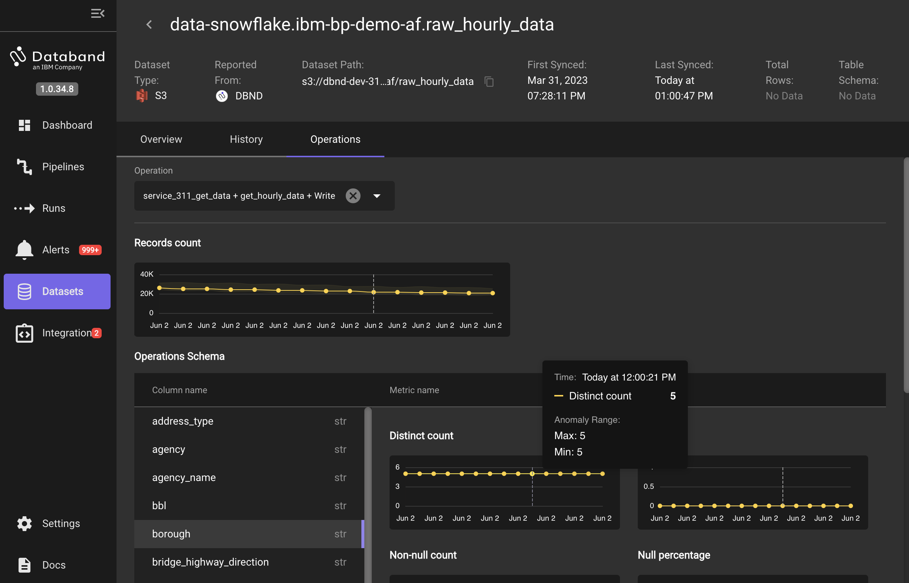

This completes the overview and tour of Databand. If you are giving a customer demo, at this point you can start a discussion about how Databand's acceleration of understanding issues in pipeline execution and visibility to potential data quality issues can help data engineers to identify and fix problems in data processiong pipelines before they have a significant negative impact to the business.

You may have noticed in the overview that there was not a lot time spent on the **Integration** panel - in the [next lab](/databand/101) you will get hands on and set up your own integration between an IBM DataStage flow and Databand.
