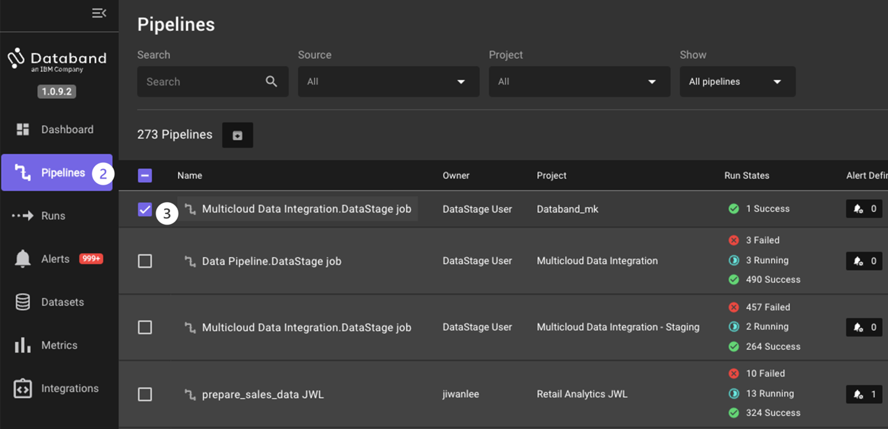
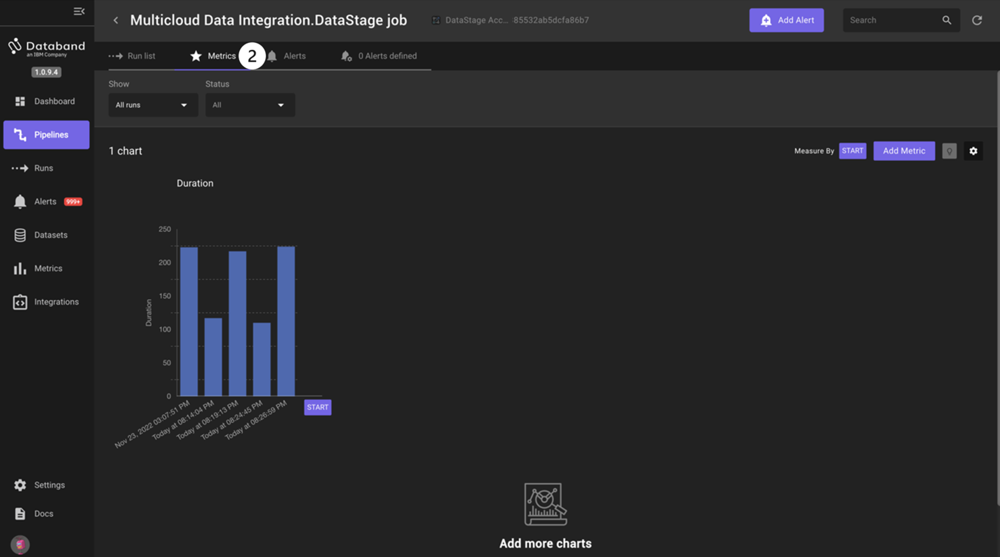
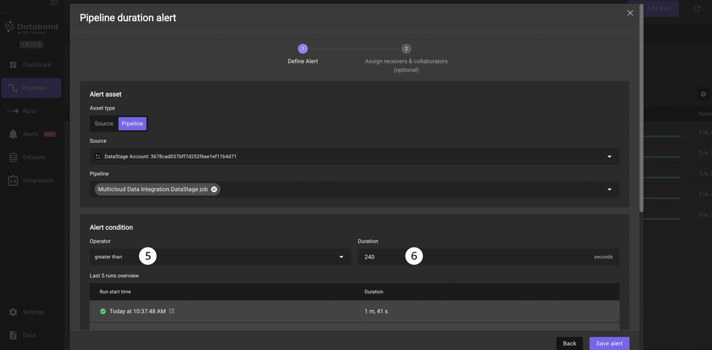
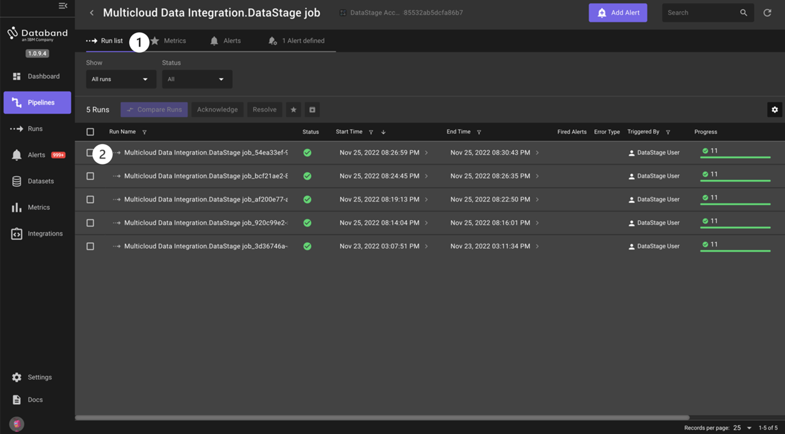
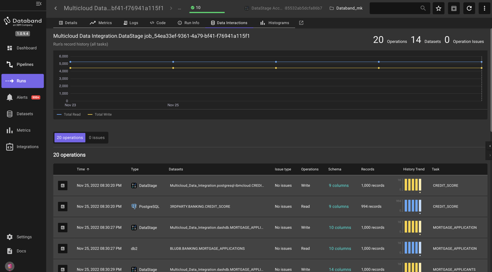
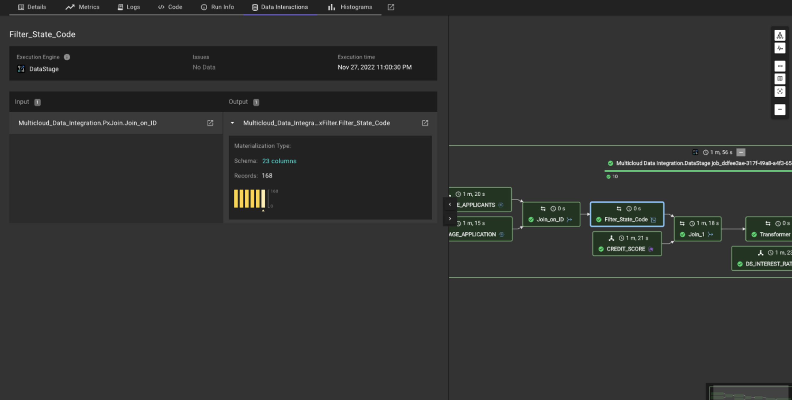
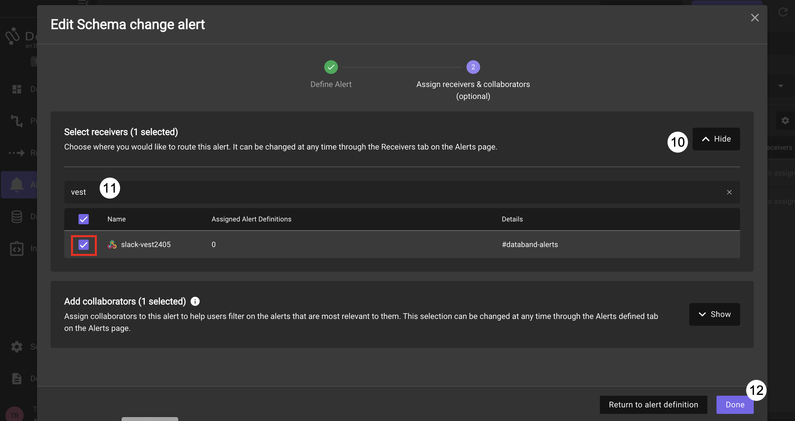
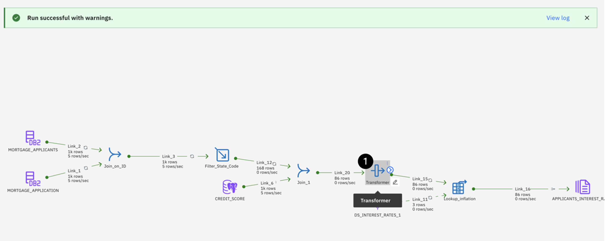
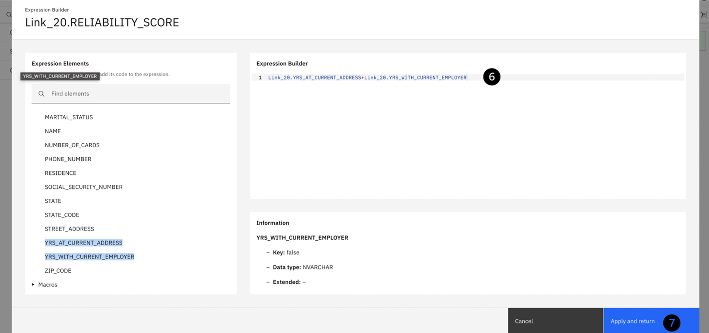
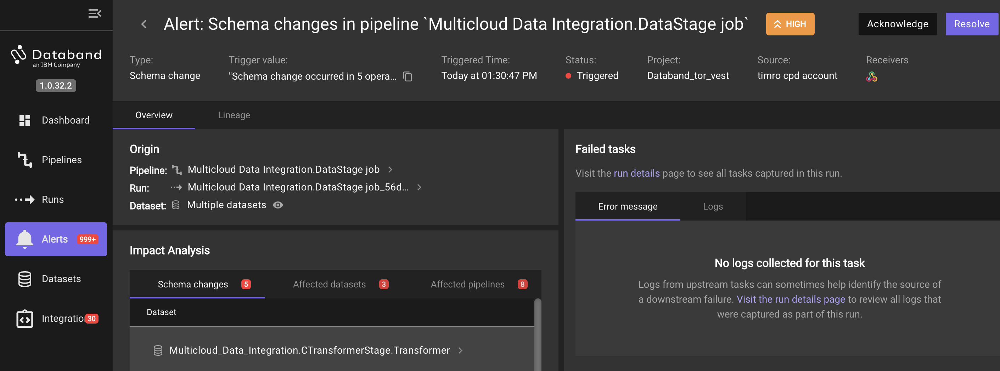

# 102: Observación de trabajos, configuración de alertas y notificaciones externas

## Observar un trabajo en Databand

1.  Vuelva a la pestaña del navegador con CP4DaaS. Abra el flujo de Integración de Datos Multicloud (si no está allí), y haga clic en el botón **Ejecutar** en la parte superior.

     La tarea puede tardar unos minutos en ejecutarse. Una vez completado, verá un banner verde **Ejecutar correctamente con advertencias** en la parte superior. Cuando lo vea, vuelva a la pestaña Databand.

2.  En el menú de la izquierda, seleccione la pestaña **Pipelines**. Usted puede identificar su trabajo específico de DataStage / ETL (extraer, transformar, cargar) pipeline mirando la columna **Proyecto** en esta página, que muestra el nombre del proyecto de su entorno DataStage.

3.  Haga clic en la columna **Nombre** de su proyecto específico (por ejemplo, **Databand\_mk**)

     **CONSEJO RÁPIDO:** Puede buscar rápidamente su trabajo DataStage específico haciendo clic en el menú desplegable **Proyecto** y escribiendo el nombre de su proyecto CP4DaaS en la barra de búsqueda. Vea la siguiente captura de pantalla para un ejemplo de esta función de búsqueda.

    

4.  La nueva pantalla que aparecerá será la Lista de ejecuciones de cada una de las ejecuciones del pipeline ETL (trabajo DataStage). Esta página muestra la lista secuencial de ejecuciones del trabajo de DataStage, el estado de esas ejecuciones, la hora de inicio y fin, las alertas, los errores, el número de tareas correctas/incorrectas y la duración de esas tareas.

    Sólo ha ejecutado este trabajo de DataStage una vez, por lo que sólo se mostrará una ejecución. Sin embargo, a medida que continúe ejecutando trabajos a lo largo de este laboratorio, verá que esta página se llena con cada ejecución secuencial.

5.  En esta misma pantalla, haga clic en el **nombre de ejecución** para esta ejecución de trabajo específica.

    

6.  Cambie el tamaño del panel de la ventana que muestra la tubería para que pueda ver todo el flujo arrastrando la flecha que apunta hacia la izquierda a la parte izquierda de la pantalla.

     La pantalla se parecerá a la captura de pantalla siguiente. Puede que tenga que arrastrar y ampliar la pantalla para centrar el trabajo.

     **NOTA:** Para trabajos grandes y complejos puede utilizar una ventana de navegación en la parte inferior derecha para desplazarse por el trabajo. Se trata del icono **Alternar minimapa** de la derecha.

    

    Databand muestra una representación gráfica del trabajo DataStage. Observe que cada etapa es de color verde, lo que significa que se ha ejecutado correctamente. Cada etapa individual contiene el nombre de esa etapa, y una marca de tiempo de cuánto tiempo tardó cada etapa en ejecutarse. Además, la parte superior de esta vista muestra el tiempo total que tardó en ejecutarse este trabajo.

    **NOTA:** Estas etapas pueden ejecutarse en paralelo y, por lo tanto, la suma total del tiempo de cada etapa individual mostrada es probablemente mucho mayor que el tiempo total de ejecución del trabajo.

7.  A continuación, haga clic en la etapa **MORTGAGE\_APPLICANTS**.

8.  Seleccione la pestaña **Registros** en el menú superior. Cambia el tamaño de la vista como hiciste antes para ver más del registro de la etapa seleccionada.

    

    Esta vista nos mostrará los registros asociados a esa etapa específica. No dude en hacer clic en otras etapas para ver esos registros también.

    En este punto, usted ha visto algunas de las funcionalidades "paso a paso" que Databand aporta a la observación de nuestros trabajos DataStage. Vuelva a la pestaña del navegador que aloja su entorno DataStage y ejecute el trabajo **4 veces más** para generar más métricas y establecer algunas líneas de base para nuestro entorno Databand. Esto tendrá sentido a medida que continuemos nuestro laboratorio y simulemos cómo sería un entorno de cliente donde un trabajo se ejecutaría muchas veces.

## Alertas de empleo de Pruebas en Databand

1.  Después de ejecutar el trabajo de Integración de Datos Multicloud cuatro veces más (ahora ha ejecutado este trabajo un total de cinco veces), vuelva a su entorno Databand. Selecciona la pestaña **Pipelines** del menú de la izquierda, busca tu pipeline, profundiza en él y fíjate en la pestaña **Run list** del menú superior.

    

2.  Seleccione la pestaña **Métricas** en el menú superior. La métrica mostrada por defecto es la **Duración** de cada ejecución.

     **NOTA:** También puede observar otras métricas del trabajo DataStage; por ejemplo, las filas que se escriben y se leen en cada etapa. Esto está fuera del alcance de este laboratorio.

3.  Ahora es el momento de crear tu primera alerta. Haz clic en el botón morado **Añadir alerta** en la esquina superior derecha de la pantalla.

     El primer paso para crear una alerta Databand es crear la "Definición de la alerta". Esta es la lógica detrás de su alerta. Observe todas las posibilidades de alerta que puede crear en Databand. Puede crear una alerta basada en las métricas de ejecución de su trabajo de DataStage, tales como éxito o fracaso, duración de la ejecución, duración de tareas específicas, operaciones de datos faltantes y cambios de esquema.

4.  Dado que estos trabajos tardan unos 2 ó 3 minutos en ejecutarse, se creará una alerta si el trabajo tarda más de 4 minutos. Para crear esta alerta, haga clic en el botón **Configurar** del mosaico **Duración de la canalización**.

    

5.  Haga clic en el desplegable **Operador** y seleccione la opción **mayor que**. Fíjese en los demás operadores que aparecen aquí, como **Desviación porcentual** y **Anomalía**.

6.  Introduzca **240** en la casilla **Duración**, que acepta segundos como entrada, para designar el tiempo de 4 minutos.

    

7.  Desplácese hacia abajo hasta la sección **Configuración adicional** y haga clic en la casilla **Baja** que aparece bajo la sección **Gravedad de la** alerta. Esto alertará al grupo individual asignado sobre la importancia de esta alerta específica. Dado que esta alerta se activará si un trabajo se ejecuta ligeramente más lento de lo normal, márquela como gravedad baja.

8.  Asigne a esta alerta un nombre titulado Trabajo de ejecución lenta **\<SUS\_INICIALES>** (por ejemplo, Trabajo de ejecución lenta AB).

9.  Asegúrese de que la lógica de su definición de alerta coincide con las capturas de pantalla anteriores y, a continuación, haga clic en **Guardar alerta**.

    

10. La siguiente pantalla le permite asignar esta alerta a un receptor, que es un usuario o grupo de usuarios que serán notificados de esta alerta a través de Slack, correo electrónico o PagerDuty (esta parte se cubre en la siguiente parte del laboratorio.) Por ahora, mantenga la alerta dentro de Databand. Haga clic en el botón **Hecho**.

    

Tenga en cuenta lo útiles que pueden ser estas alertas para controlar el éxito, el fracaso y el rendimiento general de nuestros trabajos de DataStage.

## Alertas basadas en interacciones de datos

Para la parte final de este laboratorio, verá las interacciones de datos de su trabajo y creará una alerta basada en dichas interacciones. Este es uno de los principales valores añadidos de la integración de Databand con su entorno DataStage, ya que ahora puede alertar a los usuarios casi en tiempo real sobre muchos fallos personalizados, cambios de trabajo, retrasos y mucho más.

1.  Si aún no se encuentra en la página Lista de ejecuciones, vuelva a la pestaña Lista de ejecuciones seleccionando Lista de ejecuciones en la barra de menú superior.

2.  Haga clic en el primer nombre de ejecución.

    

3.  Seleccione la pestaña **Interacciones de datos** en el menú superior. Utilice el reescalador para centrarse en la parte izquierda de la pantalla.

     Puede ver las entradas y salidas (lecturas/escrituras) de los registros y columnas en cada etapa respectiva. Puede ver el tipo de fuente, los conjuntos de datos asociados, cualquier problema que haya podido surgir, información sobre el esquema y los registros, y la etapa asociada. El total de estos registros se representa en el gráfico de la parte superior de la pantalla. El gráfico de la parte superior titulado **Historial de registros de ejecución (todas las tareas)**, así como la columna titulada **Tendencia del historial**, ofrecen al usuario una visión del rendimiento histórico de la tarea.

     **NOTA:** También puede utilizar la pestaña **Interacciones de datos** para cada etapa individual, como en la captura de pantalla siguiente. Al hacer clic en la transformación específica, puede ver información como el esquema, el recuento de filas y la tendencia histórica de ese recuento de filas.

    

4.  Ahora creará una alerta en torno a un cambio de esquema. Seleccione la pestaña **Alertas** en el menú de la izquierda. Aquí es donde se muestran todas las alertas de Databand. Tómese un momento para echar un vistazo a esta página y entender qué información se muestra al usuario.

5.  Haga clic en el botón púrpura **Añadir alerta** en la esquina superior derecha. Aquí puedes ver (de nuevo) que puedes crear una alerta en un pipeline (trabajo de DataStage), múltiples pipelines, calidad de datos y más.

    

6.  Va a crear una alerta para monitorizar un cambio de esquema y establecer que el receptor sea Slack. Haga clic en **Configurar** en el mosaico **Cambio de** esquema.

    

7.  En primer lugar, debe especificar su canalización desde el proyecto y crear su definición de alerta. Seleccione el tipo de activo **Proyecto**. Haga clic en el desplegable **Proyecto**, escriba el nombre del proyecto que ha creado o parte del nombre y seleccione el nombre de su proyecto con el flujo DataStage.

    

8.  Después de seleccionar su proyecto, seleccione **Alta** como gravedad en la sección **Gravedad de la alerta**.

9.  Haga clic en **Guardar alerta**.

    

    Para esta alerta, establecerá que el receptor de la alerta sea Slack.

10. En la página siguiente, amplíe la lista de **Recibidores** pulsando en **Mostrar**

11. En la lista de búsqueda escriba **vest** para filtrar los receptores Slack preconfigurados del taller. Seleccione el receptor cuyo nombre coincida con el día y el mes del taller

12. Haga clic en **Hecho**.

    

## Detección de cambios en el esquema de DataStage

Ahora, vuelva a su entorno Cloud Pak for Data DataStage donde introducirá a propósito un cambio de esquema. Este cambio de esquema activará la alerta de esquema que acabamos de crear en Databand.

1.  Haga doble clic en la etapa Transformer para abrir su configuración.

    

2.  Seleccione la pestaña **Salida**.

3.  Haga clic en el botón **Añadir columna** de la derecha.

4.  Nombre su nueva columna **RELIABILITY\_SCORE**. Añadirá la nueva columna al final del campo **Nombre de columna**.

5.  A continuación, haga clic en el icono del **lápiz** de la columna **Derivación** y, a continuación, haga clic en el icono **Calculadora** para editar la expresión. En este campo, utilice la suma de la columna **YRS\_AT\_CURRENT\_ADDRESS** y la columna **YRS\_WITH\_CURRENT\_EMPLOYER**.

    

6.  Para crear esta expresión, localice las dos columnas bajo el twistee **Columnas de entrada**. Haga doble clic en **YRS\_AT\_CURRENT\_ADDRESS**, inserte un símbolo más (+) y luego haga doble clic en **YRS\_WITH\_CURRENT\_EMPLOYER**. Observe como la expresión se rellena en la ventana **del Constructor de Expresiones** a la derecha. Su expresión debería parecerse a la captura de pantalla.

7.  Haga clic en **Aplicar y volver** y, a continuación, en **Guardar y volver** para guardar los cambios que acaba de realizar.

    

    Ejecute el trabajo (haga clic en el icono de ejecución de la parte superior) y espere unos minutos hasta que el trabajo se complete y se active la alerta. Cuando se active la alerta, verá un mensaje en el canal de Slack **#databand-alerts** en el espacio de nombres del taller similar a la captura de pantalla siguiente.

8.  Haga clic en el enlace **Schema changes in pipeline 'Multicloud Data Integration.DataStage.job'** en el mensaje de Slack. Esta descripción de alerta sigue al icono de **círculo naranja** de gravedad alta. Se abrirá la siguiente pantalla:

    

Al hacer clic en el enlace, accederá a Databand, donde podrá ver el análisis del impacto de esta alerta. En concreto, puede ver qué cambios de esquema se produjeron en el trabajo de Datastage, qué conjuntos de datos se vieron afectados y los pipelines (trabajos de DataStage) que se vieron afectados. También puede ver toda esta información gráficamente en la pestaña **Lineage**.

Esta alerta se generó casi en tiempo real mientras se ejecutaba el oleoducto. Esta es otra ventaja importante de utilizar Databand para la observabilidad. Ser capaz de identificar problemas a medida que se ejecuta el pipeline ayuda a mejorar la calidad de los datos más rápidamente, en lugar de inspecciones retroactivas y problemas potencialmente perdidos durante días, semanas e incluso meses.

## Resumen

Enhorabuena por haber completado este laboratorio. Ha adquirido experiencia práctica en las siguientes áreas de integración:

*   Sincronización de DataStage/CP4DaaS con Databand
*   Observación de la representación gráfica del trabajo DataStage dentro de Databand y la información relevante en torno a este
*   Visualización de métricas de conjuntos de datos y tendencias históricas
*   Edición de entradas y salidas de trabajos DataStage
*   Creación y configuración de alertas para trabajos de DataStage en Databand

Con esto concluye el laboratorio práctico de DataStage y Databand. Por favor, póngase en contacto con el equipo de VEST o con su Partner de IBM para cualquier pregunta, comentario, duda o situación con la que se encuentre.
