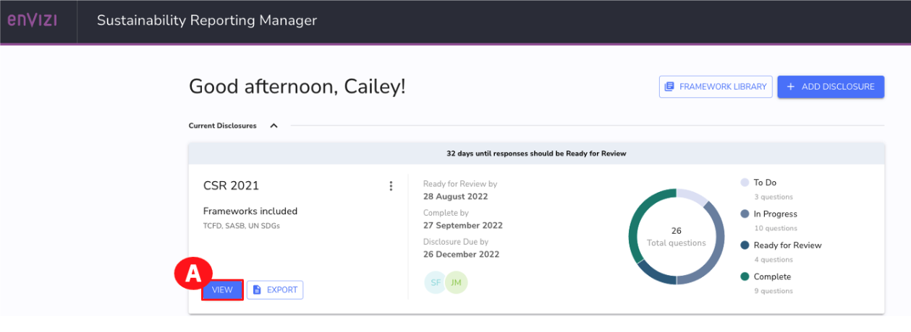
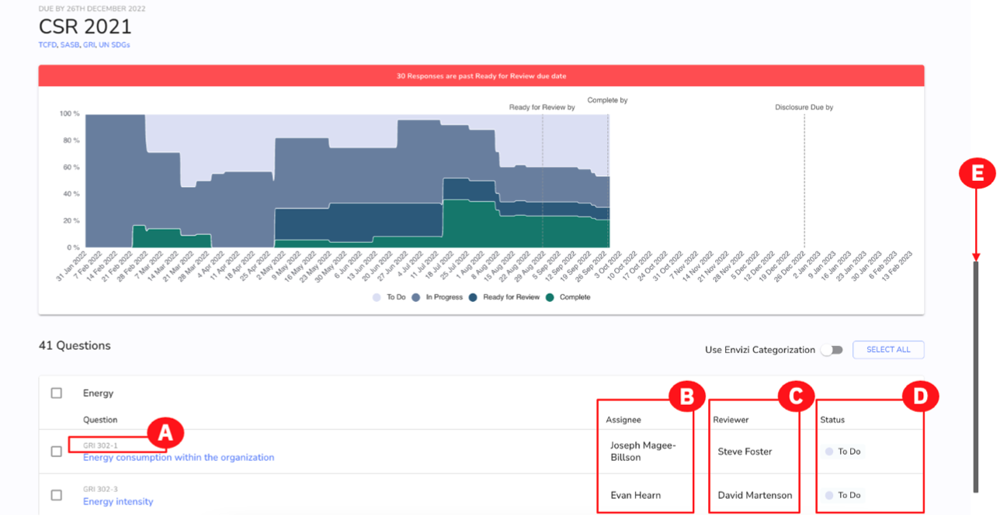
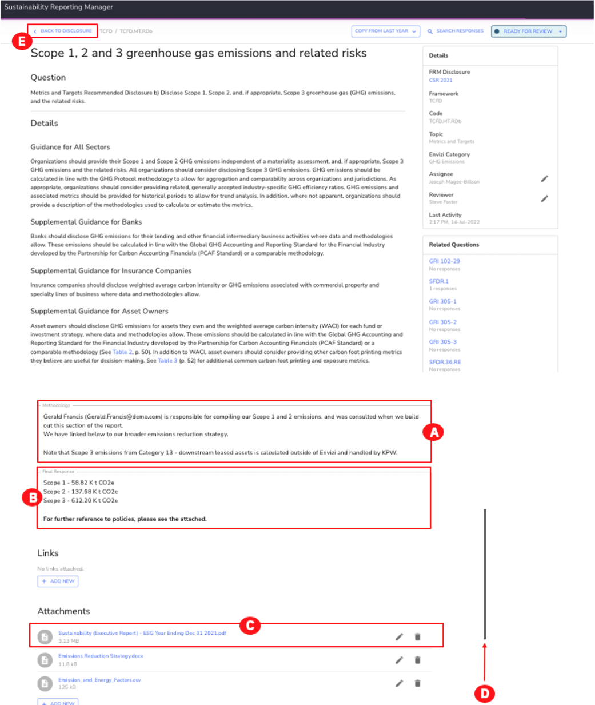

# 101: Introducción a el Envizi Administrador de sostenibilidad y rendimiento

<QuizAlert text='¡Atención! El material de la prueba será marcado así!' />

## Iniciar sesión en la plataforma Envizi

Para completar este paso, utilizará sus credenciales de acceso de la solicitud de acceso.

1. Haga clic en esta URL de la página principal de Envizi https://uk001.envizi.com/home/default.aspx para iniciar el ambiente de demostración de Envizi.
2. Se le dirigirá a la pantalla de inicio de sesión **Welcome To Envizi**. Introduzca sus credenciales de inicio de sesión **(A)**.
3. Pulse el botón **Login (Iniciar sesión)** **(B)**.
   

4. Es posible que se le pida **Review time zone settings (Revisar la configuración de la zona horaria)**. Haga clic en el menú desplegable y elija la zona horaria correcta **(A)**. (Para saltarse este paso, haga clic en el botón **NOT NOW (NO AHORA)**).

5. Pulse el botón **CHANGE (CAMBIAR)** **(B)**.

   

6. 6. Lea las **ENVIZI SOFTWARE TERMS OF USE ( CONDICIONES DE USO DEL SOFTWARE ENVIZI)** y haga clic en el botón ** ACCEPT (ACEPTAR) (A)**.

   

## Administrador de informes de sustentabilidad

Una vez introducidas las credenciales de acceso, se abrirá la página de inicio del ambiente en vivo de Envizi. En esta página aparecen varias herramientas y enlaces. En esta parte de la demostración, se centrará en la herramienta Administrador de Informes de Sustentabilidad que ayuda a gestionar sistemáticamente todas las preguntas, respuestas, personas, flujos de trabajo y documentos de apoyo necesarios para garantizar que los informes de sustentabilidad corporativa se alineen con algunos de los marcos externos como TCFD, SASB y otros.

1. En la pantalla de inicio, en la sección Quick Links (Enlaces rápidos), haga clic en el widget Sustainability Reporting Manager (Administrador de informes de sostenibilidad) (A). Esto abrirá el mosaico del Sustainability Manager (Administrador de sostenibilidad) en una nueva pestaña del navegador.
   <QuizAlert text="Material de prueba: preste atención a estos enlaces rápidos"/>

   

   > **NOTA:** Si la teja **Sustainability Reporting Manager (Administrador de Informes de sostenibilidad)** no se abre, compruebe su casilla URL ya que puede tener la ventana emergente bloqueada.

   **NOTA:** No cierre la pestaña del navegador **Página de inicio de Envizi**, ya que se utilizará más adelante en la demostración.

Esto abrirá la herramienta **Sustainability Reporting Manager (Administrador de Informes de Sustentabilidad)** donde podrá ver tanto las divulgaciones actuales como las divulgaciones pasadas. Cada uno de los resúmenes de esta página representa un proyecto de divulgación ESG de un año específico. Si esta empresa elabora anualmente un Informe de Sustentabilidad Corporativa (CSR) que está alineado con varios marcos.

**NOTA:** Es posible que tenga que desplazarse hacia abajo para ver el informe **CSR 2021**. Si no ve el informe etiquetado como **CSR 2021**, seleccione en su lugar el **CSR Annual Report (Informe anual CSR)** para continuar.

De un vistazo, hay algunas áreas en las que centrarse para gestionar sistemáticamente el progreso de la presentación del informe, así como todas las preguntas, respuestas, personas, flujo de trabajo y documentos de apoyo. Entre ellas se incluyen:

- Los marcos de información con los que se alinea la memoria de sostenibilidad corporativa **(A)**.
- Los hitos clave del proyecto en cuanto a la preparación de los contenidos, cuándo deben revisarse todos los contenidos y la fecha límite de presentación **(B)**.
- El estado de todas las respuestas a las preguntas del CSR. Muestra las preguntas que no se han iniciado (**To Do (Por hacer)**), las preguntas que están **In Progress (En curso)**, las preguntas que están **Ready for Review (Listas para revisión)** y las preguntas que ya están **Complete (Completadas) (C)**.

El informe de CSR contiene información más detallada. Como responsable de sostenibilidad de tu empresa, quizá quieras profundizar en los detalles de este informe.

2. Dentro del mosaico del informe **CSR 2021**, haga clic en el botón **VIEW** **(A)**.

    Encuentre la sección **GRI 302: Energy 2016**

   

3. Para obtener más información sobre cada pregunta, consulte las siguientes áreas:

   - A qué marco externo está vinculada esta divulgación (A).

   - Quién es el encargado de responder a la respuesta para la divulgación de este año (B).

   - Quién se encarga de revisar la pregunta antes de su publicación (C).

- Cuál es el estado actual de esa pregunta: "To Do (Por hacer)", "In Progress (En proceso)", "Ready for Review (Listo para revisión)" o "Complete (Completo)" (D).

4. Desplácese por esta lista de preguntas para ver más preguntas (E).

   

## Añadir preguntas a - y eliminar preguntas de - un estructura

Después de revisar las preguntas de su informe, puede que necesite añadir una nueva pregunta. Afortunadamente, las preguntas pueden añadirse o eliminarse de este informe en cualquier momento.

1.  Para añadir (o eliminar) una pregunta, haga clic en el menú desplegable **ACTIONS (ACCIONES)** **(A)** y haga clic en **Add / Remove Questions (Añadir / Eliminar preguntas) (B)** del menú.

Se abrirá una página con toda la información sobre los SDG de la ONU. Las preguntas de este marco están separadas por títulos en grupos que son importantes para este marco de información, como Poner fin a la pobreza, Acción por el clima, Acción económica y limpia, y más. Cualquier pregunta que ya exista en su informe de RSC tendrá la casilla marcada junto a la pregunta. Puede añadir cualquiera de las preguntas a su informe de CSR 2021.

3.  Para ello, marque la casilla situada junto a la pregunta o preguntas que desee añadir al informe RSE **(A)**. (Por ejemplo, seleccione la casilla **Halving overall global poverty (Mitigar la pobreza mundial en general)** y **Access to basic services globally (Acceso a los servicios básicos en todo el mundo)**)
4.  Una vez seleccionadas todas las preguntas deseadas, los usuarios guardarán su selección. **DO NOT DO THIS STEP (NO REALICE ESTE PASO)**.

> **Nota:** Para esta demo, estás en modo **View Only (Sólo Ver)**, **no** hagas clic en el botón **SAVE (GUARDAR)**.

    

    Supongamos que desea volver a una de las preguntas del informe CSR 2021 y profundizar en ella para revisar los detalles.

5.  Para volver a las preguntas, en la página **Estructura de los SDGs de la ONU**, haga clic en el botón **BACK (ATRÁS)** **(A)**.

    

6.  Haga clic de nuevo en el botón **BACK** **(B)** para volver a la página de resumen del **CSR 2021/CSR Annual Report (Informe anual CRS 2021/CSR)**.

## Administrador de memorias de sostenibilidad continuación

Supongamos que desea ver los detalles que se proporcionan al profundizar en una pregunta específica.

1. Desplácese hacia abajo hasta la sección **Governance (Gobierno)** **(A)** y haga clic en el enlace directo **Board’s role in managing risks and opportunities (Función del Consejo en la gestión de riesgos y oportunidades)** **(B)**.

   

   Al hacer clic en una pregunta de la divulgación, se muestran varios detalles. Como Administrador de sostenibilidad, esto te facilita ver la pregunta, algunas orientaciones, quiénes son las partes interesadas y mucho más, todo en una sola vista.

2. Para cada revelación dentro de un marco seleccionado, puede ver:

   - La pregunta a la que debe responder, tal y como la formula el marco de elaboración de informes externos, que en este ejemplo es TCFD **(A)**.
   - Orientaciones del propio marco de información **(B)**.
   - Orientación adicional de IBM Envizi, basada en su experiencia de trabajo con cientos de clientes que realizan divulgaciones ESG **(C)**.
   - La metodología que debe seguir su equipo. Esto es, en efecto, la memoria de la empresa; si el equipo se enfrenta a cambios durante el próximo año, todavía hay una "receta" clara a seguir sobre cómo responder a esta pregunta y todas las demás preguntas de la divulgación. También hay una lista de partes interesadas a las que se puede consultar para obtener más orientación **(D)**.
   - La respuesta final que se publicará externamente **(E)**.
   - Enlaces a documentación externa que puede estar disponible en intranets corporativas o sitios web externos **(F)**. Puede hacer clic en el botón **+ADD NEW (+AÑADIR NUEVO)** para añadir otros enlaces.
   - Anexos que proporcionan documentación de apoyo al proceso o respuestas finales **(G)**. Puede hacer clic en el botón **+ADD NEW (+AÑADIR NUEVO)** para añadir documentos adicionales.
   - Una pista de auditoría completa (**Comments (Comentarios)**) sobre el diálogo entre los implicados en la respuesta y revisión de esta pregunta específica y otras actividades **(H)**.

Como Administrador de sostenibilidad, usted quiere minimizar el esfuerzo que su equipo dedica a responder a las preguntas. Esto significa que tiene que aprovechar el trabajo que su equipo ha realizado en años anteriores, así como encontrar sinergias entre preguntas similares en marcos diferentes. Para ayudarte en esta tarea, existen algunas herramientas de Envizi que puedes aprovechar.

3. Copie las preguntas, las respuestas y la información de apoyo de la divulgación de un año anterior. Para ello, haga clic en **COPY FROM LAST YEAR (COPIAR DEL AÑO PASADO) (A)** en la parte superior y seleccione **VIEW DETAILS (VISAR DETALLES) (B)**.

Esto le permite desglosar y ver los detalles de la respuesta del año pasado. No sólo puede ver la información asociada a la respuesta del año pasado, sino que si desea iniciar la respuesta de este año con la información del año pasado, puede hacerlo utilizando el botón **COPY TO RESPONSE (COPIAR EN LA RESPUESTA)** situado en la parte inferior de esta pantalla.

Su equipo puede elegir qué información copiar del año pasado, como la metodología, la respuesta final, los enlaces o los archivos adjuntos, simplemente seleccionando la casilla situada junto a cada encabezamiento.

**Nota:** Para esta demostración, usted está en modo **View Only (Sólo ver)**, **no** haga clic en el botón **COPY TO RESPONSE (COPIAR A RESPUESTA)**.

4. Haga clic en el botón **CANCEL (CANCELAR)** **(A)** para volver a la pregunta.

Otra posibilidad que ofrece Envizi es la de copiar información en otros marcos. En la página **Board’s role in managing risks and opportunities (El papel de la Junta Directiva en la gestión de riesgos y oportunidades)**, puede copiar información y respuestas de preguntas similares de otros marcos.

5. En la parte derecha de la sección **Related Questions (Preguntas relacionadas)**, haga clic en **SDG 13.1 (A)**.

   Esta es una divulgación de otro marco que está muy cerca del marco actual en el que estás trabajando. Este podría ser un buen candidato para copiar su respuesta a la divulgación en la que estás trabajando. Si desea copiar esta respuesta, puede hacerlo haciendo clic en el botón **COPY TO RESPONSE (COPIAR EN RESPUESTA)**.

   > **Nota:** Para esta demostración, se encuentra en modo Sólo Ver, no haga clic en el botón **COPY TO RESPONSE (COPIAR A RESPUESTA)**.

6. Haga clic en la **X** de la esquina superior izquierda para cerrar la ventana de Respuesta **(B)**.
7. 7. Haga clic en **BACK TO DISCLOSURE (VOLVER A REVELACIÓN)** en la parte superior para volver a la página de resumen del informe CSR 2021 (C).

   

   > **Nota:** El texto de los campos que aparecen en las capturas de pantalla y en el vídeo de demostración puede diferir para el usuario final que complete la demostración posteriormente.

   Es importante tener en cuenta que, para algunas preguntas, las respuestas requieren cálculos numéricos complejos que agregan miles de flujos de datos. Este suele ser el caso de la parte medioambiental ("E" de ESG). Para estas preguntas, las respuestas suelen proceder de los informes Envizi. Veamos un ejemplo en torno a las emisiones de GHG de Scope 1, Scope 2 y Scope 3.

> **Nota:** El Protocolo de Gases de Efecto Invernadero (GEI) clasifica las emisiones de gases de efecto invernadero en tres "Ámbitos". Scope 1 cubre las emisiones directas de fuentes propias o controladas, como los vehículos y la combustión de combustible. An example of Scope 1 emissions is fleet fuel used for an organization’s vehicle fleet. Scope 2 cubre las emisiones indirectas procedentes de la generación de electricidad comprada, vapor, calefacción y refrigeración. Un ejemplo de emisiones de Scope 2 son las emisiones de la electricidad que una organización compra para refrigerar sus centros de datos. Scope 3 cubre las emisiones indirectas, como la compra de bienes y servicios y los viajes de negocios.

Un ejemplo de emisiones de Scope 3 son las emisiones de FedEx, que fue contratada por el gobierno (o cualquier empresa de transporte contratada para el caso) para refrigerar y enviar vacunas de custodia de la cadena de frío durante la pandemia de COVID-19.

>  https://ghgprotocol.org/about-us >  https://ghgprotocol.org/sites/default/files/Scope2_ExecSum_Final.pdf >  https://www.carbontrust.com/resources/briefing-what-are-scope-3-emissions >  https://www.nationalgrid.com/stories/energy-explained/what-are-scope-1-2-3- carbon-emissions

8.  Desplácese hacia abajo hasta **Metrics and Targets (Métricas y objetivos) (A)** y haga clic en el **Enlace directo **(B)** de **Scope 1, 2, and 3 Greenhouse gas emissions and related risks (Emisiones de gases de efecto invernadero y riesgos relacionados)\*\*

Al igual que en la pregunta anterior en la que has profundizado, esta página contiene toda la información relacionada con esta pregunta.

9. Para esta pregunta, hay una serie de detalles importantes en los que fijarse:

- En la sección Metodología se encuentra la " fórmula " para responder a esta pregunta y dejar que Envizi haga todo el trabajo pesado y extraiga las cifras de un informe Envizi (A).

  - Hacia el final de la página, observe que la Respuesta Final es numérica. Se trata de la suma de miles de flujos de datos, y puede ver que es un número resumido de emisiones por Scope (B).
  - En Archivos adjuntos, se adjunta el informe puntual correspondiente a un periodo concreto. Si hace clic en Sustainability (Executive Report) - ESG Year Ending Dec 31 2021.pdf, podrá ver el informe en una nueva pestaña del navegador o descargar el PDF para verlo localmente; sin embargo, esto sólo le mostrará la versión en PDF del informe (C).

  Ahora supongamos que desea explorar cómo puede acceder a este informe en la plataforma Envizi.

10. Desplácese hasta la parte superior de la página **(D)** y haga clic en **BACK TO DISCLOSURE (VOLVER A INFORMACIÓN) (E)**.

    > **Nota:** Las métricas y el texto de los campos que aparecen en las capturas de pantalla y en el vídeo de demostración pueden diferir para el usuario final que complete la demostración posteriormente.

### ¡Felicidades, has llegado al final del laboratorio 101!

Deje la ventana de su navegador abierta, [lab 102](../102) comienza desde esta pantalla.
