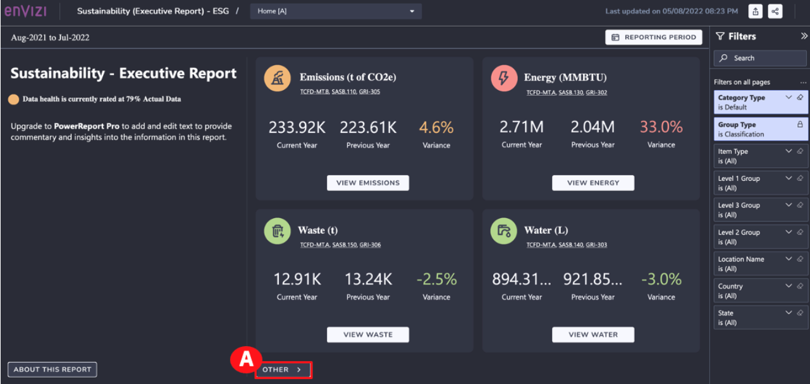
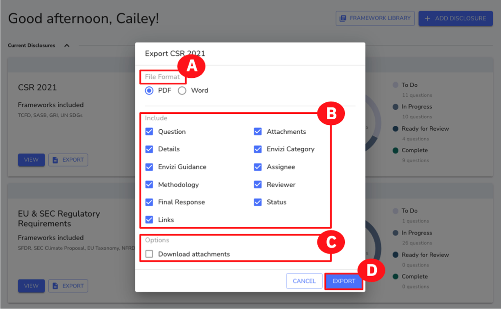

# 102: Informes alineados

## Power Reports para la responsabilidad social de las empresas

Recuerde que anteriormente en esta demostración se indicó que mantuviera abierto el navegador original de [**la página de**](https://uk001.envizi.com/home/default.aspx) inicio de Envizi. Para explorar el **Informe** Ejecutivo, vuelva al navegador de la página de inicio de Envizi. (Haga clic en el logotipo de **Envizi** en la parte superior izquierda si cerró la ventana original).

1.  En la página de inicio de Envizi, en la barra superior de búsqueda global, haga clic en el desplegable y seleccione **Informes (A)**. Escriba Exec en el campo **Buscar informes** **(B)** y observe cómo aparecen los resultados en tiempo real.

2.  Haga clic en **Sostenibilidad (Informe ejecutivo) - ESG** en la barra de búsqueda para acceder a la página **Informes** **(C)**.

    

    > **Nota:** Actualmente, PowerReports sólo está disponible en inglés. Si ha configurado otro idioma, vuelva a cambiar al inglés para ver el informe.

3.  En la página de **Informes**, haga clic en el enlace directo **Sostenibilidad (Informe ejecutivo) - ESG** **(A)**. Dependiendo de su navegador, el PowerReport se abrirá en la misma ventana del navegador o en una nueva pestaña.

    

    > **Nota:** No cierre la página del navegador Informes, ya que se utilizará en pasos futuros.

    Este informe apoya muchas de las divulgaciones medioambientales dentro de los marcos ESG, como las emisiones de Alcance 1, Alcance 2 y Alcance 3, la energía, el agua y los residuos. Se trata de un informe personalizable que se adapta a los informes de sostenibilidad corporativa de cualquier empresa. También existe la posibilidad de **guardar una copia** del informe, lo que permite a los usuarios editar los informes existentes o crear otros nuevos dentro de la interfaz de Microsoft PowerBI. Sin embargo, este privilegio no está disponible actualmente integrado en este entorno de demostración.

    > **Nota:** El botón **Guardar una** copia sólo aparece para usuarios con privilegios de edición de PowerReport. Esto debe ser concedido por el administrador del sistema y no forma parte de esta demostración.

    Ahora es el momento de explorar las distintas opciones de este informe.

4.  Haga clic en el botón **PERÍODO DE INFORME (A)** para elegir un período que se ajuste a una de las divulgaciones del marco ESG.

5.  Seleccione la pestaña **CALENDARIO** y, a continuación, **2021 (B)**.

    > **Nota:** Si no ve 2021 como opción, haga clic en la pestaña ROLLING y amplíe el Rolling Date Period más allá de 12 meses a 2+ años y 2021 volverá a aparecer en la pestaña CALENDAR.

6.  Haga clic en **CERRAR (C)**.

    

    > **Nota:** Las métricas mostradas en las capturas de pantalla y en el vídeo de demostración pueden diferir para el usuario final que complete la demostración posteriormente.

7.  Haga clic en las flechas de **Filtros** de la derecha **(A)** para abrir el panel lateral de **Filtros**. Puede utilizarlo para filtrar cualquier parte de la organización.

8.  Haga clic en **VER EMISIONES (B)** en el cuadro **Emisiones (t de CO2e)** para desglosar los tipos de datos clave que son relevantes para las preguntas de los marcos de información a los que está informando sobre las emisiones de su empresa.

    

    En esta página. Puede ver que las cifras resumidas se han etiquetado en relación con elementos de divulgación específicos del marco de información.

    > **Nota:** Las métricas mostradas en las capturas de pantalla y en el vídeo de demostración pueden diferir para el usuario final que complete la demostración posteriormente.

9.  Resalte la sección **Rendimiento** **(A)**. Esta será la información que extraiga y consulte en el **Gestor de memorias de sostenibilidad**.

10. Haga clic en **ATRÁS** en la parte superior **(B)**.

    

11. Haga clic en **OTROS(A)** en la parte inferior para ver los informes de otros tipos de datos medioambientales, como los viajes en avión, el kilometraje de los coches, etc.

    

    > **Nota:** Las métricas mostradas en las capturas de pantalla y en el vídeo de demostración serán diferentes para el usuario final que complete la demostración más adelante.

12. Cuando haya terminado de ver los tipos de datos medioambientales, haga clic en **ATRÁS (A** ) para volver a **Sostenibilidad - Informe ejecutivo**.

    

    Todos los PowerReports pueden exportarse a varios formatos, incluidos PDF y PowerPoint (PPTx).

13. Haz clic en el icono **Exportar datos** de la parte superior derecha (se parece al icono de compartir al que puedes estar acostumbrado en los dispositivos con iOS) **(A)**. Aparecerá un cuadro de diálogo con diferentes opciones de exportación. Una vez seleccionada la salida deseada, puede hacer clic en el botón **Exportar** para exportar el informe. Este es el tipo de informe que se vincularía a una divulgación previa específica.

> **Nota:** Para esta demostración, usted está en el modo **Sólo Ver**, **no** haga clic en el botón **Exportar**.

14. Haga clic en CANCELAR (B).

    

    El segundo informe que va a ver se centra en las métricas sociales, alineadas con la Global Reporting Initiative (GRI) y otros marcos. Recuerde que anteriormente en esta demostración se indicó que mantuviera abierta la página del navegador Informes. Para explorar el siguiente informe, vuelva a la página del navegador Informes.

    > **Nota:** No cierre la página del navegador **Informes**, ya que se utilizará en pasos futuros.

15. En la página **Informes**, en la barra superior de búsqueda global, haga clic en el desplegable y seleccione **Informes (A)**. Escriba *GRI* en el campo **Buscar** informes **(B)** y observe cómo aparecen los resultados en tiempo real.

16. Haga clic en **Envizi CSR Report** en el menú de resultados de la barra de búsqueda **(C)**.

    

17. En la página **Informes**, haga clic en el enlace **Envizi CSR Report** **(A)**. Se abrirá una nueva ventana del navegador con el PowerReport.

    

    > **Nota:** No cierre la página del navegador Informes, ya que se utilizará en pasos futuros.

    Una vez más, este informe debe personalizarse en función de los indicadores sociales de su empresa y de la forma en que desee visualizar esas métricas en su informe de sostenibilidad corporativa. Dentro de este informe hay varias páginas que formatean los datos sociales capturados en la plataforma Envizi de forma personalizada para su Informe de Sostenibilidad Corporativa. En este ejemplo, están alineados con indicadores GRI específicos.

18. Para acceder a las páginas adicionales, haga clic en el menú **desplegable** de la parte superior y seleccione cualquiera de las páginas, como **Información del empleado, Inversión en la comunidad o Seguridad de los empleados (A)**.

    > **Nota:** Esta demostración no explora cada una de las páginas adicionales. En su lugar, se muestran capturas de pantalla a continuación.

19. Desde cualquiera de los informes, para volver a la página anterior, haga clic en la flecha Atrás (B).

20. Para ver otra página, haga clic en el menú desplegable de la parte superior y seleccione la página deseada (C).

    > **Nota:** Las métricas mostradas en las capturas de pantalla y en el vídeo de demostración pueden diferir para el usuario final que complete la demostración posteriormente.

    

## Revisión y aprobación

El último paso para cualquier divulgación es la firma del Vicepresidente (VP) de Sostenibilidad y, posiblemente, de otros miembros del equipo directivo. Como responsable de la elaboración de memorias de sostenibilidad, debe proporcionar extractos que puedan utilizarse para revisiones intermedias o revisiones finales, y resumir no solo las respuestas finales sino toda la información de apoyo que haya conducido a esas respuestas.

1.  Para explorar el siguiente informe, vuelva a la página del navegador **Informes**. A continuación, haga clic en el logotipo **de Envizi** **(A)** en la parte superior izquierda para volver a la página de inicio.

    

2.  En la **página de inicio de Envizi**, haga clic en Gestor de informes de sostenibilidad **(A)**. El Gestor **de** Informes de Sostenibilidad se abre en una nueva pestaña.

    

    > Nota: Es posible que tenga que desplazarse hacia abajo para ver el informe CSR **2021**. Si no ve el informe etiquetado como CSR **2021**, seleccione en su lugar el **Informe anual CSR** para continuar.

3.  En el cuadro **Informe CSR 2021**, haga clic en el **botón EXPORTAR (A)**.

    

4.  Se abre el cuadro de diálogo **Exportar informe CSR**. Los revisores pueden obtener tanta o tan poca información como sea necesaria para realizar esta revisión. Por ejemplo, puede seleccionar:

    *   El **formato de archivo** deseado para el informe. Supongamos que necesita un **PDF (A)**.
    *   Qué incluir en el informe. Se utiliza para las revisiones o para las respuestas finales. Marque o desmarque las casillas deseadas **(B)**.
    *   Opción para descargar los anexos en el informe. Seleccione la casilla Descargar **anexos** para que se incluyan en el informe **(C)**.
    *   Una vez terminado, pulse el botón **EXPORTAR** **(D)**.

    

    > **Nota:** El informe tardará unos minutos en generarse. Dependiendo de su navegador, una vez finalizado, se abrirá en una nueva pestaña del navegador o recibirá un archivo zip que podrá abrir. Para fines de demostración, es posible que desee producir este informe antes de la demostración y tenerlo listo y abierto para desplazarse a través.

    Una vez generado este informe, aparecerá en su carpeta de descargas y, dependiendo de su navegador, se abrirá en una nueva pestaña del navegador o obtendrá un archivo zip del informe que podrá abrir. Este informe en PDF tiene un **índice**. Este informe (que también está disponible en formato Word) proporciona a los revisores lo que necesitan para proporcionar su afirmación y firmar la divulgación, incluido el Vicepresidente de Sostenibilidad. También le proporciona a usted, como Responsable de Sostenibilidad, las respuestas finales que necesita proporcionar al equipo que dará formato a la información para su publicación externa en su sitio web corporativo.

5.  Desplácese por el informe para ver la información proporcionada **(A)**.

    

    Una vez revisado el informe, vuelva a la pestaña del navegador de la página de inicio de Envizi.

### Enhorabuena, has llegado al final del laboratorio 102.

Continúe con [el laboratorio 103](/envizi/103).
