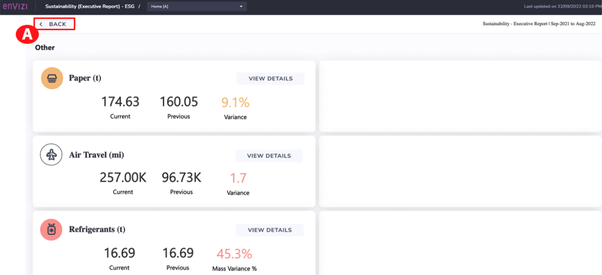
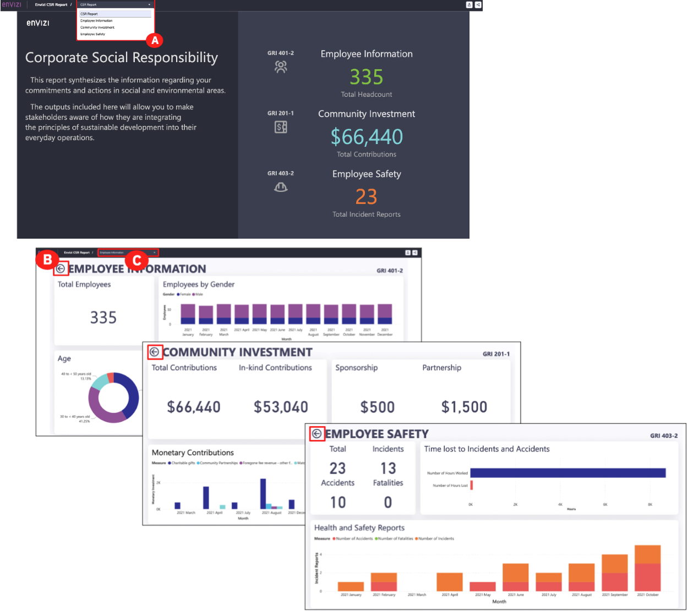

# 102: Aligned Reporting

## Power Reports for Corporate Social Responsibility

Recall earlier in this demonstration it was noted to keep the original [**Envizi home page**](https://uk001.envizi.com/home/default.aspx) browser open. To explore the **Executive Report**, go back to the Envizi home browser. (Click the **Envizi** logo in the top left if you closed the original window.)

1. From the Envizi home page, in the upper global search bar, click the dropdown and select **Reports (A)**. Type Exec in the **Search for Reports** field **(B)** and notice how results appear in real-time.
2. Click **Sustainability (Executive Report) – ESG** from the search bar to be directed to the **Reports** page **(C)**.

   

   > **Note:** PowerReports are currently only supported in English. If you configured another language, switch back to English to view the report.

3. From the **Reports** page, click the **Sustainability (Executive Report) – ESG** hotlink **(A)**. Depending on your browser, the PowerReport will either open in the same browser window or to a new browser tab.

   

   > **Note:** Do not close the Reports browser page as it will be used in future steps.

   This report supports many of the environmental disclosures within ESG frameworks, such as Scope 1, Scope 2, and Scope 3 emissions, energy, water, and waste. This is intended to be a customizable report to align with any company’s Corporate Sustainability Reporting. There is also the ability to **Save a Copy** of the report which allows users to edit existing reports or create new ones within the Microsoft PowerBI interface. However, this privilege is currently not available embedded in this demo environment.

   > **Note:** The **Save a Copy** button only appears for users that have PowerReport Edit privileges. This must be granted by the system admin and is not part of this demo.

   Now it’s time to explore the different options in this report.

4. Click the **REPORTING PERIOD (A)** button to choose a period that aligns with one of the ESG framework disclosures.
5. Select the **CALENDAR** tab then select **2021 (B)**.

   > **Note:** If you do not see 2021 as an option, click the ROLLING tab and expand the Rolling Date Period beyond 12 months to 2+ years and 2021 will appear under the CALENDAR tab again.

6. Click **CLOSE (C)**.

   

   > **Note:** The metrics displayed in the screenshots and in the walkthrough video may differ for the end user completing the demo at a later time.

7. Click the **Filters** arrows on the right **(A)** to open the side **Filters** panel. You can use this to filter to any part of the organization.
8. Click **VIEW EMISSIONS (B)** on the **Emissions (t of CO2e)** box to drill down into the key data types that are relevant to the questions in the reporting frameworks you are reporting to for your company’s emissions.

   

   On this page. You can see that summary numbers have been tagged against specific reporting framework’s disclosure items.

   > **Note:** The metrics displayed in the screenshots and in the walkthrough video may differ for the end user completing the demo at a later time.

9. Highlight the **Performance** section **(A)**. This would be the information that you pull and reference in the **Sustainability Reporting Manager**.

10. Click **BACK** at the top **(B)**.

    

11. Click**OTHER (A)** at the bottom to view reporting for other environmental data types such as air travel, car mileage, and more.

    

    > **Note:** The metrics displayed in the screenshots and in the walkthrough video will differ for the end user completing the demo at a later time.

12. When finished viewing the environmental data types, click **BACK (A)** to return to the **Sustainability – Executive Report**.

    

    All PowerReports can be exported to several formats, including PDF and PowerPoint (PPTx).

13. Click the **Export Data** icon in the upper right (it looks like the share icon you might be used to on iOS-minded devices) **(A)**. A dialog box with different export options will appear. Once you select desired output, you could then click the **Export** button to export the report. This is the kind of report that would be linked to a specific previous disclosure.

> **Note:** For this demo, you are in **View Only** mode, **do not** click the **Export** button.

14. Click CANCEL (B).

    

    The second report you are going to look at focuses on social metrics, aligned with Global Reporting Initiative (GRI) and other frameworks. Recall previously in this demo it was noted to keep the Reports browser page open. To explore this next report, go back to the Reports browser page.

    > **Note:** Do not close the **Reports** browser page as it will be used in future steps.

15. On the **Reports** page, in the upper global search bar, click the dropdown and select **Reports (A)**. Type _GRI_ in the **Search for Reports** field **(B)** and notice how results appear in real-time.

16. Click **Envizi CSR Report** from the search bar results menu **(C)**.

    

17. In the **Reports** page, click the **Envizi CSR Report** hotlink **(A)**. This will open a new browser window with the PowerReport.

    

    > **Note:** Do not close the Reports browser page as it will be used in future steps.

    Again, this report is intended to be customized according to the social indicators your company is reporting against, and the way you’d like to visualize those metrics in your Corporate Sustainability Reporting. Within this report are multiple pages that format the social data captured in the Envizi platform in a customized way for your Corporate Sustainability Reporting. In this example, they are aligned with specific GRI indicators.

18. To access the additional pages, click the **Drop-down** menu at the top and select any one of the pages such as **Employee Information, Community Investment, or Employee Safety (A)**.

    > **Note:** This demonstration does not explore every one of the additional pages. Instead, screenshots are shown below.

19. From any of the reports, to go back to the previous page, click the Back arrow (B).
20. To view another page, click the Drop-down menu at the top and select the desired page (C).

    > **Note:** The metrics displayed in the screenshots and in the walkthrough video may differ for the end user completing the demo at a later time.

    

## Review and signoff

The final step for any disclosure is to sign off by the Vice President (VP) of Sustainability and possibly other members of the senior leadership team. As the Sustainability Reporting Manager, you must provide extracts that can be used for intermediate reviews or final reviews, and summarize not only the final answers but all the supporting information that led to those answers.

1. To explore this next report, go back to the **Reports** browser page. Then click the **Envizi** logo **(A)** in the upper left to go back to the home page.

   

2. From the **Envizi home page**, click **Sustainability Reporting Manager (A)**. The **Sustainability Reporting Manager** opens in a new tab.

   

   > Note: You may need to scroll down to see the **CSR 2021** report. If you don’t see the report labeled as **CSR 2021**, select the **CSR Annual Report** instead to continue.

3. On the **CSR 2021 Report** box, click the **EXPORT button (A)**.

   

4. The **Export CSR Report** dialog box opens. Reviewers can get as much, or as little information as required to perform this review. For example, you can select:

   - The desired **File Format** of the report. Assume you need a **PDF (A)**.
   - What to include in the report. This is used for reviews or for final answers. Select or deselect the desired checkboxes **(B)**.
   - Option to download the attachments in the report. Select the **Download attachments** box for them to be included in the report **(C)**.
   - Once finished, click the **EXPORT** button **(D)**.

   

   > **Note:** It will take a few minutes for the report to generate. Depending on your browser, once it is complete, it will either open in a new browser tab or you will get a zip file that you can open. For demo purposes, you may want to produce this report before the demo and have it ready and opened to scroll through.

   Once this report has been generated, it appears in your downloads folder, and depending on your browser, it opens in a new web browser tab, or you will get a zip file of the report that you can open. This PDF report has a **Table of Contents**. This report (which is also available in Word format) gives reviewers what they need to provide their affirmation and sign off on the disclosure, including the VP of Sustainability. It also gives you, as the Sustainability Manager, the final answers that you need to provide to the team that will format the information for external publication on your corporate website.

5. Scroll through the report to see the information provided **(A)**.

   

   Once you have reviewed the report, go back to the Envizi home page browser tab.

### Congratulations, you've reached the end of lab 102.

Continue to [lab 103](/envizi/103).
