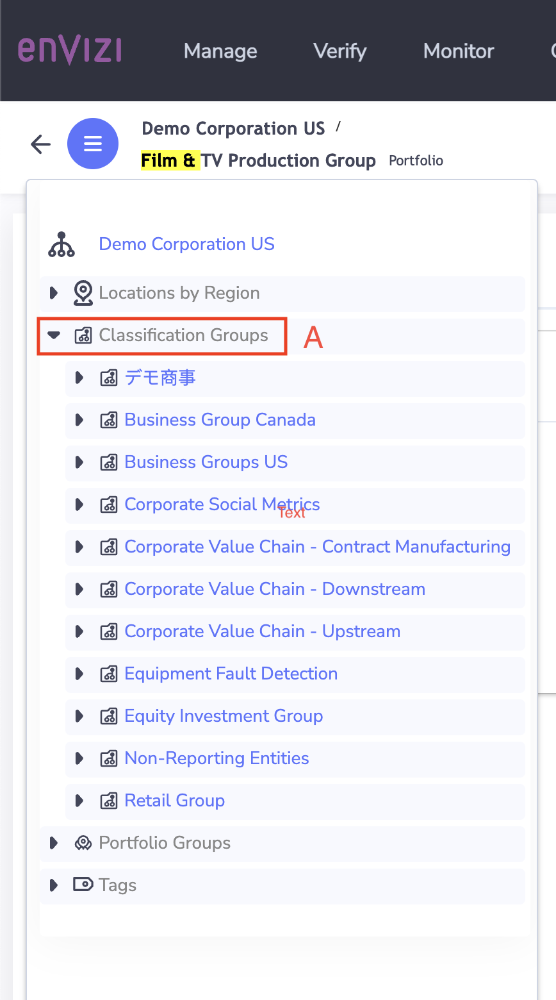
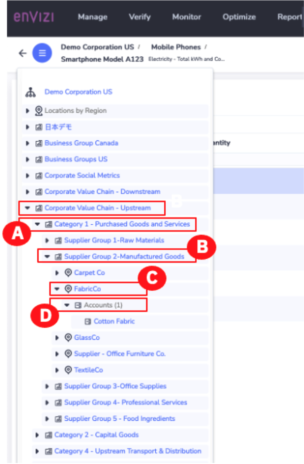
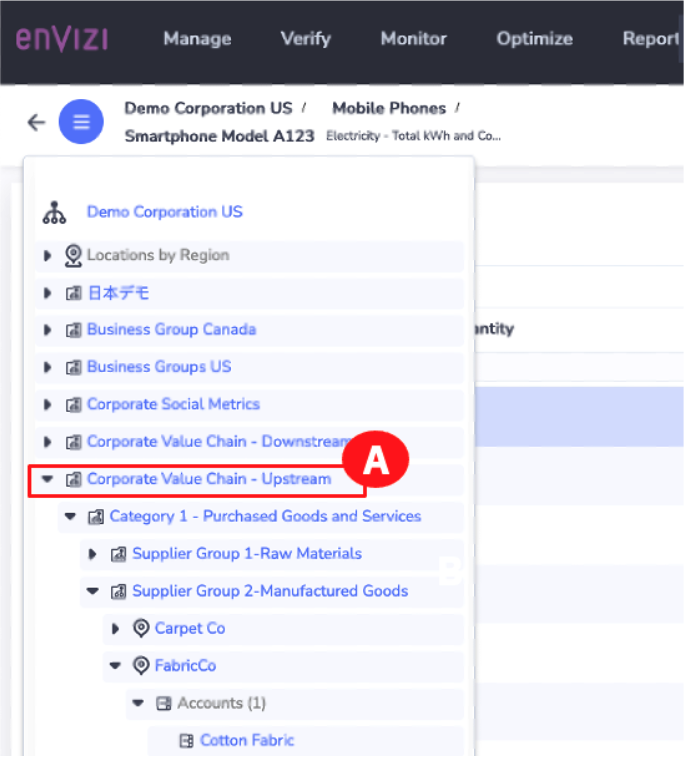
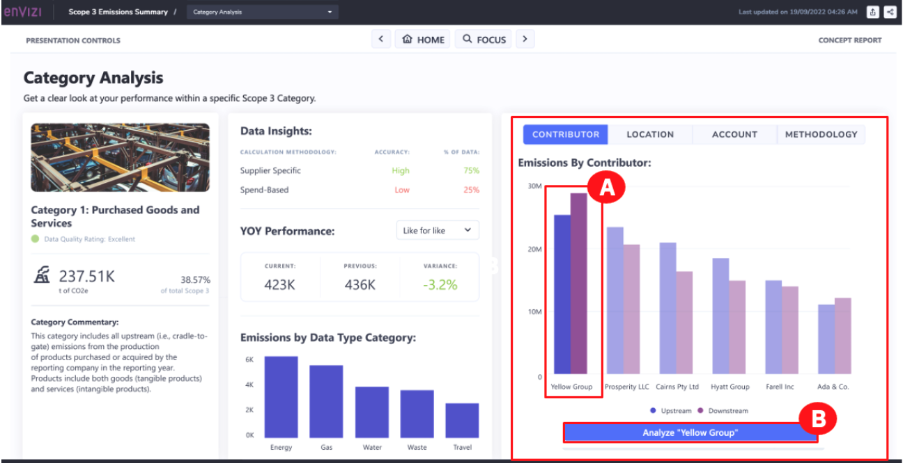
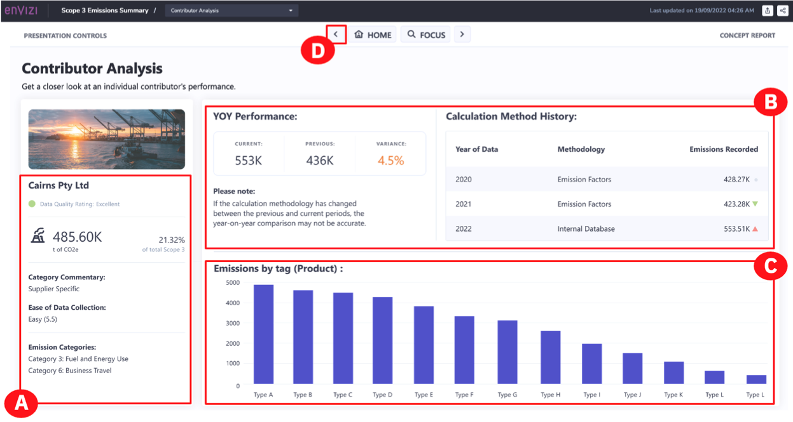
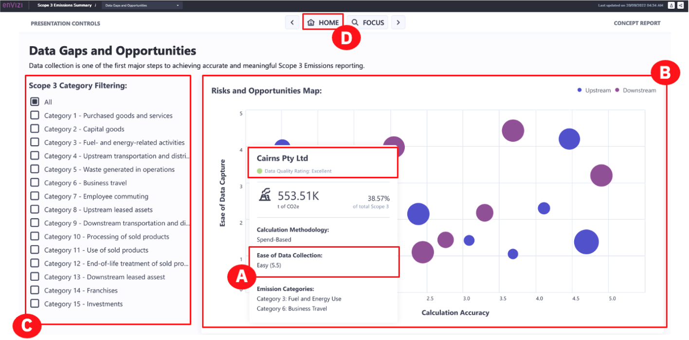

# 103: Capacidades del Ámbito 3

En los últimos años, ha habido una explosión de interés en las emisiones de Alcance 3. Como gestor de sostenibilidad, es necesario capturar e informar sobre las emisiones de Alcance 3 para divulgaciones externas. Sin embargo, esto puede ser un reto porque la captura, gestión y presentación de informes sobre los datos de Alcance 3 puede ser mucho más complejo que lo que se requiere para el Alcance 1 y Alcance 2 debido a la diversidad de fuentes de datos de Alcance 3, así como los desafíos en el acceso a esos datos.

Envizi permite capturar cualquier dato de Alcance 3. Envizi ayuda a gestionar las emisiones de Alcance 3 de cinco maneras:

1.  Captura automática de datos, garantizando así un enfoque sistemático de captura manual de datos auditable.
2.  Proporciona un sólido conjunto de herramientas para la gestión continua de los factores de emisión.
3.  Proporciona herramientas de elaboración de informes de rendimiento para realizar un seguimiento en función de los objetivos y las bases de referencia, y para identificar los puntos conflictivos que deben abordarse.
4.  Proporciona herramientas de elaboración de informes externos para tomar los datos del Alcance 3 y formatearlos adecuadamente para los distintos requisitos del marco de elaboración de informes externos.
5.  Proporciona una pista de auditoría sólida para ayudar a los auditores externos.

## Organización de los flujos de datos del Ámbito 3

Esta sección de la demostración examina cómo pueden organizarse los datos de Alcance 3 capturados con Envizi para la elaboración de informes y análisis. Estos datos pueden referirse a los residuos, los viajes en avión o los desplazamientos de los empleados. Para la mayoría de las organizaciones, lo más lógico es capturar esta información a nivel de centro.

1.  Desde la página de inicio de Envizi, abra la jerarquía de organizaciones para desglosar una ubicación haciendo clic en el icono **Mostrar jerarquía de organizaciones** (el círculo con 3 líneas horizontales, a veces denominado icono de hamburguesa) **(A)** en la esquina superior izquierda.

2.  En **Grupos de Cartera**, busque **Grupo de Producción de Cine y TV** y haga clic en el botón **giratorio** para expandir este grupo **(B)**.

    

    Siga bajando hasta llegar a los datos capturados:

3.  Haga clic en **Producción: WS1** para expandirlo **(A)**.

4.  Haga clic en el enlace **Lugares de rodaje** para ampliarlo **(B)**.

5.  Haga clic en el twistee **USCA** para ver las cuentas de esta ubicación **(C)**.

6.  Haga clic en el botón **Cuentas** para abrir las cuentas de esta ubicación **(D)**.

7.  Tome nota de los datos. En este ejemplo, en la sede de USCA, se capturan diferentes datos; por ejemplo, **Alojamiento, Viajes en avión, Residuos, Reciclaje** y otros tipos de datos de Alcance 3 **(E)**.

    

    Abra una parte de la jerarquía centrada en los tipos de datos capturados a nivel organizativo y continúe desglosando.

8.  Desplácese hasta el nivel superior **Grupos de clasificación** y haga clic en el botón giratorio para expandir este grupo **(A)**.

    

9.  Haga clic para ampliar la **Cadena de Valor Corporativa -** Jerarquía **ascendente** **(A)**. Esta jerarquía es un ejemplo y puede personalizarse.

    

    Siga bajando hasta llegar a los datos capturados:

10. Haga clic en el enlace **Categoría 1 - Bienes y servicios adquiridos** para acceder a los grupos de proveedores más pequeños **(A)**.

11. Haga clic en el enlace **Grupo de proveedores 2 - Productos manufacturados** para desglosar los grupos de proveedores y ver empresas concretas **(B)**.

12. Dentro de cada proveedor hay productos específicos o materias primas que se compran. Haga clic en el twistee **FabricCo** para ver los productos de este proveedor **(C)**.

13. Haga clic en el twistee **Cuentas** para ver **Tejido de algodón (D)**.

    

    La forma de capturar los datos es personalizable. En algunos casos, las organizaciones pueden capturar datos a nivel sectorial para algunas emisiones de Alcance 3 más personales. Luego pueden capturar los datos a nivel de proveedor para los 100 o 500 principales proveedores que contribuyen materialmente a sus emisiones de Alcance 3.

    Lo mismo ocurre con las emisiones descendentes.

14. Haga clic en el twistee **Cadena de valor de la empresa - Upstream** para contraer este grupo **(A)**.

    

15. Haga clic en el twistee **Cadena de valor de la empresa - Aguas abajo** **(A)**.

16. Tome nota de los ejemplos de categorías de emisiones de Alcance 3 **(B)**. Estas podrían capturarse a nivel sectorial o a nivel de un proveedor específico.

17. Haga clic en el icono **Mostrar jerarquía de organización** (el círculo con 3 líneas horizontales, a veces denominado icono de hamburguesa) **(C)**.

## Analizar las emisiones de Alcance 3 mediante informes y cuadros de mando

Ha llegado el momento de profundizar en las perspectivas del Alcance 3. En esta demostración se utilizará el informe Scope 3 PowerReport de Envizi para explorar un informe conceptual que demuestre la información sobre las emisiones de Alcance 3.

1.  En la barra superior de búsqueda global, haga clic en el desplegable y seleccione **Informes (A)**. Escriba *Ámbito 3* en el campo **Buscar** informes **(B)** y observe cómo aparecen los resultados en tiempo real.

2.  Haga clic en **Resumen de emisiones de alcance 3 - PowerReport (C)**.

    

3.  Haga clic en **Resumen de emisiones de alcance 3 - Power** Report en la página **Informes** **(A)**. Se abrirá PowerReport en una nueva pestaña del navegador.

    > **Nota:** Si el **Resumen de Emisiones de Alcance 3 - PowerReport** no se abre en una nueva ventana, compruebe su casilla URL, ya que es posible que tenga bloqueada la ventana emergente.

    

    Este informe de alcance 3 sobre la energía está diseñado para ayudar a identificar los puntos críticos de alcance 3 que representan oportunidades para la reducción de emisiones. Estas oportunidades pueden estar relacionadas con las 15 categorías de Alcance 3, con categorías de productos o con proveedores específicos. Este informe también ayuda a identificar oportunidades para mejorar la calidad de los datos de Alcance 3 en términos de lagunas y precisión de los datos. Envizi utiliza Microsoft Power BI para elaborar este informe, que puede personalizarse para satisfacer las necesidades específicas de visualización y análisis de la organización.

4.  Busque oportunidades para reducir las emisiones. Para ello, haga clic en el botón **CONTINUAR CON EL INFORME** **(A)**.

    

5.  Se abrirá el panel **de emisiones**. Este panel ofrece una visión macro de las emisiones de Alcance 3, incluyendo:

    *   **Resumen de las emisiones:** Una comparación de las emisiones de Alcance 3 frente a las emisiones de Alcance 1 y Alcance 2. Ambas se representan en términos absolutos y porcentuales. Muestra la tendencia general de las emisiones de Alcance 3 y, a continuación, desglosa las emisiones de Alcance 3 por categorías anteriores y posteriores **(A)**.
    *   **Rendimiento de la categoría de Alcance 3:** Esta es la contribución de emisiones de cada categoría de Alcance 3. Puede analizar cualquiera de las categorías mostradas en esta sección **(B)**.
    *   **Principales contribuyentes:** Los principales contribuyentes globales a las emisiones de Alcance 3 **(C)**.

    

    También puede profundizar en una categoría específica del Alcance 3. Por ejemplo, supongamos que desea examinar una de las categorías más comunes, la Categoría 1: Bienes y servicios adquiridos.

6.  En la sección **Desempeño de la categoría de Alcance** 3, en el centro, haga clic en **Categoría 1: Bienes y servicios adquiridos (A)**.

7.  Haga clic en el botón **Analizar Categoría 1 Bienes y servicios adquiridos** (este botón aparece después de seleccionar esta categoría en el paso anterior) en la parte inferior **(B)**.

    

8.  Se abre el panel de **Análisis de Categorías**. Este panel permite analizar la categoría seleccionada de varias maneras:

    *   **Conocimiento de los datos:** Describe la metodología de cálculo utilizada para las distintas proporciones de los datos y la precisión asociada a cada una de ellas, tal y como se define en el protocolo de gases de efecto invernadero **(**GEI) **(A)**.
    *   **Rendimiento interanual:** El rendimiento interanual (YOY) es una tendencia de las emisiones en esta categoría. Existe la posibilidad de limitar la comparación únicamente a aquellas fuentes de datos en las que la metodología de cálculo no ha variado a lo largo del periodo **(B)**. (En otras palabras, una comparación similar).
    *   **Emisiones por categoría de tipo de datos:** Los principales tipos de datos que componen las emisiones de esta categoría **(C)**.
    *   **Emisiones por contribuidor:** Los principales contribuyentes de esta categoría. En el caso de bienes y servicios adquiridos, serían los proveedores, como Yellow Group. **(D)**.

    

9.  Para centrarse en un proveedor concreto, por ejemplo, Grupo **Amarillo**, haga clic en **Grupo Amarillo** en el gráfico **(A)** y, a continuación, en el botón **Analizar "Grupo Amarillo"** **(B)**.

    

10. Se abre el panel **Análisis de contribuidores**. Este panel ofrece un análisis de un contribuyente o proveedor concreto:

    *   **Nombre del contribuyente (Cairns Pty Ltd):** La cuota de emisiones que representa este proveedor en particular y la metodología utilizada para el cálculo de las emisiones, que puede influir en la confianza que usted tenga en las cifras que vea. Anote también las categorías de emisiones aplicables a las emisiones de este proveedor **(A)**.
    *   **Rendimiento interanual:** La tendencia de las emisiones de este proveedor. Y en Historial del método de cálculo, una indicación de si la metodología de cálculo ha cambiado con el tiempo **(B)**.
    *   **Emisiones por etiqueta (Producto):** Las emisiones por los productos que este proveedor suministra a su empresa **(C)**.

11. Haga clic en el botón de **flecha Atrás** situado en la parte superior **(D)**.

    

12. Accederá al **Panel de contribuyentes**. Este cuadro de mando examina las emisiones de Alcance 3 desde el punto de vista de los principales contribuyentes. Este panel muestra:

    *   Vista de la concentración de proveedores **(A)**.
    *   Vista de la distribución geográfica de los proveedores **(B)**.
    *   Proveedores individuales **(C)**. Si desea analizar un proveedor, puede hacer clic en el botón " **Nombre** del **proveedor** " y, a continuación, en el botón **Analizar "Nombre del proveedor"**. Esto le devolvería al Panel de control de proveedores.

    

13. Haga clic en el botón **INICIO** de la parte superior **(A** ) para volver a la página de inicio del **Resumen del Alcance 3 de las emisiones**.

    

    Para comprender mejor los datos de Alcance 3 de su empresa, también querrá ver las lagunas y oportunidades de los datos.

14. Para ver un cuadro de mando con esta información, haga clic en el botón **DATA GAPS AND OPPORTUNITIES** **(A** ) de la página **Resumen de emisiones de alcance 3**.

    

    Este cuadro de mandos ofrece una visión de qué fuentes de datos de Alcance 3 representan un riesgo para determinar una imagen completa de las emisiones de Alcance 3. Hay dos atributos asociados a cada fuente de emisión que se muestran al pasar el ratón por encima de una burbuja:

    *   Para el contribuyente de **Cairns Pty** Ltd, ¿cómo de fácil fue capturar los datos de esta fuente de emisión? Las fuentes automatizadas son las mejores, mientras que las capturas manuales una vez al año se clasificarían mal **(A)**.
    *   El grado de precisión de los cálculos, basado en la metodología utilizada para esta fuente de datos. Las emisiones de la esquina superior derecha representan el menor riesgo para determinar una imagen exacta de las emisiones de Alcance 3 y las de la esquina inferior izquierda representan el mayor riesgo para determinar una imagen exacta **(B)**.

15. Esta evaluación podría acotarse seleccionando una categoría de la lista **(C)**.

16. Haga clic en el botón **INICIO** de la parte superior **(D)**.

    

### Enhorabuena. Has llegado al final del laboratorio 103.

Con esto concluye el laboratorio L3. Encontrará más recursos de Envizi, incluidos otros módulos de demostración, en [la página sísmica "Accelerate ESG Reporting and Performance with Envizi](https://ibm.seismic.com/Link/Content/DC3d7gR9pH2TF82DCcDqpX48F2qd)".

Ya puedes [completar el cuestionario](https://learn.ibm.com/course/view.php?id=11879) de Envizi Sustainability Performance Management Technical Sales L3
