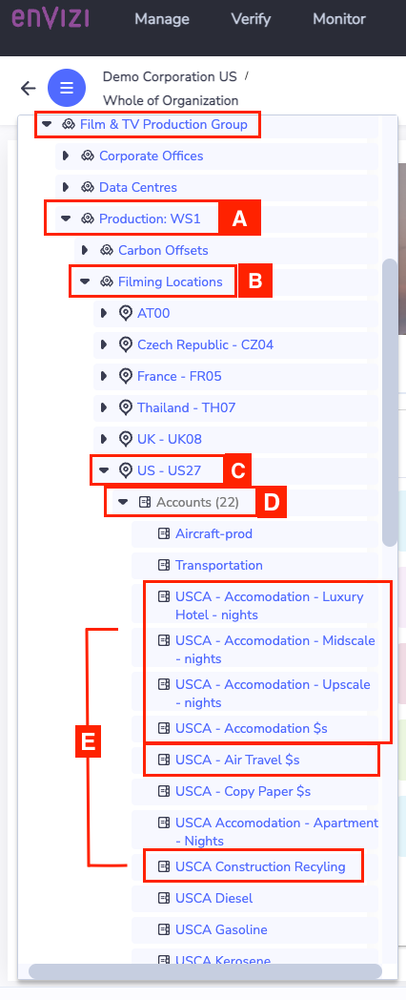
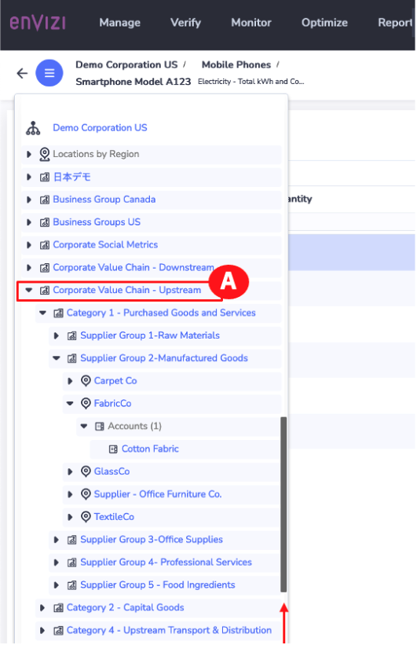
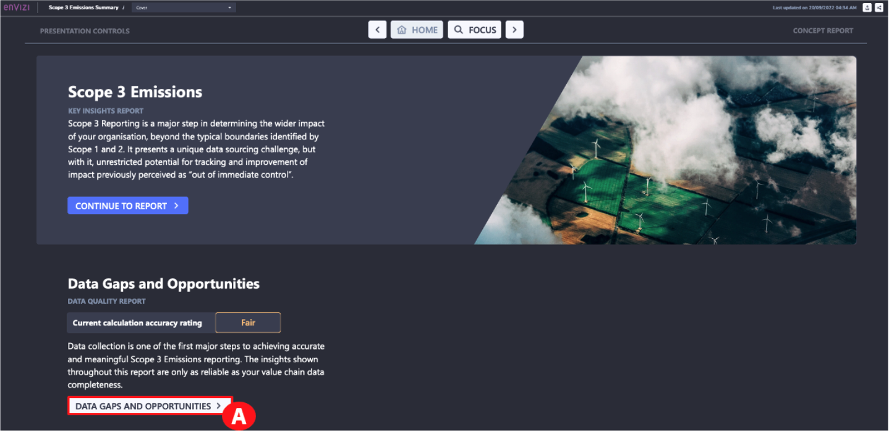

# 103: Capacidades del Ámbito 3

<QuizAlert text='¡Atención! El material del concurso se marcará así!' />

En los últimos años, ha habido una explosión de interés en las emisiones de Ámbito 3. Como Gerente de Sostenibilidad, usted necesita capturar e informar sobre las emisiones de Ámbito 3 para divulgaciones externas. Sin embargo, esto puede ser un reto porque la captura, gestión y presentación de informes sobre los datos de Ámbito 3 puede ser mucho más complejo que lo que se requiere para el Ámbito 1 y Ámbito 2 debido a la diversidad de fuentes de datos de Ámbito 3, así como los desafíos en el acceso a esos datos.

Todos los datos de Ámbito 3 pueden capturarse en Envizi. Envizi ayuda a gestionar las emisiones de Alcance 3 de cinco maneras:

1. Captura automática de datos, garantizando así un enfoque sistemático auditable de captura manual de datos.
2. Proporciona un sólido conjunto de herramientas para la gestión continua del factor de emisión.
3. Proporciona herramientas de elaboración de informes de rendimiento para realizar un seguimiento con respecto a los objetivos y las bases de referencia,
   y para identificar los puntos conflictivos que deben abordarse.
4. Proporciona herramientas de información externa para tomar datos de Alcance 3 y formatearlos
   adecuadamente para los diferentes requisitos del marco de información externa.
5. Proporciona una pista de auditoría sólida para ayudar a los auditores externos.

## Organización de los flujos de datos del Ámbito 3

Esta sección de la demostración examina cómo los datos de Ámbito 3 capturados con Envizi pueden organizarse para la elaboración de informes y análisis. Estos datos pueden referirse a los residuos, los viajes en avión o los desplazamientos de los empleados. Para la mayoría de las organizaciones, lo más lógico es capturar esta información a nivel de centro.

1. En la página de inicio de Envizi, abra la jerarquía de la organización para desglosar una ubicación haciendo clic en el icono **Show Organization Hierarchy (Mostrar jerarquía de la organización)** (el círculo con 3 líneas horizontales, a veces denominado icono de hamburguesa) **(A)** en la esquina superior izquierda.
2. Desplácese hacia abajo hasta **Film & TV Production Group (Grupo de Producción de Cine y TV)** y haga clic en el **twistee** para expandir este grupo **(B)**.

   

   Continúe perforando hacia abajo para llegar a los datos capturados:

3. Haga clic en **Producción: WS1** twistee para expandirlo **(A)**.
4. Haz clic en el twistee **Filming Locations (Lugares de filmación)** para expandirlo **(B)**.
5. Haga clic en el twistee **USCA** para ver las cuentas de esta ubicación **(C)**.
   <QuizAlert text="Material del concurso"/>
6. Haga clic en el botón **Accounts (Cuentas)** para abrir cuentas para esta ubicación **(D)**.
7. Tome nota de los datos. En este ejemplo, en la ubicación USCA, se capturan diferentes datos; por ejemplo, **Alojamientos, Viajes en avión, Residuos, Reciclaje**, y otros tipos de datos de Alcance 3 **(E)**.

Abra una parte de la jerarquía que se centre en los tipos de datos que se capturan a nivel organizativo y continúe desglosando.

8.  Desplácese hasta **Film & TV Production Group (Grupo de Producción de Cine y TV*)* y haga clic en el botón giratorio para contraer este grupo **(A)\*\*.

9.  Desplácese hacia arriba y haga clic en para expandir el grupo **Corporate Value Chain – Upstream (Cadena de Valor Corporativa - Ascendente)** **(A)**. Esta jerarquía es un ejemplo y puede personalizarse.

Continúe perforando hacia abajo para llegar a los datos capturados:

10. Haga clic en el enlace **Category 1 – Purchased Goods and Services (Categoría 1 - Bienes y servicios adquiridos)** para acceder a los grupos de proveedores más pequeños **(A)**.

11. Haga clic en el enlace **Supplier Group 2 – Manufactured Goods (Grupo de proveedores 2 - Productos manufacturados)** para examinar los grupos de proveedores y ver las empresas específicas **(B)**.
12. Dentro de cada proveedor hay productos específicos o mercancías que se compran.
    Haga clic en el enlace **FabricCo** para ver los productos de este proveedor **(C)**.

13. 13. Haga clic en **Accounts (Cuentas)** para ver **Cotton Fabric (Tejido de algodón) (D)**.

    

    La forma de capturar los datos es personalizable. En algunos casos, las organizaciones pueden capturar datos a nivel sectorial para algunas emisiones de ámbito 3 más personales. Luego pueden capturar los datos a nivel de proveedor para los 100 o 500 proveedores principales que contribuyen materialmente a sus emisiones de ámbito 3.

    Lo mismo ocurre para las emisiones descendentes.

14. Haga clic en el botón **Corporate Value Chain – Downstream (Cadena de Valor Corporativa - Ascendente)** para contraer este grupo **(A)**.

    

15. Haga clic en el botón **Corporate Value Chain – Downstream (Cadena de valor corporativa - Descendente)** para contraer este grupo **(A)**.
16. Tome nota de los ejemplos de categorías de emisiones de ámbito 3 **(B)**. Éstas podrían capturarse a nivel sectorial o a nivel de un proveedor específico.

17. Haga clic en el icono **Show Organization Hierarchy (Mostrar jerarquía de organización)** (el círculo con 3 líneas horizontales, a veces denominado icono de hamburguesa) **(C)**.

## Analizar las emisiones de ámbito 3 mediante informes y cuadros de mando

Ahora es el momento de profundizar en las perspectivas del ámbito 3. Para explorar un informe de recorrido conceptual que demuestre la presentación de informes de emisiones de ámbito 3, esta demostración utilizará Envizi's ámbito 3 PowerReport.

1.  En la barra de búsqueda global superior, haga clic en el menú desplegable y seleccione **Reports (Informes) (A)**. Escriba _Scope 3_ en el campo **Search for Reports (Buscar informes)** **(B)** y observe cómo aparecen los resultados en tiempo real.
2.  Haga clic en **Scope 3 Emissions Summary – PowerReport (Resumen de emisiones del Ámbito 3 - PowerReport) (C)**.

    

3.  Haga clic en **Scope 3 Emissions Summary – PowerReport (Resumen de emisiones del Ámbito 3 - PowerReport)** en la página **Reports (Informes)** **(A)**. Se abrirá PowerReport en una nueva pestaña del navegador.

> **Nota:** Si el **Scope 3 Emissions Summary – PowerReport (Resumen de Emisiones del Ámbito 3 - PowerReport)** no se abre en una nueva ventana, compruebe su casilla URL, ya que es posible que tenga bloqueada la ventana emergente.

Este informe sobre el ámbito 3 de la energía está diseñado para ayudar a identificar los puntos calientes del ámbito 3 que representan oportunidades para la reducción de emisiones. Estas oportunidades pueden referirse a las 15 categorías de ámbito 3, a categorías de productos o a proveedores concretos. Este informe también ayuda a identificar oportunidades para mejorar la calidad de los datos de ámbito 3 en términos de lagunas y precisión de los datos. Envizi utiliza Microsoft Power BI para construir este informe; se puede personalizar para satisfacer las necesidades específicas de la organización para la visualización y el análisis.

4.  Examine la identificación de oportunidades para la reducción de emisiones. Para ello, haga clic en el botón **CONTINUE TO REPORT (CONTINUAR CON EL INFORME)** **(A)**.

    

5.  Se abrirá el **Emissions dashboard (Panel de emisiones)**. Este cuadro de mandos proporciona una vista macro de las emisiones de Ámbito 3, incluyendo:
    <QuizAlert text="Material de prueba"/>

- **Resumen de las emisiones:** Comparación de las emisiones de ámbito 3 con las de ámbito 1 y 2. Ambas se representan en términos absolutos y porcentuales. Ambas se representan en términos absolutos y porcentuales. Muestra la tendencia general de las emisiones de ámbito 3 y, a continuación, desglosa las emisiones de ámbito 3 por categorías anteriores y posteriores **(A)**.
- **Desempeño de la categoría de ámbito 3:** Se trata de la contribución de las emisiones de cada categoría de ámbito 3. Puede analizar cualquiera de las categorías mostradas en el cuadro. Puede analizar cualquiera de las categorías mostradas en esta sección **(B)**.

  - **Principales contribuyentes:** Los principales contribuyentes globales de las emisiones de Alcance 3 **(C)**.

  

También puede profundizar en una categoría específica de ámbito 3. Por ejemplo, supongamos que desea examinar una de las categorías más comunes - Categoría 1: Bienes y servicios adquiridos.

6.  En la sección central "Rendimiento de las categorías del ámbito 3", haga clic en **Category 1: Purchased goods and services (Categoría 1: Bienes y servicios adquiridos) (A)**".
7.  Haga clic en el botón **Analyse Category 1 Purchased goods and services (Analizar Categoría 1: Bienes y servicios adquiridos)** (este botón aparece después de seleccionar esta categoría en el paso anterior) en la parte inferior **(B)**.

    

8.  Se abre el **Category Analysis (Panel de análisis de categorías)**. Este panel ofrece la posibilidad de analizar la categoría seleccionada de varias maneras, incluyendo:

- **Data Insights:** Describe la metodología de cálculo utilizada para las diferentes proporciones de los datos y la precisión asociada a cada una de ellas, tal y como se define en el protocolo de gases de efecto invernadero (GEI) **(A)**.

- **Rendimiento interanual:** El rendimiento interanual es una tendencia de las emisiones en esta categoría. Existe la posibilidad de limitar la comparación únicamente a aquellas fuentes de datos en las que la metodología de cálculo ha permanecido invariable durante el periodo **(B)**. (En otras palabras, una comparación de igual a igual)
- **Emisiones por categoría de tipo de datos:** Los principales tipos de datos que componen las emisiones de esta categoría **(C)**.
- **Emisiones por contribuidor:** Los principales contribuidores de esta categoría. En el caso de bienes y servicios adquiridos, serían los proveedores, como Yellow Group. **(D)**.

9.  Para centrarse en un proveedor concreto, por ejemplo, **Grupo amarillo**, haga clic en **Yellow Group (Grupo amarillo)** en el gráfico **(A)** y, luego, haga clic en el botón **Analyse "Yellow Group" (Analizar "Grupo amarillo ")** **(B)**.

    

10. Se abre el panel **Contributor Analysisv (Análisis de colaboradores)**. Este panel proporciona un análisis de un contribuyente o proveedor en particular:

    - **Nombre del contribuidor (Cairns Pty Ltd):** La cuota de emisiones que representa este proveedor concreto y la metodología utilizada para el cálculo de las emisiones, que puede influir en la confianza que tenga en las cifras que vea. Tenga en cuenta también las categorías de emisiones aplicables a las emisiones de este proveedor **(A)**.
    - **YOY Performance:** La tendencia de las emisiones de este proveedor. Y en Historial del método de cálculo, una indicación de si la metodología de cálculo ha cambiado con el tiempo **(B)**.
    - **Emisiones por etiqueta (producto):** Las emisiones de los productos que este proveedor suministra a su empresa **(C)**.

11. Pulse el botón **Back arrow (Flecha atrás)** en la parte superior **(D)**.

    

12. Esto le llevará al **Panel de control de contribuidores**. Este cuadro de mandos analiza las emisiones de ámbito 3 desde el punto de vista de los principales contribuidores. Este panel muestra:

    - Una vista de la concentración de proveedores **(A)**.
    - Una vista de la distribución geográfica de los proveedores **(B)**.
    - Proveedores individuales **(C)**. Si desea analizar un proveedor, puede hacer clic en el botón **Supplier name (Nombre del proveedor )** y, luego, en el botón **Analyse “Supplier name” (Analizar "Nombre del proveedor ")**. Esto le devolvería al Panel de control del colaborador.

    

13. Haga clic en el botón **HOME** de la parte superior **(A)** para volver a la página de inicio del **Resumen del Ámbito 3 de las emisiones**.

Para comprender mejor los datos de ámbito 3 de su empresa, también querrá ver las lagunas de datos y las oportunidades.

14. Para ver un cuadro de mando con esta información, haga clic en el botón **DATA GAPS AND OPPORTUNITIES** **(A)** de la página **Scope 3 Emissions Summary**.

    

Este cuadro de mando proporciona una visión de qué fuentes de datos de ámbito 3 representan un riesgo para determinar una imagen completa de las emisiones de ámbito 3. Hay dos atributos asociados a cada fuente de emisión que se muestran al pasar el ratón por encima de una burbuja:

- Para el contribuyente **Cairns Pty Ltd**, ¿qué tan fácil fue capturar los datos de esta fuente de emisión? Las fuentes automatizadas son las mejores, mientras que las capturas manuales una vez al año tendrían una mala clasificación **(A)**.

- La precisión de los cálculos, basada en la metodología utilizada para esta fuente de datos. Las emisiones de la esquina superior derecha representan el riesgo más bajo para determinar una imagen exacta de las emisiones de Ámbito 3 y las de la esquina inferior izquierda representan el riesgo más alto para determinar una imagen exacta **(B)**.

15. Esta evaluación podría acotarse seleccionando una categoría de la lista **(C)**.

16. Haga clic en el botón **HOME** de la parte superior **(D)**.
    <QuizAlert text="Material del concurso"/>

    

### ¡Felicidades! Has llegado al final del laboratorio 103.

Con esto concluye el laboratorio L3. Encontrará más recursos de Envizi, incluidos otros módulos de demostración, en la página sísmica ["Accelerate ESG Reporting and Performance with Envizi"](https://ibm.seismic.com/Link/Content/DC3d7gR9pH2TF82DCcDqpX48F2qd).

Ahora puede [completar el cuestionario](https://learn.ibm.com/course/view.php?id=11879) para Envizi Sustainability Performance Management Technical Sales L3
