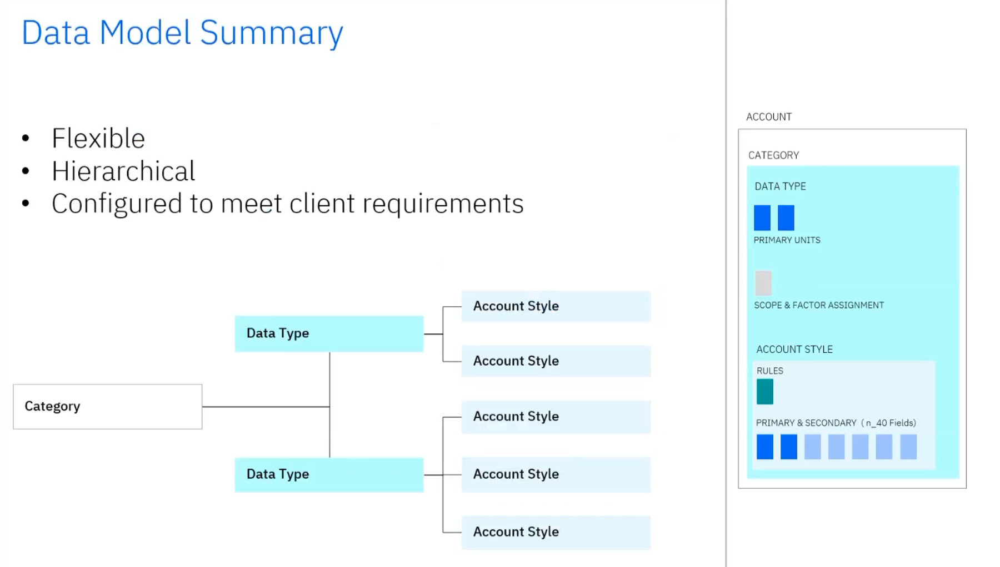
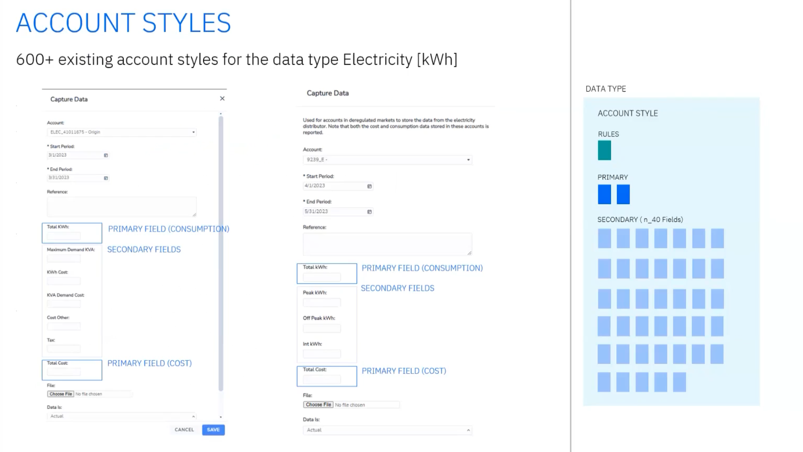
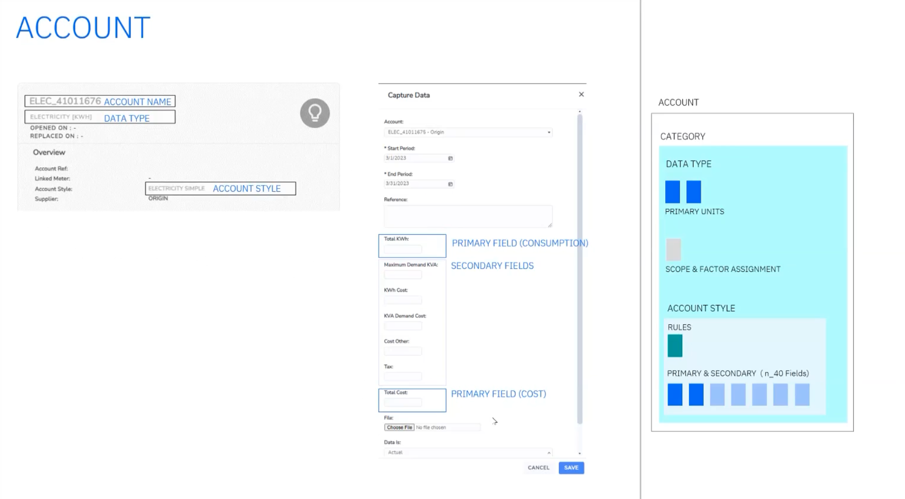
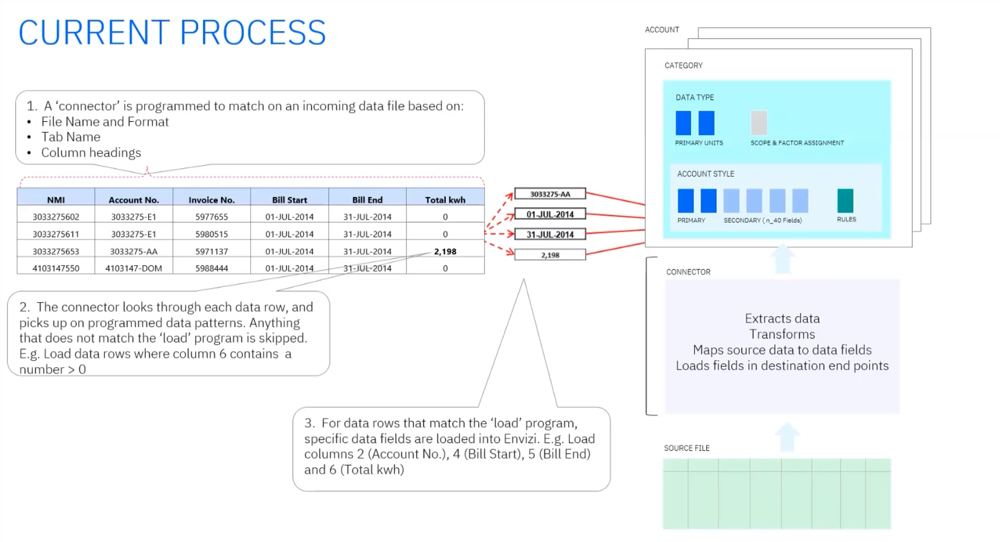

# 104: Gestión e integración de datos de Envizi

La demostración de la insignia Envizi Technical Sales Intermediate muestra el poder de Envizi para identificar oportunidades de mejoras ESG, realizar un seguimiento del progreso ESG año tras año y realizar informes ESG de acuerdo con los marcos ESG numéricos.  

La racionalización de los informes y la aceleración de la descarbonización dependen de un conjunto completo de datos ESG relevantes.  El primer paso en la elaboración de una solución Envizi es construir esa base de datos.  Este laboratorio analiza la arquitectura de gestión de datos dentro de Envizi, y las opciones actuales y futuras para cargar datos de forma automatizada. 

## Modelo de datos Envizi

A continuación se ofrece una explicación rápida de los cuatro componentes clave del sistema de gestión de datos de Envizi.

Flexible
Jerárquico por naturaleza
Configurado para satisfacer las necesidades del cliente

El modelo de datos de cada cliente se traza durante el proceso de incorporación a través de consultas con el cliente para determinar los tipos de datos que sería necesario capturar y los estilos de cuenta necesarios para capturar campos específicos que podrían ser cualquiera de ellos:
- Estilos de cuenta mapeados a partir de archivos de proveedores que se utilizarían en la recopilación automatizada de datos.
- campos necesarios para satisfacer los requisitos de elaboración de informes. 

### Tipos de datos
Los tipos de datos son los cimientos del modelo de datos de Envizi.

Configurables, pero gestionados por el equipo de producto de Envizi.

Definir:
- Categoría de datos a gestionar (por ejemplo, Agua, Gas Natural, Electricidad)
- Unidad de medida primaria (coste y consumo) que se registrará en el tipo de datos 
- Alcance de las emisiones (1, 2 o 3) y proceso de asignación del factor de emisiones para el tipo de datos, si procede. 

Las métricas sociales o los tipos de datos de información sobre edificios pueden tener "Sin alcance".  

El alcance y la categoría de los datos influyen en el modo en que se aplica el factor de emisiones a esos datos en la plataforma. 

Envizi cuenta con una biblioteca de más de 4.000 tipos de datos. La biblioteca se amplía constantemente cuando es necesario para satisfacer las necesidades de recopilación de datos de los clientes.

### Estilos de cuenta
Esquema de datos configurado sobre un Tipo de datos
Configurado **por cliente** para proporcionar flexibilidad para satisfacer diferentes requisitos de captura de datos
- Define los campos de datos específicos que deben capturarse, divididos en campos primarios y secundarios.
- Puede permitir que se añadan desplegables para soportar cosas como la captura de datos multi-unidad, listas de selección de divisas, etc.
- Admite reglas para:
  - Hacer obligatorios determinados campos
  - Proporcionar valores por defecto
  - Realizar operaciones matemáticas sencillas en la entrada para derivar un valor de campo basado en otros datos capturados. 

### Cuentas
Las cuentas son el punto final para el almacenamiento de datos dentro de Envizi.  Los datos capturados a través de la interfaz de usuario o los conectores se asocian a una cuenta. 

- Únicas por nombre e ID
- Configuradas a nivel de ubicación
- Configuradas con un tipo de datos y un estilo de cuenta específicos.
- Al crear una nueva cuenta, elija primero el tipo de datos y, a continuación, el estilo de cuenta.  
- Sirve como punto final para el almacenamiento de datos cuando los datos se inyectan ya sea por captura manual o automatización a través de Conectores. 
- Se utiliza como entidad de información que se despliega a través de la jerarquía de agrupación.

## Conectores 

Hay varias formas de capturar datos en Envizi.
- UI: es una opción para introducir pequeñas cantidades de datos de forma puntual.  
- Carga masiva desde una plantilla

### Proceso actual
- Personalizado, por sistema fuente, por cliente
- Altamente específico
- Hace coincidir el archivo de datos entrante en función del nombre, el formato, los encabezados, etc.
- Utiliza un cubo de almacenamiento en la nube S3 como zona de aterrizaje para los archivos que debe consumir el conector
- Este enfoque carece de escalabilidad

### Próximamente - Fin del segundo trimestre
Conector de cuenta universal - requerirá una plantilla estándar que varía según el estilo de cuenta.

Una plantilla de carga de datos (el informe de extracción de estilos de cuenta puede descargarse desde la interfaz de usuario para cualquier estilo de cuenta). Esto permitirá a los socios mucha más flexibilidad en la forma en que quieren obtener los datos en Envizi.

#### Opción A
Los archivos de origen son transformados por sistemas o procesos externos para que coincidan con el formato de archivo universal de Envizi (varía según el Estilo de Cuenta) y se cargan directamente a través del Conector de Cuenta Universal.

#### Opción B
Los archivos de origen son transformados por un servicio gestionado que utiliza instancias de App Connect para que coincidan con el formato de archivo universal de Envizi (varía según el estilo de cuenta) y se cargan a través del Universal Account Connector.
- Flujos de transformación de App Connect y servicios de supervisión proporcionados por IBM Integration Services
- Fijación de precios basada en el número de tipos de datos del archivo de origen
- Precio de las integraciones personalizadas previa solicitud, por ejemplo, interfaces API

### Próximos eventos

- 24 de mayo: Gestión de etiquetas
- 30 de mayo: PowerReport (presentación, precios, alcance)

### Mejor juntos: Turbonomic y Envizi

Continuar en [lab 105](/envizi/105)
