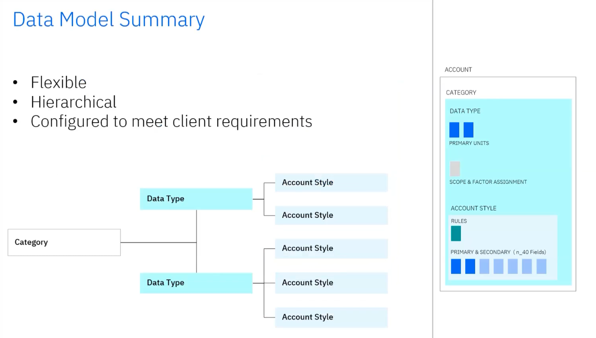
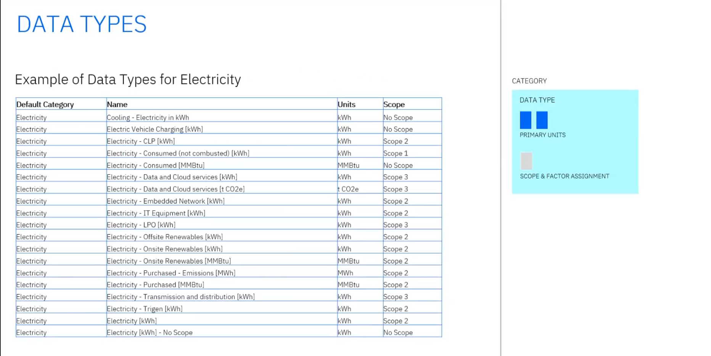
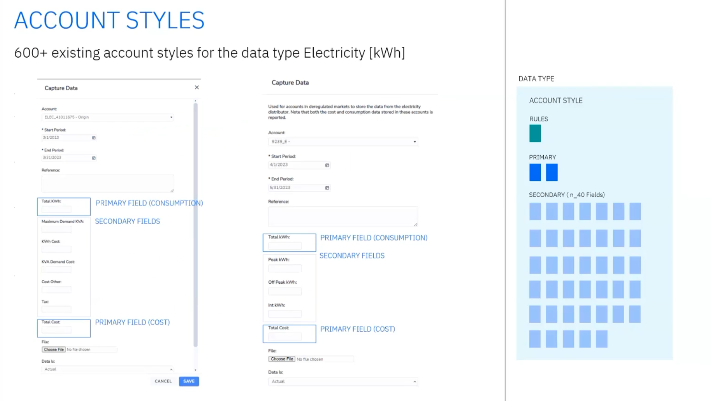
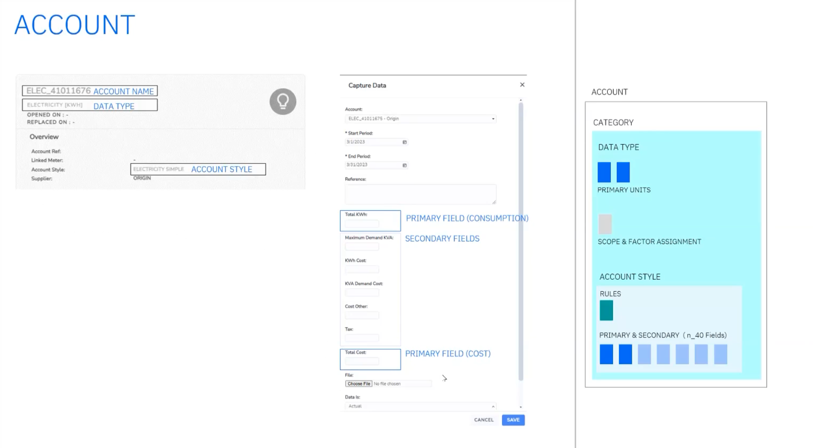

# Envizi data management and integration

The Envizi Technical Sales Intermediate badge demo displays the power of Envizi for identifying opportunities to ESG improvements, track ESG progress year over year, and perform ESG reporting in accordance with numerious ESG frameworks.  

Streamlined reporting and accelerated decarbonization depends on a comprehensive set of relevant ESG data.  The first step in crafting an Envizi solution is to build that data foundation.  This lab discusses the data management architecture within Envizi, and current and future options for loading data in an automated fashion. 

## Envizi Data model

The following is a quick explanation of the four key components of the Envizi data management system.

Flexible
Hierarchical in nature
Configured to meet client requirements

Each customer data model is mapped out during the onboarding process through customer consultation to determine the data types that would need to be captured and account styles needed to capture specific fields that might be either:
- Account styles mapped from supplier files that would be used in automated data collection
- fields needed to satisfy reporting requirements. 

### Data Types
Data Types are the foundational building block of Envizi's data model.

Configurable, but managed by envizi's product team.

Define:
- Data category to be managed (e.g. Water, Natural Gas, Electricity)
- Primary unit of measure (cost and consumption) to be recorded against the data type 
- Emissions scope (1, 2, or 3) and emissions factor assignment process for the data type if applicable. 

Social metrics or building information data types may have "No Scope".  

Scope and data category play a part in how the emissions factor is applied for that data in the platform. 

Envizi has an existing library of 4,000+ data types. The library is constantly expanding when necessary to meet client data collection needs.

### Account Styles
Data schema configured on top of a Data Type
Configured **per customer** to provide flexibility to meet different data capture requirements
- Defines the specific data fields to be captured, split in to primary and secondary fields.
- Can allow for drop-downs to be added to support things like multi-unit data capture, currency pick-lists, etc.
- Supports rules to:
  - Make certain fields mandatory
  - Provide default values
  - Perform simple math on input to derive a field value based on other captured data. 

### Accounts
Accounts are the end point for data storage within Envizi.  Data captured via UI or connectors is associated with an Account. 

- Unique by name and ID
- Configured at a location level
- Configured with a specific data type and account style.
- When creating a new account, first choose the data type, then the account style.  
- Serves as the end point for data storage when data is injested either by manual capture or automation via Connectors. 
- Use as reporting entity that rolls up through grouping hierarchy.

## Connectors 

There are multiple ways to capture data in Envizi. 
- UI: is an option for entering smaller amounts of data in a one off manner.  
- Bulk loading from a template

### Current Approach
Highly specific
- Custom, per source system, per customer

Envizi uses an S3 cloud storage bucket as the landing zone for files that should be consumed by the connector.

Match the incoming data file based on 
- File

Scalability is lacking with this approach, 

### Coming Soon
Universal account connector - will require a standard template

Data loading template (Account Style Extract Report can be downloaded from the UI for any Account Style)

#### Option A

#### Option B

### Noteworthy integrations

### Better Together: Turbonomic and Envizi

Turbonomic 

Upselling Envizi to Turbonomic customers
- Connector available via IBM Expert Labs to pull Data Centers in to Envizi for ESG tracking of IT.  
- This contributes to the ESG Data Foundation which is critical for 

Upselling Turbo to Envizi customers
Turbonomic is an Application Resource Management (ARM) tool that continually analyzes cloud workloads and compliance restraints to improve data center efficiency, bringing down costs and also reducing the environmental footprint of the data center. 

Pulling in data for the data centers that have been discovered by Turbonomic
- Pulling in as accounts the:
  - Active Hosts
  - Active VMs
  - Energy Host Intensity
  - VM Host Density
  - Energy Consumption

Search bar --> Reports --> Turbo

Click "Turbonomic Performance Dashboard" to open the dashboard that has been developed on the specific data being imported by turbonomic.

How can I show some of the operational excellence that Turbonomic brings from an IT perspective and surface that to the sustainability users in Envizi?

Seeing the IT real estate from an energy and emissions perspective.  So you can see the benefits of using turbonomic.

Notice current year, previous year on the left side under Organization Totals

Average active Hosts (org wide)

Average active VMs (org wide)

Click the Energy

You'll see the visualization of the data

Comparison from private cloud and data centers to optimize the IT resources being used. 

#### Authors
 [Jeya Gandhi Rajan M](https://community.ibm.com/community/user/envirintel/people/jeya-gandhi-rajan-m1), [Mamatha Venkatesh](https://community.ibm.com/community/user/envirintel/network/members/profile?UserKey=813a3553-d5cc-4b76-9970-ed40f865cb31)

