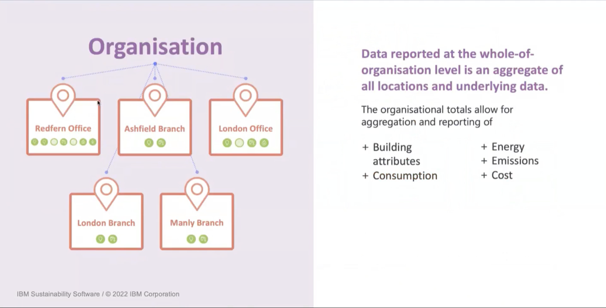
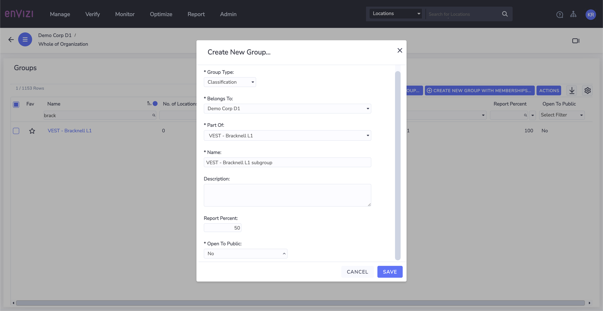

# 104: Envizi data management

The Envizi Technical Sales Intermediate badge demo displays the power of Envizi for identifying opportunities to ESG improvements, track ESG progress year over year, and perform ESG reporting in accordance with numerious ESG frameworks.  

Streamlined reporting and accelerated decarbonization depends on a comprehensive set of relevant ESG data.  The first step in crafting an Envizi solution is to build that data foundation.  This lab discusses the data management architecture within Envizi. 

## Envizi organization model

The following explains how data is organized and managed for an organization in Envizi.

An organization represents the whole of a client's business. High level enterprise reporting aggregates all of the data from all accounts and meters in Envizi.
 

Groups can be used to organize reporting, as well as for user access. This can be very helpful if you want to delegate regions to certain managers. There are 3 tiers of groups available, main groups and up to 2 child groups. For example a main group might be all company office buildings, with sub groups for each country such as Spain and the UK, and additional sub groups within those for regions in the country, such as London and the South East.

 

Locations usually represent a physical building or group of buildings. In addition to the data from accounts and meters at a location, other attributes can be stored such as address, region, date opened, refurbishments and their dates, floor space, occupancy and more.

 

Transactional & activity data. Accounts can vary widely from Electricty bills to flight travel data, spend with a particular supplier or on goods or materials. Meters capture much more granular data from IT sensors or smart meters at 15, 30, or 60 minutes.

 

## Group management

### Groups

To manage groups in Envizi, click "Manage" -> "Groups"

The group list is highly configurable. Groups can be searched, filtered, and the column names can be drag-and-dropped and shown / hidden to customize the view. These preferences are user specific and will persist. New groups can be created in 4 different ways, 3 via the UI, and also via email by sending the bulk creation setup template. Clicking the "New group" button is the simplest way to add a new group. The "Create new group with memberships" button allows you to specify locations that are part of the group, which is most commonly used after the fact when locations are already created. Note that you can always right click and edit a group after the fact.

Group Type:
- Classification groups are the main category that is used, and represent primary reporting hierarchy.
- Portfolio groups can represent any other secondary group for user access or reporting purposes.

Belongs To:
- The organization which the group is under.

Part Of:
- NA represents a level 1 top tier group.
- Clicking another choice will create this group as a secondary or tertiary group underneath.

Bulk creating of groups is also possible via upload of a bulk group template file, downloadable below.

<a href='/envizi/Envizi_SetupGroups_VEST.xlsx'>bulk group create / update template</a>
 
 
Click "Manage" -> "Upload files" -> "Create new" and attach the filled out template. You can then verify the group(s) have been created by going back to the groups view.

There is another tool which allows you to see uploaded / emailed files and re-download them or verify they loaded correctly.

Similar processes exist for the creation of locations, accounts, meters, users, and historical data, but those are out of scope for this section.

That's the end of this section! Continue on to learn about the more granular data model within accounts.

## Granular data model

The following is an explanation of the four key components of the Envizi data management system at the account level.

- Flexible
- Hierarchical in nature
- Configured to meet client requirements

Each customer data model is mapped out during the onboarding process through customer consultation to determine the data types that would need to be captured and account styles needed to capture specific fields that might be either:
- Account styles mapped from supplier files that would be used in automated data collection
- fields needed to satisfy reporting requirements. 

### Data Types
Data Types are the foundational building block of Envizi's data model.

Configurable, but managed by envizi's product team.

Define:
- Data category to be managed (e.g. Water, Natural Gas, Electricity)
- Primary unit of measure (cost and consumption) to be recorded against the data type 
- Emissions scope (1, 2, or 3) and emissions factor assignment process for the data type if applicable. 

Social metrics or building information data types may have "No Scope".  

Scope and data category play a part in how the emissions factor is applied for that data in the platform. 

Envizi has an existing library of 4,000+ data types. The library is constantly expanding when necessary to meet client data collection needs.

### Account Styles
Data schema configured on top of a Data Type
Configured **per customer** to provide flexibility to meet different data capture requirements
- Defines the specific data fields to be captured, split in to primary and secondary fields.
- Can allow for drop-downs to be added to support things like multi-unit data capture, currency pick-lists, etc.
- Supports rules to:
  - Make certain fields mandatory
  - Provide default values
  - Perform simple math on input to derive a field value based on other captured data. 

### Accounts
Accounts are the end point for data storage within Envizi.  Data captured via UI or connectors is associated with an Account. 

- Unique by name and ID
- Configured at a location level
- Configured with a specific data type and account style.
- When creating a new account, first choose the data type, then the account style.  
- Serves as the end point for data storage when data is injested either by manual capture or automation via Connectors. 
- Use as reporting entity that rolls up through grouping hierarchy.

Continue to [lab 105](/envizi/105).
