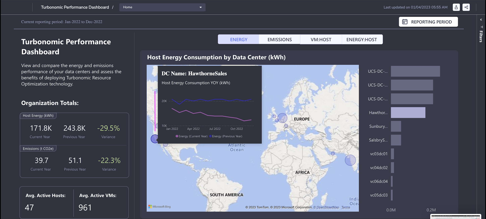
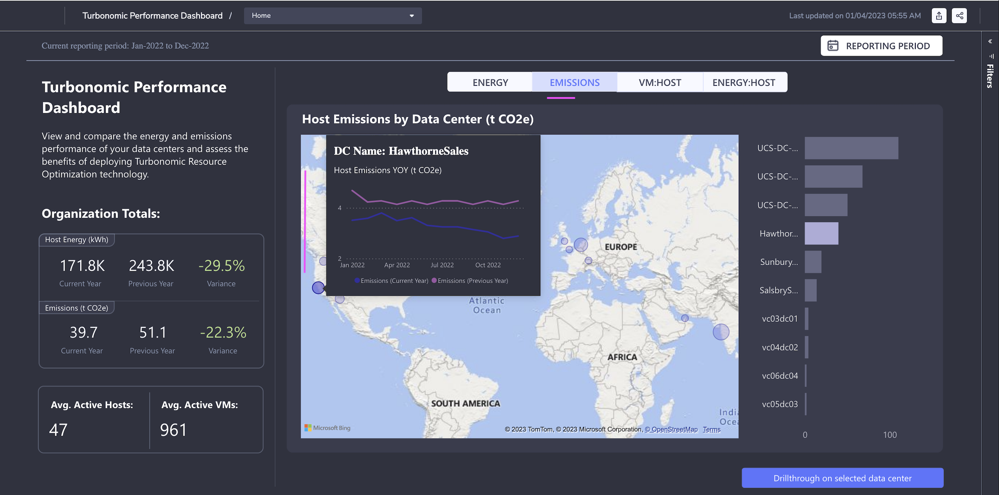
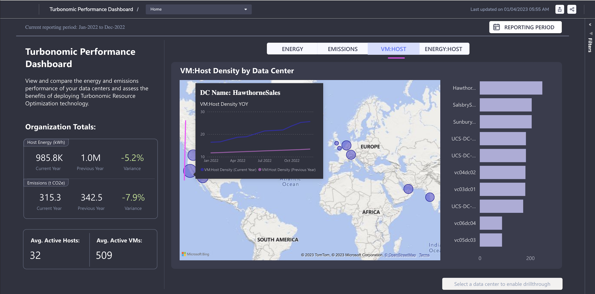
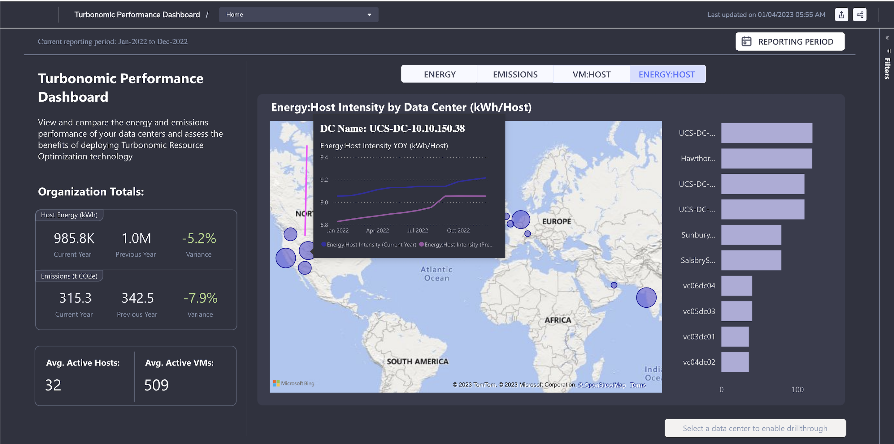
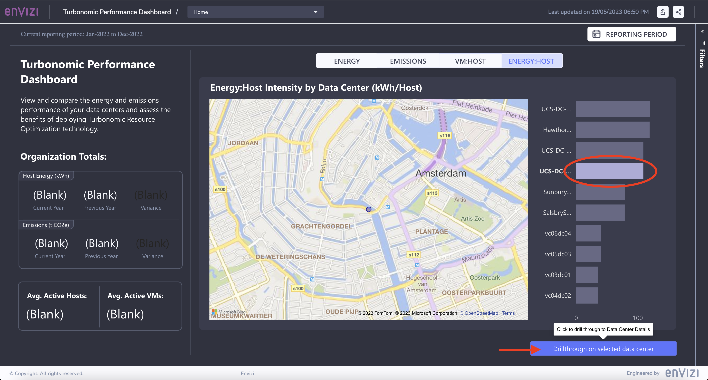
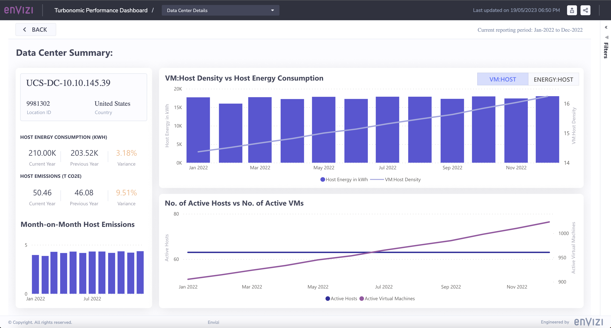
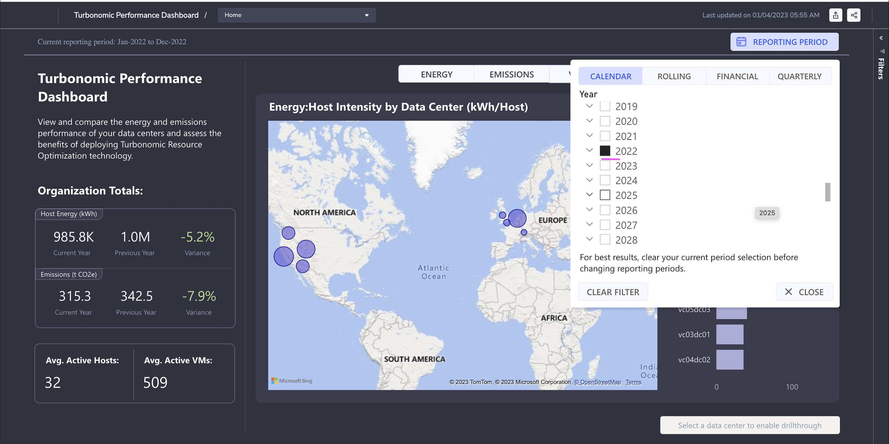

# Cuadro de mandos de Turbonomic

## 1. Inicio del panel

Para navegar hasta el cuadro de mandos de Turbonomic:
- Seleccione "Reports" en el menú desplegable (A)
- Escriba "Turbonomic" y seleccione "Turbonomic Performance Dashboard" (B)

 
 

El cuadro de mandos muestra los datos de energía y emisiones de Host de toda la organización. 

#### Panel izquierdo

El panel izquierdo muestra lo siguiente para toda la organización.

- Energía del año en curso (985,8K), año anterior (1,0M) y variación (-5,2%)
- Emisiones de carbono del año en curso (315,3), año anterior (342,5) y variación (-7,9%)
- Media de hosts activos (32) y media de máquinas virtuales activas (509)

Así pues, este año se ha reducido el consumo de energía de los hosts y las emisiones de carbono en comparación con el año anterior.

#### Panel central
El panel central muestra los centros de datos marcados en el mapa.

#### Panel derecho

El panel derecho muestra la lista de centros de datos ordenados según el consumo de energía del host.

### 1.1 Consumo de energía del host por centro de datos

1. Haga clic en cualquiera de los `data center` del Mapa.

    El panel de la izquierda se actualiza con los datos específicos del centro de datos.

- Energía del host del año actual (171,8K), año anterior (243,8K) y variación (-29,5%).
- Emisiones de carbono del año en curso (39,7), año anterior (51,1) y variación (-22,3%)
- Media de hosts activos (47) y media de máquinas virtuales activas (961)

    El panel lateral derecho también destaca el centro de datos seleccionado.

2. Al pasar el ratón por encima del `centro de datos` en el mapa se muestra el gráfico `Consumo de energía del host` comparado con el año anterior.

    El gráfico muestra que el "consumo de energía" es menor que el año pasado.

### 1.2 Emisiones del host por centro de datos

1. Haga clic en la pestaña `Emissions` del panel Centro.

    Se actualiza la página con los detalles de las Emisiones. No hay ningún cambio en el panel izquierdo ya que ya muestra los detalles de las emisiones.

2. Al pasar el ratón por encima del "centro de datos" del mapa, se muestra el "gráfico de emisiones" comparado con el año anterior.

    El gráfico muestra que las emisiones son inferiores a las del año pasado.

### 1.3 Densidad VM:Host por Centro de Datos

1. Haga clic en la pestaña `VM:HOST` y se mostrará la `Densidad de máquinas virtuales y hosts` en el centro de datos.

    Cuando se aprovisionan más máquinas virtuales en un host, se produce una utilización eficaz de los recursos. Turbonomic ayuda a identificar las máquinas virtuales dispersas y a tomar las medidas adecuadas.

2. Al pasar el ratón por encima del centro de datos en el mapa, se muestra la densidad `VM:Host` en comparación con el año anterior.

### 1.4 Intensidad de energía:host por centro de datos

1. Haga clic en la pestaña `Energy:Host` del panel Centro.

2. Al pasar el ratón sobre el centro de datos en el mapa se muestra la Intensidad Energía:Host comparada con el año anterior.

## 2. Resumen del centro de datos

Veamos el informe resumen del centro de datos.

1. Haga clic en cualquiera de los centros de datos del panel derecho.

2. 2. Haga clic en el botón `Drillthrough on selected data center`.

Esto nos lleva a la página "Resumen del centro de datos".

#### Panel izquierdo

El panel izquierdo muestra la siguiente información relacionada con el centro de datos seleccionado.

- Nombre del centro de datos
- Id de ubicación
- País
- Energía del host del año actual (210,00K), año anterior (203,52K) y variación (3,18%)
- Emisiones de carbono del año en curso (50,46), año anterior (46,08) y variación (9,51%).
- Gráfico de emisiones de Host mes a mes.

#### Panel central

La parte superior del Panel Central muestra el gráfico `VM:Host Density vs Host Energy Consumption`.

La parte inferior del Panel Central muestra el gráfico `No. of Active Hosts vs No. of Active VMs`.

### 2.1 Densidad VM:Host vs Consumo de Energía del Host

1. Pulse sobre cualquiera de los meses del panel izquierdo.

    El panel central se actualiza.

2. Pasa el ratón por encima de la sección `No. of Active Hosts vs No. of Active VMs` del gráfico. Muestra 
- Los `Hosts Activos` del mes son `63`.
- Las "Máquinas virtuales activas" del mes son `998`

3. Pasa el ratón por encima de la sección `VM:Host Density vs Host Energy Consumption` del gráfico. Muestra
- La `Energía del Host` del mes es de `17.932,33`.
- La `Densidad VM` del mes es de `15.84`.

### 2.2 Energía:Intensidad del Host vs Consumo de Energía del Host

1. Haga clic en la pestaña `Energy:Host` del panel central.

3. Pasa el ratón por encima de la sección `Energy:Host Intensity vs Host Energy Consumption` del gráfico. Muestra
- La `Energía del Host` para Mayo 2022 es `17,825.00`.
- La `VM Host Density` del mes es `15.00`.

## 3. Periodo del informe 

Puede cambiar el periodo del informe para mostrar los datos entre las fechas seleccionadas.

#### Integración de Turbo con Envizi a través de AppConnect para datos Green IT

En [este blog](https://community.ibm.com/community/user/envirintel/blogs/jeya-gandhi-rajan-m1/2023/03/23/integrating-turbo-with-envizi-via-appconnect) se explican las instrucciones paso a paso para extraer datos de TI ecológicos de Turbonomic a Envizi a través de App Connect.

 
