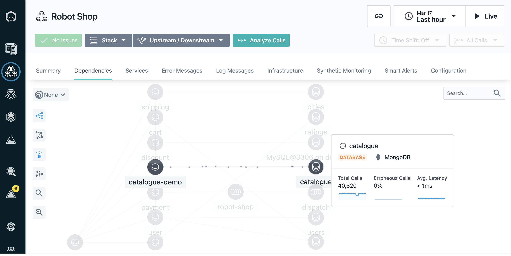
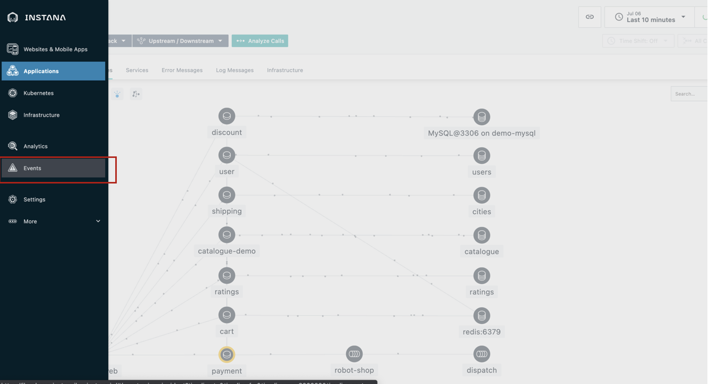
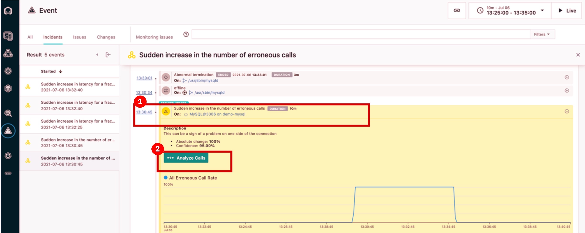
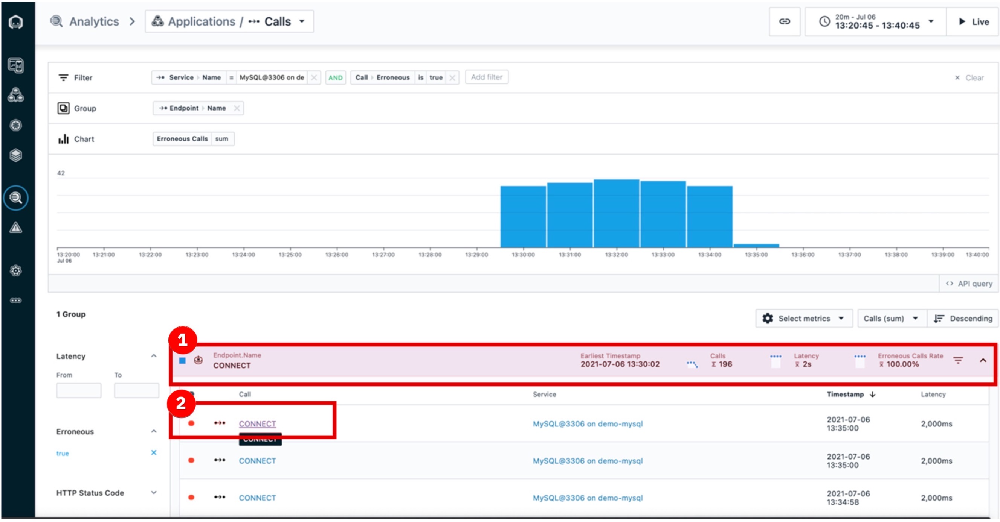

# 102: Monitor Calls + Application Tracing

## Navigate to RobotShop’s dependencies

1.  Starting by navigating to the [Instana playground](https://play-with.instana.io/)

    We’re going to use Instana to view all the dependencies within the RobotShop application.

    Instana automatically discovers the relationships between the services and correlates them into a dynamic graph.

2.  From the sidebar menu, click the **Applications** icon (1) and choose **RobotShop** (2).

    

3.  Click on the **Dependencies** tab.

    

    We can see each moving dot represents a call requests. The requests are moving through the application in real time. Instana is able to do this because it tracks every request that flows through the application.

    We can tell there are some problems with the application because several services are highlighted in yellow and red.

4.  Hover the cursor over a few of the icons to show info on what technology they are built on.

    For example, we can see that the **catalogue** database is built on MongoDB.

    

    🟢 There are quiz questions related to the **Dependencies** graph.

## Automatically assess events and alerts

Since you wouldn’t normally be looking at the dashboard when something like this happens, let’s see the SRE/IT operator’s point of view when an incident occurs.

We’ve just gotten an alert from Instana that there has been a sudden increase in erroneous calls on our **discount** service, which is part of the robot shop application.

Although I don’t have it connected right now, the alert would show up via one of the configurable alert channels, like PagerDuty, Microsoft Teams, Slack, and many others ([full list](https://www.instana.com/docs/events_alerts/alert-channels)).

1. Click the **Events** icon (triangle) on the left sidebar menu.

   

   Instana automatically groups related events and issues into incidents.

   It determines what events and/or issues are related using the dynamic dependency graph that we just looked at.

   Instana also continuously assesses the groups of events and issues to determine which ones are impacting end users or posing an imminent risk of impacting end users.

   Those are the ones that Instana will alert on, so as a SRE/IT operator, you will not be interrupted constantly for things that are not very important.

   Let’s go into the details for this incident.

## Inspecting auto-correlated incident details

Instana recognized that the sudden increase of erroneous calls was something important to alert on, so we did not have to do any configuration or set thresholds in order to get this alert.  
Let’s click the incident on the **discount** service for more details.

1. Click the incident called **Sudden increase in the number of erroneous calls** on the **discount** service.

   

We can now see a timeline of the incident, the event that triggered Instana to create the incident, and all of the related events.

2. Hover the cursor over to show **Incident Timeline**, **Triggering Event**, and **Related Events**.

   

   🟢 There is a quiz question related to the **Related Eevents** widget.

## Debugging the incident by inspecting calls

By inspecting the related events, it looks like the abnormal termination of the MySQL database caused the problem.

We can go into more detail about each call that failed to connect to the database.

1. Under **Related Events**, click the event that says **Sudden increase in the number of erroneous calls** (1). Then, click **Analyze Calls** (2).

   

2. Click the first endpoint (1) groups list. Then, click the first call (2) in the call list.

   All the calls are grouped by endpoint. There is only one endpoint showing, but if there were more you’d see a list here.

   Endpoints are automatically discovered and mapped by Instana. We can go into the details for each erroneous call to MySQL via this endpoint (CONNECT).

   Going into the actual trace for a request that resulted in an error will help us confirm that **MySQL** is really the source of the incident.

   

## Drilling down with end-to-end traces

Now that we’ve clicked on an individual call, in this case the first call in the list, we can view the call in the context of the end-to-end trace.

1. Highlight the middle dashboard area showing elements of the first call on the list. You will need to scroll down to the timeline view, and then change focus to the right column.

   

   🟢 There is a quiz question related to **Unbounded Analytics** page.

   We can see where the request began and each call that was made along the way.

   The **Timeline** view gives a quick overview of the time spent on each span, as well as key performance indicators, such as the number of erroneous calls in this trace, the number of warning logs, and the total latency.

   Everything is presented in an easy-to-navigate visual dashboard, so we can drill into increasingly detailed information to pinpoint the problem, without using multiple tools or navigating back and forth to lots of dashboards.

2. In the call stack [move to right column], we can click each span to see more information, including the complete stack trace.

   We can see the source, in this case the _discount_ service, and [scroll down] the destination, which in this case is _CONNECT_ of MySQL.

   It’s useful to have this context because we can easily see how the calls go from one service to another, just by clicking them. We can also see how the error (**red triangle**) propagated up the call stack, in this case beginning with the MySQL database.
