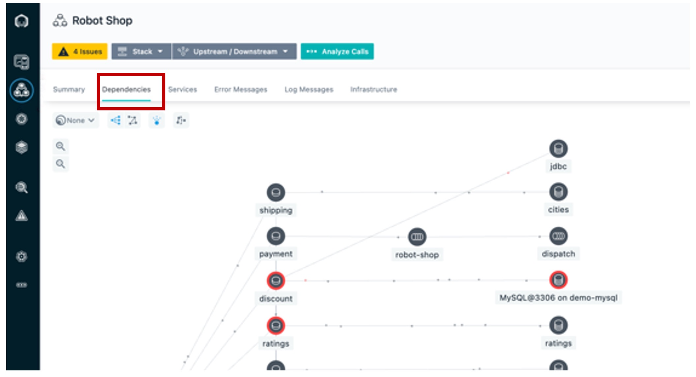
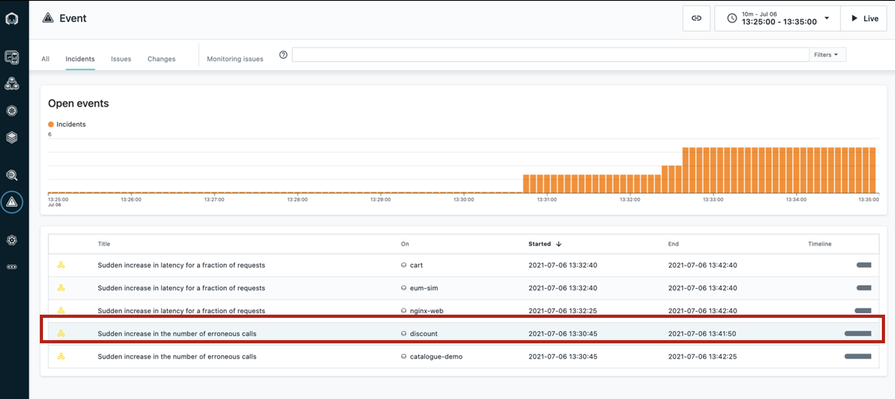

# 102:Monitorización de llamadas + Rastreo de aplicaciones

## Navegue hasta las dependencias de RobotShop

1.  Empezando por navegar al [Instana playground](https://play-with.instana.io/)

    Vamos a utilizar Instana para ver todas las dependencias dentro de la aplicación RobotShop.

    Instana descubre automáticamente las relaciones entre los servicios y los correlaciona en un gráfico dinámico.

2.  En el menú de la barra lateral, haga clic en el icono **Applications** (1) y seleccione **RobotShop** (2).

    

3.  Haga clic en la pestaña **Dependencies**.

    

    Podemos ver que cada punto en movimiento representa una solicitud de llamada. Las solicitudes se mueven a través de la aplicación en tiempo real. Instana es capaz de hacer esto porque rastrea cada solicitud que fluye a través de la aplicación.

    Podemos decir que hay algunos problemas con la aplicación porque varios servicios están marcados en amarillo y rojo.

4.  Pasa el cursor por encima de algunos de los iconos para ver información sobre la tecnología en la que están basados.

    Por ejemplo, podemos ver que la base de datos **catalogue** está construida sobre MongoDB.

    

    🟢 Hay preguntas relacionadas con el gráfico **Dependencies**.

## Evaluar automáticamente eventos y alertas

Como normalmente no estarías mirando el panel de control cuando ocurre algo así, veamos el punto de vista del operador de SRE/IT cuando se produce un incidente.

Acabamos de recibir una alerta de Instana de que se ha producido un aumento repentino de llamadas erróneas en nuestro servicio de **discount**, que forma parte de la aplicación de tienda robotizada.

Aunque ahora mismo no lo tengo conectado, la alerta aparecería a través de uno de los canales de alerta configurables, como PagerDuty, Microsoft Teams, Slack y muchos otros ([lista completa](https://www.instana.com/docs/events_alerts/alert-channels)).

1. Haz clic en el icono **Events** (triángulo) del menú de la barra lateral de la izquierda.

   

   Instana agrupa automáticamente los eventos y problemas relacionados en incidentes.

   Determina qué eventos y/o problemas están relacionados utilizando el gráfico de dependencia dinámico que acabamos de ver.

Instana también evalúa continuamente los grupos de eventos y problemas para determinar cuáles afectan a los usuarios o suponen un riesgo inminente de afectar a los usuarios.

Instana alertará sobre esos eventos, por lo que, como operador de SRE/IT, no se le interrumpirá constantemente por cosas que no son muy importantes.

Entremos en los detalles de este incidente.

## Inspección de los detalles de los incidentes auto-correlacionados

Instana reconoció que el aumento repentino de llamadas erróneas era algo importante para alertar, por lo que no tuvimos que hacer ninguna configuración ni establecer límites para obtener esta alerta.  
Hagamos clic en la incidencia del servicio **discount** para obtener más detalles.

1. Haga clic en la incidencia llamada **Sudden increase in the number of erroneous calls** en el servicio **discount**.

   

Ahora podemos ver una cronología del incidente, el evento que provocó que Instana creara el incidente y todos los eventos relacionados.

2. Pase el cursor por encima para mostrar **Incident Timeline**, **Triggering Event** y **Related Events**.

   

   🟢 Hay una pregunta relacionada con el widget **Related Eevents**.

## Depurando el incidente inspeccionando las llamadas

Inspeccionando los eventos relacionados, parece que la terminación anormal de la base de datos MySQL causó el problema.

Podemos entrar en más detalle sobre cada llamada que falló al conectarse a la base de datos.

1. En **Related Events**, haga clic en el evento que dice **Sudden increase in the number of erroneous calls** (1). A continuación, haga clic en **Analyze Calls** (2).

   

2. Haga clic en la lista de grupos del primer punto final (1). A continuación, haga clic en la primera llamada (2) de la lista de llamadas.

   Todas las llamadas se agrupan por punto final. Sólo se muestra un endpoint, pero si hubiera más vería una lista aquí.

Instana descubre y mapea automáticamente los puntos finales. Podemos entrar en los detalles de cada llamada errónea a MySQL a través de este endpoint (CONNECT).

Entrar en la traza real para una petición que resultó en un error nos ayudará a confirmar que **MySQL** es realmente la fuente del incidente.

## Profundizando con las trazas de extremo a extremo

Ahora que hemos hecho clic en una llamada individual, en este caso, la primera llamada de la lista, podemos ver la llamada en el contexto de la traza de extremo a extremo.

1. Seleccione el área central del panel de control que muestra los elementos de la primera llamada de la lista. Tendrá que bajar hasta la vista de línea de tiempo y, a continuación, cambiar el foco a la columna de la derecha.

   

   🟢 Hay una pregunta relacionada con la página **Unbounded Analytics**.

Podemos ver dónde comenzó la solicitud y cada llamada que se hizo en el proceso.

La vista **Timeline** ofrece una visión rápida del tiempo empleado en cada tramo, así como indicadores clave de rendimiento, como el número de llamadas erróneas en esta traza, el número de registros de advertencia y la latencia total.

Todo se presenta en un panel visual de fácil navegación, de modo que podemos profundizar en información cada vez más detallada para localizar el problema, sin necesidad de utilizar varias herramientas ni de navegar de un lado a otro por montones de paneles.

2. En la pila de llamadas [desplazarse a la columna derecha], podemos hacer clic en cada tramo para ver más información, incluido el seguimiento completo de la pila.

   Podemos ver el origen, en este caso el servicio _discount_, y [desplazar hacia abajo] el destino, que en este caso es _CONNECT_ de MySQL.

   Es útil tener este contexto porque podemos ver fácilmente cómo las llamadas van de un servicio a otro, simplemente haciendo clic en ellas. También podemos ver cómo el error (**triángulo rojo**) se propaga por la pila de llamadas, en este caso empezando por la base de datos MySQL.
