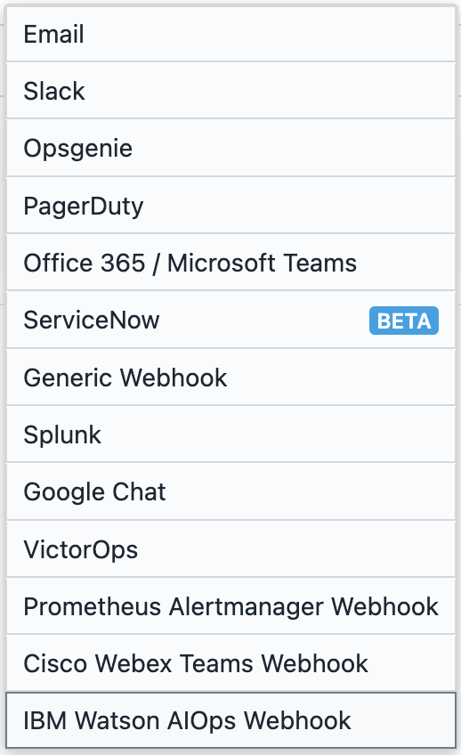
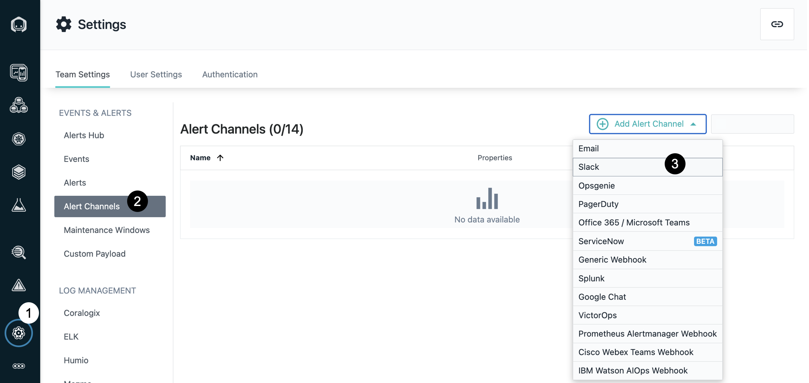
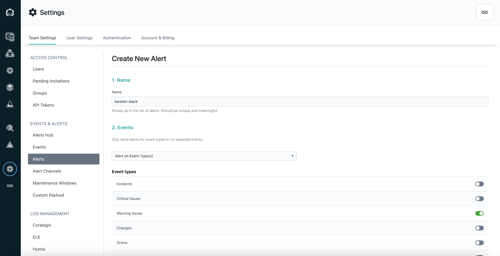
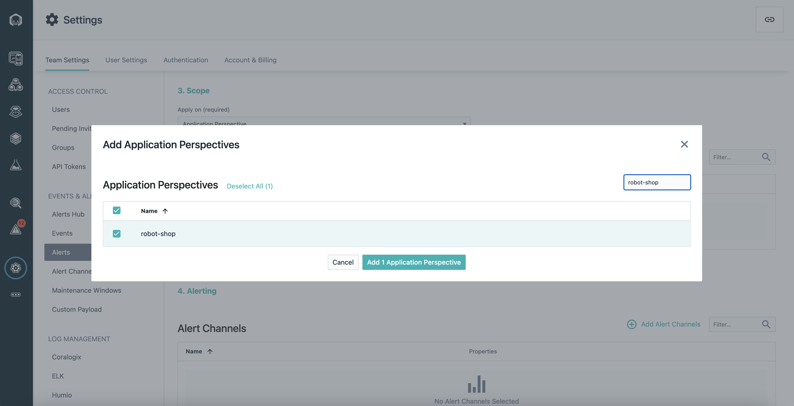
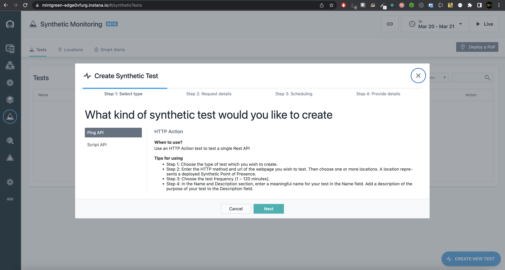
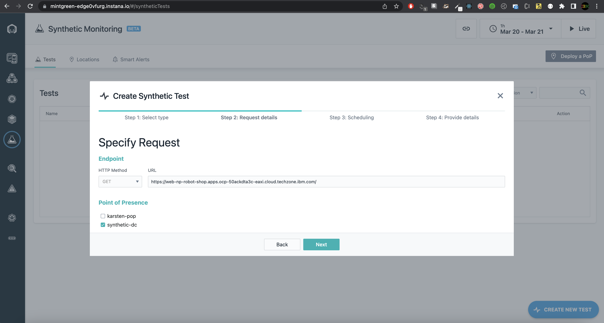
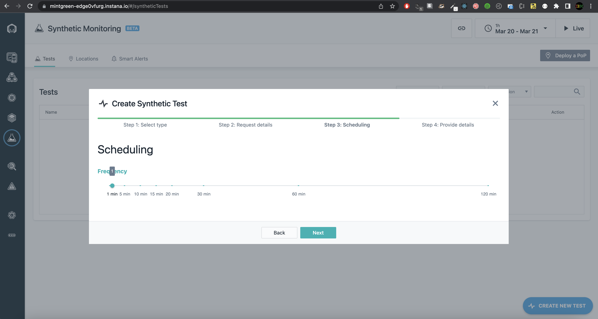
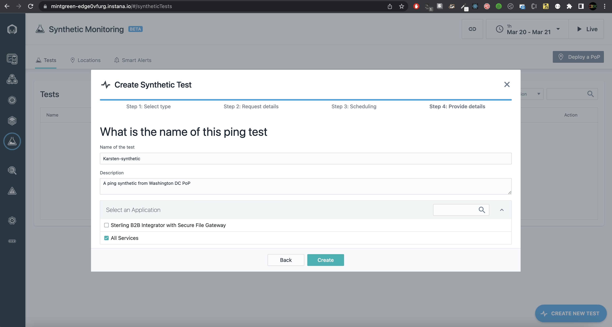

# 103: Alerta y sintéticos

## Alertas

Instana es compatible con 13 tecnologías para [canales de alerta](https://www.ibm.com/docs/en/instana-observability/current?topic=apis-alerting#alerting-integrations).

## Añadir _Slack_ como canal de alerta

Para crear alertas, primero tenemos que crear un canal de alerta. Este es un proceso sencillo que consiste en añadir un webhook entrante a _Slack_ para un canal _Slack_ específico. En su instancia local de Instana, cree un canal de alerta siguiendo estos pasos.

1. En la interfaz de usuario de Instana, seleccione la opción **Configuración** en el menú de la izquierda.

1. Seleccione la opción **Canales de alerta** en **Configuración del equipo**.

1. Abra la lista desplegable **Añadir canal de alerta** y seleccione **Slack**.

   

1. Introduzca **lab-4** para el nombre del canal, copie el webhook proporcionado en el espacio de trabajo slack del taller o por el instructor y establezca el nombre del canal como **\#instana-alerts**. A continuación, haga clic en **Probar canal**. Si la prueba se realiza correctamente, haga clic en **Crear** para añadir el canal de alertas.

   

Para ver tu mensaje de prueba (y también el de otros usuarios del taller), únete al canal **\#instana-alerts** en _Slack_.

## Enviando eventos específicos al canal

Ahora que el canal ha sido creado, podemos proceder a decidir qué alertas queremos enviar a _Slack_. Para esta demo enviaremos todos los avisos de la tienda del robot directamente al canal _Slack_.

1. En la barra lateral de navegación de la izquierda, haga clic en la sección **Settings**.

2. En la página **Settings**, en la barra lateral de navegación de la izquierda, haga clic en la sección _Alerts_ que se encuentra justo encima de los Canales de alerta. A continuación, haga clic en el botón **New Alert**.

3. Para el nombre utiliza este pattern, `<tu-nombre>-slack`.

4. En **Events**, elija la opción **Alert on Event Type(s)**, y luego active todas las opciones. Esto nos permitirá mostrar cómo se muestran los diferentes eventos en _Slack_.

   

5. En **Scope**, elija la opción **Application Perspective** y, a continuación, seleccione la opción **Add Application Perspectives**. A continuación, **Select All** las opciones.

_Observación: Si utiliza Instana para observar varias aplicaciones, puede añadir alertas de varias aplicaciones diferentes a la vez, o puede crear varias alertas, una para cada perspectiva._

6. En Canales de alerta, seleccione **lab-4** y, a continuación, haga clic en **Create**. Este canal permitirá a Instana enviar mensajes al canal _Slack_ de **\#instana-alerts**.

Ya está. Ahora, a medida que se generen eventos desde Instana, se enviarán al canal _Slack_. Este método de alerta potente y flexible permite alertas específicas, como el uso de diferentes canales _Slack_ para alertas de diferente gravedad o incluso enviar mensajes a los desarrolladores desde PagerDuty para problemas críticos.

## Sintéticos

Los sintéticos son una novedad en Instana. Permiten simular experiencias de usuario en su aplicación y monitorizar varias características de rendimiento.

Aviso: Synthetics sólo está disponible en una instancia SaaS, no on-prem.

En esta sección crearemos pruebas sintéticas para monitorizar nuestra aplicación. Para crear una prueba sintética, primero debe tener un Punto de Presencia (PoP) instalado y en funcionamiento. Múltiples PoPs pueden ser desplegados en clusters en varias regiones geográficas para simular la experiencia del usuario en esas regiones. Las instrucciones para instalar PoPs se pueden encontrar [aquí.](https://www.ibm.com/docs/en/instana-observability/current?topic=beta-pop-deployment) Esto está fuera del alcance de este laboratorio, y utilizaremos un PoP existente ya registrado en el panel de Instana.

1. En la instancia de Instana SaaS ([https://sandbox-partner.instana.io/#/home](https://sandbox-partner.instana.io/#/home)), vaya a **Synthetic Monitoring** en el menú de navegación de la izquierda y haga clic en **Create New Test**.

2. Para familiarizarnos con la funcionalidad, crearemos un sintético de ping.

   En **Paso 2: Solicitar detalles** añada la URL para la región específica de su solicitud y elija **synthetic-dc** como Punto de Presencia. Haga clic en Siguiente.

   

3. Para la Frecuencia elija 1 Minuto, y haga clic en Siguiente.

   

4. Nombre su sintético utilizando este modelo `<su nombre>-synthetic`, y escriba una descripción opcional. Marque **All Services** y haga clic en el botón **Create**.

   

Ahora puede ver los análisis y métricas de su prueba sintética en la lista **Tests**.
