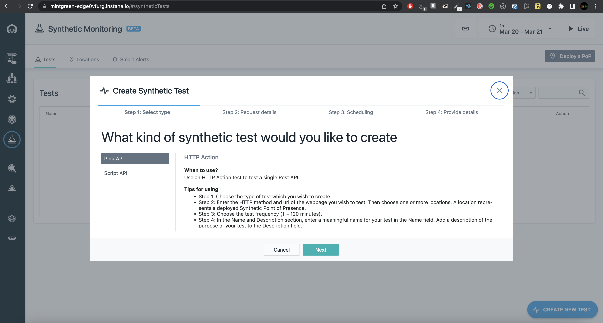

# 104: Alerting and Synthetics

## Alerting

Instana currently supports 13 technologies for alert channels.

## Adding slack as an alert channel

In order to create alerts, we first need to create an alert channel. This is a simple process that involves adding an incoming webhook to Slack for a specific Slack channel. To avoid having each person create a new channel, we will just use an existing one for this lab. Everyone join the \#alert-lab channel in slack.

## Sending specific events to the channel

Now that the channel has been created, we can proceed to decide which alerts we want to push to slack. For this demo we will push all robot-shop warning issues to the slack channel.

1. In the left hand nav, click Alerts just above Alert Channels, and then "New Alert"

2. For name put \<your name\>-slack

3. Under Events, choose "Alert on Event Type(s)", and then toggle all of the options. This will allow us to showcase how different events show up in Slack.

4. Under Scope, choose Application Perspective, and then "Add Application Perspectives". Select all of the options. Note: if you are using Instana to observe multiple apps, you can add alerts from multiple different apps at once, or you can create multiple alerts, one for each perspective.

5. Under Alert Channels, select "lab-4", then click Create. This channel will allow Instana to post to the \#alert-lab slack channel.

That's it! Now as events are generated from Instana, they will be pushed to the slack channel. This powerful, flexible alerting method allows for need specific alerting, such as using different slack channels for alerts of different severity, or even paging out developers from PagerDuty for critical issues.

## Synthetics

Synthetics are brand new in Instana! They allow for simulated user experiences in your app, and monitoring for various performance characteristics.
Note: Synthetics are only available in a SaaS instance, not on-prem.

For this section we will be creating synthetics to monitor our application. In order to create a synthetic test, you must first have a Point of Presence (PoP) installed and running. Multiple PoPs can be deployed to clusters in various geographic regions to simulate user experience for those regions. Instructions for deploying PoPs can be found [here.](https://www.ibm.com/docs/en/instana-observability/current?topic=beta-pop-deployment) This is out of scope for this lab, and we will be using an existing PoP already registered in the Instana dashboard.

1. In the Instana SaaS instance (https://mintgreen-edge0vfurg.instana.io/#/home) navigate to "Synthetic Monitoring" in the left hand navigation, and click "Create New Test".

2. To get familiar with the functionality, we will create a ping synthetic. Under "Step 2: Request Details" add https://web-np-robot-shop.apps.ocp-50ackdta3c-eaxi.cloud.techzone.ibm.com/ for the URL, and choose "synthetic-dc" as the Point of Presence. Click Next.

3. For Frequency choose 1 Minute, and click next.

4. Name your synthetic \<your name\>-synthetic, and provide an optional description. Check "All Services" and then click Create.

