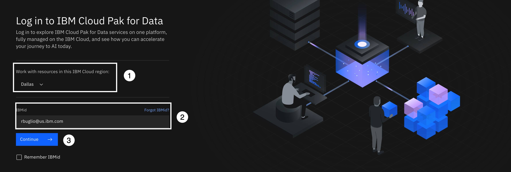
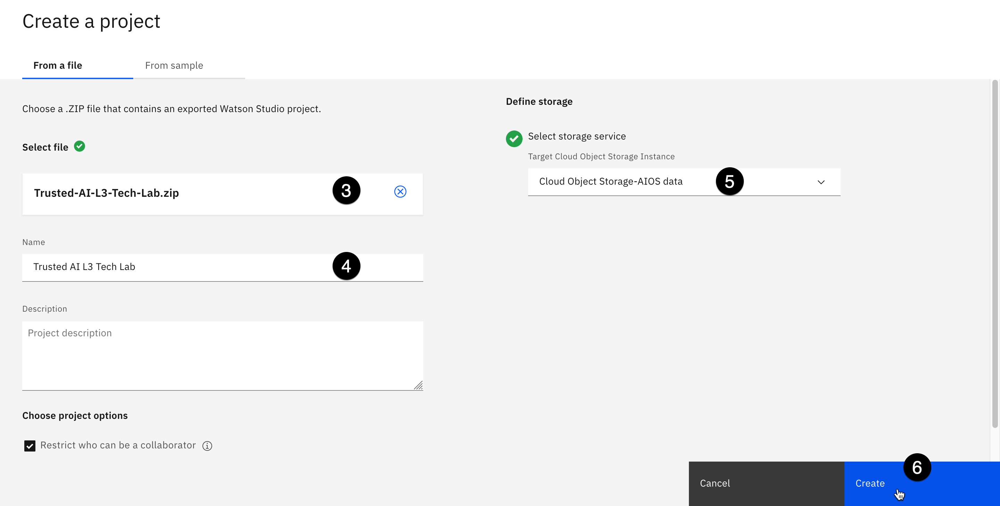
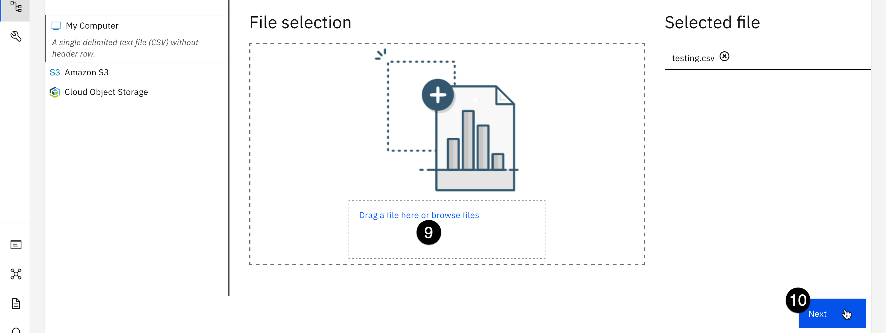
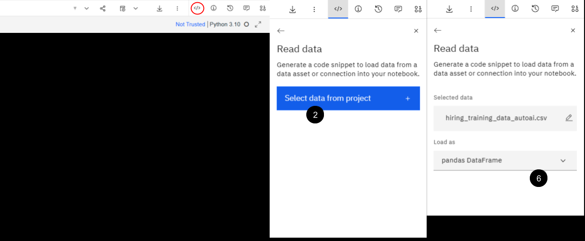

# 101: Acceso a los datos

## Introducción

Como científico de datos, se le ha asignado analizar el abandono de empleados en su empresa minorista de electrónica. En 2018, su empresa, que se enfrentaba a un grave desgaste, construyó un modelo para predecir qué empleados abandonarían la empresa, lo que permitió al departamento de recursos humanos trabajar de forma proactiva para retenerlos. Sin embargo, el modelo ha perdido parte de su poder predictivo gracias a condiciones cambiantes como la pandemia de COVID-19, el énfasis posterior en el trabajo remoto y las interrupciones en la cadena de suministro.

Tendrá que trabajar con datos de toda la empresa para desarrollar posibles modelos de sustitución. Desplegará y evaluará esos modelos y realizará un seguimiento de su ciclo de vida, recopilando métricas y metadatos que ayuden a determinar si están listos para su despliegue en producción y cuándo.

## Requisitos previos

> Nota: El contenido que aparece a continuación puede completarse en su totalidad utilizando servicios gratuitos; sin embargo, es probable que exceda su asignación mensual de datos gratuitos para Watson Studio. Si es posible, utilice una cuenta de pago de Watson Studio. De lo contrario, puede que tenga que esperar hasta que sus créditos de datos se actualicen para terminar el laboratorio.

Antes de continuar, debe configurar su entorno. Esto implica importar un proyecto y configurar su servicio de aprendizaje automático. Este laboratorio ha sido construido en Cloud Pak para Datos como Servicio (Cloud). Para los entornos locales, los detalles de la plataforma, como la creación de la clave API y el acceso a los datos a través del almacenamiento de objetos, serán diferentes, pero la mayor parte del laboratorio sigue siendo aplicable. Se espera que complete este laboratorio en la nube.

### 1. Descargar el archivo del proyecto

A lo largo de este laboratorio, utilizarás un proyecto de Watson Studio. Este proyecto se ha creado previamente y se proporciona en un archivo zip que se encuentra en el repositorio GitHub de **Data and AI Live Demos**. Antes de continuar, descarga el archivo de proyecto [Trusted-AI-L3-Tech-Lab.zip](https://github.com/CloudPak-Outcomes/Outcomes-Projects/raw/main/TrustedAI-L3-Tech-Lab/Trusted-AI-L3-Tech-Lab.zip).

### 2. Inicie sesión en Cloud Pak for Data

Si aún no lo ha hecho, siguiendo las instrucciones y las capturas de pantalla que aparecen a continuación, inicie sesión en [IBM Cloud](https://dataplatform.cloud.ibm.com/) Pak for Data. Utilizará **su** cuenta **personal** de Cloud Pak for Data as a Service en la región **de Dallas** para realizar el laboratorio.



1.  Mediante el menú desplegable **Trabajar con recursos** en esta región de IBM Cloud:, seleccione la región de **Dallas**.

    *   Esto es **muy importante** porque todos los servicios en la nube que se le indicó que aprovisionara en las [instrucciones de Primeros pasos](/mlops/100), deben aprovisionarse en la región **de Dallas**.

2.  Introduzca el **ID de IBM** que utilizó para registrarse en Cloud Pak for Data.

    *   Este debe ser su ID personal de IBM Cloud. Si ha iniciado sesión en Cloud Pak for Data anteriormente y ha marcado la casilla de verificación **Recordar IBMid**, es posible que ya lo haya rellenado. Si tiene varias cuentas de Cloud Pak for Data, puede hacer clic dentro del área IBMid encima del botón **Continuar** y se mostrará una lista de los ID de IBM disponibles para que pueda elegir.

3.  Pulse el botón **Continuar**

Si su IBM ID se reconoce como un IBM w3id (ID de intranet IBM w3 interno), se le pedirá que introduzca su contraseña utilizando el cuadro de diálogo w3id on IBM Security Verify:


1.  Introduzca la **contraseña** de su IBM w3id.
2.  Haz clic en el botón **Iniciar sesión**.

Si su IBM Id **no** es un IBM w3id, se le pedirá que introduzca su contraseña mediante el cuadro de diálogo estándar IBM Security Verify:


1.  Introduzca la **contraseña** de su IBM ID.
2.  Haga clic en el botón **Iniciar sesión**

### 3. Valide su entorno

Accederá a la página de inicio de Cloud Pak for Data. Si en algún momento de estas instrucciones recibe un mensaje emergente de Cloud Pak for **Data** pidiéndole que le guíe o le ayude, deséchelo y siga simplemente los pasos de las instrucciones.

#### Asegúrate de que estás en tu cuenta personal en la nube


Puedes ser miembro de muchas cuentas en la nube. Este laboratorio se realiza desde tu cuenta personal en la nube. La cuenta que se muestra debe mostrar **Su ID de cuenta en la nube - Su nombre**. Por ejemplo, en la captura de pantalla anterior, la cuenta personal es **1792871 - Rick Buglio**. Si tu cuenta personal está seleccionada, como en la captura de pantalla anterior, puedes proceder al siguiente paso. Si no es así, siga las instrucciones siguientes para cambiar a su cuenta personal. Tenga en cuenta que la barra de menú completa, incluidos los detalles de su cuenta y la región, sólo puede aparecer si la ventana de su navegador está maximizada.


En la captura de pantalla anterior, el usuario está en la cuenta en la nube Techzone **Outcomes** y necesita cambiar a su cuenta personal. Se trata de un escenario habitual porque los vendedores y socios comerciales de IBM podrían seguir teniendo una reserva en la cuenta en la nube Data and AI Live Demos**(**Techzone Outcomes) para realizar las demostraciones de ventas de nivel 2 de Data Fabric. Cuando inicia sesión en Cloud Pak for Data, recuerda la última cuenta en la que inició sesión, por lo que es una buena práctica comprobar en qué cuenta se encuentra antes de continuar.

1.  Utilizando el menú desplegable **Cuenta en la nube** de la barra de herramientas, seleccione **su** cuenta **personal** en la nube.

#### Asegúrese de que se encuentra en la región de Dallas

Esto es **muy importante**. De acuerdo con las instrucciones [para empezar](/mlops/100), debería tener sus servicios aprovisionados en la región de **Dallas**.

**No se puede** trabajar en varias regiones de servicios en la nube en Cloud Pak for Data as a Service. Sólo **los servicios globales**, como **Cloud Object Storage**, se pueden utilizar en todas las regiones de servicios en la nube. Por lo tanto, **todos** sus servicios deben estar en la misma región para que pueda completar este laboratorio.


En la captura de pantalla anterior, el usuario se encuentra en la región de **Londres** y necesita cambiar a la región de **Dallas**. Si su región **no está configurada** como **Dallas**, siga estos pasos:

1.  Seleccione la región de **Dallas** en el **menú desplegable Región de** la barra de herramientas.

### 4. Importar el proyecto de laboratorio


1.  En la pantalla de bienvenida de Watson Studio Cloud, haz clic en **Trabajar con datos**.
2.  Haga clic en **Crear un proyecto a partir de una muestra o un archivo**.



3.  En la sección **Cargar archivo**, coloca el archivo **Trusted-AI-L3-Tech-Lab.zip** que acabas de descargar.
4.  En el campo **Nombre**, asigne un nombre al proyecto. Por ejemplo: "Trusted AI L3 Tech Lab".
5.  Utilice el menú desplegable **Seleccionar servicio de almacenamiento** para seleccionar su instancia de Cloud Object Storage.
6.  Haga clic en **Crear**. Se importará el proyecto, lo que tardará aproximadamente un minuto.


7.  Una vez finalizada la importación, haga clic en **Ver resumen de importación**.


8.  Compruebe que todos los activos se han importado correctamente. Si es así, haga clic en **Cerrar** y vaya al paso 11. Si uno o más activos no se han importado correctamente, vaya al paso 9.


9.  Si falla la importación de uno o más activos, vaya a su [lista de proyectos](https://dataplatform.cloud.ibm.com/projects) y seleccione la casilla asociada al nuevo proyecto.
10. Haga clic en el botón azul **Eliminar** de la parte superior derecha y siga las instrucciones que aparecen en pantalla para confirmar la eliminación. Vuelva a la [pantalla del nuevo proyecto](https://dataplatform.cloud.ibm.com/projects/new-project?context=cpdaas) y repita esta sección, empezando por el paso 2.
11. Una vez que su proyecto se haya importado correctamente, puede continuar con el resto del laboratorio.

### 5. Añada su servicio Watson Machine Learning (WML)

El servicio WML se creó anteriormente tal y como se describe en la página [Introducción](/mlops/100).


1.  En su nuevo proyecto, seleccione la pestaña **Gestionar**.
2.  Seleccione Servicios e integraciones en la barra de menú de la izquierda.
3.  Haga clic en el botón azul Servicio asociado de la derecha.


4.  Haga clic en la casilla asociada con el servicio **de** aprendizaje automático que aprovisionó. Tenga en cuenta que puede tener varios servicios en esta lista, así que asegúrese de seleccionar uno con Aprendizaje **automático** en la columna **Tipo de** la tabla.
5.  Haga clic en el botón azul **Asociar** situado en la parte inferior derecha de la pantalla.

## Acceso a los datos

La ciencia de datos no es nada sin datos. En esta sección, aprenderás cómo hacer que los activos de datos estén disponibles en un proyecto y cómo acceder a los datos a través de un bloc de notas. También se puede acceder a los datos a través de otras herramientas disponibles, que se tratan en la sección [Soluciones sin código y de bajo código](/mlops/103) de este laboratorio.

Cloud Pak for Data accede a los datos de dos formas: archivos y conexiones. Los archivos **no** se limitan al formato de valores separados por comas (csv). Por ejemplo, los datos pueden venir como archivos comprimidos en formato zip o tar.

Las conexiones son puntos de acceso a diferentes repositorios. Esta es una **lista parcial** de las conexiones disponibles en Cloud Pak para Data as a Service:


### 1. Añadir una conexión a un proyecto

En la sección **Introducción** de los laboratorios, se le indicó que creara un servicio Db2. Este es el servicio de base de datos utilizado en este laboratorio. Es un ejemplo perfecto de cómo crear y acceder a una conexión.

Las empresas tienen conjuntos de datos críticos repartidos en múltiples repositorios; para añadir más complejidad, esos activos de datos pueden residir en las instalaciones o en la nube. Es fundamental que los profesionales de la ciencia de datos puedan acceder fácilmente a estos datos y, al mismo tiempo, mantenerlos en su ubicación original para reducir costes y complejidad. Copiar los datos genera confusión, ya que, por ejemplo, los usuarios no sabrían si están utilizando los datos más actualizados. Como el número de copias de datos aumenta con el número de proyectos en la empresa, se genera confusión sobre qué copia representa la versión real de la verdad. Con el tiempo, diferentes copias de los mismos datos dan lugar a versiones parciales de la verdad, lo que hace casi imposible descifrarla.

Como se ha mostrado anteriormente, Cloud Pak for Data admite una amplia variedad de tipos de conexión. Veamos cómo crear una conexión.

1.  Obtenga las credenciales de su servicio Db2. Abra la [lista de recursos Servicios y software](https://cloud.ibm.com/resources?groups=resource-instance) desde la consola de IBM Cloud.
2.  Haga clic en el **servicio Db2**.


3.  En el panel lateral izquierdo, seleccione **Credenciales de servicio**.
4.  Si no hay **credenciales**, haga clic en el botón azul **Nueva credencial** y, a continuación, en **Añadir**.
5.  Seleccione el twistie para las credenciales.
6.  Haga clic en el icono de copia para copiar las credenciales en el portapapeles. Péguelas en un editor de texto, para poder hacer referencia a los elementos específicos en la creación de la conexión Db2 a continuación.

### 2. Crear una conexión a la base de datos

En esta sección, se utiliza la credencial creada (o encontrada) en el paso anterior para crear una conexión a una base de datos Db2.

Este ejemplo utiliza el nombre de usuario y la contraseña *del* administrador. En una situación del mundo real, sería mejor crear un usuario adicional y limitar sus privilegios. Esto es lo que se hizo para el uso de la conexión "Data Warehouse" que forma parte de este proyecto.

1.  En la [lista de proyectos](https://dataplatform.cloud.ibm.com/projects?context=cpdaas), abra el que importó en el paso anterior haciendo clic en su nombre.


2.  Seleccione la pestaña **Activos**.
3.  Haga clic en el botón azul **Nuevo activo**.
4.  Haga clic en el mosaico **Conexión**.


5.  En la lista de tipos de conexión, desplácese hacia abajo y seleccione **IBM Db2** (utilice este nombre específico de entre todas las posibilidades de tipo Db2)
6.  Pulse el botón azul **Seleccionar**.
7.  Introduzca un nombre para su conexión (sugerido: Db2).

Para los pasos 8-12 a continuación, copiará los valores de las credenciales que pegó en un editor de texto en el formulario. Copie los valores entre comillas del texto de las credenciales. Los valores que necesitará son **base de datos**, **nombre de host**, **puerto**, **nombre de usuario** y **contraseña**. Se pueden encontrar en el texto de las credenciales de la siguiente manera:


Copie los valores de uno en uno y péguelos en los campos correspondientes:


8.  Desplácese hasta el campo **Base de datos** e introduzca el elemento de credencial **de la base de datos** (por defecto **bludb**).
9.  En el campo **Nombre de host o dirección IP**, introduzca el elemento de credencial **del nombre de host**.
10. En el campo **Puerto**, introduzca el elemento de credencial **del puerto**
11. Desplácese hasta la sección **Credenciales**. En el campo **Nombre** de usuario, introduzca el elemento de credencial **nombre de usuario**. El nombre de usuario también sirve como nombre del esquema.
12. En el campo **Contraseña**, introduzca el elemento de credencial **contraseña**.
13. Desplácese hacia abajo hasta la sección **Certificados** y seleccione la casilla de verificación El **puerto está habilitado para** SSL. Aunque añadir credenciales SSL no era estrictamente necesario para esta conexión, seleccionar la opción permite añadir un nivel de seguridad al permitir el uso de la conexión sólo desde hosts de confianza.
14. Haga clic en **Probar conexión** en la parte superior derecha. Si la prueba no ha tenido éxito, compruebe que ha introducido correctamente las credenciales.
15. Una vez que la prueba de conexión se haya realizado correctamente, haga clic en el botón azul **Crear** de la parte inferior derecha.
16. Haga clic en **Crear** en la ventana emergente para confirmar.

### 3. Crear datos conectados

Los datos conectados permiten utilizar datos procedentes de cualquier repositorio de datos como si se tratara de un archivo, sin necesidad de copiarlos en una nueva ubicación. De este modo, los científicos de datos y otros miembros del equipo pueden acceder a los datos exactos que desean en lugar de tener que utilizar SQL u otros lenguajes para llegar a ellos.


1.  Para crear y rellenar una tabla, comience por abrir la [lista de recursos de IBM Cloud](https://cloud.ibm.com/resources?groups=resource-instance) y haga clic en la instancia de Db2.

> Utilice el filtro por nombre y escriba "Db2" para acceder rápidamente a este recurso.


2.  Seleccione la pestaña **Gestionar**.
3.  Haga clic en el botón **Ir a la interfaz de usuario**. El panel de **IBM Db2 on Cloud** se abre en una nueva pestaña del navegador.


4.  Haga clic en el icono **SQL** de la izquierda.


5.  Introduzca la siguiente sentencia SQL:

```sql
CREAR TABLA testing ( col1 int, col2 int, col3 int );
```

6.  Haga clic en el botón azul **Ejecutar todo**, arriba a la derecha.
7.  Utilizando un editor de texto local, cree y guarde en su ordenador un archivo llamado **test.csv** con cuatro filas de tres columnas con el siguiente formato:

```csv
col1,col2,col3 8,1,6 3,5,7 4,9,2
```


8.  Haga clic en el icono **Datos**, justo debajo del icono **SQL**.



9.  Arrastre y suelte el archivo de su disco duro en el cuadro de selección de archivos. Verá que aparece bajo **Archivo seleccionado** a la derecha cuando se cargue.
10. Haga clic en el botón azul **Siguiente** de la parte inferior derecha.


11. Seleccione su esquema. Es el nombre de usuario de la credencial anterior y debería ser el único esquema listado.
12. Pulse el botón **Nueva tabla** en la celda **Tabla**. Nombre su tabla **PRUEBAS**.
13. Haga clic en **Crear** para crear la tabla.
14. Haga clic en **Siguiente** tres veces para pasar por las pantallas restantes hasta que vea el botón **Iniciar carga**.
15. Haga clic en **Iniciar carga**.


Esto debería completar con tres filas leídas y tres filas cargadas. Puede cerrar esta pestaña. En el siguiente paso volverás a la pestaña de activos de tu proyecto en Cloud Pak for Data as a Service (Watson Studio).

### 4. Cree un activo de datos conectado que apunte a la tabla

1.  Vuelve a la pestaña con tu proyecto de Watson Studio. Si has cerrado la pestaña, abre tu [lista de proyectos](https://dataplatform.cloud.ibm.com/projects) y haz clic en el nombre de tu proyecto para abrirlo.


2.  Seleccione la pestaña **Activos**.
3.  Haga clic en **Importar activo**.


4.  Seleccione **Datos conectados**.
5.  Haga clic en la conexión **Db2** (o en el nombre que haya dado a su conexión).
6.  Seleccione su nombre de usuario **Db2** como nombre del esquema.
7.  Seleccione la tabla **PRUEBAS** y haga clic en el botón azul Seleccionar de la parte inferior derecha.
8.  Mantenga el nombre predeterminado y haga clic en **Importar**.

### 5. Acceso a archivos y conexiones a través de un cuaderno

Ahora que tiene varios archivos que puede utilizar, veamos cómo se puede acceder a ellos en un cuaderno Jupyter. El acceso a estos archivos también puede realizarse utilizando herramientas como AutoAI y SPSS Modeler. Esto se explorará más adelante en este laboratorio.

> Para un tutorial rápido sobre los cuadernos Jupyter, haz clic [aquí](https://blog.udemy.com/jupyter-notebook-tutorial/). En el cuaderno, puedes utilizar el botón azul **Reproducir** o pulsar **Mayús + Intro** en el teclado para ejecutar la celda actual. Las celdas en ejecución se marcarán con un asterisco entre paréntesis a la izquierda de la celda. Cuando la celda haya terminado de ejecutarse, el asterisco será sustituido por un número. Cuando se ejecutan celdas en el bloc de notas, a menudo es mejor esperar hasta que una celda haya terminado antes de ejecutar la siguiente, lo que le permite abordar cualquier error en el código.

En la sección anterior (opcional), importó un conjunto de datos que incluye columnas enmascaradas. Como verás en este cuaderno, estas columnas se desenmascaran cuando se utiliza una conexión de base de datos (en este caso, Db2). Para conservar el enmascaramiento, debe utilizar en su lugar una conexión Watson Query (virtualización de datos).

Primero vamos a abrir la libreta con la que vamos a trabajar en este paso. Para llegar al bloc de notas, empieza desde tu proyecto en la pestaña Activos.

1.  Haga clic en los tres puntos verticales al final de la línea para **01-Laboratorio de acceso a datos**. Aparecerá un menú desplegable.
2.  Haga clic en **Editar**. Una vez abierto el cuaderno, siga las instrucciones proporcionadas.


Ahora que estás en el editor, una actividad clave en el cuaderno Acceso a datos es algo llamado **Fragmentos de código**. Para acceder a esta capacidad, desde un cuaderno en modo edición, necesitas abrir la pestaña de datos. Para ello, sigue estos pasos:

1.  En la figura de abajo aparece un círculo rojo alrededor del icono del código. Al hacer clic en este icono, se abrirá la pestaña de datos a la derecha.
2.  Esta pestaña tendrá un botón titulado **Seleccionar datos del proyecto**. Haga clic en este botón.
3.  Se abrirá un nuevo menú que le permitirá seleccionar los elementos de datos que desea conectar. Empiece haciendo clic en **Activo de datos**
4.  Ahora aparecerá otra sección. Ahora haga clic en el nombre del archivo **hiring\_training\_data\_autoai.csv**.
5.  Ahora puede hacer clic en el botón **Seleccionar** de este menú. La barra lateral **de fragmentos de** código volverá a aparecer.
6.  En la barra lateral de **fragmentos de** código aparecerá el elemento de datos seleccionado y las opciones para cargarlo ("pandas DataFrame", "Credentials").

Verás que ahora hay un botón titulado **Insertar código en celda** en la parte inferior de la barra lateral. **No** hagas clic en él todavía. Sigue los pasos del cuaderno para colocar el cursor en la celda adecuada antes de insertar el fragmento de código.




Ahora que ya sabes cómo cargar datos en un cuaderno, asegúrate de leer el resto del cuaderno y completar cada paso.
