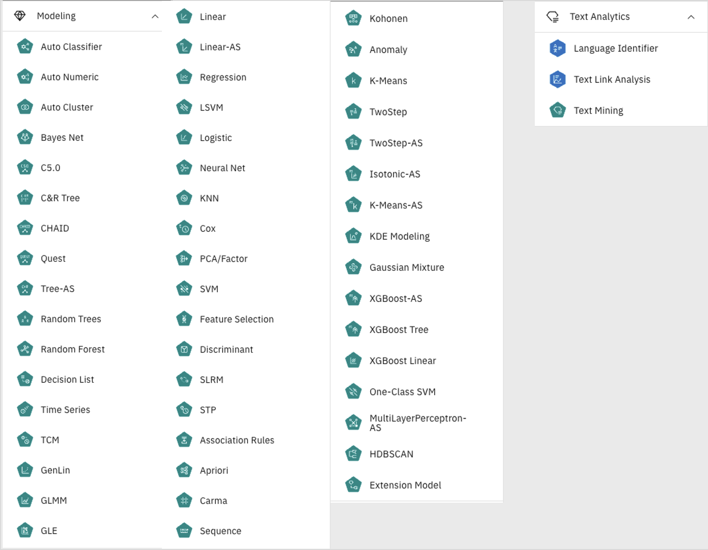
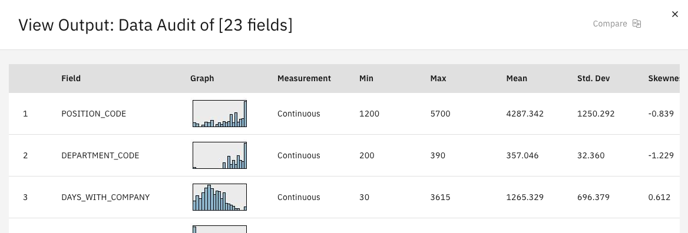
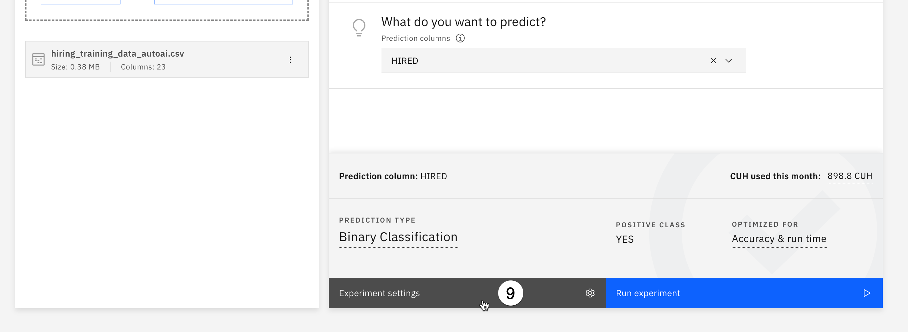
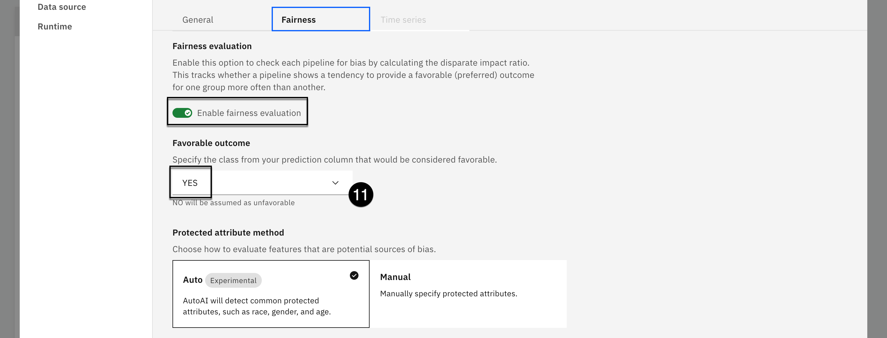

# 103: Soluciones sin código y de bajo código

La demanda de científicos de datos cualificados ha superado con creces la oferta durante años. Los científicos de datos experimentados son difíciles de encontrar, cobran salarios elevados y prefieren trabajar en problemas interesantes. Cualquier cliente que desee acelerar su programa de ciencia de datos y aportar valor al negocio tendrá que adaptarse a estas realidades. Watson Studio proporciona una serie de herramientas de vanguardia que no sólo pueden acelerar muchas tareas mundanas para los científicos de datos expertos, sino que también pueden permitir que los "científicos de datos ciudadanos" (expertos en la materia que pueden no sentirse cómodos escribiendo código) contribuyan.

SPSS Modeler es una solución de bajo código para transformar datos y construir modelos. AutoAI es una solución sin código para la creación rápida de prototipos de modelos. Esta sección del laboratorio explora estas dos ofertas.

## 1. Flujo de SPSS Modeler

<QuizAlert />

SPSS Modeler es una herramienta completa que ofrece una variedad de métodos de modelado tomados del aprendizaje automático, la IA y la estadística. Las dos figuras siguientes muestran los operadores disponibles en SPSS Modeler. La primera figura incluye 61 operadores para importación, exportación, registro y operaciones de campo, gráfico y capacidades de salida. La segunda figura incluye 56 operadores utilizados en modelado y análisis de texto.




SPSS proporciona una interfaz flexible de bajo código que ayuda a los científicos de datos, desde los intermedios hasta los expertos, a explorar y comprender sus datos, realizar ingeniería de funciones, crear modelos e implementarlos para la producción.

En este laboratorio creará dos flujos simples. Uno para la ingeniería de características y otro para la creación de modelos. Estos dos flujos no están relacionados, pero es fácil ver que flujos similares podrían formar parte de una solución.

### 1. Ingeniería de características

En este ejemplo más sencillo de ingeniería de funciones, generará el día de la semana en que se contrató a un empleado y el día de la semana en que un empleado abandonó la empresa. Estos datos pueden proceder de archivos o conexiones. Los datos también podrían provenir de múltiples fuentes y unirse para crear una entrada más completa. En este ejemplo, leerá los datos de una base de datos utilizando la conexión Data Warehouse disponible en su proyecto Cloud Pak for Data.

Tener acceso al día de la semana de un evento específico le permitirá comparar actividades de una semana a otra. Por ejemplo, ¿cuántas transacciones realizó el lunes? ¿Cómo se compara con otros lunes? ¿Puede ver un patrón de una semana a otra? ¿Tiene que prever más empleados e inventario los viernes que los lunes? Estos son los tipos de preguntas que se pueden plantear una vez que se extrae el día de la semana de una fecha. Podría tratarse de una simple transformación antes de pasar los datos al modelo de aprendizaje automático.

Veamos lo sencillo que es hacerlo con SPSS Modeler.


En este ejercicio utilizarás los tres operadores siguientes:

*   **Activo de datos**: para acceder a una tabla de una base de datos
*   **Derivar**: Para crear dos nuevas características (atributos / columna)
*   **Exportación de activos de datos**: Para escribir el resultado en un archivo de almacenamiento de objetos en la nube (COS)

Mientras sigues las instrucciones, tómate tu tiempo para ver las distintas opciones disponibles en cada operador.

1.  Vuelva a su proyecto en su navegador. Si ha cerrado la pestaña, vaya a su [lista de proyectos](https://dataplatform.cloud.ibm.com/projects?context=cpdaas) y haga clic en el nombre de su proyecto de la lista.
2.  En su proyecto, seleccione la pestaña **Activos** y haga clic en **Nuevo activo**.


3.  Seleccione **Constructores gráficos** en la columna del tipo de herramienta de la izquierda.
4.  Haga clic en el mosaico **del modelador de SPSS** en la parte inferior derecha de la pantalla.
5.  Dé a su flujo un nombre y una descripción opcional, después haga clic en **Crear**. Es posible que se le pida que realice una visita guiada de los Flujos de SPSS Modeler. Si es así, haga clic en **Tal vez más tarde** para cerrar el mensaje y continuar con el laboratorio.


6.  Despliegue la sección **Importar** de la paleta de la izquierda. Haga clic y arrastre el operador **Activo de** datos y suéltelo en el lienzo situado en el centro de la pantalla.


7.  Pase el ratón por encima del activo de datos que ha añadido al lienzo, haga clic en los tres puntos verticales que aparecen y seleccione **Editar**.


8.  Seleccione **Conexión** en el menú.
9.  Seleccione la conexión **al almacén de datos**.
10. Seleccione el esquema **EMPLEADO**.
11. Seleccione la tabla **EMPLEADOS**.
12. Haga clic en **Seleccionar** y, a continuación, en el botón **Guardar**. El activo de datos se actualizará con los datos de la base de datos conectada.


13. Despliegue las **Operaciones de campos** en la paleta de la izquierda.
14. Arrastre y suelte un operador **Derivar** a la derecha del operador **Activo de datos**.


15. Para conectar el operador **Activo de** **datos** con el operador **Derivar**, sitúe el ratón sobre el **Activo de datos** en el lienzo. Haga clic y arrastre el icono circular con el signo **>** hasta el operador **Derivar**. Ahora debería ver una línea que conecta estos dos operadores.


16. Pase el ratón por encima del operador **Derivar** en el lienzo, haga clic en los tres puntos verticales que aparecen y seleccione **Editar**.


17. Seleccione **Campos múltiples** en la sección **Modo de** la derecha.
18. Haga clic en el botón **Añadir columnas**.
19. Seleccione las columnas "DATE\_HIRED" y "TERMINATION\_DATE" de la tabla y haga clic en el botón azul **OK** de la parte inferior derecha.


20. Cambie la extensión del nombre del campo a la derecha de **\_Derive** a **\_wkday** para que sea más explícito a efectos de documentación.
21. En el cuadro Expresión de la parte inferior derecha, copia y pega lo siguiente:

```txt
datetime_weekday(@FIELD)
```

22. Haga clic en **Guardar**.


23. Despliegue la sección **Exportar** de la paleta de la izquierda.
24. Arrastre y suelte el operador **Exportación de Activos de** Datos en el lienzo, colocándolo a la derecha del operador **Derivar**.
25. Conecte el operador **Derivar** a la **Exportación de Activos** de **Datos** situando el ratón sobre el operador **Derivar** y, a continuación, haciendo clic y arrastrando el icono circular con el **>** hasta el nodo **Exportación de Activos** de Datos.
26. Edite el operador de **Exportación de Activos** de Datos del mismo modo que lo hizo anteriormente.


27. Cambie el valor del campo **Nombre de archivo** de **output.csv** a **employee\_w\_wkday.csv**.
28. Haga clic en **Guardar**.
29. Haga clic en el botón azul de **selección** Ejecutar en la parte superior de la ventana. Aparecerá la ventana emergente **Flujo en ejecución**, que le mostrará el estado de su ejecución.


30. Cuando haya finalizado la ejecución, vuelva a su proyecto Cloud Pak for Data haciendo clic en el nombre del proyecto en la parte superior izquierda de la pantalla.


31. Seleccione la pestaña **Activos**.
32. Haga clic en el activo **employee\_w\_wkday.csv** recién añadido en la sección **Todos los activos**. La vista previa muestra los dos nuevos campos que ha personalizado como las dos últimas columnas del archivo. Puede que tenga que desplazarse hacia la derecha para verlos.

Este sencillo flujo apenas insinúa las capacidades de SPSS Modeler. Por ejemplo, este flujo podría haber escrito el resultado de vuelta a una base de datos, o pasarlo a otro flujo para la creación del modelo.

El número de operadores disponibles en SPSS es sólo una parte de la historia. Cada operador incluye funciones para utilizar en expresiones de transformación de datos como **datetime\_weekday**. Podría haber utilizado la ayuda incorporada para encontrar la función que buscaba en lugar de confiar sólo en la memoria.

### 2. Creación de modelos

En esta sección del laboratorio, creará un modelo para predecir el abandono de los empleados. Se trata de un modelo similar a los dos modelos de bajas creados con cuadernos Jupyter en la sección de este laboratorio titulada [Aumento de las herramientas de código abierto](/mlops/102). El modelo tendrá este aspecto:


Este modelo tendrá un total de seis operadores. Se generará un séptimo en el proceso:

*   **Activo de datos**: Se utiliza para acceder al archivo de entrada.
*   **23** campos: Operador de auditoría de datos que muestra información estadística y de calidad sobre cada campo de entrada.
*   **Tipo**: Ayuda a identificar los tipos de columna adecuados y sus funciones.
*   **Partición**: Divide los datos entre los conjuntos de entrenamiento y prueba al crear el modelo.
*   **Desgaste** (Verde): Se trata en realidad de un operador **Autoclasificador** que proporciona una selección de operadores para evaluar antes de tomar una decisión final sobre cuál utilizar.
*   **Desgaste** (Oro): Es el resultado de la ejecución del operador **Autoclasificador** anterior. Puedes ver las evaluaciones del modelo y decidir con cuál te quedas.
*   **Tabla**: Es el resultado de todo el modelo. Puede guardar esta "rama" como modelo y desplegarla para utilizarla en diferentes contextos.

Siga los pasos descritos a continuación para crear este modelo de desgaste.

1.  Vuelva a su proyecto Cloud Pak for Data utilizando el nombre del proyecto en la parte superior izquierda de la pantalla.
2.  Seleccione la pestaña **Activos** y haga clic en el botón **Nuevo activo** de la derecha.
3.  Seleccione **Constructores gráficos** en el panel **Tipo de herramienta** de la izquierda.
4.  Haga clic en el mosaico **SPSS Modeler**.
5.  Dé a su flujo un nombre y una descripción opcional y, a continuación, haga clic en **Crear**.


6.  Despliegue la sección **Importar** de la paleta de la izquierda y, a continuación, arrastre el operador **Activo de** datos y suéltelo en el lienzo.
7.  Pase el ratón por encima del nodo **Activo de datos** en el calendario, haga clic en los tres puntos verticales que aparecen y seleccione **Editar**.


8.  Seleccione **Activo de datos**
9.  Seleccione **modeling\_records\_2022.csv**.
10. Pulse **Seleccionar** en la parte inferior derecha de la pantalla y, a continuación, pulse el botón azul **Guardar** en la parte inferior derecha. Los cambios tardarán unos 30 segundos en actualizarse.


11. Despliegue la sección **Salidas** de la paleta de la izquierda.
12. Arrastre y suelte un operador de **Auditoría de datos** debajo del de **Activos de datos**.
13. Conecte el operador **Activo de** **datos** al operador Auditoría de **datos** haciendo clic en el icono circular con el signo **>** que aparece al pasar el ratón por encima del **Activo de datos** y arrástrelo hasta el operador **Auditoría** de datos. Cuando conecte estos operadores, el operador **Auditoría** de datos pasará a llamarse automáticamente **23 Campos**.
14. Haga clic con el botón derecho del ratón en el operador **23 Campos** y seleccione **Ejecutar**.


15. El panel de resultados se abre en la parte derecha del lienzo. Haga clic en el nombre del resultado de **la Auditoría de datos** (no seleccione la casilla de verificación).



Puede ver información estadística y de calidad en cada campo de entrada. Puede que tenga que desplazarse a la derecha para ver columnas adicionales. Esta vista proporciona indicaciones sobre la calidad de los datos. Si la calidad se considera baja, tendría más sentido ir a buscar nuevos datos en lugar de continuar con la modelización.

Una vez que haya terminado de ver esta información, cierre la salida de la vista ("X" en la parte superior derecha) y cierre la sección Salidas utilizando la "X" en la parte superior derecha para dejar más espacio para trabajar con el lienzo.

16. Despliegue la sección **Operaciones de campo** de la paleta de la derecha.


17. Arrastre y suelte un operador **Tipo** a la derecha del operador **Activo de datos**.
18. Arrastre y suelte un operador **Partición** a la derecha del operador **Tipo**.
19. Conecte el operador **Activo de datos** al operador **Tipo** como ha hecho en pasos anteriores.
20. Pase el ratón por encima de Operador de **tipo**. Haga clic en los tres puntos verticales que aparecen y seleccione **Editar**.


21. Utilice el menú desplegable de la columna **Medida** de la fila **GENDER\_CODE** para establecer el valor en **Categórico**.
22. Utilice el desplegable de la columna **Medida** de la fila **ATTRICIÓN** para establecer el valor en **Bandera**.
23. Utilice el desplegable de la columna **Rol** en la fila **ATTRITION** para establecer el valor en **Target**.
24. Pulse el botón azul **Guardar** en la parte inferior derecha de la pantalla.
25. Conecte el operador **Tipo** al de **Partición** como ha hecho muchas veces antes.
26. Edite el operador **Partición**.


27. Cambie el campo **Partición de entrenamiento(%)** a **90**.
28. Cambie el campo **Partición de prueba(%)** a **10**.
29. Pulse el botón azul **Guardar** en la parte inferior derecha.


30. Despliegue la sección **Modelado** de la paleta de la izquierda.
31. Arrastre y suelte un operador **Autoclasificador** en el lienzo y colóquelo a la derecha del operador **Partición**.
32. Conecte el operador **Partición** al **Autoclasificador** uno (tenga en cuenta que el nombre del operador cambiará automáticamente a **ATTRICIÓN**, que usted designó como objetivo en el paso 23).
33. Editar el operador **ATTRITION**.
34. Desplácese hacia abajo en la ventana que se abre. Fíjese en las múltiples secciones, entre las que se incluyen **Opciones de construcción**, **Criterios para marcar objetivos**, **Experto**, etc.


35. Despliegue la sección **Experto**. Puede ver que hay varios modelos seleccionados en la subsección **Seleccionar Modelos**. Por defecto, SPSS Modeler seleccionará una variedad de modelos a utilizar.
36. Haz clic en el botón azul **Guardar** de la parte inferior derecha.
37. Haga clic con el botón derecho del ratón en el operador **ATTRITION** y seleccione **Ejecutar**. El flujo tardará unos minutos en ejecutarse. Una vez completada la ejecución, aparece un nuevo operador **ATTRITION** (dorado) debajo del antiguo operador **ATTRITION**, y SPSS traza conexiones a este nuevo operador desde los operadores **Partición** y **ATTRITION**.

Este nuevo operador representa los modelos creados a partir de los datos de entrenamiento. Puede ver las evaluaciones de los modelos y decidir con cuál(es) quedarse. Si se selecciona más de un modelo, SPSS Modeler los utilizará como un conjunto (un grupo de modelos) para ofrecer una evaluación agregada de todas las salidas del modelo.


38. Despliegue la sección **Salidas** de la paleta de la izquierda.
39. Arrastre y suelte un operador de **Tabla** en el lienzo a la derecha del operador **ATTRITION** generado por SPSS oro.
40. Conecte el operador dorado **ATTRITION** al operador **Table** que acaba de añadir.
41. Haga clic con el botón derecho del ratón en el operador **Tabla** y seleccione Ejecutar.


42. Abra el resultado **de la tabla** haciendo clic en su nombre en el panel derecho.
43. Desplácese hasta la derecha para ver las columnas generadas:

*   **Partición**: Si esta entrada es de las particiones de entrenamiento o de prueba, como se especifica en el nodo de partición.
*   **$XF-ATTRITION**: Si el modelo predice que el empleado dejará la empresa (1) o se quedará (0)
*   **$XFC-ATTRITION**: grado de confianza del modelo en la predicción, entre 0 (confianza baja) y 1 (confianza alta)

44. Cierre la salida de la vista haciendo clic en la **X** de la parte superior derecha.

Puede guardar este modelo para su despliegue haciendo clic con el botón derecho del ratón en el operador **Tabla** y seleccionando **Guardar rama como modelo**. Esto está fuera del alcance de este laboratorio.

Esta sección apenas araña la superficie de lo que SPSS Modeler puede hacer. SPSS Modeler puede ser útil en tareas como la exploración y comprensión de datos, ingeniería de características, construcción de modelos y más. Consulte la [documentación](https://dataplatform.cloud.ibm.com/docs/content/wsd/spss-modeler.html?context=cpdaas\&audience=wdp) para obtener más información sobre las capacidades de SPSS Modeler.

Además de la documentación, puede encontrar proyectos y cuadernos que utilizan SPSS en la galería. Para ver la galería de proyectos de ejemplo, [cree un nuevo proyecto](https://dataplatform.cloud.ibm.com/projects/create-project?context=cpdaas\&type=import) y desplácese hasta la sección **Galería**.

## 2. AutoAI

AutoAI es la solución sin código de Watson Studio para la creación rápida de prototipos y el desarrollo de modelos. Puede ser utilizada por científicos de datos ciudadanos para crear modelos sin escribir ningún código. Además, los científicos de datos experimentados la utilizan con frecuencia para acelerar la creación de código de modelo repetitivo, seleccionar los algoritmos más prometedores o probar la validez de un conjunto de datos para la creación de modelos.

En esta sección del laboratorio, creará un modelo de "ayudante de contratación" que un cliente podría utilizar para examinar los currículos enviados para vacantes en su empresa.

1.  Vaya a la pantalla de inicio del proyecto que ha estado utilizando para este laboratorio, ya sea desde el enlace de migas de pan en la parte superior izquierda de la pantalla, o haciendo clic en él desde su [lista de proyectos](https://dataplatform.cloud.ibm.com/projects).


2.  Seleccione la pestaña **Activos** y haga clic en el botón azul **Nuevo activo** de la derecha.


3.  Seleccione **Constructores automatizados** en la lista **Tipo de herramienta** situada a la izquierda de la pantalla y, a continuación, haga clic en la ficha **AutoAI**. Se abrirá la pantalla **Crear un experimento** AutoAI.
4.  Dale a tu modelo un nombre descriptivo como **Ayudante de contratación** y una descripción opcional, y luego haz clic en el botón azul **Crear**.
5.  Haga clic en el botón **Seleccionar del proyecto** para añadir una fuente de datos de su proyecto.


6.  En la lista **Categorías** de la izquierda, seleccione **Activo de datos** y, a continuación, marque la casilla situada junto a **hiring\_training\_data\_autoai.csv**. Ahora haga clic en el botón azul **Seleccionar activo** en la parte inferior derecha.
7.  Este modelo no es una previsión de series temporales, así que haga clic en **No** en el cuadro **Configurar detalles**.
8.  En el desplegable **Columnas de predicción**, seleccione **Contratado** en la parte inferior de la lista. El servicio AutoAI determinará automáticamente que se trata de un problema de clasificación binaria, en el que su modelo elegirá entre dos resultados: contratar o no contratar.



9.  Para personalizar el experimento, haga clic en Configuración del **experimento**. Se abrirá la pantalla **Configuración** del experimento.


10. El servicio AutoAI incluye una tecnología pionera de IBM Research que puede comprobar la equidad del modelo en el momento de la compilación. Para comprobarlo, seleccione la pestaña **Equidad** en la pantalla **de ajustes de predicción**.



11. Haga clic en el conmutador para **Activar evaluación de imparcialidad**. Haga clic en el desplegable **Resultados favorables** y seleccione **SÍ**; este resultado indica que la herramienta de selección debería recomendar al candidato que continúe en el proceso de contratación. Puede configurar el **método Atributo protegido** para identificar manualmente posibles fuentes de sesgo. En este ejemplo dejará que AutoAI identifique automáticamente posibles problemas de imparcialidad.


12. Vuelva a la pestaña **General de los ajustes de predicción** y desplácese hasta la sección Métrica **optimizada**. Observe que puede seleccionar para qué métrica optimizar, y puede pasar el ratón por encima de cada una para obtener una breve descripción de lo que es esa métrica. Como está intentando construir un modelo justo, seleccione **Precisión e** Impacto dispar de la lista. El impacto [desigual](https://dataplatform.cloud.ibm.com/docs/content/wsj/model/wos-disparate-impact.html) compara el porcentaje de resultados favorables de un grupo supervisado con el porcentaje de resultados favorables de un grupo de referencia.
13. Desplácese hasta la sección **Algoritmos a incluir**. Una vez más, observe la gran variedad de algoritmos que pueden incluirse. De nuevo, puedes pasar el ratón por encima de cada uno para obtener una breve descripción de cómo funciona ese algoritmo.
14. Haga clic en el botón azul **Guardar configuración** situado en la parte inferior derecha y, a continuación, haga clic en el botón azul **Ejecutar experimento**. La ejecución de AutoAI tardará unos minutos en completarse.

Puedes hacer clic en el enlace azul de la **vista Swap** de la derecha para ver el mapa de progreso, o ver cómo se va rellenando el mapa de relaciones con los distintos algoritmos. A medida que se vayan puntuando los algoritmos, se irán añadiendo a la tabla **de clasificación de Pip** eline, en la parte inferior de la pantalla.

15. Una vez finalizada la ejecución, desplácese hacia abajo para ver la **tabla de** clasificación de la canalización. Las canalizaciones generadas automáticamente se clasifican en función de los criterios seleccionados en el paso anterior (precisión e impacto desigual, o equidad). Tenga en cuenta que, debido a la asignación aleatoria de datos de entrenamiento y datos de espera (prueba), los resultados del mejor algoritmo variarán de una ejecución a otra. Cada fila de la tabla muestra las distintas mejoras introducidas en la canalización, incluida la optimización de hiperparámetros y la ingeniería de características. Para obtener una explicación más detallada de las canalizaciones y las mejoras, consulte la sección AutoAI de la [demo MLOps and Trustworthy AI](https://cp4d-outcomes.techzone.ibm.com/data-fabric/trusted-ai). Obsérvese también el tiempo de compilación, que suele ser de sólo unos segundos para una canalización completa.


16. Haga clic en un pipeline que muestre algunas mejoras. Se abrirá la pantalla de **detalles del** pipeline correspondiente.
17. Seleccione **Resumen de características** en la lista de la izquierda. Esta pantalla muestra la importancia de las distintas características en el resultado del modelo. Las transformaciones realizadas en la característica pueden verse pasando el ratón por encima en la columna **Transformación** de la tabla.
18. Seleccione la sección **Equidad** de la lista de la izquierda. La **pantalla** de Equidad muestra los cálculos de impacto dispar. Desplácese hacia abajo hasta la tabla de atributos protegidos. AutoAI ha identificado cinco características, incluyendo **Género**, **Edad** y **Estado Civil**. Otras dos características, **TotalDeAñosDeTrabajo** y **AñosEnLaEmpresaActual**, son probablemente sustitutos de la **Edad** y también se han identificado como fuentes potenciales de sesgo injusto. La tabla muestra el índice de impacto desigual para cada característica. Puede hacer clic en el enlace azul **"Más información"** situado justo encima de la tabla para obtener más información sobre la equidad y el impacto desigual.


> Tenga en cuenta que en una situación real, para intentar eliminar un sesgo potencialmente injusto, variables como **el sexo** no se incluirían como características en el modelo. Sin embargo, la simple eliminación de la característica no garantiza que el modelo sea justo. A menudo, otras características aparentemente benignas de un modelo actuarán como características sustitutivas de las excluidas. Puede que hayas visto esto en la sección de equidad del modelo de la [demo MLOps and Trustworthy AI](https://cp4d-outcomes.techzone.ibm.com/data-fabric/trusted-ai), donde utilizas Watson Trust (OpenScale) para evaluar la equidad de este modelo.

19. Haga clic en el botón azul **Guardar como** en la parte superior derecha para uno de los pipelines. AutoAI le permite guardar el pipeline como un modelo que puede ser rápidamente desplegado como un servicio web, o como un cuaderno para su posterior ajuste. La primera opción permite a los ciudadanos generar sus propios modelos. La segunda opción atrae a los científicos de datos expertos, que pueden crear rápidamente prototipos de una docena de pipelines, evaluar el que mejor funciona y generar el código necesario para su posterior optimización, todo ello en cuestión de minutos. Si lo desea, puede guardar su pipeline en su proyecto como un cuaderno o un modelo, o simplemente hacer clic en **Cancelar**.
