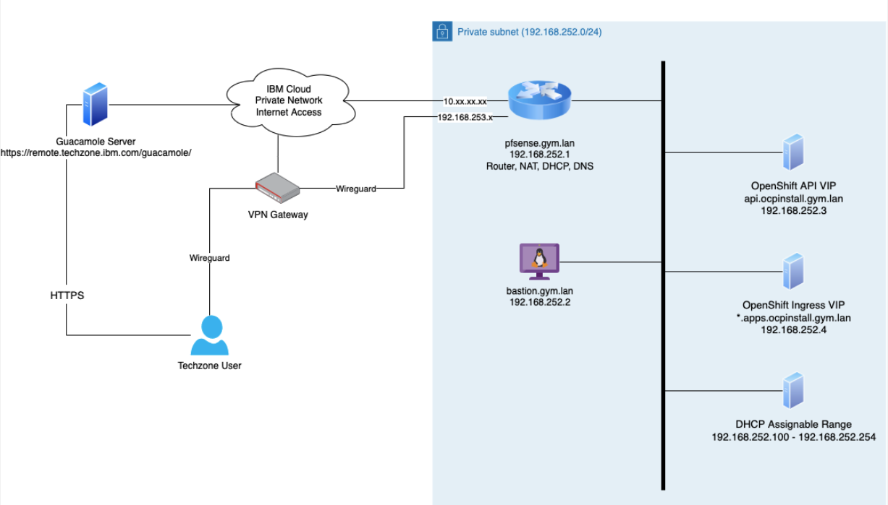
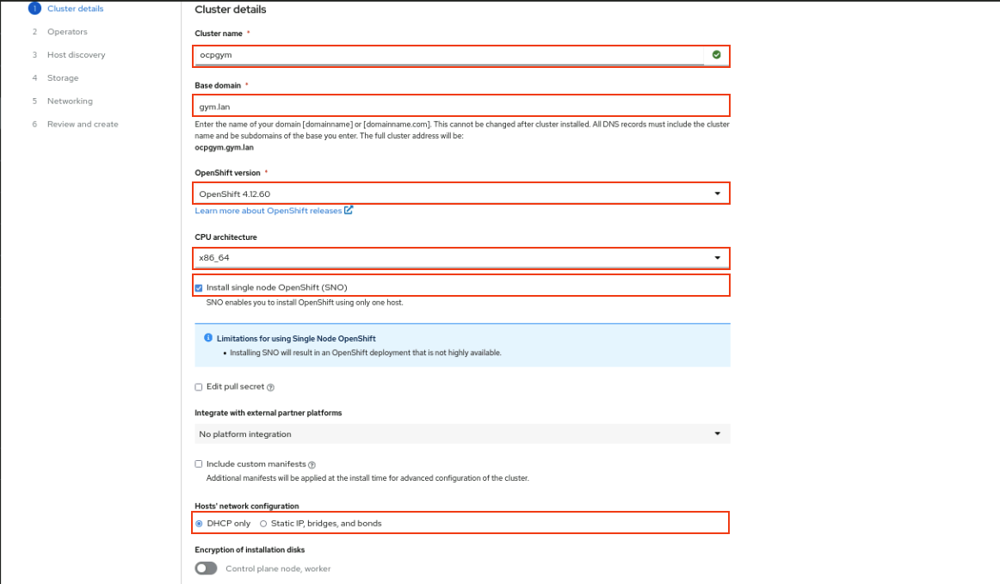
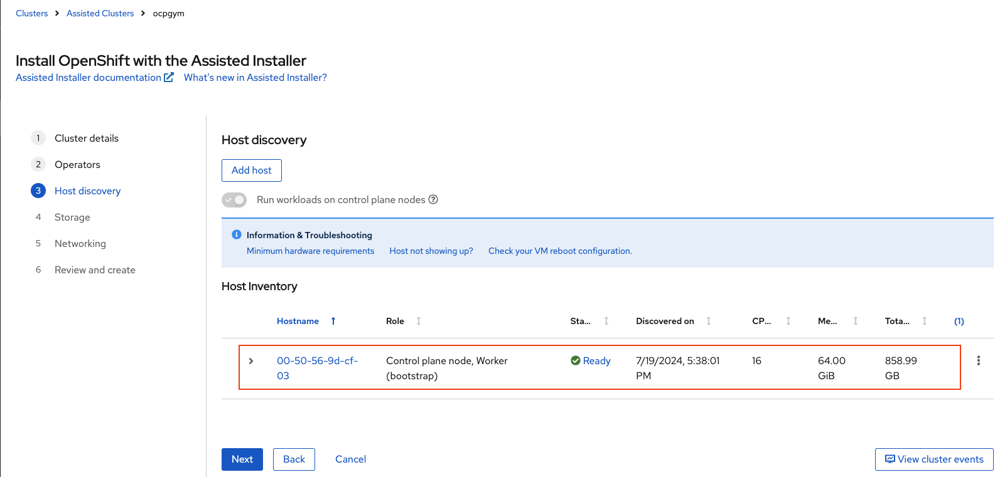
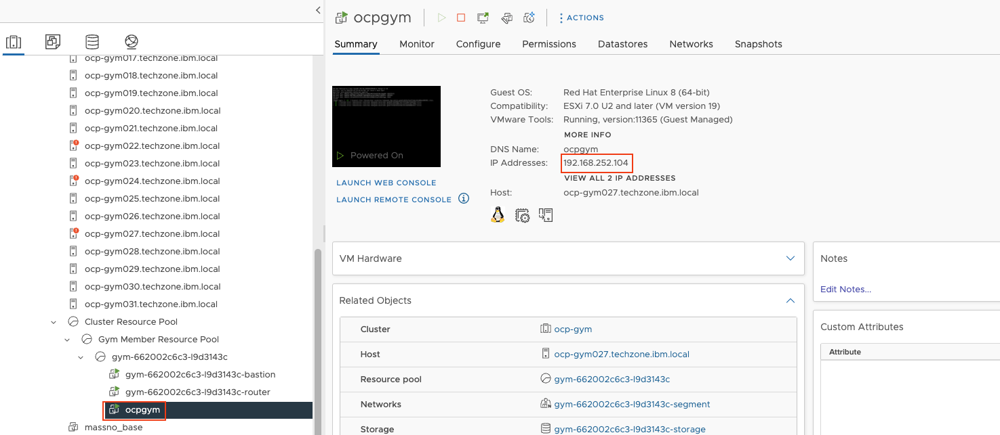
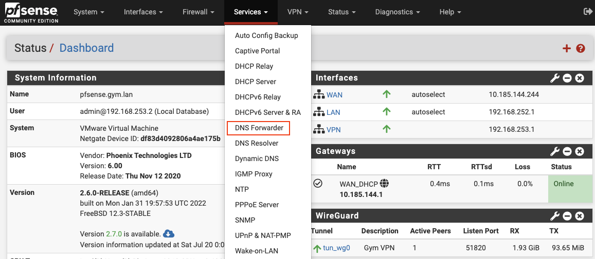

# Maximo Technical Sales Workshop

If you are an IBM Business Partner or an IBMer, this is a skinny but complete guide to create a MAS Manage environment in IBM TechZone.

 

 General diagram of Gym Network

  

At high level, the following steps are going to be described in this guide:
1. How to create a vSphere-based environment in TechZone. This environment includes a Bastion
Server and a Router with DHCP, NAT and DNS.
2. The creation of an SNO iso file using the Red Hat Console and its download into the Bastion
Server
3. How to connect to the vSphere-based environment thru VPN
4. The upload of the SNO iso file from the Bastion Server into vCenter
5. How to create a VM instance that will run the SNO and use the uploaded iso file for booting
6. How to clone from GitHub the Ansible collection that will be use to install MAS and run it

## Create a vSphere-based environment in TechZone

1. Navigate to https://techzone.ibm.com/collection/ocp-gymnasium/environments and login using your IBMId

    You will see following tile, click on **Reserve** button

    

2. In the Create a Reservation page input and click **Submit** button

    **Name:** MAS SNO Workshop
    **Purpose:** Practice / Self education
    **Purpose description:** Educate myself how to install SNO and MAS
    **Preferred Geography:** AMERICAS
    **VMware Datastore Size:** 3 TB
    **VPN Access:** Enable

  You should also have received an email that **“Your environment/access request is provisioning”**

  When the environment is ready, you will receive another email with subject **“Your environment is ready”**

3. The environment that is being create contains a Bastion computer (RHEL based) and a Router (pfSense based). When it will be available, you can VPN into it and directly access the computers running in it.

  Setting up the VPN is very simple. When the environment will be ready, you can click on the tile and you will see a page with lots of useful information. At the bottom of that page, you will find the button to download the Wireguard VPN configuration from reservation page.

  Download the configuration, install Wireguard (https://www.wireguard.com/install/) if you don’t have it already and import the configuration. You can activate the VPN as needed and access also the OpenShift cluster we are going to deploy.

## Creating new Cluster

1. Navigate to reserved instance in Techzone. Click on the blue button, which will open a new browser window. Click on the **+** signs to expand the sections:

    

  Click on the Remote Desktop option to open the Bastion remote desktop. The Bastion runs RHEL, therefore you can use the **Activities** button at the top left to open a tile and click on the Firefox icon.

2. Log into the Red Hat Console for OpenShift (https://console.redhat.com/openshift). You should see a blue **Create cluster** button. Click it.

> **Note:** You can register, if you have not registered yet. 

    

3. In the following screen, click on the **Datacenter** tab, and click on the blue **Create cluster** button. 

    

  Fill the form that shows up in this way:
    **Cluster name:** ocpgym
    **Base domain:** gym.lan
    **OpenShift version:** OCP 4.12.x
    **select** “Install single node OpenShift (SNO)”
    **Hosts' network configuration:** DHCP Only

    

4. Click the **Next** button. Don’t change anything in the next screen and click again **Next**. 

    

5. Click the **Add host** button. In the dialog that will be shown, select **Full image file: Download a self-contained ISO**, upload your **SSH public key** and click on the **Generate Discovery ISO** button.

    

> **Note** In case you have never used SSH and you need to generate your private/public keys, use the ssh-keygen tool. Open a Terminal window on the Bastion computer, type ssh-keygen and accept all the defaults (i.e. location of files, no passphrase, etc.). When done, you can find your SSH public key in the ~/.ssh folder. Keep in mind that you may also avoid to upload your SSH public key, but this will prevent you in the future from accessing the node using SSH.

```bash
    $ ssh-keygen
    $ cat .ssh/id_rsa.pub
```

6. After the Discovery ISO has been generated, in the following dialog, click the **Download Discovery ISO** button and save the ISO file on the Bastion computer. It will have a filename like this: **e430fdbb-8c63-4b42-b15f-62bd3d8fbef0-discovery.iso**

Close the dialog. We’ll come back to this screen later, but now we want to upload the ISO into the TechZone vCenter.

## Create a Virtual Machine in vShpare

1. In the Firefox window, notice that there is a predefined button to access the vCenter.

    

  Click on that button. You can find credential for vCenter at the bottom of the Techzone reservation page.

2. Once you login, At the top left of the screen you should see a symbol of a drum disk. **Click** on it. Open the pull down and select the storage with the name that start with “**gym-**“. On the right side select **Files**.

    

3. Create an iso folder called “sno” under the main storage element using the **NEW FOLDER** option shown in the previous picture. **Click** on the newly created **sno** folder and upload in it the ISO you downloaded from Red Hat using the **UPLOAD FILES** option. You can check the upload progress from the status window.

4. When the ISO has uploaded, we create a new VM that will become the Single Node OpenShift. **Click** on the servers icon at the top left of the screen and open all the sections
    

5. **Right click** on the resource pool highlighted and chose **New Virtual Machine…**
    

6. In the dialog that will be shown, select **Create a new virtual machine** and click **Next**
    

7. Set the **virtual machine name** as **ocpgym** and select the folder the one starting with gym-...

    

8. Click **Next**. Select the compute resource starting with **gym-...**
    

9. Click **Next**. Select the storage starting with **gym-...**
    

10. Click **Next**. Select compatibility **ESXi 7.0 U2 and later**.

11. Click **Next**. Select Guest OS Family **Linux** and **Version RHEL 8 64 bit** 

12. In the next panel set **CPU to 16**, **memory to 64**, **primary disk 300 GB**, use the **ADD NEW DEVICE** to add a secondary Hard Disk of **500 GB**, set the **New CD/DVD Drive to “Datastore ISO File”** and **select** the ISO you uploaded before.

Make sure to **select** the **Connect** checkmark. The final result should look like the following picture.

    

13. At this point click on the **VM Options** tab and open the **Advanced** section. Find the **Configuration Parameters** section and click on **EDIT CONFIGURATION**. In the following panel, click on **ADD CONFIGURATION PARAMS**. Type in the name **disk.EnableUUID** and set the value to **TRUE**

    

Click **OK** on the **Configuration Parameter** panel.

14. Click **Next**. Review one more time everything and click **Finish**.

The new VM should now show in your pool under the bastion and the router. **Select** it by clicking on it and start it by either typing **crtl+alt+b** or by **right clicking** and using the **Power->Power ON** menu item.

## Installing OCP Cluster

1. Switch back to the **Redhat Window** where you have created new cluster. If you are on the host page, you should see a host appeared. 

    

2. Change its hostname to **ocpgym**. The line should look like this:

    

3. Click **Next**. In the Storage screen click **Next**. In the Networking screen don’t change anything and click **Next**. Some times it takes a bit of time to get to a **Ready** state, due to NTP to be unreachable. Don’t worry, be patient and wait for the state to become **ready** and then click **Next**.

4. In the **Review and create** all the validations should be good and you can click the **Install Cluster** button.

    

5. The next screen will allow you to follow the cluster installation till its end. It will take around 45 min to complete.

    

    You can follow the details of the progress by using the **View Cluster Events** button at the bottom of the page. You can move to next step while installtion is in progress. 

## Router Configuration

While we are waiting for the SNO to be installed, let’s configure the router. 

1. Go back to the vCenter panel and click on the **ocpgym** VM, On the right panel that will be shown, note the **IP address** of the VM, In this case the IP address is 192.168.252.104.

    

2. Then **click** on the **router VM** in the left panel. On the **right panel** that will be shown, click on the **VIEW ALL 4 IP ADDRESSES** and pick the one from the
**192.168.252.x subnet**. In this case it’s **192.168.252.1**.

    
3. Open a new **browser window** and navigate to the address **192.168.252.1**. You should see the pfsense login panel. Use **admin** as username and the **vCenter password** you used before to login to vCenter (**which is in the Reservation page**).

    

4. At the top, use the **Services** pull down and chose **DNS Forwarder**

    

5. In the page that will be shown, there are a few configurations to make at the bottom of the page using the **ocpgym** IP address.
    - Add **address=/apps.ocpgym.gym.lan/192.168.252.104** to the **Custom options** and Save.
    - Add two **Host Overrides** using the Add button:
      
      **Host:** api, **Domain:** ocpgym.gym.lan, **IP Address:** 192.168.252.104
      **Host:** api-int, **Domain:** ocpgym.gym.lan, **IP Address:** 192.168.252.104

    

      Your page sould look like this in the end:

    

