# Maximo Technical Sales Workshop

If you are an IBM Business Partner or an IBMer, this is a skinny but complete guide to create a MAS Manage environment in IBM TechZone.

 

 General diagram of Gym Network

  

At high level, the following steps are going to be described in this guide:
1. How to create a vSphere-based environment in TechZone. This environment includes a Bastion
Server and a Router with DHCP, NAT and DNS.
2. The creation of an SNO iso file using the Red Hat Console and its download into the Bastion
Server
3. How to connect to the vSphere-based environment thru VPN
4. The upload of the SNO iso file from the Bastion Server into vCenter
5. How to create a VM instance that will run the SNO and use the uploaded iso file for booting
6. How to clone from GitHub the Ansible collection that will be use to install MAS and run it

## Create a vSphere-based environment in TechZone

1. Navigate to https://techzone.ibm.com/collection/ocp-gymnasium/environments and login using your IBMId

    You will see following tile, click on **Reserve** button

    

2. In the Create a Reservation page input and click **Submit** button

    **Name:** MAS SNO Workshop
    **Purpose:** Practice / Self education
    **Purpose description:** Educate myself how to install SNO and MAS
    **Preferred Geography:** AMERICAS
    **VMware Datastore Size:** 3 TB
    **VPN Access:** Enable

  You should also have received an email that **“Your environment/access request is provisioning”**

  When the environment is ready, you will receive another email with subject **“Your environment is ready”**

3. The environment that is being create contains a Bastion computer (RHEL based) and a Router (pfSense based). When it will be available, you can VPN into it and directly access the computers running in it.

  Setting up the VPN is very simple. When the environment will be ready, you can click on the tile and you will see a page with lots of useful information. At the bottom of that page, you will find the button to download the Wireguard VPN configuration from reservation page.

  Download the configuration, install Wireguard (https://www.wireguard.com/install/) if you don’t have it already and import the configuration. You can activate the VPN as needed and access also the OpenShift cluster we are going to deploy.

## Creating new Cluster

1. Navigate to reserved instance in Techzone. Click on the blue button, which will open a new browser window. Click on the **+** signs to expand the sections:

    

  Click on the Remote Desktop option to open the Bastion remote desktop. The Bastion runs RHEL, therefore you can use the **Activities** button at the top left to open a tile and click on the Firefox icon.

2. Log into the Red Hat Console for OpenShift (https://console.redhat.com/openshift). You should see a blue **Create cluster** button. Click it.

> **Note:** You can register, if you have not registered yet. 

    

3. In the following screen, click on the **Datacenter** tab, and click on the blue **Create cluster** button. 

    

  Fill the form that shows up in this way:
    **Cluster name:** ocpgym
    **Base domain:** gym.lan
    **OpenShift version:** OCP 4.12.x
    **select** “Install single node OpenShift (SNO)”
    **Hosts' network configuration:** DHCP Only

    

4. Click the **Next** button. Don’t change anything in the next screen and click again **Next**. 

    

5. Click the **Add host** button. In the dialog that will be shown, select **Full image file: Download a self-contained ISO**, upload your **SSH public key** and click on the **Generate Discovery ISO** button.

    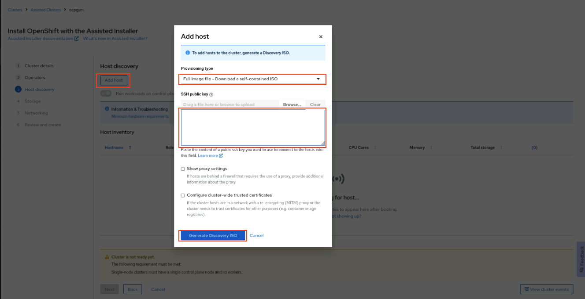

> **Note** In case you have never used SSH and you need to generate your private/public keys, use the ssh-keygen tool. Open a Terminal window on the Bastion computer, type ssh-keygen and accept all the defaults (i.e. location of files, no passphrase, etc.). When done, you can find your SSH public key in the ~/.ssh folder. Keep in mind that you may also avoid to upload your SSH public key, but this will prevent you in the future from accessing the node using SSH.

```bash
    $ ssh-keygen
    $ cat .ssh/id_rsa.pub
```

6. After the Discovery ISO has been generated, in the following dialog, click the **Download Discovery ISO** button and save the ISO file on the Bastion computer. It will have a filename like this: **e430fdbb-8c63-4b42-b15f-62bd3d8fbef0-discovery.iso**

Close the dialog. We’ll come back to this screen later, but now we want to upload the ISO into the TechZone vCenter.

## Create a Virtual Machine in vShpare

1. In the Firefox window, notice that there is a predefined button to access the vCenter.

    

  Click on that button. You can find credential for vCenter at the bottom of the Techzone reservation page.

2. Once you login, At the top left of the screen you should see a symbol of a drum disk. **Click** on it. Open the pull down and select the storage with the name that start with “**gym-**“. On the right side select **Files**.

    

3. Create an iso folder called “sno” under the main storage element using the **NEW FOLDER** option shown in the previous picture. **Click** on the newly created **sno** folder and upload in it the ISO you downloaded from Red Hat using the **UPLOAD FILES** option. You can check the upload progress from the status window.

4. When the ISO has uploaded, we create a new VM that will become the Single Node OpenShift. **Click** on the servers icon at the top left of the screen and open all the sections
    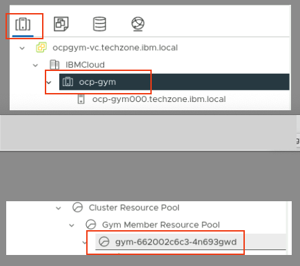

5. **Right click** on the resource pool highlighted and chose **New Virtual Machine…**
    

6. In the dialog that will be shown, select **Create a new virtual machine** and click **Next**
    

7. Set the **virtual machine name** as **ocpgym** and select the folder the one starting with gym-...

    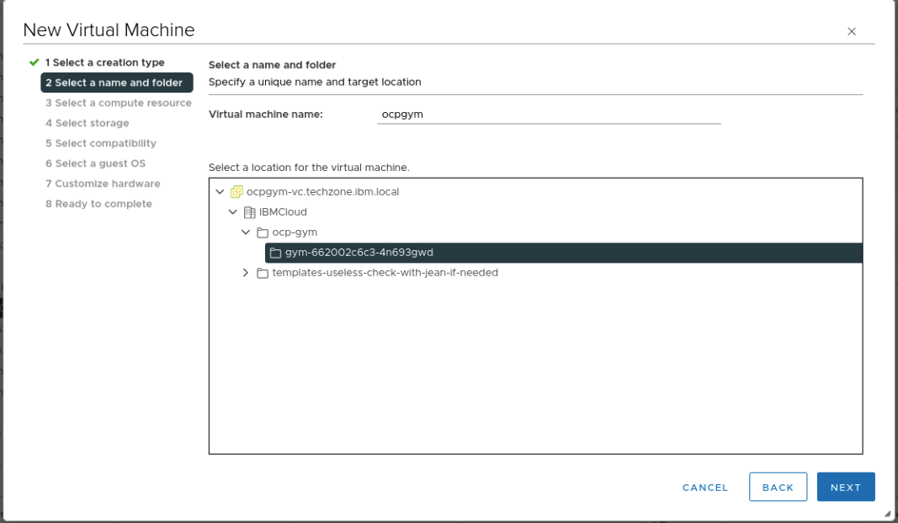

8. Click **Next**. Select the compute resource starting with **gym-...**
    

9. Click **Next**. Select the storage starting with **gym-...**
    

10. Click **Next**. Select compatibility **ESXi 7.0 U2 and later**.

11. Click **Next**. Select Guest OS Family **Linux** and **Version RHEL 8 64 bit** 

12. In the next panel set **CPU to 16**, **memory to 64**, **primary disk 300 GB**, use the **ADD NEW DEVICE** to add a secondary Hard Disk of **500 GB**, set the **New CD/DVD Drive to “Datastore ISO File”** and **select** the ISO you uploaded before.

Make sure to **select** the **Connect** checkmark. The final result should look like the following picture.

    

13. At this point click on the **VM Options** tab and open the **Advanced** section. Find the **Configuration Parameters** section and click on **EDIT CONFIGURATION**. In the following panel, click on **ADD CONFIGURATION PARAMS**. Type in the name **disk.EnableUUID** and set the value to **TRUE**

    

Click **OK** on the **Configuration Parameter** panel.

14. Click **Next**. Review one more time everything and click **Finish**.

The new VM should now show in your pool under the bastion and the router. **Select** it by clicking on it and start it by either typing **crtl+alt+b** or by **right clicking** and using the **Power->Power ON** menu item.

## Installing OCP Cluster

1. Switch back to the **Redhat Window** where you have created new cluster. If you are on the host page, you should see a host appeared. 

    

2. Change its hostname to **ocpgym**. The line should look like this:

    

3. Click **Next**. In the Storage screen click **Next**. In the Networking screen don’t change anything and click **Next**. Some times it takes a bit of time to get to a **Ready** state, due to NTP to be unreachable. Don’t worry, be patient and wait for the state to become **ready** and then click **Next**.

4. In the **Review and create** all the validations should be good and you can click the **Install Cluster** button.

    

5. The next screen will allow you to follow the cluster installation till its end. It will take around 45 min to complete.

    

    You can follow the details of the progress by using the **View Cluster Events** button at the bottom of the page. You can move to next step while installtion is in progress. 

## Router Configuration

While we are waiting for the SNO to be installed, let’s configure the router. 

1. Go back to the vCenter panel and click on the **ocpgym** VM, On the right panel that will be shown, note the **IP address** of the VM, In this case the IP address is 192.168.252.104.

    

2. Then **click** on the **router VM** in the left panel. On the **right panel** that will be shown, click on the **VIEW ALL 4 IP ADDRESSES** and pick the one from the
**192.168.252.x subnet**. In this case it’s **192.168.252.1**.

    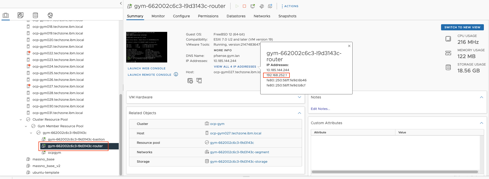
3. Open a new **browser window** and navigate to the address **192.168.252.1**. You should see the pfsense login panel. Use **admin** as username and the **vCenter password** you used before to login to vCenter (**which is in the Reservation page**).

    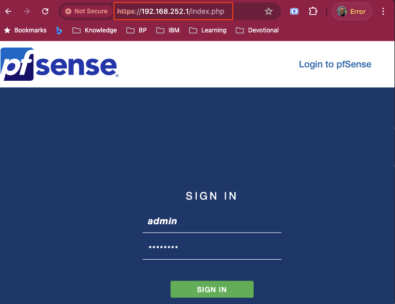

4. At the top, use the **Services** pull down and chose **DNS Forwarder**

    

5. In the page that will be shown, there are a few configurations to make at the bottom of the page using the **ocpgym** IP address.
    - Add **address=/apps.ocpgym.gym.lan/192.168.252.104** to the **Custom options** and Save.
    - Add two **Host Overrides** using the Add button:
      
      **Host:** api, **Domain:** ocpgym.gym.lan, **IP Address:** 192.168.252.104
      **Host:** api-int, **Domain:** ocpgym.gym.lan, **IP Address:** 192.168.252.104

    

      Your page sould look like this in the end:

    

6. Go to the top of the page and apply changes using the button **Apply Changes**

    

    You can log out from **pfSense** using the exit door icon at the top left of the page.

Hopefully at this time the cluster is installed. Go back to the Red Hat Cluster installation page and you should see a page including this:


## Configure OCP Cluster

1. Switch to **Redhat Console browser tab** and check if OCP cluster creation is completed. 

    

2. You can **click** the **Web Control URL** to access the Single Node OpenShift. Use the **Username** and **Password** shown in cluter page to log in. Check around to see if everything is in shape.

3. The next step is to provide the cluster with a storage class and related provisioner. Go to the **OperatorHub** (left menu under Operators) and **search** for **LVM**. 

    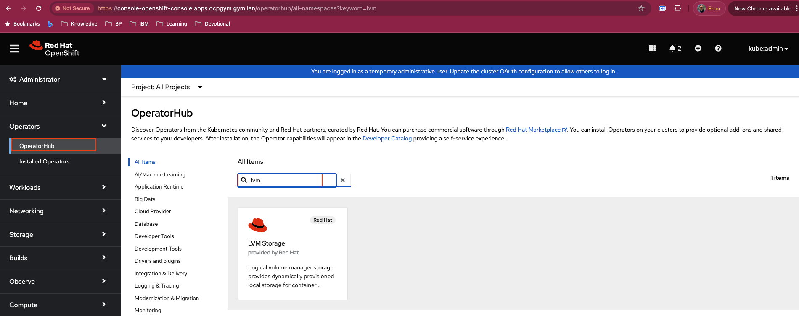

4. **Click** on the **LVM tile** and install the operator using **default parameters**. When the operator becomes ready for use, click on the **Create LVMCluster** button

    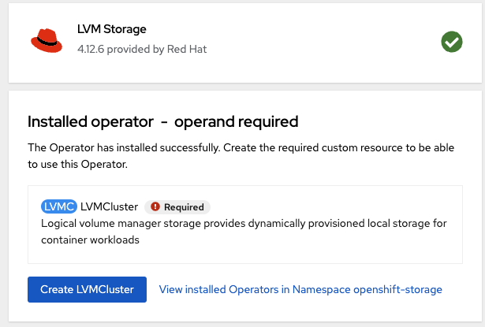

5. In the page that will appear, leave all the defaults and click on the **Create** button at the bottom of the page.

    

6. Wait for the LVMCluster status to become **Ready**.

    

7. At this point we will have to do some configurations, that can be done either via the OpenShift Console UI or via command line. Lets start with OpenShift Console UI to enable the local image registry. 

    Click on **Home -> Search**, type **config** in the **search field**, you should see

    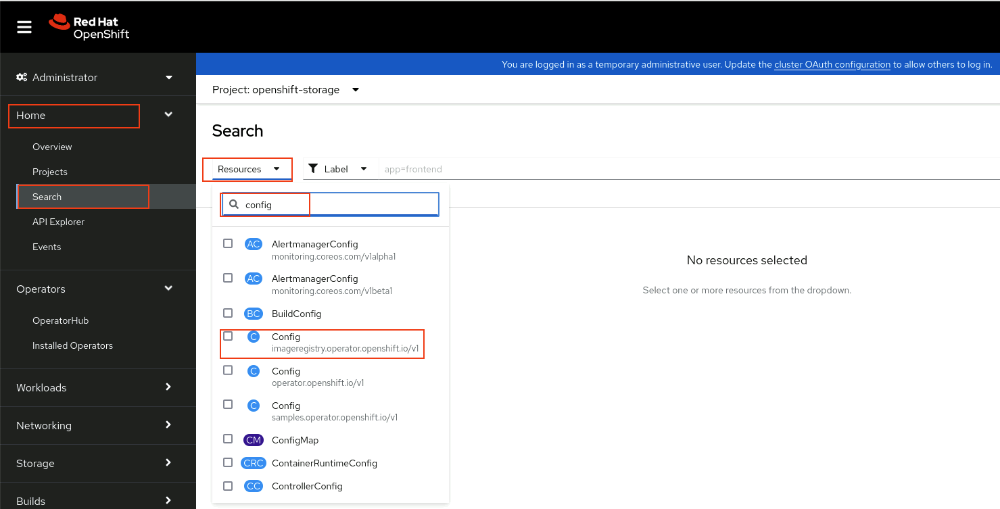

    Choose the first config, which is the one for the image registry. You should see:

    

    Click on the **cluster** resource and click on the **YAML** tab. **Edit** the **yaml** in the following way, save frequently otherwise you will get an error when the yaml has changed:

    Modify rolloutStrategy from this:
    ```bash
        rolloutStrategy: RollingUpdate
    ```
    To this

    ```bash
        rolloutStrategy: RollingUpdate
    ```

    Save and then modify managementState from this:

    ```bash
        managementState: Removed
    ```
    To this

    ```bash
        managementState: Managed
    ```
    Save and then modify storage from this:

    ```bash
        storage: {}
    ```
    To this

    ```bash
        storage:
          pvc:
            claim: ''
    ```

8. **Optional** : To use the command line, open a bash shell either on the bastion or a computer that has a VPN connection with the TechZone environment. 

     Use the OpenShift Console top right pulldown menu to grab the login command to OpenShift.

    

    Click on the **Copy login command**, the click on the **Display Token** word that will be shown in the page that just opened, and then copy the login command shown under **Log in with this token**

    

    Use following command to edit in a vi-like editor

    ```bash
        oc edit configs.imageregistry.operator.openshift.io/cluster
    ```
    
9. Unfortunately the registry operator has a bug and has created a wrong PVC, therefore you will find it that that PVC is pending and not bound:

    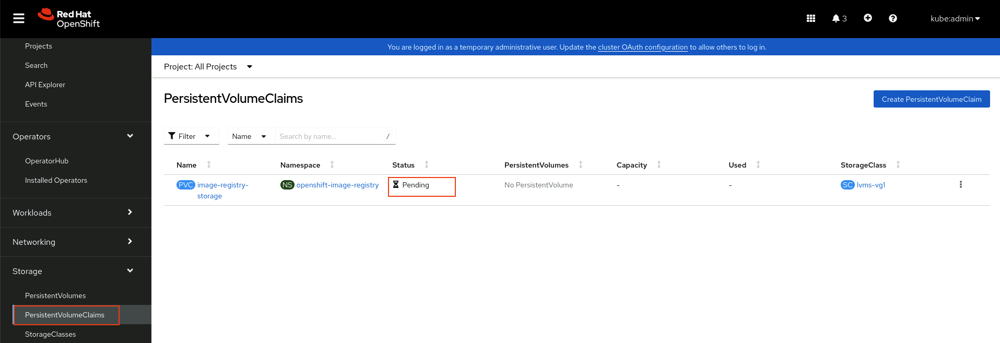

    To resolve this problem, click on the **image-registry-storage** PVC, click on the **YAML tab**, **download** the YAML and **edit** it to:

    - Remove the metadata fields **uid, resourceVersion, creationTimestamp**
    - Remove the **manageFields** section
    - Remove the **status** section
    - Modify the **accessModes** from **ReadWriteMany** to **ReadWriteOnce**

    In the end it should look something like this:  

    

    Go back to the **PersistentVolumeClaim** list and delete the **image-registry-storage** PVC using the **three dots pulldown**.

    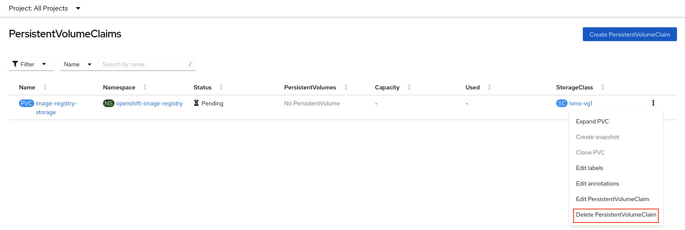

    Use the Create **PersistentVolumeClaim** button to create a new one (the **project** at the top right should still be **openshift-image-registry**). Click on the **Edit YAML** link at the top right of the screen. 

    

    **Replace** the content of the **yaml** with the modified one you edited.

    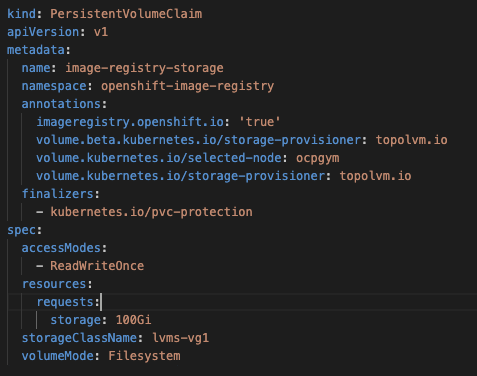

    **Click** the **Create** button at the bottom. The new PVC should immediately go into the **bound** state.

    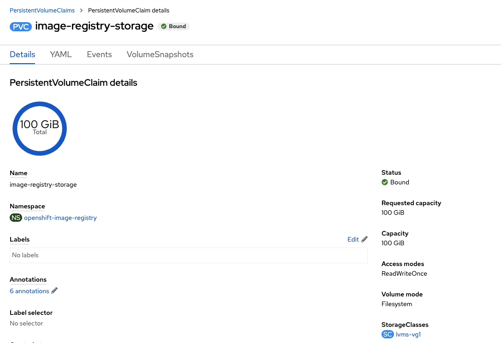

## Install MAS

At this point we are ready to install MAS and this will take more or less an hour.

Before starting this step, make sure you have two things:

- The Entitled Registry (ER) key. With this key you must have access to the Maximo Application Suite and CloudPak for Data images. You can get it by logging into - **[My IBM](https://myibm.ibm.com/dashboard/)** and click on Container Software & Entitlement key

- A MAS license file. This file is named license.dat and you can get it from the License Key Center (First link in the list at this url: **[https://www.ibm.com/support/pages/ibm-support-licensing-start-page](https://www.ibm.com/support/pages/ibm-support-licensing-start-page)**. You can also navigate to **[ https://techzone.ibm.com/collection/mas-manage-sno/resources]( https://techzone.ibm.com/collection/mas-manage-sno/resources)** and click on **Getting Started Guide - Business Partners** for direction to get license file. 


1. Open a terminal using the **Activities** button at the top left of the Bastion desktop. Issue the following commands to get a few files from GitHub

    ```bash
        sudo su –
    ```
    ```bash
        dnf -y install git-all
    ```
    ```bash
        exit
    ```
    ```bash
        git clone https://github.com/evilADevil/mas-techzone
    ```
    ```bash
        cd mas-techzone
    ```
    ```bash
        chmod 755 masinst.sh
    ```

2. In the same **mas-techzone** directory you need to put your license.dat file that you got from the License Key Server.

    Note that you can transfer files from your computer to the bastion when the VPN is active by using SFTP and its IP address (192.168.252.2). The credentials are admin and the vCenter password. An example session looks like this:

    

    You can also use different way to tranfer these file like, uploading in to google drive, box, OneDrive or email from your laptop and download from Bastion server

3. Before starting the installation of MAS, is to customize the masocpl.yml.

    - Replace **your ER key** with your ER key from step 0 above. **Remove less than and greater than symbol as well.**
    - Replace **your license id** with the license id of your license.dat file. You can find out what this is by opening the license file in an editor, and check the first line. The license id will be the second-last number. For example, if your first line is SERVER sls-rlks.... 0272bc34... 27000 then your license id is 0272bc34....
    - You should have these 4 files in the current mas-techzone directory:
        license.dat
        masdevops.yaml
        masinst.sh
        masocpl.yml

    Optionally, you may also want to update the mas_channel, the mas_catalog_version and the mas_app_channel for Manage that you want to install. A list of MAS catalog versions can be found at **[static catalog](https://ibm-mas.github.io/cli/catalogs/#static-catalogs)** .

4. At this point we need to download the OpenShift command line. It is better to download the CLI of the same version of OCP used, 4.12 in this case. Use the following command:

    ```bash
        curl -O https://mirror.openshift.com/pub/openshift-v4/x86_64/clients/ocp/stable-4.12/openshift-client-linux.tar.gz
    ```
    
    then untar the downloaded file in a directory on the path:   

    ```bash
        sudo tar -xf openshift-client-linux.tar.gz -C /usr/sbin
    ```

5. Now we want to log into the Single Node OpenShift cluster using the command line. Click on the **Copy login command** menu item. **Re-authenticate** in case it asks and then **click** on **Display token**.

Copy the login command and issue it in the terminal window.

    ```bash
        oc login --token=sha256~2gFkqieVhsRqtNPgUk2nsZdAvr0d8Ixk0TZGVwv563s --server=https://api.ocpgym.gym.lan:6443
    ```
6. Now we are ready to launch the MAS installation. Issue the following command:

    ```bash
        ./masinst.sh
    ```
7. you can always retrieve the userid and password of the MAS **superuser** from the **masdemo-credentials-superuser** secret in the **mas-masdemo-core** namespace

8. After the installation completes successfully, you may want to log into MAS administration using the MAS superuser credentials. You can find the urls to use by navigating in the OpenShift cluster console to Networking -> Routes of the mas-masdemo-core namespace.

    

First of all click on the **masdemo-api** url (the one in the Location column) and **accept** the **self-signed certificate**. In this way your browser won't have a problem in accessing the MAS APIs later on. Ignore the exception you will get and close that window.

Then go back to the cluster UI and click the **masdemo-admin** url. Log into MAS.

Once in MAS, click on the **Users** tile.

You should see the list of users that have been inherited by the Manage demo data. **Filter** by **Wilson**.

    

**Click** on the **wilson** user. **Edit** this user by using the **pencil** icon at the **top right**. Open the **Login details** section and click **Replace forgotten password**. **Click** on the **Custom** radio button and set a password. Save the changes and close the information dialog that follows.

Wait for the **synchronization** to finish. **Log out** and l**ogin as Wilson**. Accept any self-signed certificate. In the **MAS Navigator** you should see the **Manage** tile and you should be able to launch into it. Hover your mouse on it to show the Launch link.
