# Maximo Application Suite

En este laboratorio obtendrá un recorrido por cómo se pueden utilizar 4 aplicaciones clave dentro de Maximo Application Suite (MAS) para resolver problemas de una situación real en el mundo. Todas las preguntas de L3 Quiz se pueden responder utilizando este laboratorio.

Contenido de cuestionario de L3 indicado con 🟢

## Línea de historia de laboratorio

Una Autoridad de Recursos Hídricos (WRA, por sus siglas en inglés) necesita gestionar los activos de tratamiento de aguas y aguas residuales en múltiples ciudades y regiones para mantener los estándares de calidad del agua.

**Escena 1: Remote Operational Manager supervisa activos en Maximo Monitor**

1.  El gestor de soporte operativo navega a un panel de control de resumen de todas las bombas de esta WRA.
2.  El gestor ve una alerta crítica para una bomba y decide investigar más.
3.  El gestor revisa el historial de mantenimiento del activo.
4.  El gestor supervisa la velocidad de la bomba utilizando los datos del sensor.
5.  El Gestor asigna un propietario para que se encargue del problema de las vibraciones con la bomba.

**Escena 2: Reliability Engineer (RE) visualiza el rendimiento de activos actual y previsto en Maximo Health and Predict**

1.  El RE visualiza las puntuaciones de estado de todas las bombas de esta WRA en una única vista de cuadrícula.
2.  El RE encuentra activos con anomalías pronosticadas antes de su mantenimiento planificado.
3.  El RE investiga además la bomba de bajo rendimiento que se prevé que falle antes de su próximo mantenimiento programado.
4.  El RE revisa la página de detalle del activo y la línea de tiempo del activo

## Script de laboratorio

### Paso 1: Iniciar sesión en Maximo Application Suite Navigator

1.  Haga clic en este [Entorno de demostración de Maximo Application Suite ](https://gtmenable.home.enablement3.gtm-pat.com/)Enlace de URL para iniciar IBM Maximo Application Suite y abrir la página de inicio de sesión.

2.  El **IBM Maximo Application Suite** se abre la página de inicio de sesión en un navegador web Especifique la gestión de Maximo **Nombre** y **Contraseña** y pulse **Iniciar sesión**.

    

     

    Una vez aceptadas las credenciales de inicio de sesión, la aplicación Maximo **Navegador de suites** abre la ventana. Se muestran varias aplicaciones que componen los productos MAS. En esta demostración, el foco estará en Maximo Monitor, Manage, Health y Predict.

    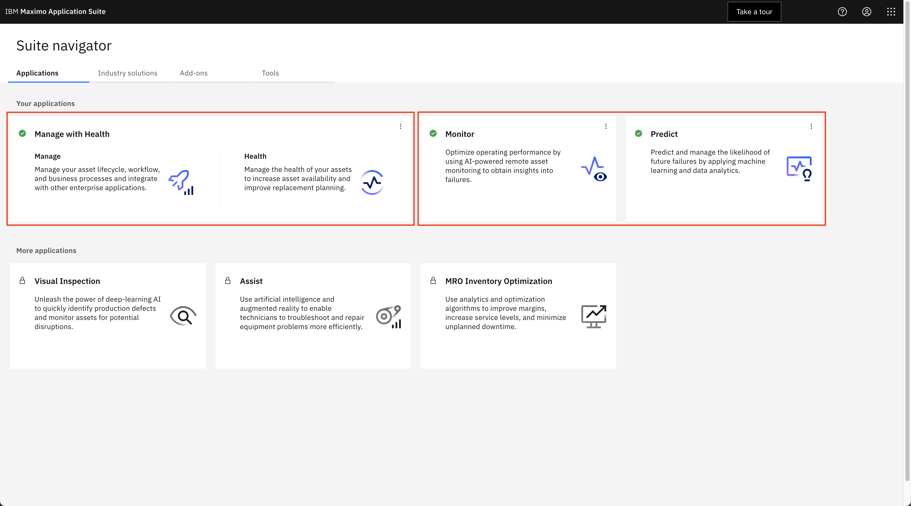

### Paso 2: Revisar alertas de alta gravedad (anomalías) en Monitor

Un Gestor de Operaciones para esta Autoridad de Recursos Hídricos (WRA) necesita ver el estado de los activos de la bomba distribuidos en varias ciudades del mundo. Esta persona tendrá que navegar a Maximo Monitor, ya que proporciona un único lugar para supervisar todos los activos globales de misión crítica de la empresa desde un único panel de control.

**Acciones:**

3.  Desde Maximo **Navegador de suites** , pulse el botón **Monitor** mosaico de aplicación.

    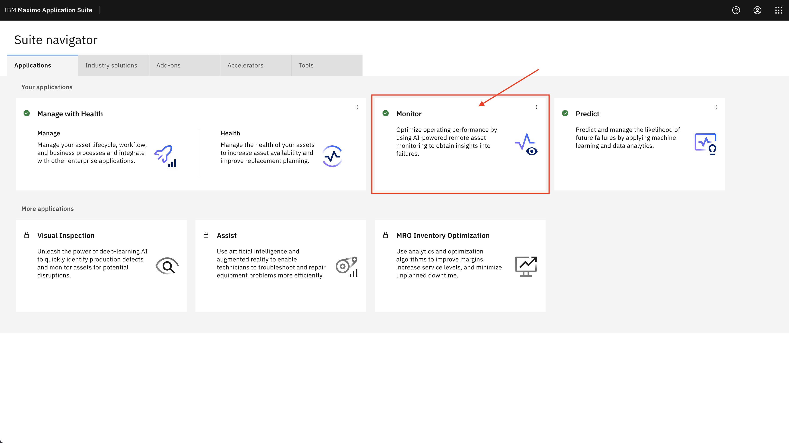

4.  Haga clic en **Monitor** azulejo en el **Bienvenido** que se abre.

    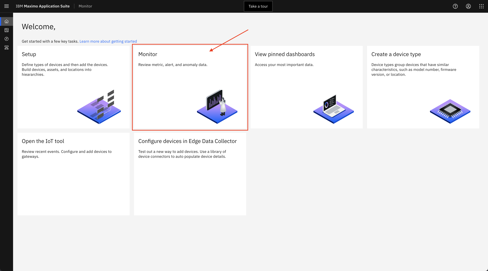

5.  En la barra lateral izquierda, utilice el **flecha derecha (>)** para desplazarse por todas las opciones de Maximo Monitor.

6.  Seleccione la opción **Dispositivos** del menú para ver la lista de tipos de dispositivo en esta WRA.

    

7.  Tipo **"bomba"** en la barra de búsqueda para filtrar los resultados.

    

8.  Pulse en **Bomba** desde la lista filtrada para ver un panel de control de resumen de Pump que aparecerá a la derecha.

9.  Haga clic en la barra lateral izquierda **Ocultar barra lateral** icono para contraerlo.

    

    Maximo Monitor permite a los usuarios categorizar/agrupar tipos de dispositivo de acuerdo con su caso de uso empresarial específico. Por ejemplo, un usuario puede tener un panel de control independiente de acuerdo con el tipo de proveedor de un activo como, por ejemplo, el fabricante de equipo original (OEM) y el no OEM. Al seleccionar el grupo de Pump, el gestor de operaciones está visualizando métricas para todos los activos de Pump con el fin de gestionar y ver el rendimiento de todo el conjunto de activos. De forma predeterminada, el **Alertas de bomba** se abre para visualizar una lista de todas las bombas con alertas en esta operación de empresa.

10. Sobre la **Alertas de bomba** , observe que hay una alerta denominada **VELOCITYX\_Alert\_KMeans\_Anomaly** para **PMPDEVICE005**.

    *   **Nota:** : Las nuevas alertas se generan con frecuencia. Es posible que tenga que filtrar "005" en el cuadro de texto Buscar para encontrarlo. Pero estaremos trabajando con PMPDEVICE005.

    

    Las alertas tradicionales basadas en umbrales pueden ser abrumadoras; Maximo Monitor utiliza alertas de anomalías basadas en IA para eliminar los falsos positivos. El Gestor de operaciones decide investigar más a fondo la bomba PMPDEVICE005.

11. Haga clic en **Mostrar barra lateral** para expandir la barra lateral.

12. Expanda el archivo **Bomba** haciendo clic en el botón **flecha desplegable** para ver la lista completa de bombas en esta categoría.

    

13. Haga clic en **PMPDEVICE005** desde la lista ampliada para que aparezca su panel de control en el lado derecho de la página (si no ve PMPDEVICE005 listado, desplácese por la lista de la bomba hasta que la encuentre). Contrae la barra lateral izquierda para ver el panel de control en la modalidad de vista completa. 🟢

    

14. El **PMPDEVICE005** El panel de instrumentos muestra datos críticos sobre la alerta o alertas de anomalía.

    

    La imagen de la bomba muestra al ingeniero que parte de la bomba está experimentando un problema utilizando el icono de alerta. Esto es increíblemente útil porque es mucho más fácil arreglar un problema con un conocimiento detallado de dónde está y cómo se ve.

15. Desplácese hacia abajo para ver gráficos de series de tiempo de métricas de bomba críticas y alertas para esta bomba.

    Estas series de tiempo se pueden utilizar para investigar cualquier anomalía y tomar las acciones adecuadas. Por ejemplo, si la presión media de la bomba está disminuyendo mientras el flujo promedio aumenta con el tiempo, esto justifica una investigación sobre si hay fugas en la tubería. Basándose en estos conocimientos, un equipo de operaciones puede investigar si las bombas deben ser atendidas con más frecuencia.

    

### Paso 3: Revisar historial de órdenes de trabajo de activos

A continuación, el Administrador de Operaciones quiere ver el historial de mantenimiento de esta bomba para ver si había algún servicio reciente hecho en él que pudiera ser la causa del problema actual.

16. Pulse en la cabecera de la parte superior izquierda para volver a la **Suite Navigator**.

    

17. Haga clic en **Gestionar** azulejo.

    

18. El **Gestionar** se abre a un panel de instrumentos que muestra activos. Haga clic en **Bomba de campo 005**.

    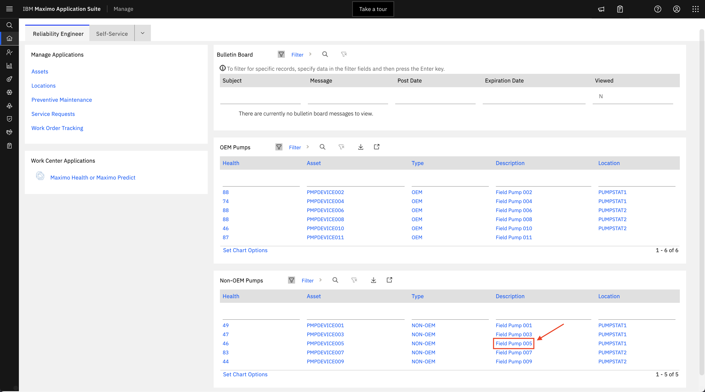

19. Seleccione la opción **Trabajo** y, a continuación, haga clic en el icono de filtro (embudo) para ver las opciones de filtro disponibles.

20. Tipo **"COMP"** en el **Estado** en la caja **Orden de trabajo** para filtrar órdenes de trabajo completadas recientes para esta bomba **(C)**. Prensa **Retorno** en el teclado para aplicar el filtro. En función de cuándo ejecute esta demostración, es posible que no haya ninguna orden de trabajo con un estado de **COMP**.

    

21. Aquí es donde el Administrador de Operaciones puede revisar las órdenes de trabajo completadas previamente para tomar decisiones informadas sobre cómo proceder con cualquier mantenimiento. Supongamos que no vieron ninguna orden de trabajo reciente que parezca relevante.

22. El gestor de operaciones está convencido de que es necesario abrir una nueva solicitud de servicio para la investigación. Volver a la **Dispositivos** de Maximo **Monitor** y seleccione **PMPDEVICE005** para ver su panel de control.

    

### Paso 4: Asignar propietario de servicio

En un escenario real, el Gestor de operaciones volvería a la alerta VELOCITYX en PMPDEVICE005 y asignaría un supervisor de mantenimiento como propietario de esta alerta. Sin embargo, para conservar este caso de uso en el entorno compartido, no se asignará esta alerta. En su lugar, investigaremos más en el Paso 5 a continuación.

23. Se trata de un paso de marcador para mencionar que un gestor de operaciones podría asignar fácilmente un propietario de servicio desde el panel de control del dispositivo.

    

### Paso 5: Ver datos de métrica casi en tiempo real de los sensores de IoT

El Gestor de Operaciones Remotos decide mirar los datos del sensor en tiempo real de VelocityX en la aplicación Monitor para dar seguimiento a la alerta VELOCITYX\_Alert activada por IA para esta bomba.

24. En la barra lateral izquierda, seleccione el **Configuración** opción de menú.

    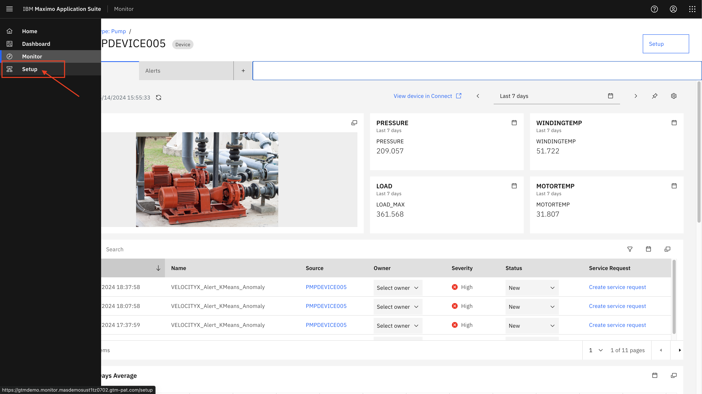

25. Seleccione la opción **Dispositivos** y en la barra de búsqueda bajo **Tipos de dispositivo** tipo **"bomba"**

    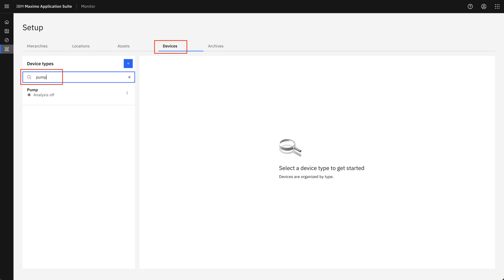

26. Haga clic en **Bomba** de la lista filtrada para ver todos los activos de este grupo. A continuación, pulse **PMPDEVICE005** Hiperenlace de la lista de bombas que aparece a la derecha.

    

27. Haga clic en la flecha hacia abajo junto a **Métrica** y seleccione el **VELOCITYX** del submenú expandido.

    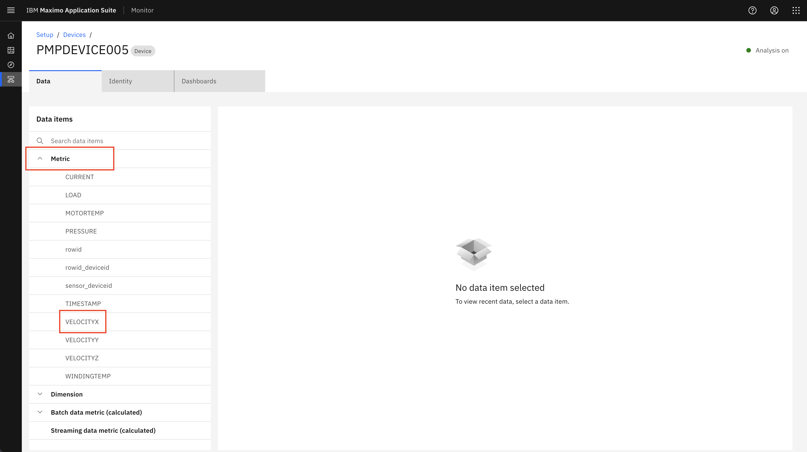

28. Un gráfico de la **VELOCITYX** la serie de tiempo para esta bomba aparece en el lado derecho de la pantalla.

    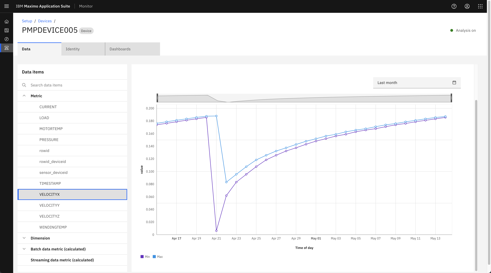

    El vector de velocidad del motor de la bomba es una combinación de velocidad a lo largo de los ejes X, Y y Z. Cuando la velocidad a lo largo de cualquier eje-como la velocidad a lo largo del eje X (o *velocityX* )-experimenta una vibración excepcional (como lo muestran los inconsistentes y valores en este gráfico), hay algo obviamente muy equivocado con el activo.

    Si una máquina está teniendo problemas, a menudo mostrará signos de antemano. Por ejemplo, la velocidad o la temperatura del motor de funcionamiento de una bomba pueden cambiar por una pequeña cantidad antes de que la bomba falle por completo. Estos cambios pueden pasar desapercibidos para un humano, pero Maximo Monitor puede utilizar modelos avanzados de IA como "Detección de anomalías" para observar los datos críticos del sensor. Puede entonces encontrar estos cambios sutiles que a menudo son indicadores de un fracaso inminente. De esta manera, los individuos apropiados pueden ser alertados para tomar medidas preventivas y reducir el costoso tiempo de inactividad.

29. Pulse en la cabecera de la parte superior izquierda para volver a la **Suite Navigator**.

    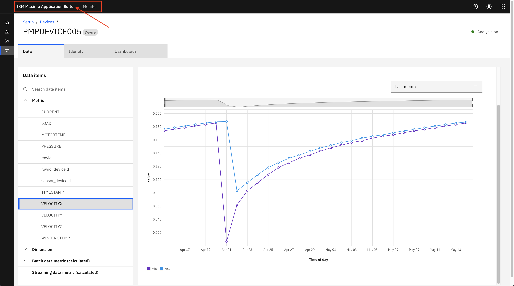

## Maximo Health and Predict

Ahora juegas el papel de un Ingeniero de Fiabilidad que debe investigar todas las bombas similares a la que creó múltiples alertas en la sección anterior. Esto asegurará que no haya anomalías antes de las fechas de mantenimiento planificadas por la misma razón. Maximo Health and Predict puede proporcionar una vista del estado actual de todos los activos de la empresa (incluidas las bombas), así como conocimientos basados en IA en las condiciones futuras proyectadas de dichos activos.

En esta parte de la demostración, el Ingeniero de fiabilidad identificará la puntuación de salud de PMPDEVICE005 y las bombas similares que necesitan atención, investigará esos activos y finalmente tomará medidas para evitar el tiempo de inactividad no planificado.

30. Haga clic en **Salud** Mosaico de aplicaciones de Maximo **Navegador de suites**.

    

31. La salud de Maximo **Activos** se abre.

    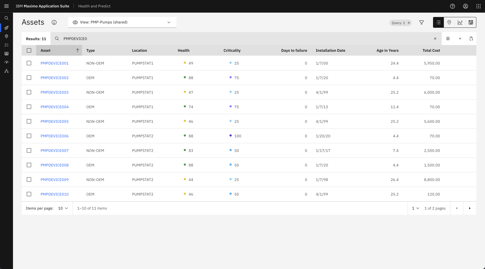

    La página Asset Health de Maximo proporciona una vista universal de todos los activos gestionados de la Autoridad de recursos de agua. Esto es valioso para el equipo de fiabilidad, ya que les permite ver los datos de TI (de Maximo Manage) y los datos de tecnología operativa (de Maximo Monitor) juntos en una sola vista. Muchas fallas no pueden prevenirse con estrategias tradicionales de mantenimiento preventivo basadas en el tiempo o únicamente basadas en datos de sensores. Individualmente, estos datos sólo proporcionan parte de la imagen. Los conocimientos sobre los problemas de mantenimiento y las solicitudes de servicio anteriores, la antigüedad de un activo y las inversiones históricas mejoran las "condiciones sentidas" de un activo. Esta es la alimentación que proporcionan Maximo Health y Manage.

### Paso 6: Puntuación de estado de activo

Con cientos de activos desplegados en cualquier operación compleja dada, Maximo Health proporciona flexibilidad para generar y personalizar diferentes vistas de datos de activos para facilitar la identificación de activos críticos. Los usuarios tienen la opción de añadir y mover columnas, filtrar, buscar y ordenar según su rol y responsabilidades.

En los siguientes pasos, el Ingeniero de fiabilidad utilizará una vista preconfigurada que les ayuda a hacer que la supervisión de rendimiento de la bomba repetida sea fácil y rápida. Esta vista puede filtrar las bombas basándose en atributos como *clase de anomalía* o *sitio* , y puede ordenar bombas por OEM/no OEM, ubicación, puntuación de salud, etc.

En esta demostración, de forma predeterminada, el **PMP-Bombas (compartidas)** se selecciona y los activos se filtran en el término de búsqueda **PMPDEVICE0**. El ingeniero puede ver dos columnas con datos calculados ( **Salud** y **Días de error** ). Las puntuaciones de salud proporcionan un enfoque potente y simplista para combinar y destilar las lecturas de evaluación de condiciones de un activo y el historial de mantenimiento histórico en una escala numérica simple de color. Similarmente, *días de error* puede ayudar a identificar de forma proactiva los activos que pueden fallar en los próximos días o semanas, lo que permite a los ingenieros realizar el mantenimiento correctivo necesario antes de que se produzca el tiempo de inactividad. El ingeniero de fiabilidad puede ver que el **Salud** y **Días de error** Las puntuaciones de varias bombas para medir el riesgo de múltiples fallas en la bomba. Un menor número de puntaje de Salud significa salud de activos deteriorados.

Cabe señalar que la tolerancia al riesgo puede variar entre las industrias, los tipos de activos y las empresas. El supervisor permite a las empresas definir los rangos de puntuación de salud específicos de sus niveles de tolerancia de operaciones de negocio y con su propio esquema de color.

32. Haga clic en **Mapa** situado en la parte superior derecha de la pantalla para ver la puntuación de salud de cada una de estas bombas en una vista de mapa.

    

    Ver cómo los activos se distribuyen espacialmente, junto con su grado de puntuación de salud, ayuda a los Ingenieros de Fiabilidad en la identificación e investigación de activos en riesgo. Esto es particularmente cierto en la industria de servicios públicos, donde los activos se extienden típicamente sobre una gran área geográfica.

    

### Paso 7: Cola de trabajo

El ingeniero de fiabilidad continúa su investigación para determinar qué bombas de agua se espera que fallen pronto. Estos son los activos que son más propensos a experimentar un tiempo de inactividad no planificado. Sin embargo, el ingeniero no tiene un plan de mantenimiento para abordar el fracaso todavía. La forma más fácil de hacerlo es utilizar la función de cola de trabajos incorporada en Maximo Health and Predict.

33. Seleccione la opción **Colas de trabajo** de la barra lateral izquierda para ver las colas disponibles.

    

    Las colas de trabajo son vistas preconfiguradas diseñadas para ayudar a los usuarios a encontrar lo que buscan y gestionar sus actividades diarias. Estos son particularmente valiosos para un Ingeniero de Fiabilidad que necesita abordar un problema específico, como una planta de tratamiento de agua tratando de evitar el tiempo de inactividad no planificado.

    Hay varias colas de trabajo incluidas con Maximo Health and Predict. Estos incluyen: **Alta probabilidad de fallo** , **Salud baja** , y **Anomalía antes del mantenimiento preventivo (MP)**. También hay colas de trabajo que muestran activos con datos que faltan. Las colas de trabajo que describen los datos que faltan son extremadamente útiles para un ingeniero de fiabilidad, ya que pueden ayudar a identificar las lagunas en los datos necesarios para crear puntuaciones de salud o modelos de anomalía predictiva.

34. Seleccione la opción **Anómalo antes del MP** cola de trabajos para ver todos los activos que se prevé que fallen antes de que se haya planificado el trabajo de mantenimiento planificado para ellos. Es fundamental que el Ingeniero de fiabilidad se dirija a estos activos para evitar el tiempo de inactividad.

    

35. Esta cola de trabajos muestra todos los activos pronosticados para fallar antes de su mantenimiento preventivo planificado (PM). Pulse el icono de búsqueda (la lupa) en la parte superior derecha y tipo **"pmp"**. Prensa **Retorno** en el teclado para aplicar este filtro y ver una lista de los activos de la bomba.

    

36. Hay varias bombas que tienen una anomalía prevista antes de su próxima fecha de mantenimiento planificada, y todas ellas son bombas no OEM. Haga clic en **PMPDEVICE005** de esta lista de colas de trabajo.

    

### Paso 8: Revisión detallada de la puntuación de salud de la bomba

37. El **PMPDEVICE005** Se abre la página de detalles de salud de

    

    La página de detalles de salud del activo PMPDEVICE005 es una herramienta increíblemente útil para investigar las condiciones actuales y futuras de una bomba. El ingeniero de fiabilidad puede encontrar toda la información del activo presentada en una sola página y en tablas, gráficos y gráficos fáciles de leer.

    Los indicadores clave de rendimiento (ICR) en la parte superior de la página Detalles de estado de activo proporcionan una instantánea del estado actual de esta bomba. Se lista la puntuación de salud de la bomba. Si se calculó una puntuación de salud anterior, las tarjetas de título también muestran el aumento o disminución de la salud de los activos desde el último cálculo.

    Dado que se trata de un entorno de demostración en directo y dinámico que también utilizan otros vendedores, los porcentajes que se muestran en este script pueden variar de lo que se puede ver en el entorno de demostración. Por lo tanto, este script intenta ser genérico en el idioma.

    Al pasar el ratón sobre los títulos de estos cuadros de ICR, se proporciona una breve descripción sobre la métrica correspondiente. Concretamente:

    1.  **Puntuación de salud:** La condición general del activo en una escala definida por el usuario. Esto ayuda a medir las necesidades generales de mantenimiento del activo.
    2.  **Criticidad:** La importancia de un activo para su negocio. Esto ayuda a priorizar las actividades de mantenimiento y reparación.
    3.  **Riesgo:** La probabilidad de un fallo de alto impacto. Esto ayuda a identificar posibles problemas antes de que se produzcan.
    4.  **Fin de vida:** La probabilidad de un fallo inminente de fin de vida. Esto ayuda a planificar la sustitución del activo de forma oportuna.
    5.  **Edad efectiva:** La edad efectiva es la edad real relativa a la puntuación de salud actual del activo. Esto ayuda a determinar la vida útil restante del activo.
    6.  **Siguiente PM:** Los días hasta la próxima generación planificada de una orden de trabajo de mantenimiento preventivo (MP). La tarjeta está vacía si la fecha de generación es la fecha actual o no se ha planificado ninguna otra generación de órdenes de trabajo. Esto ayuda a garantizar que las órdenes de trabajo de MP se generen de forma oportuna.
    7.  **MRR:** La proporción de mantenimiento a sustitución (MRR) para el activo. El MRR se calcula dividiendo el coste total actual de todo el mantenimiento para el activo, incluidas las piezas y la mano de obra, por el coste de sustitución. Si el porcentaje es 100% o superior, el coste total actual del activo es mayor que el coste para sustituir el activo.
    8.  **Siguiente fallo:** La hora hasta que se prevé que el activo falle, de acuerdo con un modelo predictivo. Esto ayuda a priorizar acciones y planificar el mantenimiento de activos.

    Debajo de la sección de KPI, el Ingeniero de fiabilidad puede ver más información acerca de esta bomba, que viene directamente del sistema Enterprise Asset Management (EAM) de la Autoridad de Recursos Hídricos (en este caso, Maximo Manage).

38. Desplácese hasta el **Datos sanitarios**. Esta sección muestra un desglose de los factores y factores de la puntuación de la salud que proporcionan información sobre lo que está causando la mala salud de esta bomba.

    

    Para este activo y activos en el mismo grupo, el Ingeniero de fiabilidad puede ver que la puntuación de salud es un promedio ponderado de órdenes de trabajo abiertas, vida útil restante y salud de medidor.

### Paso 9: Explorar acciones disponibles

39. Una vez que el Ingeniero de Fiabilidad decide qué acción tomar, puede tomar acción en la parte superior de la página. Pueden crear una solicitud de servicio, crear una orden de trabajo, volver a calcular una puntuación de salud o editar el registro del activo de origen. **NO tomaremos ninguna acción en el entorno compartido.**

    

40. El ingeniero de fiabilidad finalmente puede crear y presentar un informe detallado de sus resultados sobre el estado futuro actual y predicho de PMPDEVICE005 (y bombas similares) al gestor de operaciones.

## Predicción de Maximo

Maximo Predict incluye plantillas que ayudan a los científicos de datos empresariales a iniciarse con modelos de creación para proyectar días en anomalía, calcular la probabilidad de anomalía, detectar anomalías y generar una curva de vida de activos basada en el despliegue de un activo y fechas de jubilación. Estas plantillas incluyen muchos algoritmos, y los científicos de datos pueden seleccionar el que mejor se ajuste a sus datos y necesita conducir un resultado óptimo.

Además, Maximo Application Suite incluye Watson Studio y Watson Machine Learning, que se pueden utilizar para crear, entrenar y mantener modelos predictivos si se necesita una solución más personalizada.

41. Desplácese hacia abajo y pulse **Previsiones** para expandir esta pestaña.

    

42. El **Previsiones** mostrando los KPI predictivos de la bomba seleccionada y los gráficos de probabilidad de anomalía.

    Información breve sobre el contenido de cada azulejo se puede encontrar al pasar el ratón sobre el título del azulejo.

    

### Paso 10: Modelo de anomalía pronosticada

El modelo de IA predice que esta bomba fallará dentro de un cierto número de días, más o menos un período especificado. Si el historial de datos de este activo es suficientemente rico, un científico de datos también puede crear modelos predictivos para modalidades de anomalía específicas. Ayuda a conocer la probabilidad de falla junto con la razón de falla más probable (modo de falla). Por ejemplo, conocer información como "hay un 40% de probabilidad de que la bomba falle dentro de los próximos 30 días debido a la falla del motor" es muy útil. En este caso, el modelo buscará una secuencia de eventos que condujeron a este modo de falla y proporcionar la probabilidad de falla de la bomba debido a su burnout motor. De esta manera, ayuda a planificar acciones de mantenimiento preventivo.

43. El calendario de los datos de formación en el **Tiempo estimado de anomalía** teja puede ayudar a decidir si y cuándo debe reformarse el modelo de IA.

    

44. En el **Probabilidad de fallo** teja, observe la probabilidad de que la modalidad de anomalía seleccionada se produzca en la predicción seleccionada **Ventana de tiempo** (3 días por defecto, como se muestra en la parte inferior izquierda de este azulejo). Puede ver que esta bomba tiene un 1% de probabilidad de fallar en los próximos tres días (basado en la captura de pantalla a continuación). 🟢

    

45. Desplácese hacia abajo hasta el **Tendencia de probabilidad de fallo**. Esta tarjeta muestra el historial de probabilidad de anomalía para cada modalidad, lo que indica cómo la probabilidad de anomalía ha cambiado con el tiempo.

    

46. Desplácese hacia abajo hasta el **Factores que contribuyen a fallos**. Muestra qué factores de los datos de formación tuvieron el mayor impacto en los fallos. Esto da una idea de lo que podría causar fallas futuras.

    

47. Desplácese hasta el **Detección de anomalías** y **Historial de detección de anomalías** Las tarjetas que muestran las puntuaciones de anomalía para esta bomba, así como cuando se cruzó el valor de umbral (línea de puntos rojos en el **Historial de detección de anomalías** gráfico de la serie temporal).

    

### Paso 11: Línea de tiempo del activo

55. Desplácese hacia abajo y pulse **Calendario de activos** para expandir esta pestaña.

    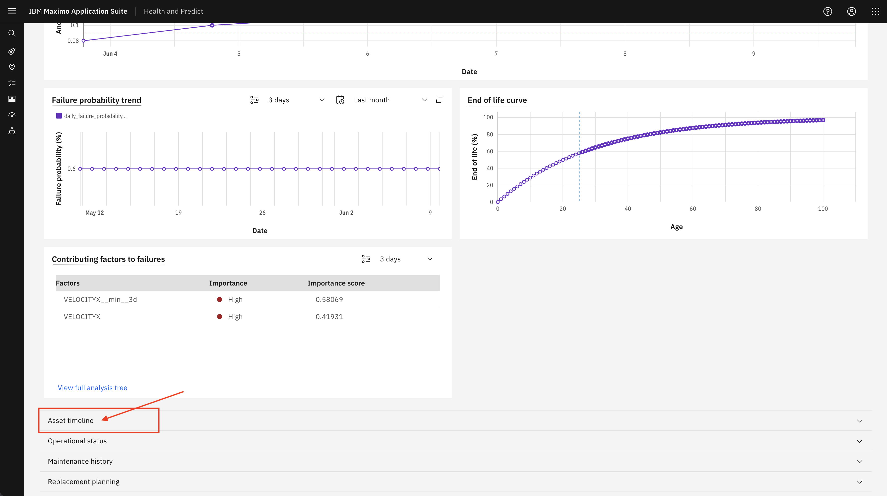

56. El **Calendario de activos** proporciona varias piezas de información clave sobre este activo dentro de un solo gráfico. 🟢

    Mirando esta línea de tiempo, la bomba seleccionada tiene una fecha de falla prevista (PF) que ocurrirá antes de su próxima fecha programada de mantenimiento preventivo (PM). Otra información del gráfico, como el orden de trabajo y las fechas de inspección anteriores, proporciona información valiosa sobre la historia del activo y puede informar la toma de decisiones sobre qué tipo de acción tomar.

    

## Observaciones finales

Esta demostración de extremo a extremo ha mostrado cómo un Operations Manager puede utilizar la detección de anomalías de IA para monitorear todas las bombas de su empresa en tiempo casi real, eliminando las alertas falsas positivas. Esta persona ha podido investigar un activo en problemas y enviar una solicitud de servicio utilizando Maximo Monitor y Maximo Manage.

Esta demostración también ha mostrado cómo las empresas pueden detectar las condiciones futuras actuales y predichas de miles de activos a escala utilizando Maximo Manage and Predict, lo que garantiza que los equipos operativos no estén más o menos manteniendo activos. A medida que los usuarios se dirigen a los activos en una cola de trabajos, pueden proporcionar a sus organizaciones un valor tremendo reduciendo el tiempo de inactividad, ahorrando en costes de mantenimiento y operativos y aumentando los ingresos.
