# Maximo Application Suite

In this lab you will get a tour of how 4 key applications within Maximo Application Suite (MAS) can be used to troubleshoot a real world situation. All L3 Quiz questions can be answered using this lab.

HEADS UP! L3 Quiz Content denoted with 🟢

## Lab Story Line

A Water Resource Authority (WRA) needs to manage water and wastewater treatment assets across multiple cities and regions to maintain water quality standards.

**Scene 1: Remote Operational Manager monitors assets in Maximo Monitor**

1. The Operational Support Manager navigates to a summary dashboard of all the pumps in this WRA.
2. The Manager sees a critical alert for a pump and decides to investigate further.
3. The Manager reviews the asset’s maintenance history.
4. The Manager monitors the pump's velocity using the sensor data.
5. The Manager assigns an owner to take care of the vibration issue with the pump.

**Scene 2: Reliability Engineer (RE) views current and predicted asset performance in Maximo Health and Predict**

1. The RE views the health scores of all the pumps in this WRA in a single grid view.
2. The RE find assets with predicted failures before their planned maintenance.
3. The RE further investigates the underperforming pump that is predicted to fail before its next
   scheduled maintenance.
4. The RE reviews the asset detail page and the asset timeline

## Lab Script

### Step 1: Log into the Maximo Application Suite Navigator

1. Click on this [Maximo Application Suite Demo Environment](https://gtmenable.home.enablement3.gtm-pat.com/) URL link to launch IBM Maximo Application Suite and bring up the login page.

2. The **IBM Maximo Application Suite** login page opens in a web browser. Enter the Maximo Manage **Username** and **Password** and click **Log in**.

   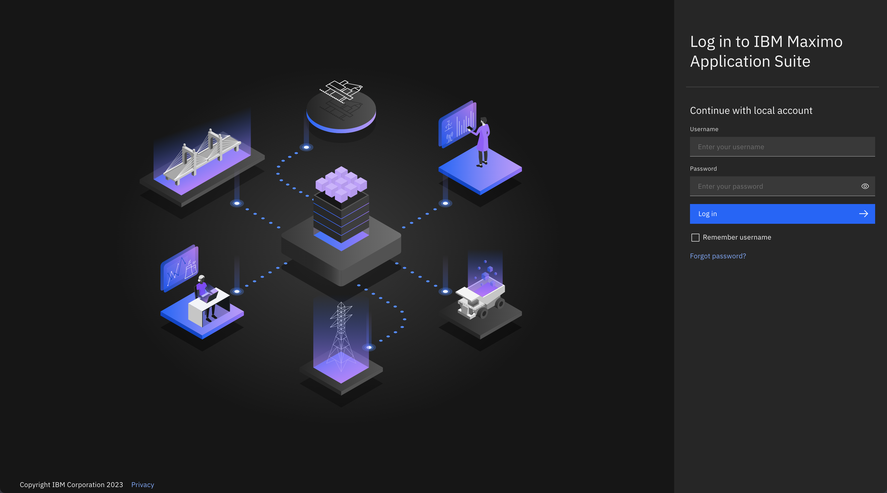
    
   Once the login credentials are accepted, the Maximo Application **Suite navigator** window opens. Several applications that make up the MAS products are displayed. In this demo, the focus will be on Maximo Monitor, Manage, Health, and Predict.

   

### Step 2: Review High Severity Alerts (Anomalies) in Monitor

An Operations Manager for this Water Resource Authority (WRA) needs to view the status of pump assets spread across multiple cities worldwide. This person will need to navigate to Maximo Monitor, as it provides a single place to monitor all enterprise mission-critical global assets from a single dashboard.

**Actions:**

3. From the Maximo **Suite navigator**, click the **Monitor** application tile.

   

4. Click the **Monitor** tile on the **Welcome** screen that opens.

   

5. On the left sidebar, use the **right arrow (>)** icon to scroll all the Maximo Monitor options.
6. Select the **Devices** tab from the menu to view the list of device types in this WRA.

   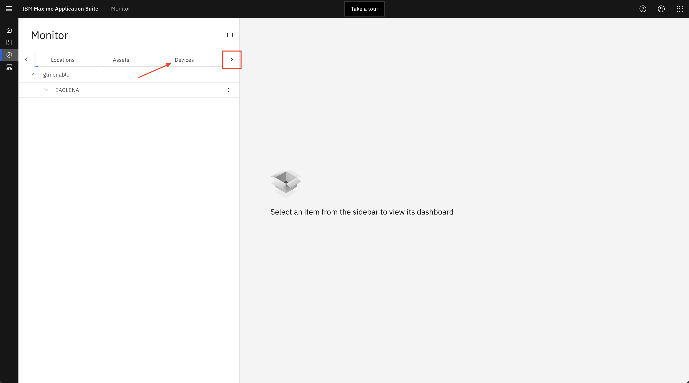

7. Type **“pump”** in the search bar to filter the results.

   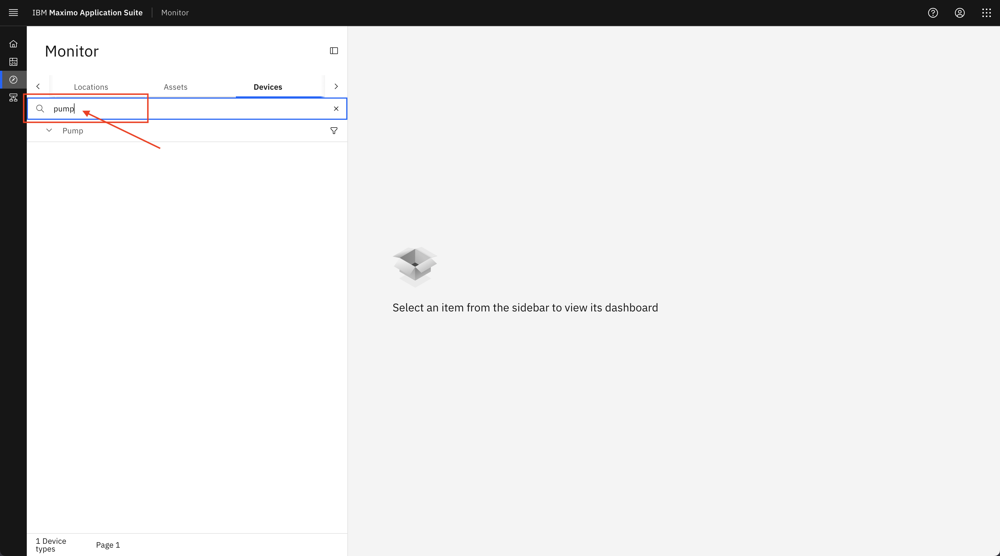

8. Click **Pump** from the filtered list to view a Pump summary dashboard that will appear on the right.

9. Click on the left side bar’s **Hide sidebar** icon to collapse it.

   

    Maximo Monitor allows users to categorize/group device types according to their specific business use case. For example, a user can have a separate dashboard according to an asset’s supplier type such as Original Equipment Manufacturer (OEM) and non-OEM. By selecting the Pump group, the operations manager is viewing metrics for all Pump assets in order to manage and view performance of that entire asset set together. By default, the **Pump Alerts** tab opens to display a list of all pumps with alerts across this enterprise operations.

10. On the **Pump Alerts** tab, notice that there is an alert named **VELOCITYX_Alert_KMeans_Anomaly** for **PMPDEVICE005**.
    - **Note**: New alerts are generated frequently. You may need to filter on "005" in the Search text box to find it. But we will be working with PMPDEVICE005.

    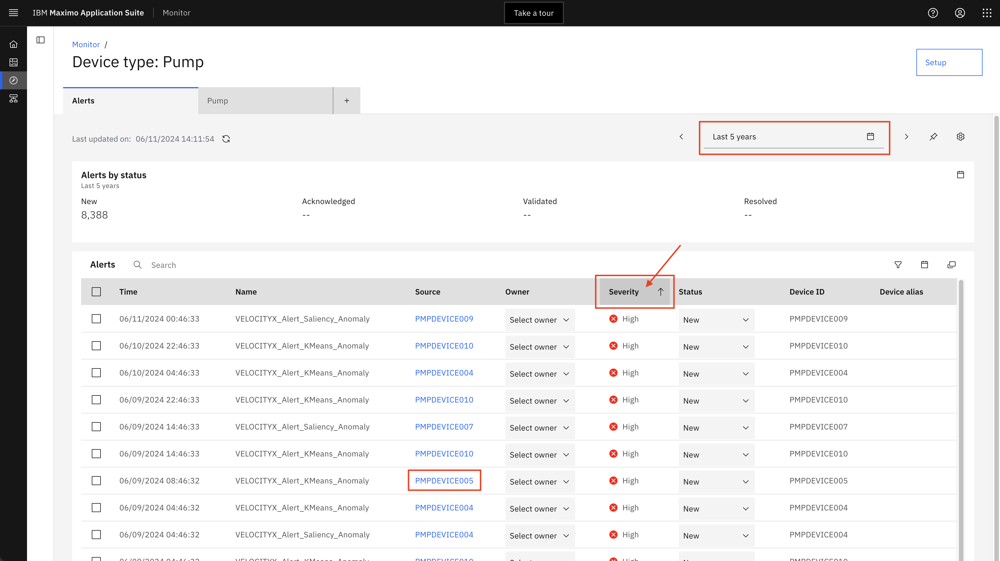

    Traditional threshold-based alerts can be overwhelming; Maximo Monitor uses AI-powered anomaly alerts to remove the false positives. The Operations Manager decides to investigate the PMPDEVICE005 pump further.

11. Click on the **Show sidebar** icon to expand the sidebar.
12. Expand the **Pump** category by clicking on the **dropdown arrow** to see the full list of pumps in this category.

    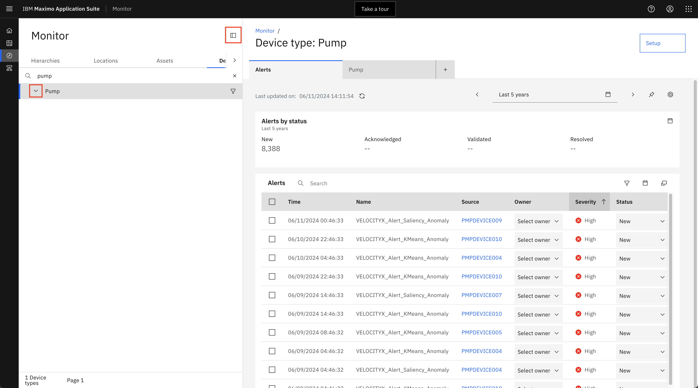

13. Click on the **PMPDEVICE005** from the expanded list to bring up its dashboard on the right side of the page (if you don't see PMPDEVICE005 listed, scroll down the pump list until you find it). Collapse the left sidebar to view the dashboard in the full-view mode. 🟢

    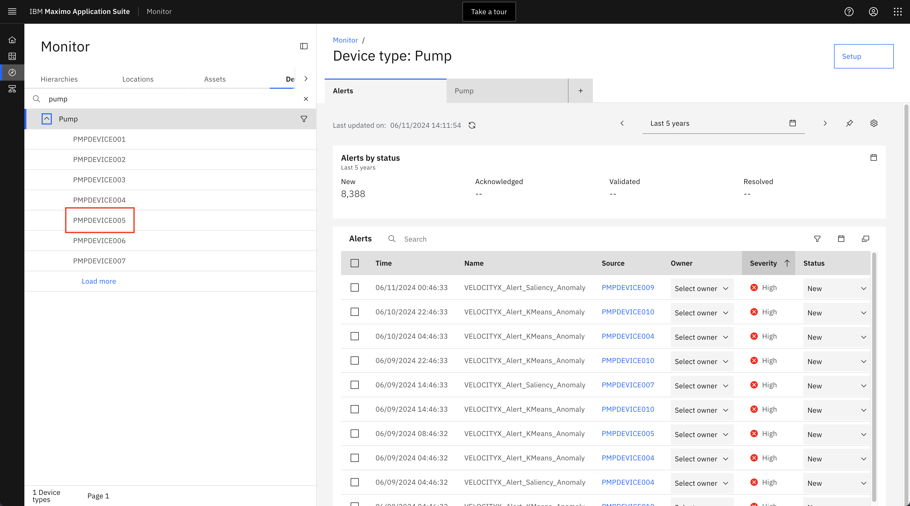

14. The **PMPDEVICE005** dashboard displays critical data about its anomaly alert(s).

    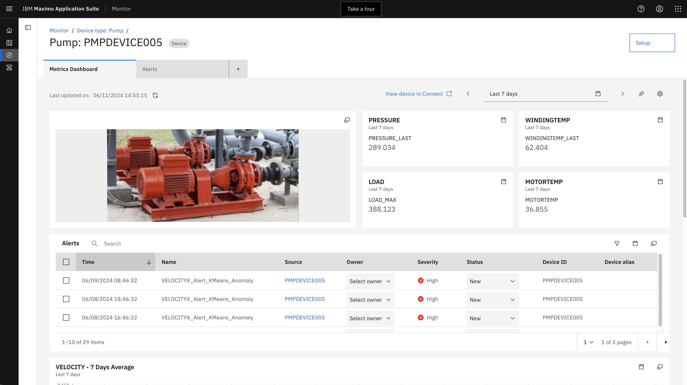

    The picture of the pump shows the engineer which part of the pump is experiencing a problem using the alert icon. This is incredibly helpful because it is much easier to fix a problem with detailed knowledge of where it is and what it looks like.

15. Scroll down to view time series graphs of critical pump metrics and alerts for this pump.

    These time series can be used to investigate any anomalies and take appropriate actions. For example, if the average pump pressure is declining while the average flow is increasing over time, this warrants an investigation into whether there are leaks in the pipeline. Based on such knowledge, an operations team can then investigate whether the pumps need to be serviced more frequently.

    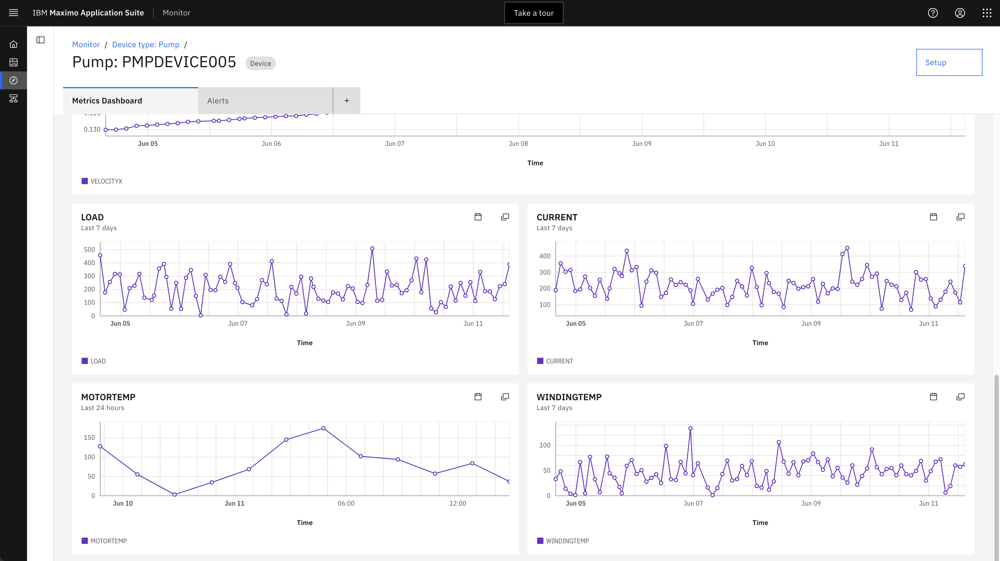

### Step 3: Review Asset Work order history

Next, the Operations Manager wants to look at this pump's maintenance history to see if there were any recent services done on it that could be the cause of the current problem.

16. Click on the header in the top-left to return to the **Suite Navigator**.

    

17. Click on the **Manage** tile.

    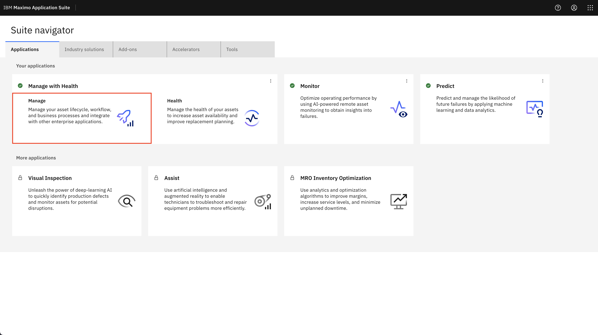

18. The **Manage** application opens to a dashboard that shows assets. Click on **Field Pump 005**.

    

19. Select the **Work** tab and then click on the filter icon (funnel) to see the available filter options.
20. Type **“COMP”** in the **Status** box in the **Work Order** section to filter recent completed work orders for this pump **(C)**. Press **Return** on the keyboard to apply the filter. Depending on when you run this demo, there may not be any work orders with a status of **COMP**.

    

21. This is where the Operations Manager can review previously completed work orders to make informed decisions on how to proceed with any maintenance. Let’s assume they did not see any recent work orders that seem relevant.

22. The Operations Manager is convinced a new Service Request needs to be opened for investigation. Return to the **Devices** tab in Maximo **Monitor** and select **PMPDEVICE005** to view its dashboard.

    

### Step 4: Assign Service Owner

In a real-world scenario, the Operations Manager would return to the VELOCITYX alert on PMPDEVICE005 and assign a Maintenance Supervisor as an owner of this alert. However, to preserve this use case in the shared environment, we will not assign this alert. Instead, we will investigate further in Step 5 below.

23. This is a placeholder step to mention that an Operations Manager could easily assign a service owner from the device dashboard.

    

### Step 5: View near-real-time Metric data from IoT sensors

The Remote Operations Manager decides to look at VelocityX real-time sensor data in the Monitor application to follow up on the AI-triggered VELOCITYX_Alert for this pump.

24. From the left sidebar, select the **Setup** menu option.

    

25. Select the **Devices** tab and in the search bar under **Device types** type **“pump”**

    

26. Click on the **Pump** option from the filtered list to see all assets in this group. Then click the **PMPDEVICE005** hyperlink from the list of pumps that appears on the right.

    

27. Click on the down-arrow beside **Metric** and select the **VELOCITYX** option from the expanded sub-menu.

    

28. A graph of the **VELOCITYX** time series for this pump appears on the right side of the screen.

    

    The pump’s motor velocity vector is a combination of velocity along the X, Y, and Z axes. When velocity along any axis—such as velocity along the X-axis (or *velocityX*)—experiences exceptional vibration (as shown by the inconsistent y-values in this graph), there is something obviously very wrong with the asset.

    If a machine is having problems, it will often show signs beforehand. For example, a pump's operating motor speed or temperature may change by a small amount before the pump fails completely. These changes may go unnoticed by a human, but Maximo Monitor can use advanced AI models like “Anomaly detection” to look at critical sensor data. It can then find these subtle changes that are often indicators of an imminent failure. This way, appropriate individuals can be alerted to take preventative action and reduce costly downtime.

29. Click on the header in the top-left to navigate back to the **Suite Navigator**.

    

## Maximo Health and Predict

You will now play the role of a Reliability Engineer who must investigate all pumps similar to the one that created multiple alerts in the previous section. This will ensure that there are no failures before the scheduled maintenance dates for the same reason. Maximo Health and Predict can provide a view of the current state of all enterprise assets (including pumps), as well as AI-powered insights into the projected future conditions of those assets.

In this part of the demo, the Reliability Engineer will identify the health score of PMPDEVICE005 and similar pumps that need attention, investigate those assets, and finally take action to avoid unplanned downtime.

30. Click on the **Health** application tile from the Maximo **Suite navigator**.

    

31. The Maximo Health **Assets** page opens.

    

    The Maximo Health Asset page provides a universal view of all of the Water Resource Authority’s managed assets. This is valuable to the reliability team as it allows them to see both IT data (from Maximo Manage) and Operational technology data (from Maximo Monitor) together in a single view. Many failures cannot be prevented with traditional time-based preventive maintenance strategies or solely based on sensor data. Individually, this data only provides part of the picture. Insights on past maintenance issues and service requests, the age of an asset, and historical investments enhances the "sensed conditions" of an asset. This is the power that Maximo Health and Manage provide.

### Step 6: Asset Health Score

With hundreds of assets deployed in any given complex operation, Maximo Health provides flexibility to generate and customize different views of asset data to make it easier to identify critical assets. Users have the option to add and move columns, filter, search, and sort according to their role and responsibilities.

In the next steps, the Reliability Engineer will utilize a pre-configured view that helps them make repeated pump performance monitoring easy and quick. This view can filter pumps based on attributes like *failure class* or *site*, and it can sort pumps by OEM/non-OEM, location, health score, etc.

In this demo, by default, the **PMP-Pumps (shared)** view is selected and assets are filtered on the search term **PMPDEVICE0**. The engineer can see two columns with calculated data (**Health** and **Days to failure**). Health scores provides a powerful and simplistic approach to combine and distill an asset’s condition assessment readings and historic maintenance history in a simple color-graded numeric scale. Similarly, *days to failure* can help proactively identify assets that are likely to fail in the next few days or weeks, allowing engineers to perform necessary corrective maintenance before any downtime occurs. The Reliability Engineer can look at that the **Health** and **Days to failure** scores for various pumps to gauge the risk of multiple pump failures. A lower number of Health score means deteriorated asset health.

It should be noted that risk tolerance can vary among industries, asset types, and enterprises. Monitor allows companies to define the health scoring ranges specific to their business operations tolerance levels and with their own color scheme.

32. Click the **Map** icon at the top right of the screen to view the health score of each of these pumps on a map view.

    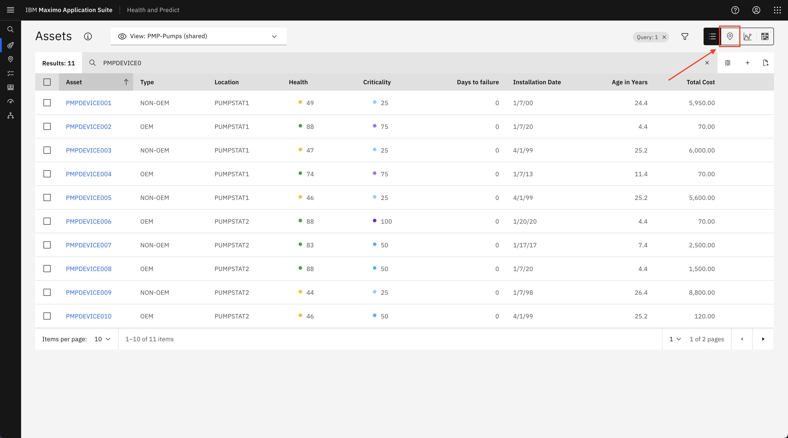

    Seeing how the assets are spatially distributed, along with their health score grade, assists the Reliability Engineers in identifying and investigating assets at risk. This is particularly true in the utilities industry, where assets are typically spread over a large geographical area.

    

### Step 7: Work Queue

The Reliability Engineer continues their investigation to determine which water pumps are expected to fail soon. These are the assets that are most likely to experience unplanned downtime. However, the engineer does not have a maintenance plan to address the failure yet. The easiest way to do this is to use the work queue feature built into Maximo Health and Predict.

33. Select the **Work queues** option from the left sidebar to see the available queues.

    

    Work queues are preconfigured views designed to help users find what they’re looking for and to manage their day-to-day activities. These are particularly valuable to a Reliability Engineer who needs to address a specific problem, like a water treatment plant trying to avoid unplanned downtime.

    There are several work queues included with Maximo Health and Predict. These include **High probability of failure**, **Low health**, and **Failing before Preventative Maintenance (PM)**. There are also work queues that show assets with missing data. Work queues describing missing data are extremely useful to a reliability engineer as they can help identify gaps in data necessary to create health scores or predictive failure models.

34. Select the **Failing before PM** work queue to see all the assets that are predicted to fail before planned maintenance work is scheduled for them. It is critical for the Reliability Engineer to address these assets to avoid downtime.

    

35. This work queue shows all the assets predicted to fail before their scheduled Preventive maintenance (PM). Click the search icon (the magnifying glass) at the top-right and type **“pmp”**. Press **Return** on the keyboard to apply this filter and see a list of pump assets.

    

36. There are multiple pumps that have a predicted failure before their next planned maintenance date, and they are all non-OEM pumps. Click on **PMPDEVICE005** from this work queue list.

    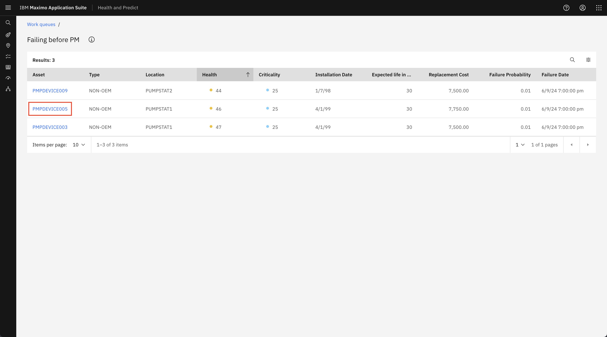

### Step 8: Detailed Review of the Pump’s Health Score

37. The **PMPDEVICE005** asset’s health detail page opens.

    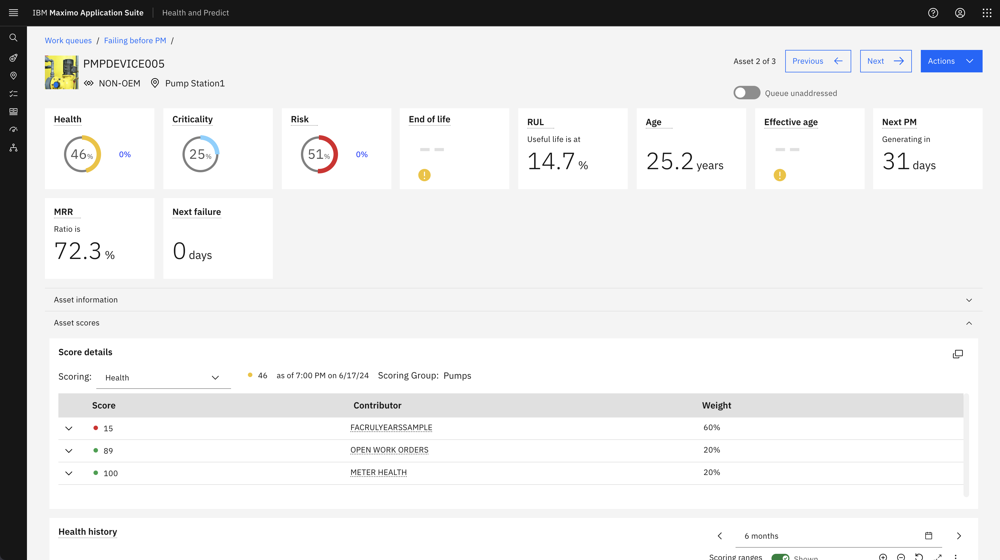

    The PMPDEVICE005 asset’s health details page is an incredibly useful tool for investigating a pump’s current and predicted future conditions. The Reliability Engineer can find all the asset’s information presented on a single page, and in easy-to-read tables, charts, and graphs.

    The Key Performance Indicators (KPIs) at the top of the Asset Health details page provide a snapshot of the current state of this pump. The health score of the pump is listed. If a previous health score was calculated, the title cards also show the increase or decrease in asset health since the last calculation.

    Because this is a live and dynamic demo environment that is also used by other sellers, the percentages shown in this script may vary from what you may see in the demo environment. Therefore, this script attempts to be generic in language.

    Hovering over the titles in these KPI tiles provides a brief description about the corresponding metric. Specifically:

    1. **Health Score:** The overall condition of the asset on a user defined scale. This helps to gauge the general maintenance needs of the asset.
    2. **Criticality:** The importance of an asset to its business. This helps to prioritize maintenance and repair activities.
    3. **Risk:** The probability of a high-impact failure. This helps to identify potential problems before they occur.
    4. **End of life:** The probability of an imminent end-of-life failure. This helps to schedule replacement of the asset in a timely manner.
    5. **Effective age:** Effective age is the actual age relative to the asset's current health score. This helps to determine the remaining useful life of the asset.
    6. **Next PM:** The days until the next scheduled generation of a preventive maintenance (PM) work order. The card is empty if the generation date is the current date or no other work order generations are scheduled. This helps to ensure that PM work orders are generated in a timely manner.
    7. **MRR:** The maintenance-to-replacement ratio (MRR) for the asset. The MRR is calculated by dividing the current total cost of all maintenance for the asset, including parts and labor, by the replacement cost. If the percentage is 100% or greater, the current total cost of the asset is greater than the cost to replace the asset.
    8. **Next failure:** The time until the asset is predicted to fail, according to a predictive model. This helps to prioritize actions and schedule asset maintenance.

    Below the KPI section, the Reliability Engineer can view more information about this pump, which comes directly from the Water Resource Authority’s Enterprise Asset Management (EAM) system (in this case, Maximo Manage).

38. Scroll to the **Health details** section. This section shows a breakdown of the health score drivers and factors that provide insight into what is causing this pump’s poor health.

    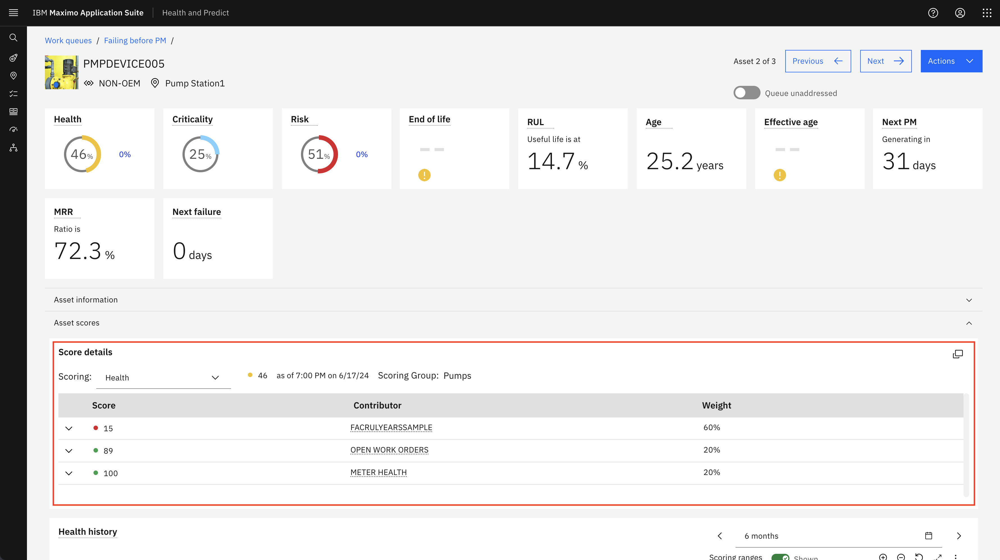

    For this asset and assets in the same group, the Reliability Engineer can see that the health score is a weighted average of open work orders, remaining useful life, and meter health.

### Step 9: Explore available actions

39. Once the Reliability Engineer decides on what action to take, they can take action at the top of the page. They can create a service request, create a work order, recalculate a health score, or edit the source asset’s record. **We will NOT take any action in the shared environment.**

    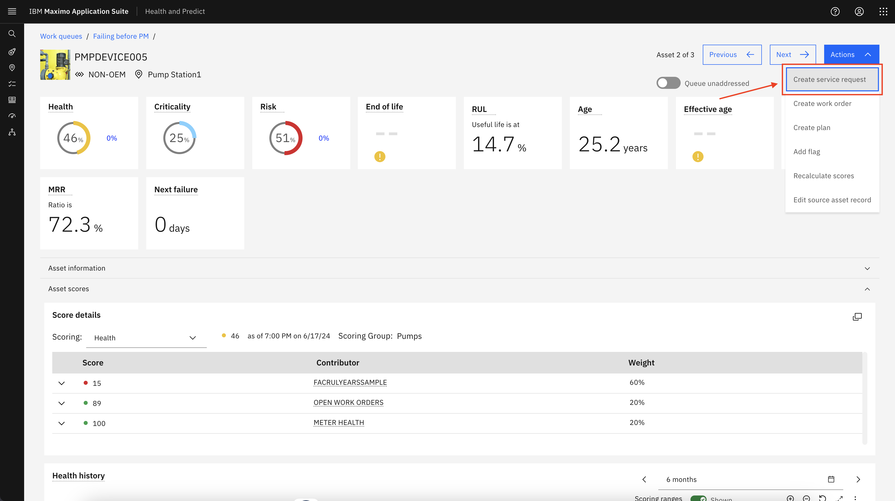

40. The Reliability Engineer can finally create and present a detailed report of their findings about current and predicted future state of PMPDEVICE005 (and similar pumps) to the Operations Manager.

## Maximo Predict

Maximo Predict includes templates that help enterprise data scientists get started with building models to project days to failure, calculate probability of failure, detect anomalies, and generate an asset life curve based on an asset’s deployment and retirement dates. These templates include many algorithms, and the data scientists can select the one that best fits their data and needs to drive an optimal outcome.

In addition, Maximo Application Suite includes Watson Studio and Watson Machine Learning, which can be used for building, training, and maintaining predictive models if a more custom solution is needed.

41. Scroll down and click **Predictions** to expand this tab.

    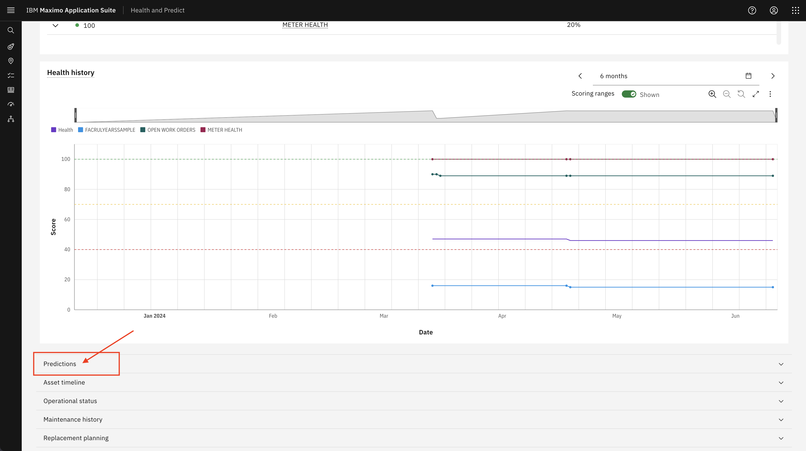

42. The **Predictions** section opens showing the selected pump’s predictive KPIs and failure probability graphs.

    Brief information about the contents of each tile can be found by hovering over the tile's title.

    

### Step 10: Predicted Failure Model

The AI model predicts that this pump will fail within a certain number of days, plus or minus a specified period. If the data history for this asset is rich enough, a data scientist can also build predictive models for specific failure modes. It helps to know the probability of failure along with the most probable failure reason (failure mode). For example, knowing information such as “there is a 40% chance the pump will fail within the next 30 days due to the motor failure” is very useful. In this case, the model would look for a sequence of events that led to this failure mode and provide the pump's probability of failure due to its motor burnout. In this way, it helps to plan for preventive maintenance actions.

43. The timeframe of the training data in the **Estimated time to failure** tile can help to decide if and when the AI model should be retrained.

    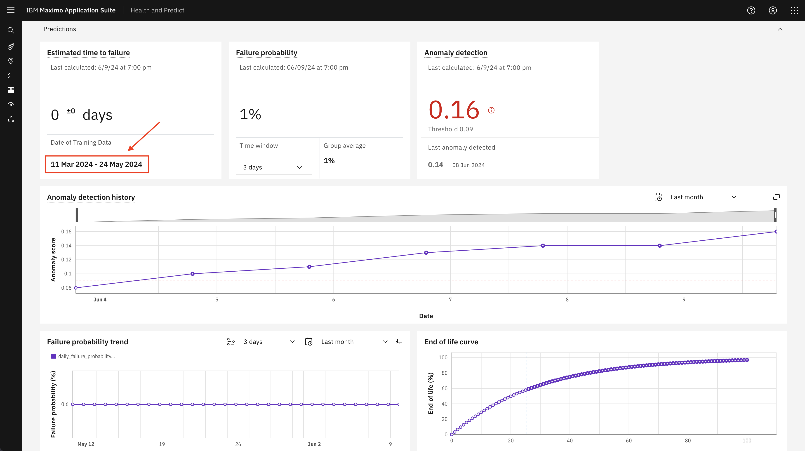

44. In the **Failure probability** tile, notice the probability of the selected failure mode occurring in the selected prediction **Time window** (3 days by default, as shown at the bottom left of this tile). You can see that this pump has a 1% chance of failing in the next three days (based on the screenshot below). 🟢

    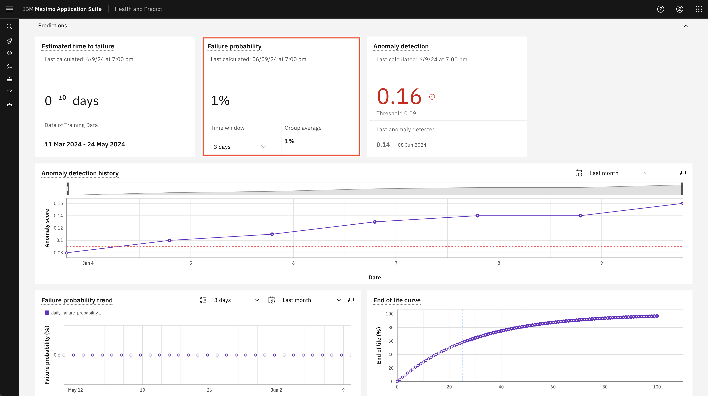

52. Scroll down to the **Failure probability trend** card. This card shows the failure probability history for each mode, indicating how the probability of failure has changed over time.

    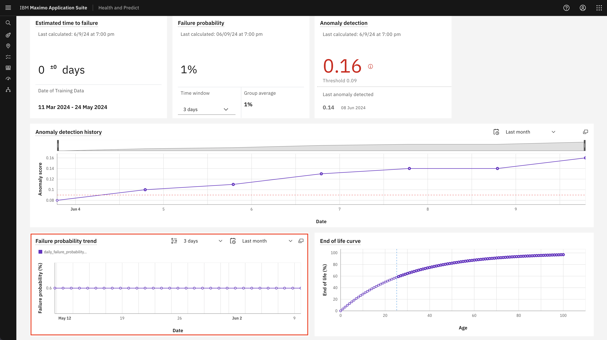

53. Scroll down to the **Factors that contribute to failures** card. It shows which factors from the training data had the biggest impact on failures. This gives an idea of what might cause future failures.

    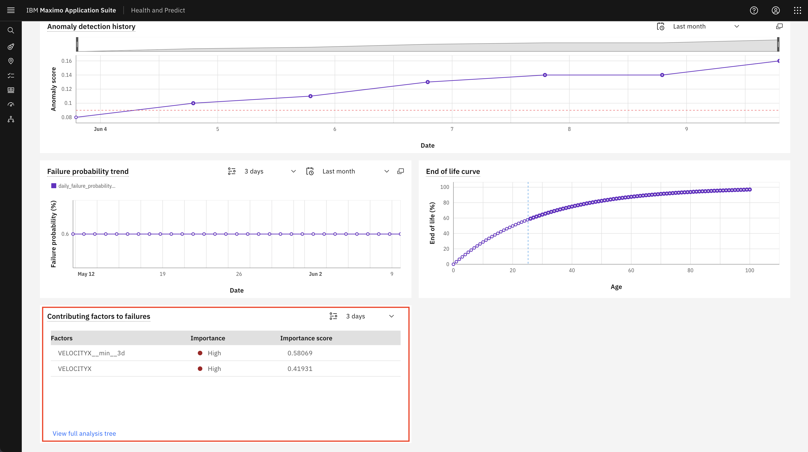

54. Scroll to the **Anomaly detection** and **Anomaly detection history** cards which show the anomaly scores for this pump as well as when it crossed the threshold value (red dotted line on the **Anomaly detection history** time series graph).

    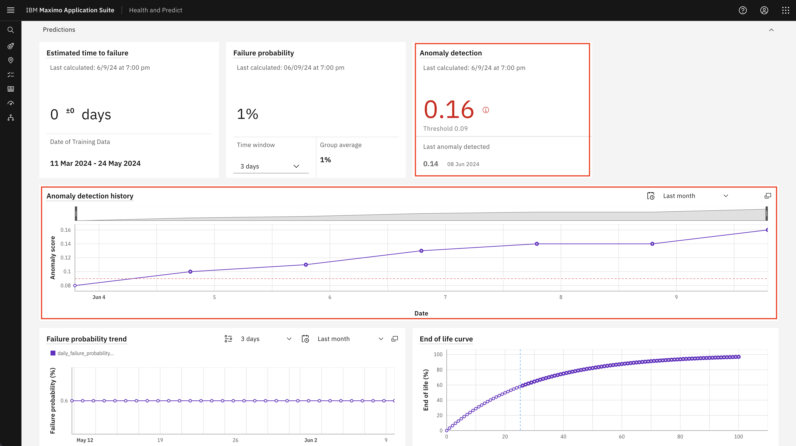

### Step 11: Asset Timeline

55. Scroll down and click **Asset timeline** to expand this tab.

    

56. The **Asset timeline** tab provides several pieces of key information about this asset within a single graph. 🟢

    Looking at this timeline, the selected pump has a predicted failure (PF) date that will occur before its next planned preventative maintenance (PM) scheduled date! Other information from the chart, like past work order and inspection dates, provides valuable insight into the asset's history and may inform one's decision-making on what kind of action to take.

    

## Closing Remarks

This end-to-end demonstration has shown how an Operations Manager can use AI anomaly detection to monitor all of their enterprise's pumps in near-real time, eliminating false positive alerts. This persona was able to investigate an asset in trouble and submit a service request all by using Maximo Monitor and Maximo Manage.

This demo has also shown how enterprises can detect the current and predicted future conditions of thousands of assets at scale using Maximo Manage and Predict, thus ensuring that operational teams aren't over- or under-maintaining assets. As users address the assets in a work queue, they can provide their organizations tremendous value by reducing downtime, saving on maintenance and operational costs, and increasing revenue.
