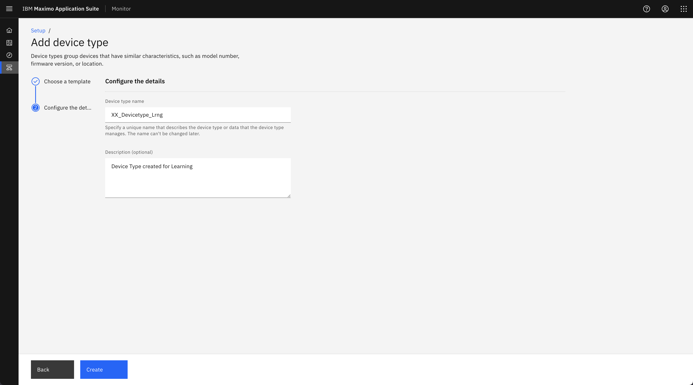
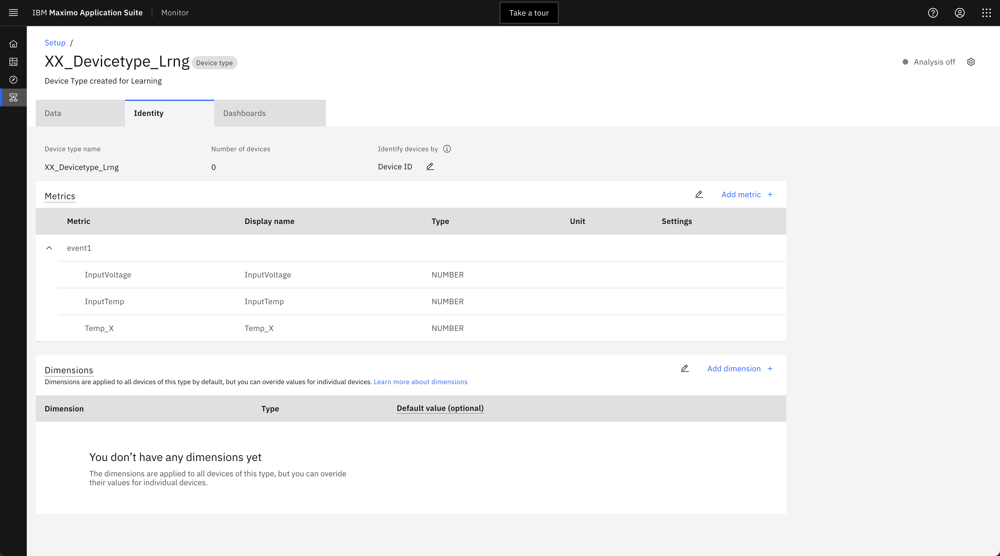
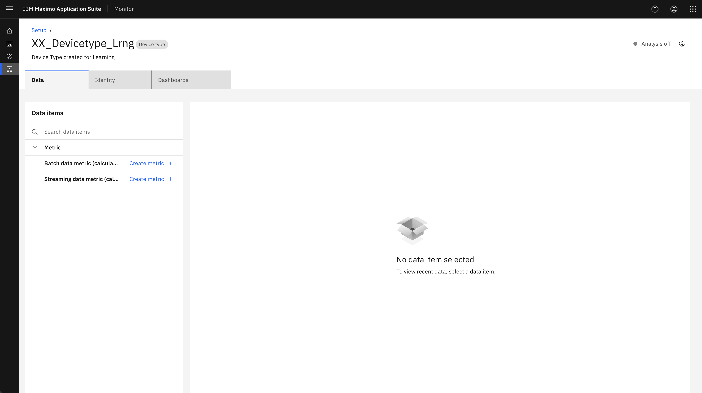
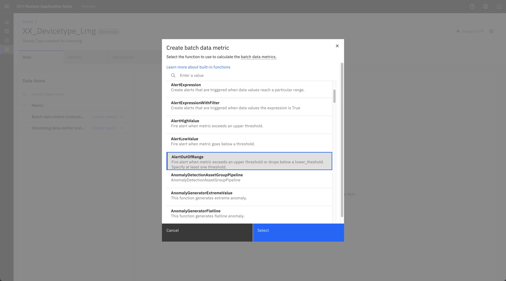
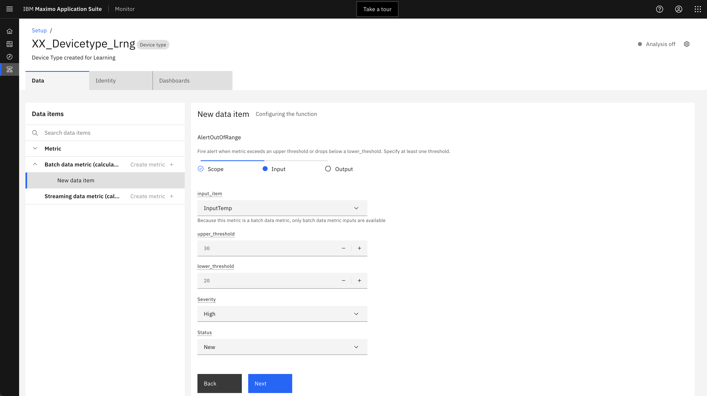
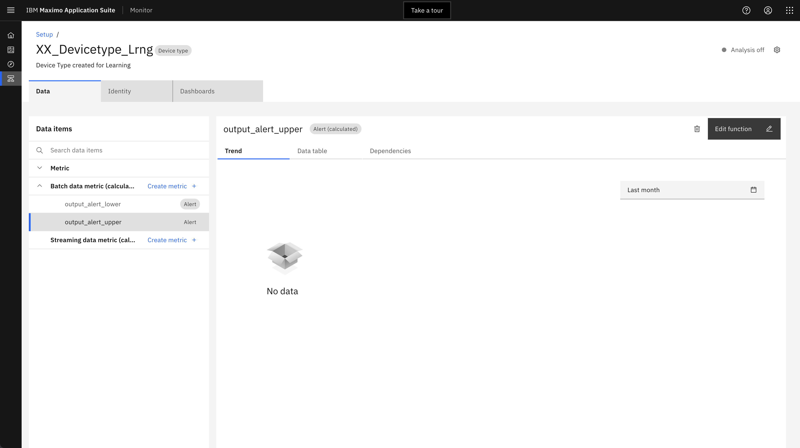
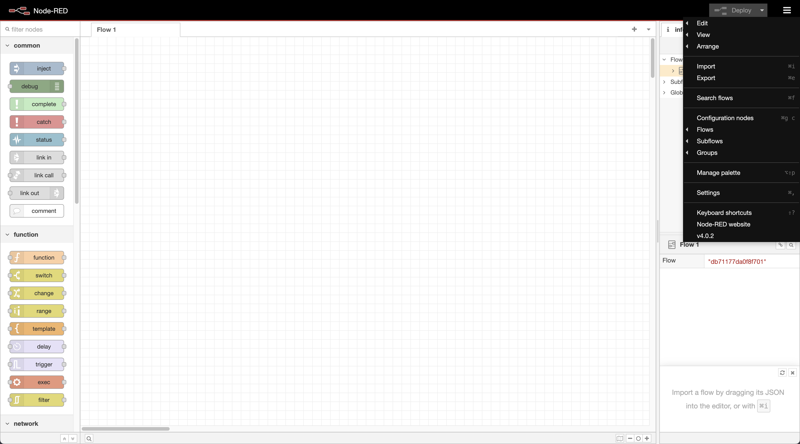
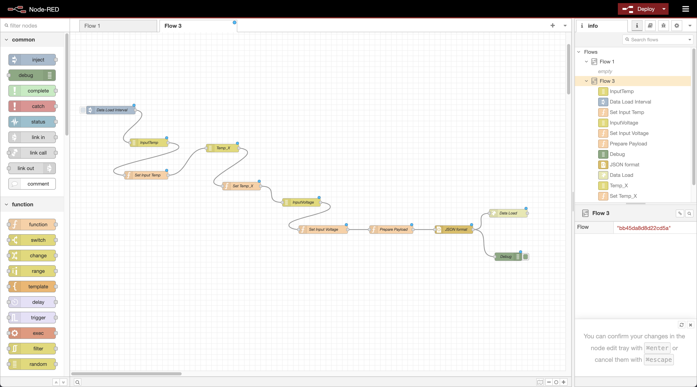
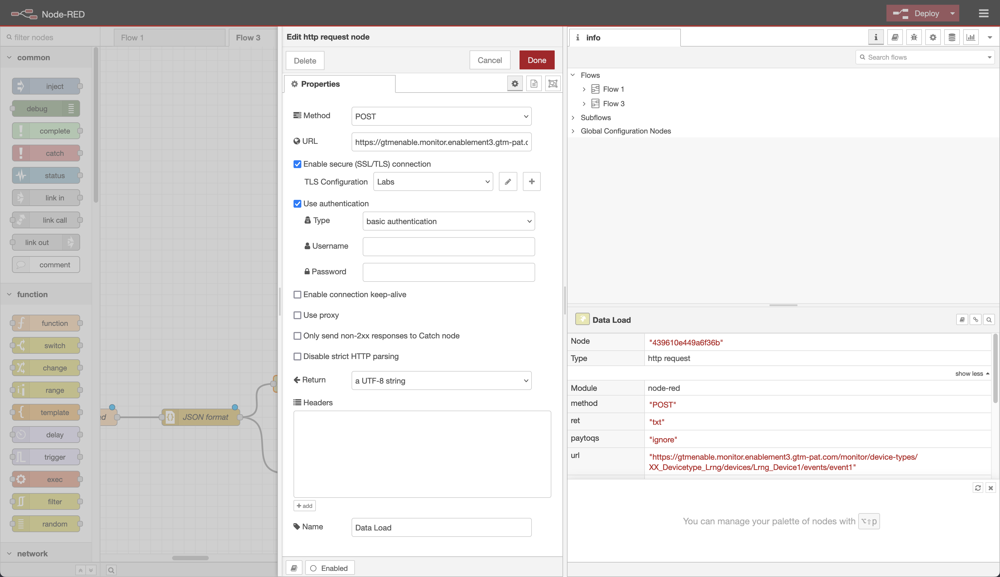

# Lab Hands-on Lab de Maximo

En este Ejercicio, aprenderá a configurar Monitor para recibir datos de un simulador Node-Red a dispositivos en Monitor.

Paso 1: Crear un tipo de dispositivo y configurar métricas en Monitor Paso 2: Crear un dispositivo en Monitor para enviar datos de sucesos desde el simulador Nodo-Red

## Crear un tipo de dispositivo

1.  Ir a la configuración en Monitor
2.  Pestaña Ir a dispositivos
3.  Pulse el botón + para crear un tipo de dispositivo
4.  Seleccione la plantilla básica
5.  Siguiente
6.  Especifique un nombre de tipo de dispositivo (por ejemplo, *XX* \_Devicetype\_Lrng, donde *XX* son sus iniciales).
7.  Crear

## Crear métricas en el tipo de dispositivo

Seleccione "Añadir métrica +" y añada las métricas siguientes. Estos puntos de datos vendrán de nuestro flujo Node-RED. Es importante etiquetar el suceso y las métricas exactamente cómo se envían los datos desde la carga útil.

**Nota: las métricas y la carga útil del tipo de suceso se configurarán en el flujo Node-RED que configuraremos más adelante.**

1.  En la sección Métricas, pulse Añadir métrica

2.  Pulse Añadir métrica

    a. Especifique InputTemp para Metric

    b. Especifique InputTemp para el nombre de visualización

    c. Especifique event1 for Event

    d. Elija NUMBER para Tipo

    e. Opcionalmente puede especificar la unidad

3.  De manera similar podemos añadir dos métricas más como se muestra a continuación. (Temp\_X, InputVoltage)

4.  Pulse Guardar

## Crear un dispositivo en Monitor

1.  Pulse el enlace de configuración azul en la parte superior izquierda que le llevará a la lista de tipos de dispositivo
2.  El tipo de dispositivo que ha creado debe seleccionarse
3.  Pulse en Añadir dispositivo +
4.  Especifique Lrng\_Device1 para el nombre
5.  Seleccione Símbolo personalizado
6.  ¡Entrar en Pasword1!
7.  Pulse Añadir y cerrar

## Añadir cálculos y alertas

La función "Alertas" le permite ser notificado cuando se detectan anomalías.

1.  Pulse el menú de configuración. Buscar en DeviceType\_Lrng
2.  Haga clic en **Configurar el tipo de dispositivo**.
3.  Haga clic en **Crear métrica +** con el icono **Métrica de datos por lotes** para crear una nueva métrica.

4.  Seleccione **AlertOutOfRange**.

5.  Seleccione **Ámbito** y **Todos los dispositivos de este tipo** , y haga clic en **Siguiente**.

6.  Seleccione los campos siguientes:

    a. Elemento de entrada: InputTemp

    b. Umbral de actualización: 30

    c. Umbral inferior: 20

    d. Gravedad: Alta

    e. Estado: Nuevo

7.  Pulse Siguiente
8.  Haga clic en Crear

## Instalar nodo-RED localmente

Este es un paso bastante fácil, ya que sólo tienes que seguir esta guía: [Ejecutar nodo-RED localmente ](https://nodered.org/docs/getting-started/local).

Una vez instalado e iniciado, abra el navegador e inicie el Editor de nodo-Red.

## Añadir nodos adicionales necesarios

Antes de cargar el script Node-RED, debe añadir las bibliotecas de nodos adicionales necesarias.

Dependencias de biblioteca de nodo-RED:

*   panel-rojo-nodo
*   node-red-contrib-ui-upload
*   nodo-rojo-contrib-fragmentos-a-líneas
*   nodo-rojo-nodo-aleatorio

1.  Haga clic en el menú de la hamburguesa en la esquina superior derecha y seleccione Gestionar paleta.

2.  Haga clic en **Instalación** y anote el nodo-rojo-nodo en el campo de búsqueda y pulse Instalar.
3.  Haga clic en Instalar de nuevo.
4.  Repita el paso anterior para otras bibliotecas.

## Nodo de importación-Flujo rojo

1.  Descargar el flujo desde git-hub
2.  Nodo de inicio-RED
3.  Haga clic en el menú de hamburguesas y seleccione Importar
4.  Pulse en seleccionar un archivo para importar
5.  Elija el archivo descargado en el paso 1.
6.  Pulse Importar

## Modificar nodo-Flujo rojo para ingestionar datos en supervisor

1.  Haga clic en **Carga de datos** de la derecha para configurarlo.

2.  Actualice el URL, por ejemplo

    [https://gtmenable.monitor.enablement3.gtm-pat.com/monitor/device-types/XX\_Devicetype\_Lrng/devices/Lrng\_Device1/events/event1](https://gtmenable.monitor.enablement3.gtm-pat.com/monitor/device-types/XX_Devicetype_Lrng/devices/Lrng_Device1/events/event1)

3.  Abrir aplicación IoT para nombre de usuario y contraseña

    a. Haga clic en las aplicaciones

    PPP

    b. Pulse en Generar clave de API

    c. Proporcione una descripción y pulse Siguiente

    d. Seleccionar rol Aplicación estándar

    e. Pulse en Generar clave.

    f. Copiar clave de API en el campo Nombre de usuario rojo de nodo

    g. Copiar señal de autenticación en el campo Contraseña roja de nodo

    PPP

4.  Para configurar la configuración de TLS a. Pulse el icono de lápiz junto al campo de configuración de TLS

    PPP

    b. Si tiene acceso a OCP, puede obtener el certificado de ca siguiendo los pasos siguientes. Sin embargo, para este laboratorio, puede descargar el archivo ca.pem de GitHub.

    c. Para el inicio de sesión del certificado CA en la consola OCP

    d. Seleccionar carga de trabajo-> Secretos y elegir proyecto de IoT.

    e. Buscar con la palabra Public-tls

    PPP

    f. Abra el secreto g. Copie el texto de ca.crt y guárdelo como archivo ca.pem

    PPP

    h. Subir el archivo ca.pem al certificado de CA

    PPP

5.  Proporcione el nombre del servidor como a continuación

masdev.messaging.iot.indlabs.masindialabs-d0e546e009fc97340f232abe59937ef-0000.au-syd.containers.appdomain.cloud

6.  Haga clic en Actualizar
7.  Haga clic en Hecho
8.  Pulse en Desplegar

## Ingerir datos de nodo-Red a dispositivo de supervisión

1.  Doble pulsación en el nodo Intervalo de carga de datos

PPP

2.  Establezca la propiedad Repetir como a continuación

PPP

3.  Haga clic en Hecho
4.  Pulse en Desplegar

## Enviar datos de anomalía a supervisar

1.  Doble pulsación en Flujo temporal de entrada

PPP

2.  Modificar la propiedad De y A como se indica a continuación

PPP

3.  Pulse en Terminado y despliegue el flujo
4.  Pulse el botón azul del nodo Intervalo de carga de datos para ingerir un registro manualmente.

PPP

5.  Volver a la aplicación Supervisar y seleccionar la pestaña Supervisor
6.  Haga clic en la ficha Dispositivos
7.  Seleccione el tipo de dispositivo y el nombre de dispositivo
8.  La alerta se mostrará en la tabla de alertas como se muestra a continuación

PPP

## Subir solicitud de servicio de la tabla de alertas

**Nota: Cree un activo en Gestionar aplicación con el mismo nombre que el dispositivo en el supervisor antes de crear la solicitud de servicio.**

1.  Pulse en Crear enlace de solicitud de servicio

PPP

2.  Especifique el campo Notificado por
3.  Haga clic en el botón Crear.

## Creación de panel

Hay varias maneras de configurar los paneles de control en Monitor.

1.  En la página de inicio del supervisor, seleccione "Supervisor"

PPP

2.  Seleccione el dispositivo en la lista de tipos de dispositivo.

PPP

3.  Pulse el icono "+" junto a Metrics Dashboard para crear un nuevo panel de control y proporcionar el título del panel de control como "XX\_Lrng\_Dashboard"

PPP

4.  Pulse el botón de panel de control Configurar azul. Muestra un panel de control vacío.
5.  La primera tarjeta que vamos a seleccionar es la Línea de Serie de Tiempo. Haga clic en él.

PPP

6.  A continuación, dé a la tarjeta un título, rango de tiempo y añada un elemento de datos.

PPP

7.  Cómo agregar una tarjeta de imagen
8.  Haga clic en la opción Agregar tarjeta y seleccione Tarjeta de imagen

PPP

9.  Arrastre y suelte cualquier imagen de su elección

PPP

10. De forma similar, puede añadir otra tarjeta al panel de instrumentos.
11. Haga clic en Guardar y cerrar.
12. Debe representar el panel de control.
13. Siéntase libre de editar el arreglo de cada tarjeta arrastrándolos alrededor. Además, personalice el tamaño y la configuración de cada tarjeta como quiera.
