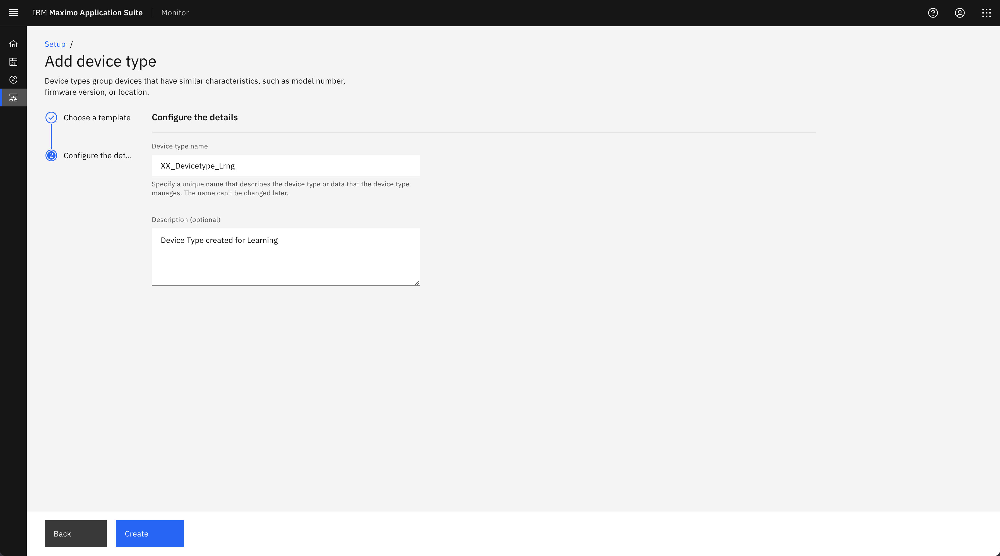
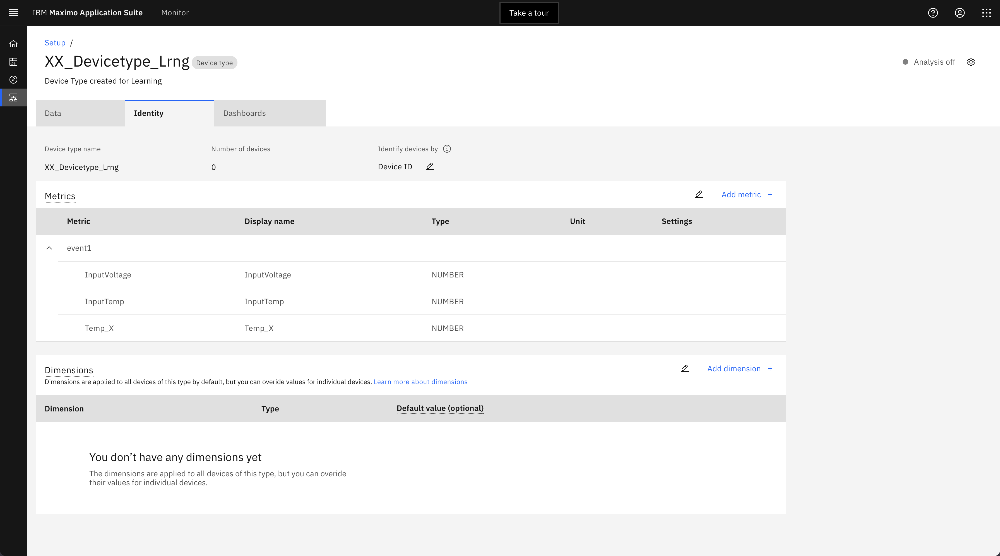
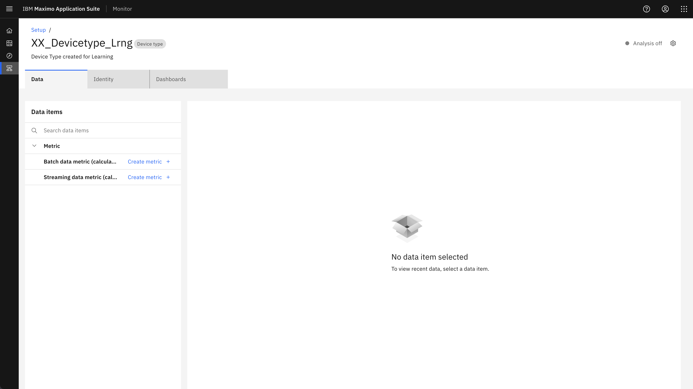
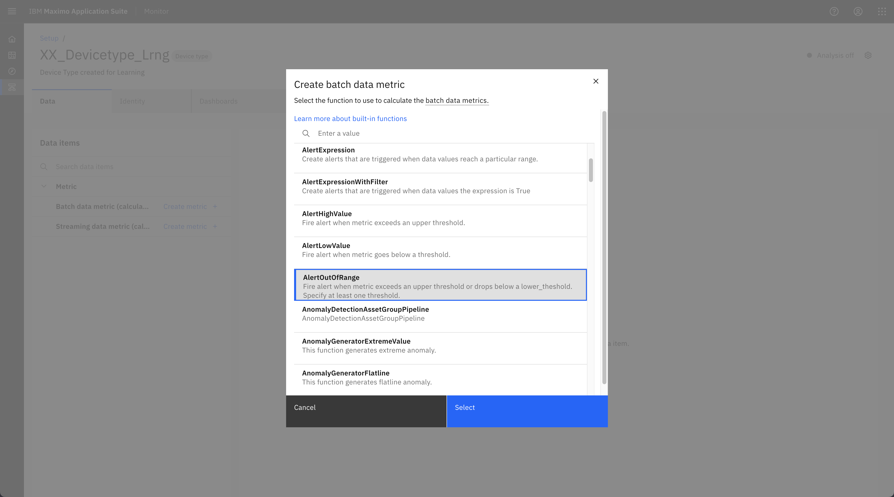
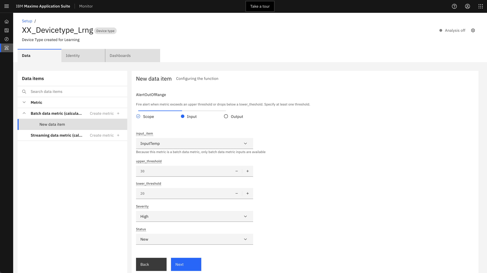
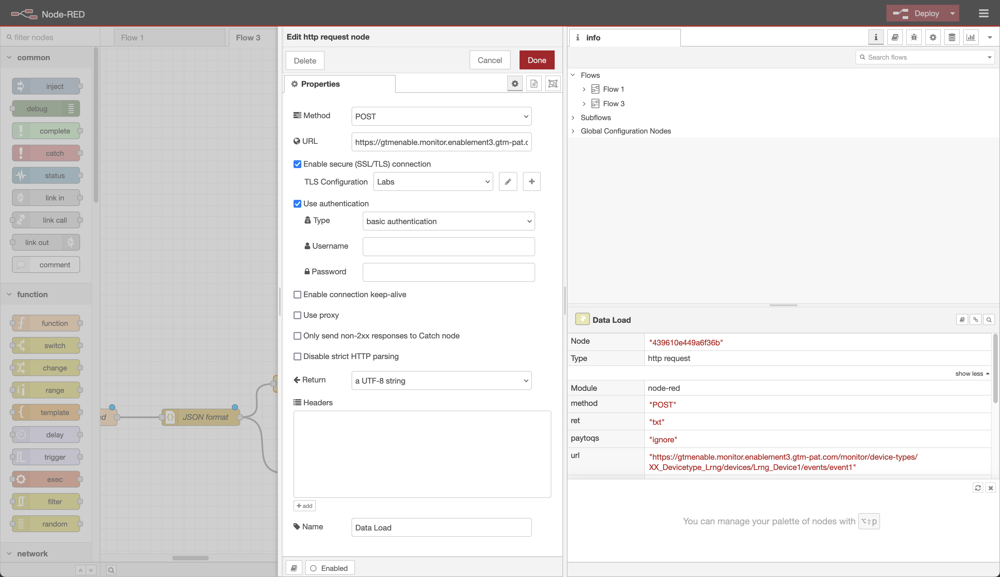

# Maximo Monitor Hands-on Lab

In this Exercise, you will learn how to setup Monitor to receive data from a Node-Red simulator to devices in Monitor.

    Step 1: Create a device type and setup metrics in Monitor
    Step 2: Create a device in Monitor to send event data from Node-Red simulator

## Create a Device Type

1. Go to Setup in Monitor
2. Go to Devices tab
3. Click on + button to create a device type
4. Choose Basic template
5. Next
6. Enter a Device type name (e.g. *XX*_Devicetype_Lrng, where *XX* are your initials).
7. Create

## Create Metrics in the Device Type

Select “Add metric +” and add the metrics below. These data points will be coming from our Node-RED flow. It is important to label the event and metrics exactly how the data gets sent from the payload.

**Note: The metrics and event type payload will be configured in the Node-RED flow which we will set up later.**

1. Under Metrics section click Add metric
2. Click Add metric

    a. Enter InputTemp for Metric

    b. Enter InputTemp for Display name

    c. Enter event1 for Event

    d. Choose NUMBER for Type

    e. Optionally you can enter Unit

3. Similar way we can add two more metrics as shown below. (Temp_X, InputVoltage)
4. Click Save

## Create a Device in Monitor

1. Click the blue Setup link in the top left which will take you to the device types list
2. The device type you created should be selected
3. Click on Add device +
4. Enter Lrng_Device1 for name
5. Choose Custom token
6. Enter Pasword1!
7. Click Add and Close

## Add Calculations & Alerts

The "Alerts" function allows you to be notified when anomalies are detected.

1. Click setup menu. Search on DeviceType_Lrng
2. Click on the **Set up device type** button.
3. Click the **Create metric +** icon under the **Batch data metric** section to create a new metric.

4. Select **AlertOutOfRange**.

5. Select **Scope** and **All devices of this type**, and click **Next**.
6. Select fields as below:

    a. Input Item: InputTemp

    b. Upper_threshold: 30

    c. Lower_threshold: 20

    d. Severity: High

    e. Status: New

7. Click Next
8. Click on Create

## Install Node-RED Locally

This is a fairly easy step, as you just have to follow this guide: [Running Node-RED locally](https://nodered.org/docs/getting-started/local).

Once installed and started open the browser and start the Node-Red editor.

## Add required additional nodes

Before loading the Node-RED script, you need to add the required additional node libraries.

Node-RED library dependencies:
    - node-red-dashboard
    - node-red-contrib-ui-upload
    - node-red-contrib-chunks-to-lines
    - node-red-node-random

1. Click on the burger menu in upper right hand corner and select Manage Palette.

2. Click on the **Install** tab and write node-red-dashboard in the search field and click on Install.
3. Click on Install again.
4. Repeat the above step for other libraries.

## Import Node-RED Flow

1. Download the flow from git-hub
2. Launch Node-RED
3. Click on the burger menu and choose Import
4. Click on select a file to import
5. Choose the file downloaded in step 1.
6. Click Import

## Modify Node-Red Flow to Ingest Data in Monitor

1. Click on the **Data Load** node on the right to configure it.
2. Update the URL e.g.

    https://gtmenable.monitor.enablement3.gtm-pat.com/monitor/device-types/XX_Devicetype_Lrng/devices/Lrng_Device1/events/event1

3. Open IoT application for Username & password

    a. Click on Apps

    PPP

    b. Click on Generate API Key

    c. Provide Description and click Next

    d. Select role Standard Application

    e. Click on Generate Key.

    f. Copy API key to Node-red Username field

    g. Copy Authentication token to Node-red password field

    PPP

4. To configure TLS configuration
    a. Click on pencil icon beside TLS configuration field

    PPP

    b. If you have access to OCP, you can get the ca certificate by following the below steps. However, for this lab, you can download the ca.pem file from GitHub.

    c. For CA certificate login to OCP console

    d. Select Workload -> Secrets and choose IoT project e.g mas-demo-IoT

    e. Search with Public-tls word

    PPP

    f. Open the secret
    g. Copy the text of ca.crt and save it as ca.pem file

    PPP

    h. Upload the ca.pem file to CA certificate

    PPP

5. Provide server name as below

masdev.messaging.iot.indlabs.masindialabs-d0e546ee009fc97340f232abe59937ef-0000.au-syd.containers.appdomain.cloud

6. Click on Update
7. Click on Done
8. Click on Deploy

## Ingest Data from Node-Red to Monitor Device

1. Double Click on Data load Interval node

PPP

2. Set the Repeat property as below

PPP

3. Click on Done
4. Click on Deploy

## Send Anomaly Data to Monitor

1. Double click on Input temp flow

PPP

2. Modify the From and To property as below

PPP

3. Click on Done and Deploy the flow
4. Click on blue button on Data Load Interval node to ingest one record manually.

PPP

5. Go back to Monitor application and select Monitor tab
6. Click on Devices tab
7. Select the Device type and device name
8. Alert will be displayed on Alert table as shown below

PPP

## Raise Service Request from Alert Table

**Note: Create an asset in Manage application with the same name as device in monitor
before creating service request.**

1. Click on Create service request link

PPP

2. Enter the Reported by field
3. Click on create button.

## Create Dashboard

There are a variety of ways you can set up dashboards in Monitor.

1. From the monitor home page, select “Monitor”

PPP

2. Select the device from device type list.

PPP

3. Click on the “+” icon beside Metrics Dashboard to create new dashboard and provide
the dashboard title as “XX_Lrng_Dashboard”

PPP

4. Click on Blue Configure dashboard button. It shows an empty dashboard.
5. The first card we are going to select is the Time Series Line. Click on it.

PPP

6. Then give the card a title, time range, and add a data item.

PPP

7. Add an image card
8. Click on Add card option and choose Image card

PPP

9. Drag and drop any image of your choice

PPP

10. Similarly you can add other card to your dashboard.
11. Click on Save and close.
12. It should render the dashboard.
13. Feel free to edit the arrangement of each card by dragging them around. Also, customize the size and settings of each card however you like.

