# Maximo Visual Inspection (MVI) - Part 1

In this lab you will first see the connection between Maximo Monitor and MVI.

Then you will create your own data set, label, and augment using an MVI instance.

HEADS UP! L3 Quiz Content denoted with 🟢

## Maximo Monitor and MVI

## Step 1: Log in to Maximo Application Suite Navigator

**Actions:**

1. Click on the **MVI URL** link from the email you received containing instructions to use the demo environment.

2. IBM Maximo Application Suite log in page opens. Enter **MVI Username (A)** and **Password (B)**  and click **Log 
in** 

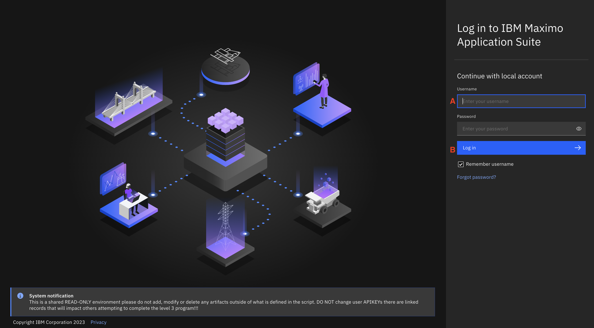 

 Once the login credentials are accepted, the MAS Application **Suite navigator** window opens. Several applications that make up the Maximo Application Suite are displayed. In this demo, the focus will be on the Maximo Visual Inspection application; however, Part One of this demo, briefly looks at MVI AI model inspection results in the MAS Monitor application. (Note: in this demo environment, only the necessary applications are available for completing MVI L3).

> Note: If this is your first-time logging into the MAS, you may be prompted to view a quick application tour (how-to tutorial). Please dismiss any such tours for the purposes of this demo.

3. In the MAS **Suite navigator** page, click on the **Visual Inspection (A)** tile.

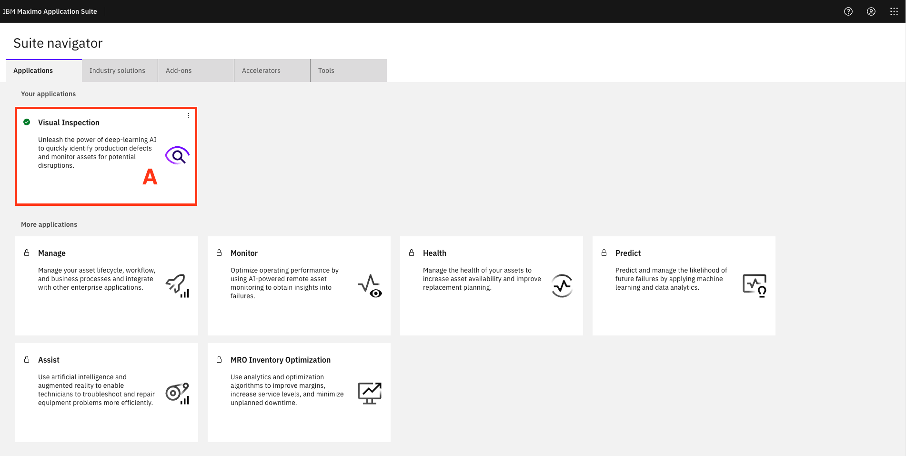

4. Click **Get started (A)** on the MVI **Welcome to IBM Maximo Visual Inspection** screen.

The **Data sets** page opens.

  

## Step 2: Create a Dataset for Model Training in Maximo Visual Inspection

**What is an MVI dataset, and why do you need to create one?**

As a first step towards building your AI inspection model, you must create a dataset in MVI containing images of clean and dirty tanks to teach the model what each class looks like.

Data is at the heart of machine learning (ML). In the case of vision-based models, this data takes the form of images or videos. Built-in MVI ML models intelligently detect and learn patterns in the uploaded dataset and analyze this data repeatedly until it can discern distinctions and ultimately recognizes objects of interest in the images. For example, to train a computer to recognize automobile tires, you need to feed it with vast quantities of tire images and tire-related items to learn the differences and identify a tire, especially one with defects.

For this use case model, you will create a dataset with a limited number of clean and dirty tank images for brevity; however, in real world scenarios, a computer vision model would require many more images and processing time than this demonstration offers.

In this demo, you manually upload saved tank images from your local machine to the MVI application dashboard, however, built-in image capture modes in MVI Mobile and MVI Edge applications (parts of the MVI solution) can also be used to collect and copy images automatically into the MVI application. Now it's time to start creating a dataset.

**Action:**

5. On the MVI **Data sets** screen, Click the **Create + (A)** blue icon on the top right.

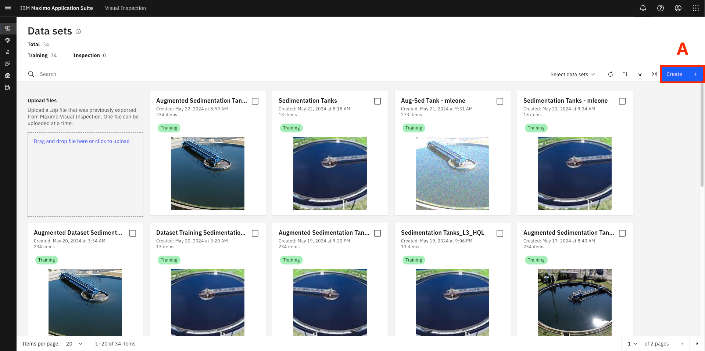

6. Enter `Sedimentation Tanks <YOUR INITIALS>` for the **Name** field in the **Create data set** window (since you are sharing the Maximo Visual Inspection demo environment with other people a unique identifier is required to avoid name conflicts) **(A).**
7. Click **Create (B)**.

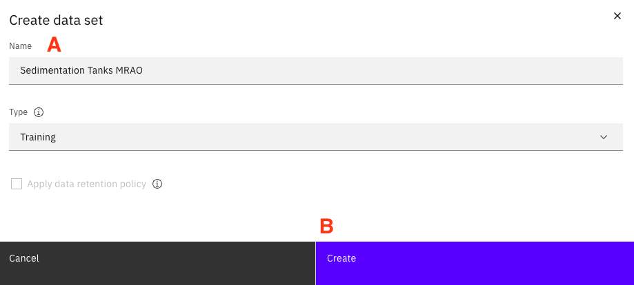

**Important:** This demo script does not address dataset names with any unique identifier. Hence to follow along as an example, if you are instructed to click on the **_Sedimentation Tanks_** dataset, you would instead click on **_Sedimentation Tanks \<YOUR INITIALS\>_** dataset, i.e., the dataset you named along with your unique identifier.

8. Click on the lower half of the newly created **Sedimentation Tanks** tile (where a light grey image icon is shown).

 Once you click on this tile, a window opens for the data set you just created. As shown in the upcoming steps, you can perform several key operations on this page, such as uploading images, labeling objects, augmenting data, and training your model.

9.  Click **Import Files** to import the model training tank images from the directory where you unzipped the sample files.

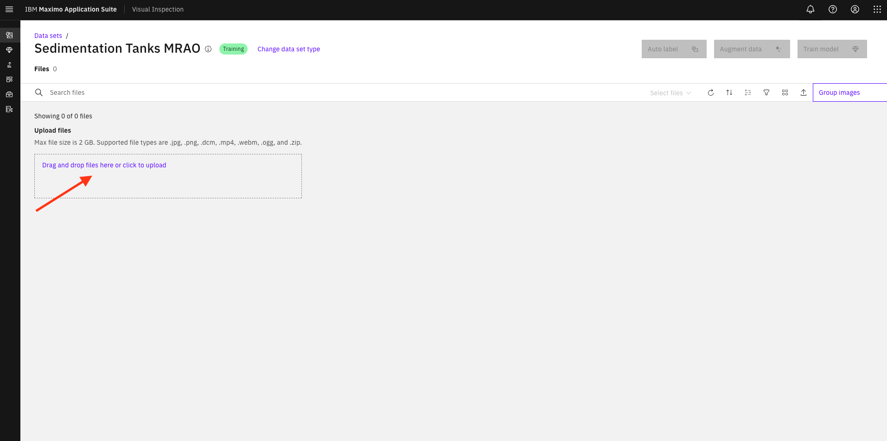

10. Navigate to the directory location where you unzipped the **Images of Sedimentation Tanks for training** folder, downloaded and extracted in the[ Pre-work Step 2.](/maximo/mvi-prereq#step-2-download-the-training-and-validation-tank-images-for-the-ai-model)

11. Select all the tank images from the folder and click **Open**.

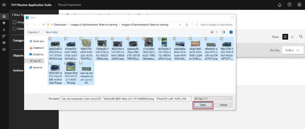

 After a few seconds, the images are uploaded to your newly created dataset. This dataset includes several photos of clean and dirty sedimentation tanks. You are now ready to label these images.

## Step 3: Label the Dataset

 In this step, you will label the tank images. Labeling is tagging the input images with information about its content. In object detection, this would involve highlighting occurrences of items of interest. In the case of this demo, you will go through each of the uploaded tank images and highlight the portion of the image that represents a clean or a dirty tank. During the training phase, these labelled images will allow your model to learn which part of the image represents a tank and next whether that image portion contains a clean or a dirty tank.

As you can imagine, labeling the images correctly is critical to the accuracy of the model you are creating because it directly impacts the overall quality of the trained model. Quite simply, when it comes to identifying objects or classifying images, you want a use case domain expert – the person with the relevant subject matter expertise (SME) – to be labeling these images. This will ensure the highest quality of input into the model training. Traditionally, data scientists have been the focal point of AI initiatives and have wasted their precious time labelling data (despite not even being a domain expert; for example, would a data scientist be able to better label a dirty tank than the on-site inspection engineer?). With MVI, a domain expert – with no data science expertise– can label the images and then subsequently build a model based on those images.

This approach lowers the barrier to entry and empowers domain experts with limited to no AI training the ability to create and deploy working AI models in a matter of hours, not days or weeks.

**Actions:**

Once all the pictures are uploaded in MVI perform the following steps:

1. From the Select files dropdown click **All (A)** to automatically select all the dataset images.

2. Click **Label objects (B)**.

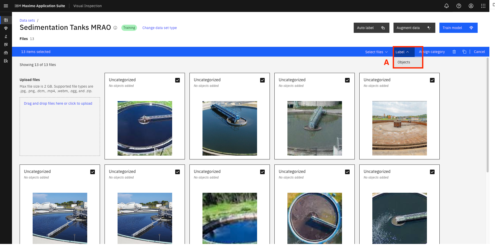

 The **Label objects / Sedimentation Tanks** page opens. This is where you create labels for clean and dirty tanks and assign them to the relevant portion of the images in the dataset. Various sections of the Label objects page user interface for layout reference are highlighted below.

3. To start the labeling process, you must define the labels (clean and dirty). Click **+ Add label** in the **Objects** window on the far right.

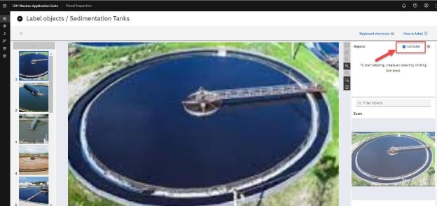

4. In the **Add objects** window that opens, type “clean” in the **Create object** field **(A)** and then click the **Add** button **(B).**

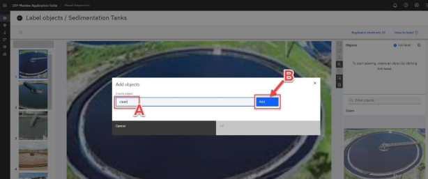

5. Now, type “dirty” in the **Add objects** window and click **Add**.

6. Click **Ok** to complete the Add label process.
7. Once the labels are defined, you can start the process of labelling the tank objects appropriately. Make sure the first tank image is selected in the Image Navigator (you will see a dark blue box around the selected image in the Image Navigator on the left). Select the **clean** label name from the **Objects** window on the right **(A).**
8. Click the **Box** icon from the selection menu **(B)** and draw a box around a portion of the image that denotes the clean or dirty tank **(C)**.

Due to potential random image sorting, it may be possible that the first image you will see in the image navigator may be of a dirty tank. In this case, choose the **dirty** label instead of **clean** and label the first image in step 7 of this section appropriately.

In case you make a mistake drawing the box, select the erroneous box and click the **trashcan** icon right next to the label. You can also press **CTRL + Z** or **Command + Z** on your Windows and Mac keyboard, respectively, to undo the last action.

9. Label all the pictures in the Image Navigator using the instructions in the previous steps. You can click the **blue downward arrow** button to scroll through and select the images in sequence for labeling.

**Image Labelling Tips:**

- Tanks with blue water are clean.
- MVI remembers your previous label selection, so you do not need to click on the **clean** or **dirty** labels every time to label each new image. Just select the appropriate label the first time you start object labeling and continue to use it till it is required to switch to another object label, for example, switching from labeling a clean tank image to a dirty tank image and vice versa.

For your convenience, a light blue bar highlights the label that is currently in selection, as shown in the screenshot below.

- If there is more than one tank (or portion of tanks) in an image, please draw separate label boxes around each tank, as shown in the screenshot below.

1.  Once all tank images in the Image Navigator are appropriately labelled, click the **Back** icon (not your browser’s back button) to navigate back to the **Data set / Sedimentation Tanks** page.

The Sedimentation Tanks data set page opens. Notice how the newly created labels are shown along with each corresponding tank image (few labels are highlighted in the screenshot below)

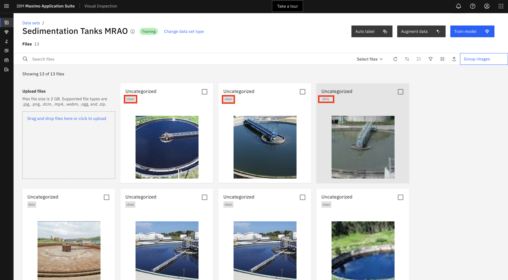

## Step 4: Data Augmentation

MVI offers an easy and cost-effective way to augment data sets. At this point, you have labelled all the tank images in the uploaded data set.

When building out a deep learning computer vision model, the more images added to the data set, the more accurate the model will generally be. However, there may be times when you do not have a dataset as varied or large enough to create an accurate and generalized model, and the cost of acquiring new data is too high.

To address this pain point, MVI provides image augmentation capabilities, where filters can be applied to perform operations such as flip, blur, sharpen, and crop, to create additional images, thus increasing model performance and decreasing the cost to acquire more data. This augmentation process multiplies the original number of images by several folds. And the good news is that any labeling that has been done in the original images is maintained in the new augmented images to avoid rework.

For this demo, it is fair to assume that a posted field camera is unlikely to take pictures of the tanks under the same conditions every time. The lighting will vary depending on weather and time of day. If the camera is rotatable, then it’s orientation to the tank and image focus can also be inconsistent. Rather than trying to provide images for all possible scenarios, image augmentation can help simulate these different conditions. This is how, data augmentation helps add additional data to your dataset to improve model performance (accuracy). You will use a few of the available MVI data augmentation options to add volume and variety to your tank images data set.

**Actions:**

1. Click **Augment data**.

2. The **Augment data** window opens and displays all of MVI’s available data augmentation filters. Select filters **Sharpen**, **Crop**, **Rotate**, **Vertical flip** and **Horizontal flip** to generate additional images **(A)**. Notice the number of images under **New creations** and **New total** labels increases as more filters are selected.
3. Click **Continue (B).**

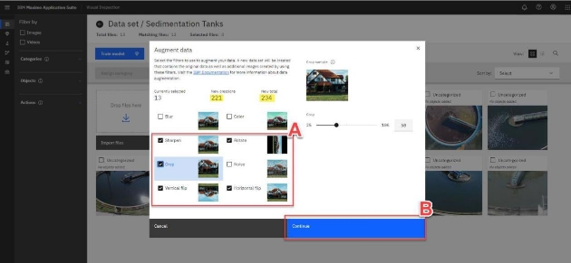

4. The **Augment data** window opens. Name the new dataset by typing `Augmented Sedimentation Tank <YOUR INITIALS>` **(A)**
5. Click **Create data set** to create your new augmented data set **(B)**

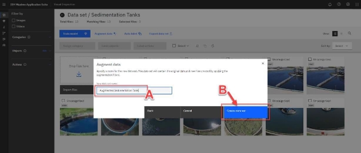
Once you click **Create data set**, you can track the progress of the data augmentation process in a small window that appears at the top right of the screen.

In this window;

- A blue progress bar denotes the data augmentation is in progress.
- A completion confirmation message and a green check mark indicate the completed process.

6. Click the **Data set** breadcrumb link to return to the main **Data sets** page, where you can see your newly created augmented dataset.

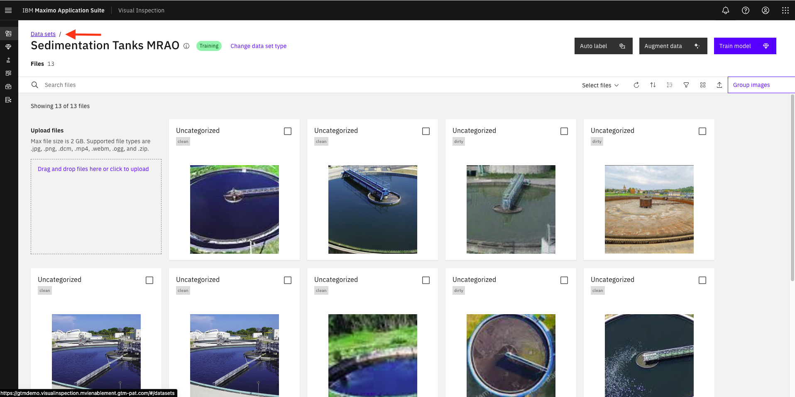

7. The main **Data sets** page opens and displays both the original and augmented dataset. Notice the increased number of images in the augmented dataset compared to the original dataset (the number of images in each dataset is shown right under its name in the tile). Click on the lower half (the water tank picture) of your newly created **Augmented Sedimentation Tanks** tile.

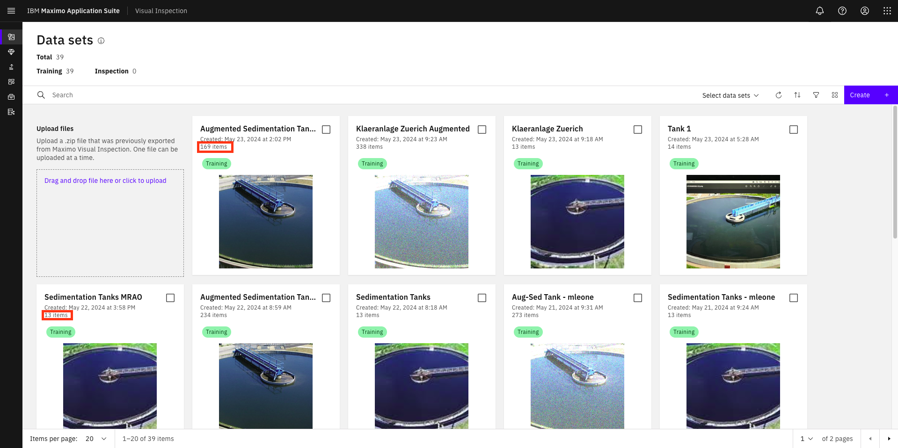

8. Once your augmented dataset page opens, notice how all the MVI generated augmented images have a small black (“magic”) icon at the bottom right of the image. Also, how image labels are automatically transferred from the original images to their corresponding augmented images.

Congratulations, you have created a new augmented dataset from the original that is ready to be trained. Now it’s time to create the object detection model using this augmented dataset.

Part 2 of the MVI lab is available [here](/maximo/visual-inspection2).
