# Maximo Visual Inspection (MVI) - Part 2

In this lab we will see how MVI makes training a model on your previously created data set easy.

Next you will explore MVI Edge to see how scaling and efficiency are facilitated.

Finally you will link MVI Mobile iOS app on your device to our MVI core instance and run gain the capability on the fly image inference.

## Training a model on your data set

### Step 1: Create Object Detection Model in Maximo Visual Inspection (Instructor Led)

**Sample Dialogue:**

Now that you have a workable dataset of images, as the Asset Analyst, it’s time to train an object detection model in MVI using these labelled images. Training is the process of fitting a model to the input data such that it can be used to make predictions on data it hasn’t seen before in the future.

During computer vision model training, pixel-level information from the image dataset is fed into the training algorithm. A Convolutional Neural Network (CNN) helps the algorithm “look” by breaking images into pixels (CNN is a popular algorithm for computer vision). This neural network also checks the accuracy of its predictions in a series of iterations until its predictions are accurate. At this point, the CNN model is recognizing or seeing images like a human’s biological neural network (hence the name – Convolutional _Neural Network_). In this demo, the model you will train is **Faster R-CNN** (Faster Region-based Convolutional Network). **Faster R- CNN** is an extension of the CNN models that belongs to a family of object detection computer vision models.

The good news is that Maximo Visual Inspection simplifies and streamlines this model training process through automation and a no-code solution; this puts deep learning into the hands of an empowered subject matter expert.

Now it’s time to start the training process of your dirty tank detection model using MVI’s power of AI and ease of use.

**Spanish Helper:**

Ahora que tiene un conjunto de datos de imágenes viable, como analista de activos, es hora de entrenar un modelo de detección de objetos en MVI utilizando estas imágenes etiquetadas. El entrenamiento es el proceso de ajustar un modelo a los datos de entrada de modo que pueda usarse para hacer predicciones sobre datos que no ha visto antes en el futuro.

Durante el entrenamiento del modelo de visión por computadora, la información a nivel de píxel del conjunto de datos de la imagen se alimenta al algoritmo de entrenamiento. Una red neuronal convolucional (CNN) ayuda al algoritmo a "mirar" dividiendo las imágenes en píxeles (CNN es un algoritmo popular para la visión por computadora). Esta red neuronal también verifica la precisión de sus predicciones en una serie de iteraciones hasta que sus predicciones sean precisas. En este punto, el modelo CNN está reconociendo o viendo imágenes como una red neuronal biológica humana (de ahí el nombre: Convolutional Network_Neural). esta demostración , el modelo que entrenará es **R-CNN más rápido** (Red convolucional basada en regiones más rápidas). **R-CNN más rápido** es una extensión de los modelos CNN que pertenecen a una familia de modelos de visión por computadora de detección de objetos .

La buena noticia es que Maximo Visual Inspection simplifica y agiliza este proceso de capacitación de modelos a través de la automatización y una solución sin código; esto pone el aprendizaje profundo en manos de un experto en la materia capacitado.

Ahora es el momento de comenzar el proceso de capacitación de su modelo de detección de tanques sucios utilizando el poder de la IA y la facilidad de uso de MVI.

---

**Actions:**

1. Click **Train model** to start the object detection training process.

2. The Train Model / Augmented Sedimentation Tank page opens. Select **Object detection** tile from the **Select type of training** section **(A)**.
3. In the **Optimize model using** section, select the **Faster R-CNN** tile **(B)**. 🟢

**Sample Dialogue:** The **Train Model / Augmented Sedimentation Tank** window (screenshot above) allows you to configure the model’s settings.

For this demo’s use case, you will use the **Object detection** training type – because you want to train a model that can analyze the tank’s condition without getting confused with any other background entity in the incoming camera image. Also, you will use the **Faster R-CNN** model type, which is optimized for higher accuracy but takes more computing and GPU power than alternatives (that’s ok; you want higher accuracy).

Apart from the chosen options, Maximo Visual Inspection (MVI) includes several models to run inferences related to classification and detection. A brief description of when to use each model type can be read within each training and model option tile.

4. To gain more control over the model training, view your model’s hyperparameters by clicking on **Advanced settings** switch to turn it **On** (located in the upper right corner of the screen).

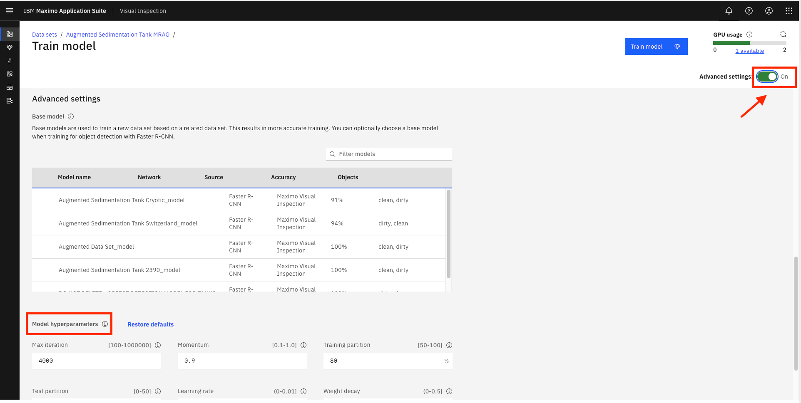

**Sample Dialogue:** Due to MVI’s ease of use, domain experts often progress very quickly into becoming advanced users. As they find themselves with new levels of comfort and control, they can also optionally choose to exploit advanced settings to further fine-tune the model. Once the **Advanced settings** switch is turned on, the **model hyperparameters** section becomes available at the bottom of the screen. Hyperparameters are used to optimize the model’s performance; and when it comes to improving the model accuracy, these parameters are the go-to option for data scientists and model experts. A brief description on each of the hyperparameters can be viewed by clicking on the **info** icon (the “**i**” in a circle) at the end of each corresponding hyperparameter. For now, keep hyperparameters at their default values.

**Spanish Helper:**

Debido a la facilidad de uso de MVI, los expertos de dominio a menudo progresan muy rápidamente para convertirse en usuarios avanzados. A medida que se encuentran con nuevos niveles de comodidad y control, también pueden elegir explotar configuraciones avanzadas para ajustar aún más el modelo. Una vez que se enciende el interruptor **Configuración avanzada**, la sección **hiperparámetros del modelo** está disponible en la parte inferior de la pantalla. Los hiperparámetros se utilizan para optimizar el rendimiento del modelo; y cuando se trata de mejorar la precisión del modelo, estos parámetros son la opción preferida para los científicos de datos y los expertos en modelos. Se puede ver una breve descripción de cada uno de los hiperparámetros haciendo clic en el ícono **info** (la "**i**" en un círculo) al final de cada hiperparámetro correspondiente. Por ahora, mantenga los hiperparámetros en sus valores predeterminados.

---

**IMPORTANT** If you are doing this demo in a classroom setting, or time is a factor, you can keep the number of iterations low. Setting it to a higher value will take longer, but it also means a more accurate model with better inspection results; for the demo, you can leave the hyperparameters at their default values.

5. While you could click the blue **Train model** button at the top to begin the model training process, this is **NOT** recommended in a live demo setting. 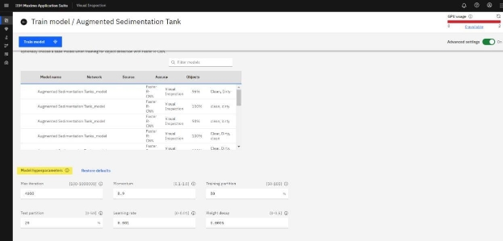

**Sample Dialogue:** Clicking on **“Train Model”** will start the training process, but since the training here will take 25+ minutes, this guide shows you the next steps using a more practical pre-built model that has been built using the same steps but was trained using 2000+ clean and dirty tank images and hours of computation.

At the time of writing, only two Graphics Processing Units (GPUs) are available for model training and deployment in the worldwide shared demo cluster (you can view the current GPU usage at the top right of the screen).

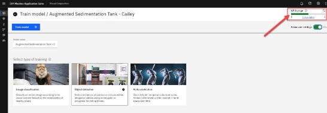

Therefore, when you click Train Model, the training process is likely queued until resources (GPUs) become available again. If this happens, you will see a window prompting you to add the training job to the queue or cancel the training altogether. You can click Cancel to terminate the training process and avoid system overload.

For demo purposes, from this point on, you will use a prebuilt sedimentation tanks model “DONOT DELETE- Sedimentation tank model” built on 2000+ tank images to showcase the next steps (just like on a cooking show where the meal is already cooked in the oven, and they just take it out on the show).

6. Click the **Hamburger** icon (a stacked bar) on the top left to view the list of page navigation options **(A)**.
7. Select **Deployed models** from the list to view a list of pre-deployed models **(B)**.

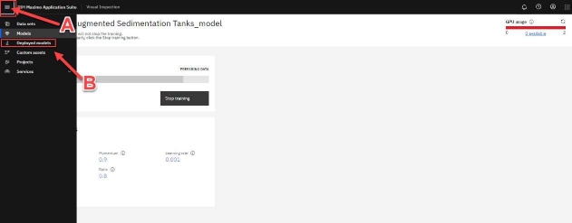

### Step 2: Model Testing

**Sample Dialogue: Testing the AI model with a new tank image**

Once model training is complete (in this case you are using a pre-built model), the model should be tested before making it generally available. In the validation phase, you will pass tank images to the model that were not part of the training dataset (called validation or test images) and let the model auto-detect the clean or dirty state of the given tank images. In this way you are simulating the scenario of a new tank inspection image sent down to the model by the field cameras and subject the model to tank images it has never seen before.

Using a dataset that was not part of the model-building phase is a standard process to check the model performance (accuracy). This helps assure that the patterns detected during model training are generalizable (also exist in the never-before-seen images) and can be used in the real world to predict new “unseen” images.

**Spanish Helper:**

Una vez que se completa el entrenamiento del modelo (en este caso, está utilizando un modelo preconstruido), el modelo debe probarse antes de que esté disponible para el público en general. En la fase de validación, pasará imágenes del tanque al modelo que no formaban parte del conjunto de datos de entrenamiento (llamadas imágenes de validación o de prueba) y permitirá que el modelo detecte automáticamente el estado limpio o sucio de las imágenes del tanque dadas. De esta manera, está simulando el escenario de una nueva imagen de inspección del tanque enviada al modelo por las cámaras de campo y sometiendo al modelo a imágenes del tanque que nunca antes había visto.

El uso de un conjunto de datos que no formó parte de la fase de creación del modelo es un proceso estándar para comprobar el rendimiento del modelo (precisión). Esto ayuda a asegurar que los patrones detectados durante el entrenamiento del modelo sean generalizables (también existen en las imágenes nunca antes vistas) y se pueden usar en el mundo real para predecir nuevas imágenes "no vistas".

---

**Actions:**

1. On the **Deployed models** screen, under the **Name** column, click **DO NOT DELETE - Sedimentation tank model** (prebuilt model).

- **Caution:** It is possible that the name of the pre-built model was changed from “DONOT DELETE- Sedimentation tank model” to something else by the time you are attempting to complete this demo. Hence to quickly identify the pre-trained model, it is worth remembering that the pre-trained model will have a dataset value of “Not found” regardless of its name as highlighted in the screenshot above. This quick tip can help you identify the pre-trained model among a list of several other deployed models regardless of any future model name changes.
- Since you are working in a worldwide shared demo cluster environment, it is likely that you may see several other models previously deployed on the **Deployed models’** screen. These models can be ignored for the purposes of this demo.

2. Once you click the deployed model’s name, you are brought to the model screen where its performance can be evaluated using a test image.

Click the **Import** button in the **Test Model** tile to select an image to score.

3. Select an image of a **clean tank** from the model testing images folder (it will have the word “**clean**” in its name) and visually confirm the model result.

4. Next, click **Import** again and select an image of a dirty tank from the same folder.

**Sample Dialogue:** With a validated model, you can build a dashboard in Maximo Monitor that will display the results of live camera feed inspections, as demonstrated in Part One of this demo. You observed how the MVI AI model sends inspection alerts to the Monitor dashboard. You also performed the steps to build a computer vision model.

Congratulations! You have just used IBM Maximo Visual Inspection to create a computer vision model that can identify dirty water sedimentation tanks!

 

## MVI Edge Inspections

**Sample Dialogue**: Now that you have trained and validated the AI model, it is time to use it for automated visual inspections on IBM Maximo Visual Inspection (MVI) Edge. MVI Edge is a web- based application that can be used to perform AI-based inspections using powerful edge computing.

Edge computing is a form of computing that takes place at or near the physical location of either the user or the data source. By placing computing services closer to these locations, users benefit from faster, more reliable services by removing latency issues and decreasing bandwidth usage. For example, it is ideal for usage in fixed camera deployments where data is in large video formats like this sedimentation tanks demo use case.

**Spanish Helper:**

Ahora que ha entrenado y validado el modelo de IA, es hora de usarlo para inspecciones visuales automatizadas en IBM Maximo Visual Inspection (MVI) Edge. MVI Edge es una aplicación basada en la web que se puede utilizar para realizar inspecciones basadas en IA mediante una potente computación perimetral.

Edge computing es una forma de computación que se lleva a cabo en o cerca de la ubicación física del usuario o de la fuente de datos. Al ubicar los servicios informáticos más cerca de estas ubicaciones, los usuarios se benefician de servicios más rápidos y confiables al eliminar los problemas de latencia y disminuir el uso del ancho de banda. Por ejemplo, es ideal para usar en implementaciones de cámaras fijas donde los datos están en formatos de video grandes como este caso de uso de demostración de tanques de sedimentación.

---

**Action:**

1. Access Maximo Visual Inspection Edge from this URL (credentials provided in slack/email) [ https://mas-wwdemo-mviedge1.gtm-pat.com/](https://mas-wwdemo-mviedge1.gtm-pat.com/)

2. The MVI Edge **Dashboard** page opens that displays live inspection results for different devices in this WRA authority.

**Sample Dialogue:** From the MVI Edge dashboard, you can easily keep track of your device’s health in real-time by viewing the total number of the corresponding pass or fail inspections.

3. From the dashboard screen, hover over the left side panel to view the key options available in the Edge server.

**Sample Dialogue:** Several options to configure the MVI Edge environment are available on the left side panel. The **green check mark** at the bottom of the side panel confirms that the Edge server is currently connected to the MVI training server (using an API key), allowing for any models and datasets created in the training server to be imported and deployed in the Edge environment. Using the **Input sources** option from this sidebar, image, video folders, or a RTSP (Real Time Streaming Protocol) camera feed can be selected as an input source for the AI model inspections.

**Spanish Helper:**

Varias opciones para configurar el entorno MVI Edge están disponibles en el panel lateral izquierdo. La **marca de verificación verde** en la parte inferior del panel lateral confirma que el servidor Edge está actualmente conectado al servidor de capacitación MVI (mediante una clave API), lo que permite importar cualquier modelo y conjunto de datos creado en el servidor de capacitación y implementado en el entorno Edge. Con la opción **Fuentes de entrada** de esta barra lateral, se pueden seleccionar imágenes, carpetas de video o una transmisión de cámara RTSP (Protocolo de transmisión en tiempo real) como fuente de entrada para las inspecciones del modelo de IA.

---

4. From the **Dashboard** screen, click on the **Tanks** link to view the inspection details (recall that Tank number 2 triggered inspection alerts on the Monitor dashboard in part one of the demo).
5. **Images** tab of the **Inspection: Sedimentation Tank 2 Inspection** page opens. Click the **Configuration** tab to view this tank’s inspection configurations.

On the configuration tab, show that any datasets, models, and projects made in the MVI training server can be easily used in the MVI Edge application by simply selecting from the corresponding dropdown menu options (**A, B, C**).

**Important:** For this demo, the project, model, and dataset are pre-selected for you on Sedimentation Tank 2 inspection screen. **Please do not change these pre-set options. Just view!**

**Sample Dialogue:** Using Edge, you can collect or inspect images by selecting the appropriate option in the **Inspection mode** section under the Inspection status section. In **Collecting** mode, any images taken as part of the inspection are simply collected to train an AI model at a later stage. In **Inspecting** mode, these images are inspected by a previously trained AI model to perform inference (detect the image elements using computer vision). Because you want to inspect the tank images, ensure that this mode is set to the **Inspecting** option.

**Spanish Helper:**

Con Edge, puede recopilar o inspeccionar imágenes seleccionando la opción adecuada en la sección **Modo de inspección** en la sección Estado de inspección. En el modo **Recopilación**, cualquier imagen tomada como parte de la inspección simplemente se recopila para entrenar un modelo de IA en una etapa posterior. En el modo **Inspección**, estas imágenes son inspeccionadas por un modelo de IA previamente entrenado para realizar inferencias (detectar los elementos de la imagen usando visión artificial). Debido a que desea inspeccionar las imágenes del tanque, asegúrese de que este modo esté configurado en la opción **Inspección**.

---

6. Scroll down to the **Rules** section. In the **Clean Tank** row, click on the **gear** icon under the **Settings** column. This is where you can view inspection rules that the AI model will use to categorize the tank’s health to be a Pass or Fail.

7. The **Rule settings** window appears. This is where the name of the inspection, and rules for

a pass or a fail inspection can be configured. On this screen, please **keep the settings to their pre-select values and do not change anything here**.

Simply put, confidence score is a measure of how confident an AI model is about its prediction and is described in a range of 0-100%.

8. On the **Rule settings** window screen, scroll down to view the **Alert type** section. In this section, you can configure inspection results to be sent as alert notifications via two external applications, **MQTT (Message Queuing Telemetry Transport) or Twilio**. Once again, **Keep the settings to their pre-select values and do not change anything here**. 🟢

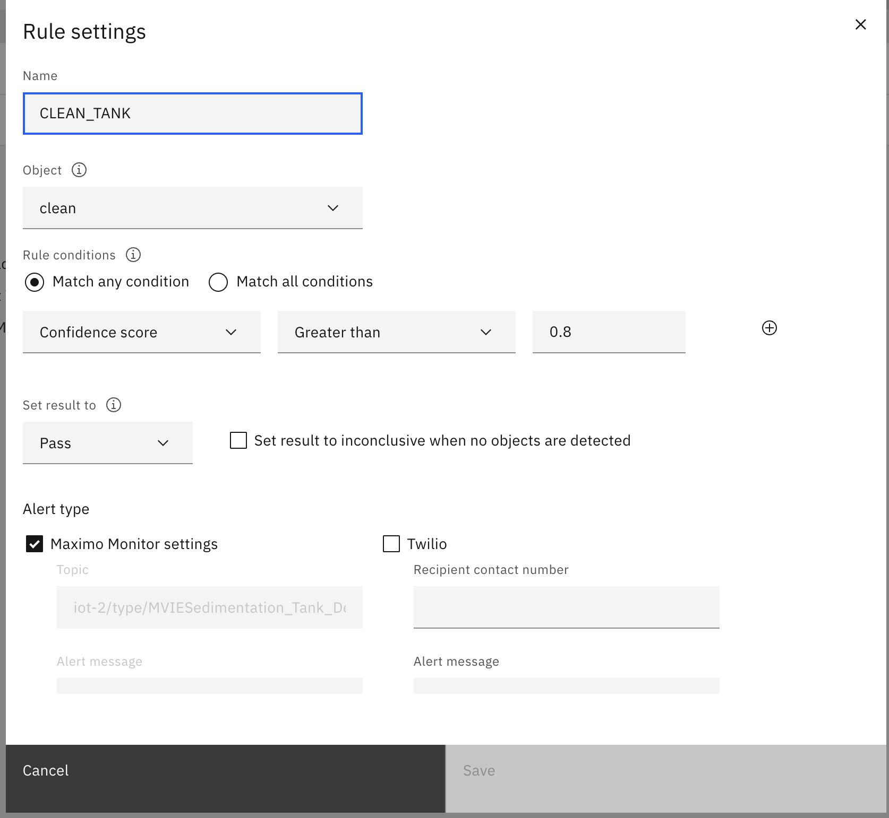

**Sample Dialogue:** Under the **Alert type** options, you can enable Maximo Visual Inspection Edge to send outbound alert messages to external recipients by configuring connections to an MQTT broker and the Twilio messaging service.

Using MQTT protocol, the Edge server integrates with other applications in the MAS Suite to display inspection alerts and enable the creation of work order requests, as you saw earlier in this demo with MAS Monitor (part one of this demo). In addition to MQTT, using Twilio, inspection results can be immediately sent as SMS to the concerned person by simply providing their contact number.

**Spanish Helper:**

En las opciones de **Tipo de alerta**, puede habilitar Maximo Visual Inspection Edge para enviar mensajes de alerta salientes a destinatarios externos mediante la configuración de conexiones a un intermediario MQTT y el servicio de mensajería Twilio.

Usando el protocolo MQTT, el servidor Edge se integra con otras aplicaciones en MAS Suite para mostrar alertas de inspección y permitir la creación de solicitudes de órdenes de trabajo, como vio anteriormente en esta demostración con MAS Monitor (primera parte de esta demostración). Además de MQTT, al usar Twilio, los resultados de la inspección se pueden enviar inmediatamente como SMS a la persona interesada simplemente proporcionando su número de contacto.

---

9. Click **Cancel** to exit out of the **Rule settings** window.

**Sample Dialogue:** Once the rule settings are complete,\*\* you are now performing batch processing on multiple tank images in a clean and dirty state. After running the inspections, the AI model will perform inference on each image and subsequently trigger inspection results as Pass or Fail, depending on the tank’s condition. Inspections can be initiated by either setting MQTT topic triggers, which will perform inspections by receiving remote triggers, or by setting time-based intervals. Inspection interval settings can be set according to the business requirements; for example, tank inspections could be set to take place every 24 hours (in seconds) etc.

**Spanish Helper:**

Una vez que se completa la configuración de la regla,\*\* ahora está realizando un procesamiento por lotes en varias imágenes de tanques en un estado limpio y sucio. Después de ejecutar las inspecciones, el modelo de IA realizará inferencias en cada imagen y, posteriormente, activará los resultados de la inspección como Pasa o Falla, según la condición del tanque. Las inspecciones se pueden iniciar configurando activadores de temas MQTT, que realizarán inspecciones al recibir activadores remotos, o configurando intervalos basados en el tiempo. La configuración del intervalo de inspección se puede establecer de acuerdo con los requisitos comerciales; por ejemplo, las inspecciones de tanques se pueden configurar para que se realicen cada 24 horas (en segundos), etc.

---

**Note:** To avoid unexpected errors in the demo environment you are not actually triggering a new inspection in this demo. Instead in the next steps you will be showing the pre-loaded inspection results to the clients.

10. Scroll up and click on the **Images** tab where the pre-loaded inspection result would be available for viewing.

11. In the Images tab, inspection results from the images in the input source are displayed. If there are no images on this screen, please click the **Refresh** icon a few times for the images to load.

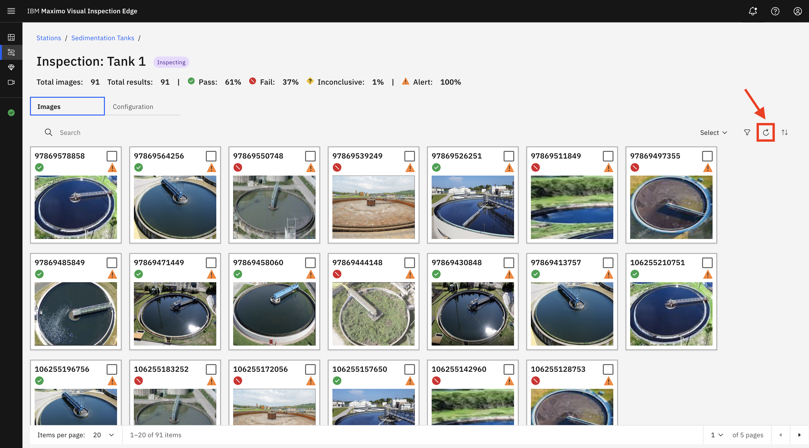

**Sample Dialogue:** All the inference results are displayed on a single screen along with important metadata. If a live feed was coming through, you will see the most recent inspection at the top left image. For convenience, icons on the images serve as a quick way to view inspection results. There is a green check mark for a clean tank and a **red X** for a dirty tank. There may also be a yellow question mark if the model is unsure about the result. A high rate of inconclusive results might indicate that the model’s performance is poor, the rule configuration is incorrect, or the quality of the camera images is compromised.

The exclamation points in the triangle indicate that the inspection result has been sent as alert notifications to Maximo Monitor via **MQTT or SMS via Twilio**, depending on the option(s) you selected in the Rules settings phase. Clicking on each of these images can show further details about the inspection, such as here you can see that the most recent tank inspection failed due to the poor tank condition, and an alert was immediately sent out about the inspection’s result. The prompt detection of the tank’s failing health helps the Water Resource Authority to avoid issues that often arise when a problem remains undetected or is detected too late. 🟢

**Spanish Helper:**

Todos los resultados de la inferencia se muestran en una sola pantalla junto con metadatos importantes. Si estaba llegando una transmisión en vivo, verá la inspección más reciente en la imagen superior izquierda. Para mayor comodidad, los íconos en las imágenes sirven como una forma rápida de ver los resultados de la inspección. Hay una marca de verificación verde para un tanque limpio y una **X roja** para un tanque sucio. También puede haber un signo de interrogación amarillo si el modelo no está seguro del resultado. Una alta tasa de resultados no concluyentes podría indicar que el rendimiento del modelo es deficiente, que la configuración de la regla es incorrecta o que la calidad de las imágenes de la cámara está comprometida.

Los signos de exclamación en el triángulo indican que el resultado de la inspección se envió como notificaciones de alerta a Maximo Monitor a través de **MQTT o SMS a través de Twilio**, según las opciones que haya seleccionado en la fase de configuración de Reglas. Al hacer clic en cada una de estas imágenes, se pueden mostrar más detalles sobre la inspección, como aquí puede ver que la inspección del tanque más reciente falló debido a las malas condiciones del tanque y se envió una alerta de inmediato sobre el resultado de la inspección. La pronta detección de la mala salud del tanque ayuda a la Autoridad de Recursos Hídricos a evitar problemas que a menudo surgen cuando un problema no se detecta o se detecta demasiado tarde.

---

**Important:** At this point in the demo script, you are far enough to pass Maximo Visual Inspection Technical Sales Level 3 Badge.

 

## MVI Mobile Inspections and Optional SMS alerts

This is an optional part of the demo. Please note, in addition to the MVI training server, you would also need access to an iOS mobile device (iPad or an iPhone) to demo this part because the MVI Mobile application is only available on iOS mobile devices (at the time of writing).

_Figure 2: Access to the MVI training server and iOS Mobile device is required_

**Sample Dialogue:** Now, let us see how a model trained on the Maximo Visual Inspection server can be used to perform inspections using IBM Maximo Visual Inspection Mobile (MVI Mobile) app. Maximo Visual Inspection (MVI) Mobile is a native iOS/iPadOS mobile app that runs on Apple devices such as the iPhone and iPad. This provides a low barrier to entry in terms of hardware costs and time to value. The sophisticated optics on Apple devices are combined with the ability to run models generated from the MVI core application, with native 5G support allowing clients to run
inspections at scale.

Like the rest of the applications in the MVI solution, MVI Mobile delivers agility with point-and-click ease but through the footprint of a mobile app, while providing a powerful real-time AI-powered inspection point and data management platform. In a matter of hours, clients can train complex computer vision models on the core MVI platform and deploy the trained model to the MVI Mobile device to perform inferencing.

The mobile application can be configured by either a handheld mode or a fixed position mode. For example, consider a fixed camera that can take photos of welds on a manufacturing line and perform an automated inspection on the spot. Being able to determine at this point that a particular weld is bad has many benefits. Not only are you preventing this part from finding its way into the hands of a customer (either as the part itself or as a component in a larger item) – which could have disastrous consequences, depending on the item – but this could be a symptom of an issue with the welding equipment, and identifying and fixing the problem early means less wasted product. Similarly, with the hand-held mode a quality inspector can easily carry the mobile device to an inspection site and harness the power of a powerful AI model to detect any anomalies by simply clicking a picture of the inspected part. The result is a dramatic improvement in production quality inspection.

**Spanish Helper:**

Ahora, veamos cómo se puede usar un modelo entrenado en el servidor Maximo Visual Inspection para realizar inspecciones usando la aplicación IBM Maximo Visual Inspection Mobile (MVI Mobile). Maximo Visual Inspection (MVI) Mobile es una aplicación móvil iOS/iPadOS nativa que se ejecuta en dispositivos Apple como iPhone y iPad. Esto proporciona una barrera de entrada baja en términos de costos de hardware y tiempo de valor. La óptica sofisticada de los dispositivos Apple se combina con la capacidad de ejecutar modelos generados a partir de la aplicación central MVI, con soporte 5G nativo que permite a los clientes ejecutar
inspecciones a escala.

Al igual que el resto de las aplicaciones en la solución MVI, MVI Mobile ofrece agilidad con la facilidad de apuntar y hacer clic, pero a través del espacio de una aplicación móvil, al tiempo que proporciona una poderosa plataforma de gestión de datos y puntos de inspección en tiempo real impulsada por IA. En cuestión de horas, los clientes pueden entrenar modelos complejos de visión por computadora en la plataforma principal de MVI e implementar el modelo entrenado en el dispositivo MVI Mobile para realizar inferencias.

La aplicación móvil se puede configurar en modo portátil o en modo de posición fija. Por ejemplo, considere una cámara fija que pueda tomar fotografías de soldaduras en una línea de fabricación y realizar una inspección automatizada en el lugar. Ser capaz de determinar en este punto que una soldadura en particular es mala tiene muchos beneficios. No solo está evitando que esta pieza llegue a manos de un cliente (ya sea como la pieza misma o como un componente de un artículo más grande), lo que podría tener consecuencias desastrosas, según el artículo, sino que esto podría ser un síntoma. de un problema con el equipo de soldadura, e identificar y solucionar el problema a tiempo significa menos producto desperdiciado. De manera similar, con el modo portátil, un inspector de calidad puede llevar fácilmente el dispositivo móvil a un sitio de inspección y aprovechar el poder de un poderoso modelo de IA para detectar cualquier anomalía simplemente haciendo clic en una imagen de la pieza inspeccionada. El resultado es una mejora espectacular en la inspección de calidad de la producción.

---

The following part of this demo will demonstrate the core capabilities of MVI Mobile using the pre-trained water sedimentation computer vision model.

### Step 1: Integrating MVI Mobile with the MVI Training server

**Actions:**

1. Open MVI Mobile application on your iOS Mobile device installed in the [ Pre-work : Step 3 ](#_page0_x57.00_y68.00)section. You will land on the **Global Settings** page where you can configure various options in MVI Mobile. On this page, enable **Handheld Mode** by sliding the switch to the right.

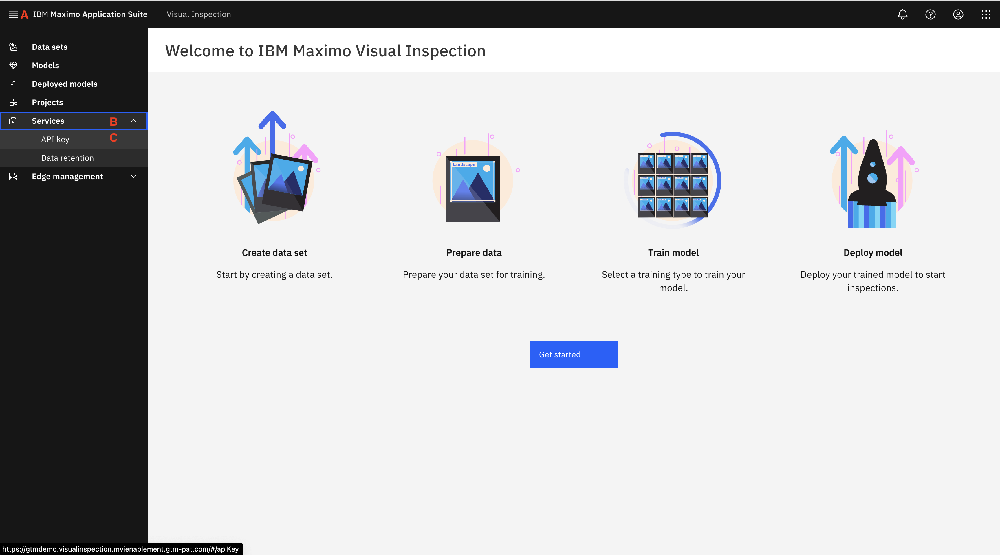

**Sample Dialogue:** To integrate MVI training server with the MVI Mobile application you can simply make use of the QR code functionality. A QR code can be generated from the MVI training server that is scanned by the MVI mobile application for automatic integration as you will see in the next steps.

Please ensure that you are logged in on IBM MVI training server on your computer . In the next few steps, you will be required to scan a QR code that appears on the MVI training server screen from your iOS mobile device.

2. On the MVI training server, click on the **API key** sub-menu option from the left side panel under the **Services** menu.

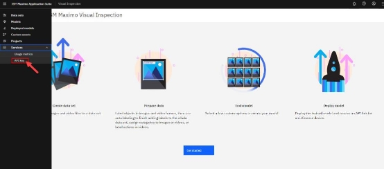

3. API Key screens appear with an API key (Application Programming Interface Key) and a QR code. In the next step you will point your iOS mobile device to this QR code for scanning and automatic application integration.

4. Using your iOS mobile device, click “**Scan QR Code**” option on the Global Settings screen of the MVI Mobile application. The camera screen appears that is ready to scan the QR code. Face your iPhone or iPad camera to the QR code to automatically integrate MVI Mobile application and MVI training server.

Note: You also have an option to manually type the API Key that is generated on MVI training server.

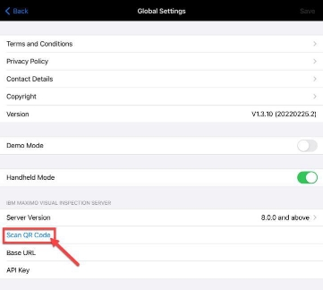

5. Once the QR code is successfully scanned, click **Save** on the top right corner of the screen (figure not shown for this step).

**Sample Dialogue:** Once the integration is completed, the main Inspections page appears. This is where inspections are created and managed with the help of MVI projects.
  

### Step 2: Creating Inspections in MVI Mobile

1. To create a new inspection, click on the **blue plus sign** on the top right corner of the left panel.

2. A new screen opens. Enter a name for the inspection in the **Inspection Name** field (e.g., “Detect Clean and Dirty Sedimentation Tanks”) **(A)**.
3. Select your project by clicking on **Project Select >** and then click on “Sedimentation Tanks Model Project” from the drop-down menu **(B)**.

4. Once you have selected your project, you will be presented with additional configuration settings for the inspection being created. Click on **Model**. The default is to have no model (Collecting Mode Only), but you want to inspect tank images, not just collect only. So, select the pre-built AI model **DO NOT DELETE – OBJECT DETECTION MODEL FOR TANKS** from the presented list.

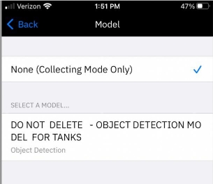

5. Now you can set inspection rules and thresholds that will determine when an inspection should be categorized a _Pass_ or _Fail_. For this, click **Set Thresholds**.

**Sample Dialogue:** On the **Set Thresholds** screen, you can specify whether an inspection is considered a _Pass_ or a _Fail_.

Associated with each label is a threshold value and a **Fail when below threshold** condition. The inspection will be marked as a _Fail_ if the confidence returned for a label is above its specified threshold or below the threshold if Fail when below threshold option is toggled on. There is also a **No Action** option which allows users to ignore the result when the object is detected.

For your model, you have both clean and dirty (tank) labels. For simplicity, let us focus on the dirty tanks, as such, you will only consider an inspection to be a failure if you find the condition of the tank to be dirty. You want to be extra careful so you will set the threshold for the dirty tank confidence level to be above 50%. On the other hand, no further actions are required for the clean sedimentation tanks. Therefore, you are going to effectively disable the clean tank rule as shown in the upcoming steps.

**Spanish Helper:**

Asociado con cada etiqueta hay un valor de umbral y una condición de **Fallo cuando está por debajo del umbral**. La inspección se marcará como _Falla_ si la confianza devuelta para una etiqueta está por encima de su umbral especificado o por debajo del umbral si la opción Falla cuando está por debajo del umbral está activada. También hay una opción **Sin acción** que permite a los usuarios ignorar el resultado cuando se detecta el objeto.

Para su modelo, tiene etiquetas limpias y sucias (tanque). Para simplificar, centrémonos en los tanques sucios, como tal, solo considerará una inspección como un fracaso si encuentra que la condición del tanque está sucia. Desea tener mucho cuidado, por lo que establecerá el umbral para que el nivel de confianza del tanque sucio esté por encima del 50 %. Por otro lado, no se requieren más acciones para los tanques de sedimentación limpios. Por lo tanto, deshabilitará efectivamente la regla de tanque limpio como se muestra en los próximos pasos.

---

6. Tap **Advanced** under the **Clean** label.

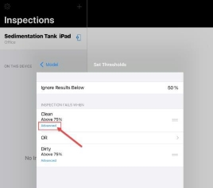

7. On the Advanced screen for a clean tank, Enable **No Action** by sliding the switch to the right

**(A)** and then click **Set Thresholds** to go back **(B)**.

 

8. Now click Advanced under the **Dirty** label and set the threshold value to 50% **(A).** Click **Set Thresholds** to go back **(B)**

9. The threshold values you set will appear as shown on the screenshot below. Once verified, click

**< Model** to go back to the model selection screen.

10. The **Model** window screen appears. Click **< Back** to go back to the **Create New Inspection** screen.

11. Each inspection in MVI mobile is required to have a dataset assigned for storing the inspection images. To specify the dataset, On the Create New Inspection window screen, click the light grey **Select >** option from the **Data Set** row.

12. **Data Set** window opens. Click **Create New Data Set**.

13. Enter “\<YOUR INITIALS\> Sed Tank Device Images” in the Data Set Name field and click **Done** to return to the Create New Inspection window screen. This Data Set is where your images captured on your device will be uploaded on the MVI Core instance.

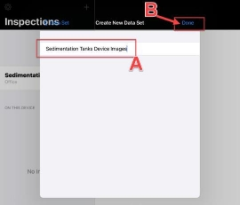

14. To set a value for the **Trigger String** enter this text “Tank Inspection”**.** Click **Done**.

15. At this point, an inspection is successfully configured in MVI Mobile. Here is what will be displayed when it is done.

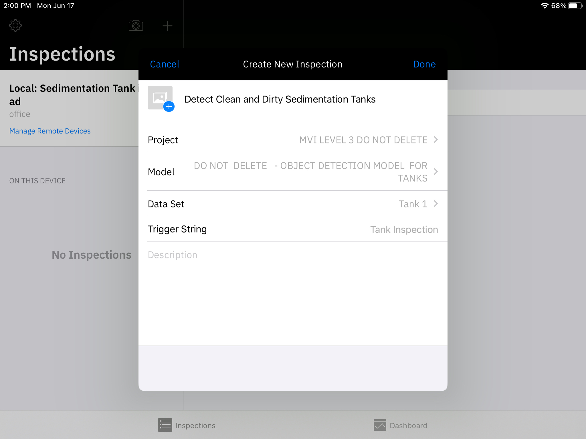

If you ever want to delete an inspection that you have created, simply click **Edit** on the top right of the inspection screen and you’ll be presented with an option to delete the inspection at the bottom left of the small window screen that appears (please don’t try this right now to avoid accidental deletion of the inspection).

  

### Step 3: (Optional) Integrating MVI Mobile with Twilio Account

**Sample Dialogue:** Although you can still go ahead now and perform inspections. However, like MVI Edge, MVI Mobile offers easy integration with the[ Twilio application ](#_page0_x57.00_y68.00) so that SMS alerts about the inspection results can be sent to the concerned person. This would be incredibly beneficial for us since the field supervisor for the Water Resource Plant is usually away on inspection rounds. Using this feature, they can immediately receive SMS alerts if the tank health is deteriorating without the need to constantly monitor inspection results by staying in front of the computer screen.

**Spanish Helper:**

Aunque todavía puede seguir adelante ahora y realizar inspecciones. Sin embargo, al igual que MVI Edge, MVI Mobile ofrece una fácil integración con la [aplicación Twilio] (#\_page0_x57.00_y68.00) para que se puedan enviar alertas por SMS sobre los resultados de la inspección a la persona interesada. Esto sería increíblemente beneficioso para nosotros, ya que el supervisor de campo de la planta de recursos hídricos suele estar ausente en las rondas de inspección. Con esta función, pueden recibir alertas por SMS de inmediato si el estado del tanque se está deteriorando sin la necesidad de monitorear constantemente los resultados de la inspección permaneciendo frente a la pantalla de la computadora.

---

**Actions:**

1. Click on the **blue gear and phone** icon to open the **Configure Device** page.

2. Configure Device page opens, click **Twilio Settings** to enter the Twilio trial account details noted during the Pre-work : Step 4.

3. On **Twilio settings** page enter all the required details in this section. Note, that Supervisor number is any phone number where you would want the inspection alerts to be sent during the demo (this is usually your personal or corporate phone number). Once all the information is entered click **Save**. (Remember to delete this information after the demo as described in the demo Appendix B: Demo Cleanup steps).

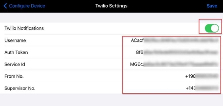

It will be easier to simply copy-paste details from the Twilio account here instead of attempting to type these codes.
  

### Step 4: Performing Inspections in MVI Mobile

**Actions:**

1. From the main Inspections page, with your inspection selected and displayed on the right side of the screen (as in the screenshot below), click the **Capture** button. This will turn on the camera on your mobile device.

**Sample Dialogue:** Mobile device’s camera screen is now enabled. If a model was not specified within an Inspection, it is in Collect mode - it takes photos and uploads to a dataset in IBM Maximo Visual Inspection to be labelled and then for a model to be trained

When you specify a model within an inspection (as you did in this demo) it is in the Inspect mode which also takes photos but then uses the trained model to run inference on the images and upload results to the specified dataset in IBM Maximo Visual Inspection.

2. For this demo, you will run inference on an _image of an image_ of a tank. For this, on your laptop, please open one of the tank images downloaded in the Prework Step 2 section and keep it on the display for the next step.
3. Take a photo of a clean or dirty tank image displayed on your computer or projector screen (you are basically taking image of an image in this step).

The photo will remain on the display on your mobile device, so please press the **back (\<)** button to go back to the camera view. Here are some examples of what you might see after a few inspections.

**Sample Dialogue:** Depending on the accuracy of the model, it has identified clean and dirty tanks in the photo. Since you are taking an image of an image it is possible that the model may struggle to accurately identify tanks or tank’s health in the image. In a real setting this could be resolved with taking an image of the actual object (and not an image of an image) or with more data and training for higher model accuracy. Note that in addition to the bounding boxes superimposed on the photo itself, the bottom of the screen shows the confidence level associated with each inferred object.

**Spanish Helper:**

Dependiendo de la precisión del modelo, ha identificado tanques limpios y sucios en la foto. Dado que está tomando una imagen de una imagen, es posible que el modelo tenga dificultades para identificar con precisión los tanques o la salud del tanque en la imagen. En un entorno real, esto podría resolverse tomando una imagen del objeto real (y no una imagen de una imagen) o con más datos y entrenamiento para una mayor precisión del modelo. Tenga en cuenta que, además de los cuadros delimitadores superpuestos a la propia foto, la parte inferior de la pantalla muestra el nivel de confianza asociado con cada objeto inferido.

---

You have now performed a successful inspection using the combined power of IBM Maximo Visual Inspection Mobile and IBM Maximo Visual Inspection!

4. You can click **“Cancel”** at any point to go back to the main **Inspections** screen.
5. If you followed the steps for Twilio integration and entered a supervisor number, then you may have received SMS alerts on the number you entered in the Twilio settings section.

  

### Step 5: Exploring the MVI Mobile Dashboard

In the previous section you defined the rules that determine whether a specific inspection (photo) represents a failure or not. You can get a collective view of inspections that have passed and failed in MVI Mobile’s Dashboard (like the MVI Edge Server environment).

1. From the **Inspections** screen, click on **Dashboard**, the second option at the bottom of the screen.

2. Here you need to first select the project that you want to view. Click the **ellipses** icon (blue circle icon with the 3 dots) and then click **Select Project**.

3. In the dashboard configuration screen, leave **IMAGES TO DISPLAY** scroll bar as-is.
4. For **SELECT A PROJECT section**, choose **Sedimentation Tanks Model Project**.

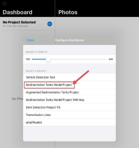

5. Click on **Data set Select \> (A)** and then choose **Sedimentation Tanks Device Images** (the data set you created earlier).

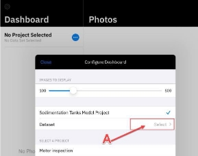 

6. This will bring you to the main dashboard screen, and here you will see statistics associated with the photos taken during the inspections. It includes all photos taken during inspection. These statistics include:

- Total number of inspection photos
- Total number of collected photos
- Fail rate for inspection
- Pass rate for inspection

You can see pass and fail rate for the inspections that were performed.

**Congratulations!** You have just used IBM Maximo Visual Inspection Mobile to identify dirty water sedimentation tanks!

**Sample Dialogue:** This concludes the demonstration. You observed how the MVI AI model sends inspection alerts to the Maximo Monitor. You also performed the steps to build a computer vision model and used that model to configure inspections in MVI Edge and in MVI Mobile. Lastly, you can think of this comprehensive solution where an AI Computer Vision model sends critical alerts beyond the use case of sedimentation tanks and apply it in any mission-critical areas where it is essential to visually detect objects of interest repeatedly at a fast pace and scale. A small assortment of examples includes fast-paced product lines, transmission lines, quality assurance, etc.

**Spanish Helper:**

Esto concluye la demostración. Observó cómo el modelo MVI AI envía alertas de inspección a Maximo Monitor. También realizó los pasos para crear un modelo de visión por computadora y usó ese modelo para configurar inspecciones en MVI Edge y en MVI Mobile. Por último, puede pensar en esta solución integral donde un modelo de AI Computer Vision envía alertas críticas más allá del caso de uso de tanques de sedimentación y aplicarlo en cualquier área de misión crítica donde es esencial detectar visualmente objetos de interés repetidamente a un ritmo rápido y escala. Una pequeña variedad de ejemplos incluye líneas de productos de ritmo rápido, líneas de transmisión, control de calidad, etc.

---

## Demo Cleanup

Once the demo is successfully completed you are required to perform a few clean up tasks to ensure that the demo application environment is not overloaded, and your personal Twilio account information is successfully deleted from the shared demo environment.

 

### Step 1: Remove your Original and Augmented Datasets from MVI

1. On MVI’s main **Data sets** page, select your Original and Augmented datasets (**A**) and click the **trashcan** icon to delete both these datasets (**B**).

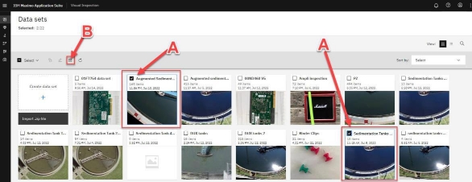

2. **Delete data set** window opens. Click **Delete** to confirm datasets deletion.

 

### Step 2: Remove Twilio account details from MVI Mobile application

Like the Edge environment you may need to delete Twilio account details from your MVI Mobile application (if you followed the steps to demo the optional Part Four)

1. Open MVI Mobile application and click on the **gear and phone** icon next to your inspection title (Sedimentation Tank iPad)

2. Configuration Device page appears. Click on Twilio Settings to view your account details.

3. Disable the Twilio Notifications toggle and delete all your account information on this page. Once deleted click **Save.**

