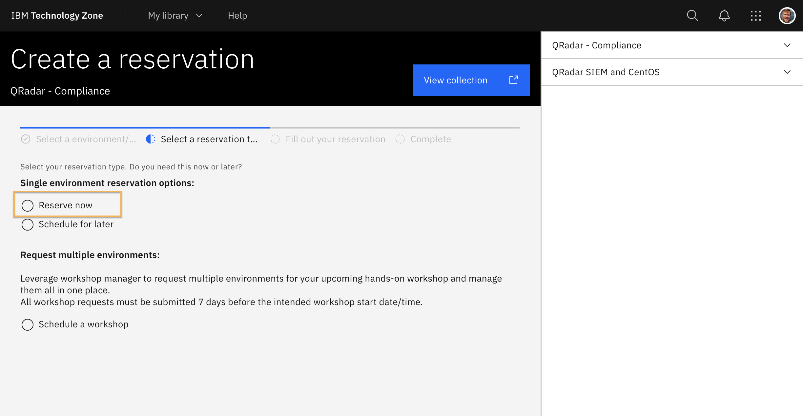
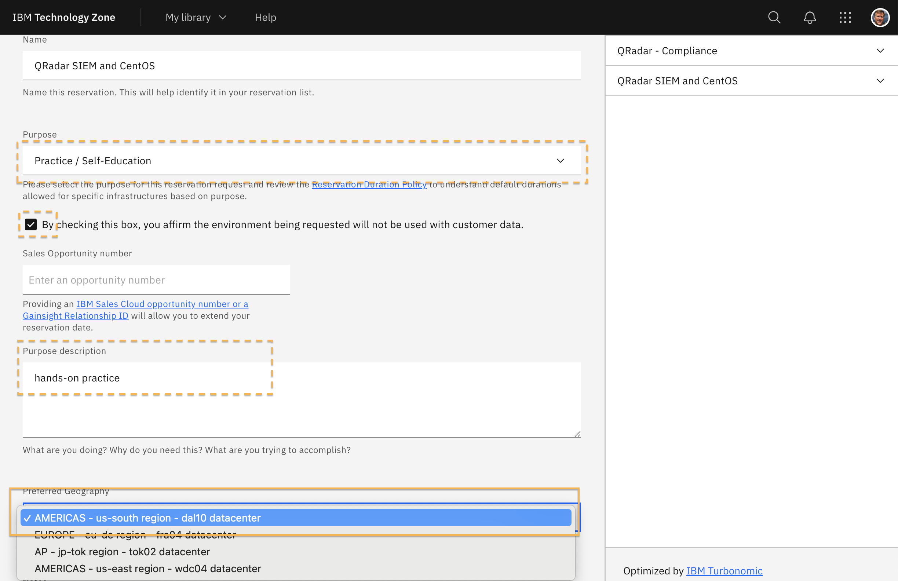
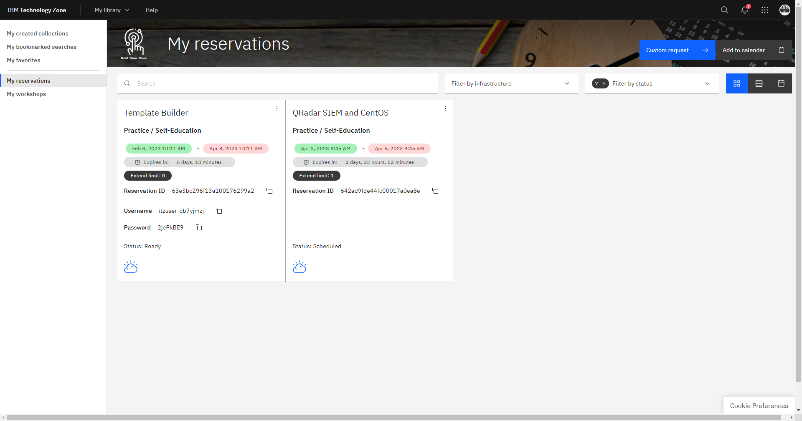
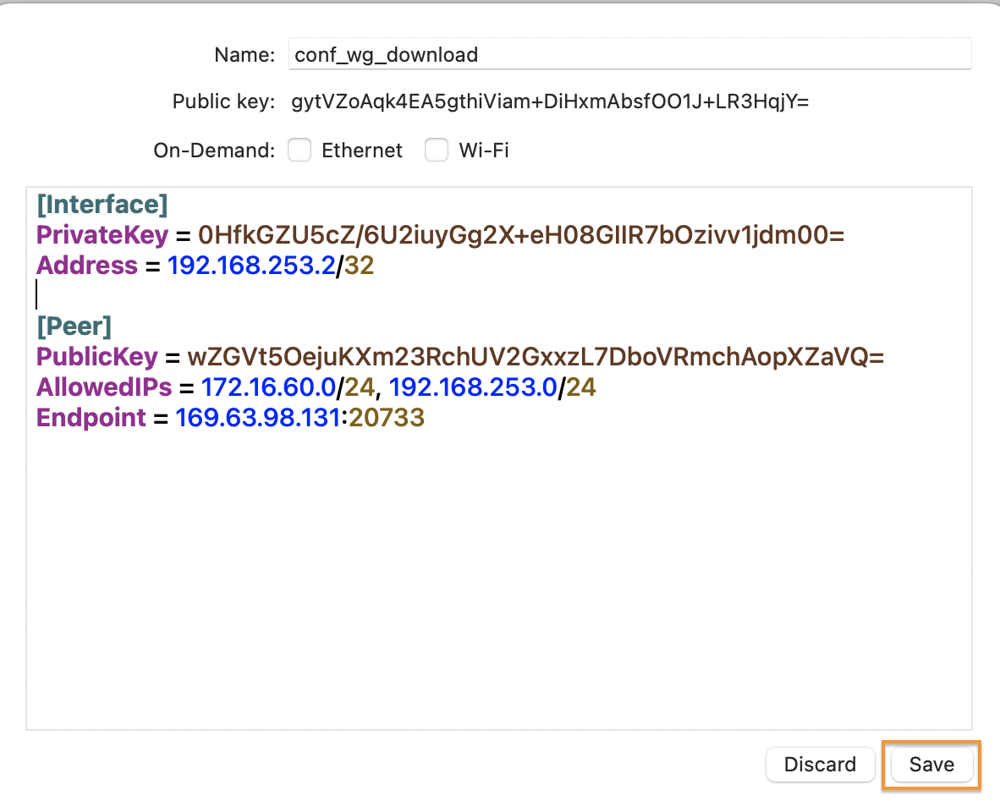
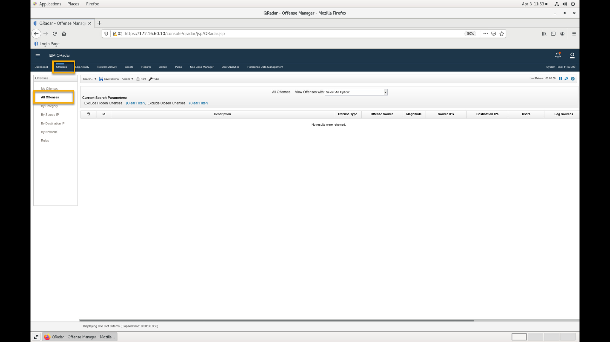
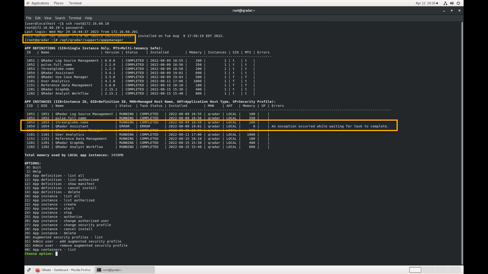
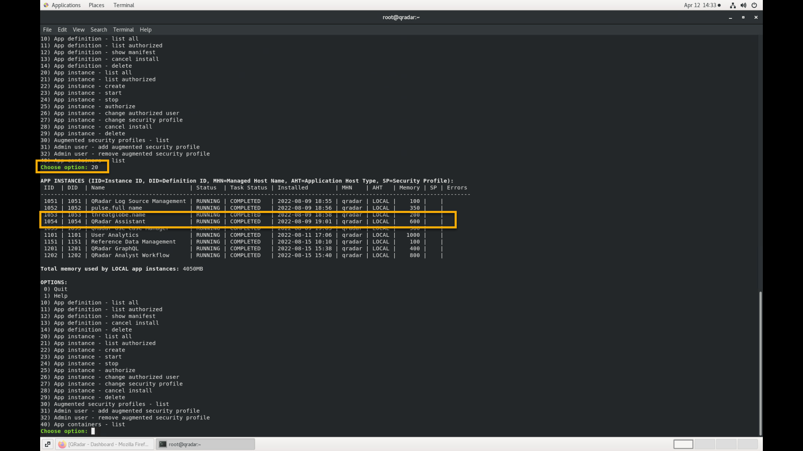

# Demonstration Preparation Guide

## Introduction

In this lab, you will set up a demo instance of QRadar Security Information
and Event Management product with sample data. Afterwards, the environment
can be used for exploring the product key features or delivering a demo to
a customer.

Here are supplemental links for you to use **after** completing
the in-person workshop.

* View the [video example](https://ibm.seismic.com/Link/Content/DCDJ8qCbhJPB28MTDjXBpB63WP7d)
    that shows how this demo can be delivered.

* Request a new live demo by using the [QRadar Instance reserved on the Tech Zone](https://ibm.biz/L300-SEIM-TZ).

* Prepare the demo as described in this [demonstration preparation guide](/qradar-siem/102).

* \[OPTIONAL\] Use the [virtual demo, also known as a click-through demo,](https://ibm.seismic.com/Link/Content/DCMh7JWdbXjQR89MR2TRjBJmPhJG)
    for this usecase.

### Prerequisites

Although it is not required, for the best experience, using a VPN with [WireGuard](https://www.wireguard.com/) is strongly recommended. Please install this application on your workstation before completing attempting to connect to QRadar using the direct URL or direct SSH. If you are using a Microsoft Windows platform 10 or later, it includes a SSH client. Otherwise you can install [PuTTY](https://www.putty.org/) or [git bash](https://gitforwindows.org/) for direct SSH access.

### \[OPTIONAL\] Request access to a live deployment

At a later time, if you want to demonstrate the use case using the live system, you can
request access to the QRadar SIEM demo system on the IBM Technology
Zone. For the in-person workshop, these steps have been performed for you, so skip ahead to the [next section](#learn-about-lab-architecture-and-get-access)

1. Use the following link for access to the QRadar instance on the IBM
    TechZone.

    [https://ibm.biz/L300-SIEM-TZ](https://ibm.biz/L300-SEIM-TZ)

    **Hint**: The URL is case sensitive.

1. Use your IBMid to authenticate to the site.

1. From the left menu bar, select **Environments**.

    

1. Click **Reserve**.

    

1. Select **Reserve now**.

    

1. At the Fill out your reservation form, populate all fields, and for
    Preferred Geography, choose the geography data center that is
    closest to you to reduce latency and to improve the demo experience.

    

1. Select an appropriate reservation time and select **Enable** for VPN Access to include a configuration file for Wireguard.

    > The demo also offers two extensions.

    

1. **Submit** your reservation.

1. To see the status of your new environment, go to **My
    reservations**.

    [https://techzone.ibm.com/my/reservations]

    

    **Hint**: The reservation takes about **30 minutes** to provision. Then
    you can access the demo.

## Learn about lab architecture and get access

The QRadar SIEM lab uses two virtual machines.

* CentOS 8

* QRadar SIEM

The Linux CentOS system is used as the Jump System to access the
QRadar SIEM virtual machine over SSH (terminal) and HTTPS (browser).

* For SSH access use the root account and password `Q1d3m0`

* For HTTPS access, use the `admin` account and password `Q1d3m0.Demo`


For the fastest response, we recommend to [use VPN to directly access the lab](#using-wireguard-vpn-to-access-the-lab), but if you do not want to set up the additional software, which consists of WireGuard and an SSH client, you can use a web browser to [access a virtual desktop on the Jump Server](#using-the-jump-server-to-access-the-lab)

### Using WireGuard VPN to access the lab

You should already have [WireGuard](https://www.wireguard.com/) installed and running on your workstation.

1. After the demo is provisioned, from the My reservations page, click
    your reserved demo.

    

1. Scroll to the bottom of the reservation page and click on the download for the VPN configuration

    

1. After the `conf_wg_download.conf` file has downloaded, from the WireGuard application, select **Import tunnel(s) from File** option

1. Select the file using the file browser and click on **Import**. Immediately after, if you are prompted by the application or operating system to add the tunnel, **Allow** the request.

    

1. With the configuration selected in the **Manage WireGuard Tunnels** panel, select on **Edit**.

1. Select and remove the **DNS** entry as this lab will not require access to resolve DNS names over the VPN.

    

1. **Save** the updated configuration

    

1. Click on the **Activate** button to enable the VPN tunnel and the status will change to **Active**.

1. Access the QRadar console. In a browser tab, open [https://172.16.60.10](https://172.16.60.10), accept any certificate warnings that are presented and log in with the user `admin` and the password `Q1d3m0.Demo`, then click **Login**

    

If the login is successful, you are set with direct access from your workstation to the QRadar live instance. Skip ahead to [verify the environment](#verify-and-configure-the-live-demo-setup).

### Using the jump server to access the lab

1. After the demo is provisioned, from the My reservations page, click
    your reserved demo.

    

1. Scroll to the bottom of the reservation page and click the blue
    button for the VM Remote Console to the CentOS system.

    

1. In the new pop-up window, click **Open in a new window**.

    

1. For the best experience, in the new window, click **Full screen**.

    

    You now have access to the demo. Verify the system and inject some demo
    data before you proceed with the demonstration steps.

1. From the CentOS desktop, open the **Applications \> Favorites \>
Firefox**.

    

1. On the login page, if needed, provide the admin password
    (Q1d3m0.Demo) and click **Login**.

        

## Verify and configure the live demo setup

Whether you are using a direct connection through WireGuard or a connection via the jump server, it is now time to verify the system.
To verify that your system is working, perform the following steps.

### Access the QRadar Console from the CentOS system

In the QRadar Console, go to **Offenses \> All offenses**.

    

1. Confirm that you do not have any open offense.

   > If you do have open offenses, clear the offenses before you run the
demo with these steps, otherwise continue in the next section.

   * Select all offenses, then expand **Actions** and select **Close**.
   * 
   * In the Close Offense window, for the *closing reasons* select False-positive and in the notes section type test.

### Generate the random events

Before starting with the demo, you must generate event data and the
offenses.

1. *If using the remote deskop on the Jump Server* open a terminal by, selecting to **Applications \> Favorites \>
    Terminal**.

    

1. Use this command in either a local (vpn) or remote (jump server desktop) terminal to `ssh` to the QRadar server.

    ```bash
    ssh root@172.16.60.10
    ```

1. At the prompt type the root password: `Q1d3m0`

1. To run the random event generator, type the following commands

    ```bash
    cd /labfiles
    ./noiseOn.sh
    ```

1. Allow the generator to run for **15 minutes**, so the events result in random
    offenses. Continue with the remaining steps in the lab while waiting.

### Verify New UI

1. Switch back to the browser.

1. In the QRadar Console, go to the **Log Activity** tab.

1. Confirm that you see new real-time events populating the Log
    Activity view.

    

1. Click the collapsed menu icon in the top-left corner to open the main menu, and then click **Try the New UI**.

1. In the New UI, confirm that you see the other important apps for the
    demo.

    * Pulse

    * Use Case Manager

    * Reference Data Management

    * User Analytics

    * Assistant

    

## \[Optional\] -- troubleshooting the apps if they do not show up in the New UI

1. Switch back to the terminal window, or from the Jump Server, go to
    **Applications \> Favorites \> Terminal**.

    

1. If needed, reconnect to the QRadar SSH console.

   ```bash
   ssh root@172.16.60.10
   ```

1. At the prompt, type the root password: `Q1d3m0`

1. To verify status of all apps, type the following command

    ```
    /opt/qradar/support/qappmanager
    ```

    

1. Inspect the status of all apps. If some app is not in the RUNNING
    state, type option 23.

1. Then, type ID that correlates to the Admin Name. Most likely it is
    2.

1. Type the instance ID that is not in the running state. In this case
    it is 1054.

    

1. Wait for **a few minutes**, and run option 20 to confirm that the
    app is brought into the RUNNING state.

    

1. If the app is not in the running state, wait a few more minutes and
    type option 20 again.

    You can repeat those steps for all apps that are not in the RUNNING
    state.

1. At the end, exit the app manager using the option 0.

## Inject the data that is use case specific

To consistently and reliably demonstrate the SIEM solution, in addition
to random events and offenses, you also must inject the events that are
use case specific, by using the following shell script in the QRadar SSH
terminal console.

If you already have the SSH terminal with QRadar open, run the following
commands. (If you have closed the QRadar SSH terminal session, use the [Generate the random events](#generate-the-random-events) section steps to reconnect to QRadar.):

```bash
cd /labfiles
./runUC.sh
```

Wait for the script to complete (about **5 minutes**).


At this time, setup of the demo environment is ready. You now can start the demo and follow the guidance in the [Demonstration Script](/qradar-siem/102).
