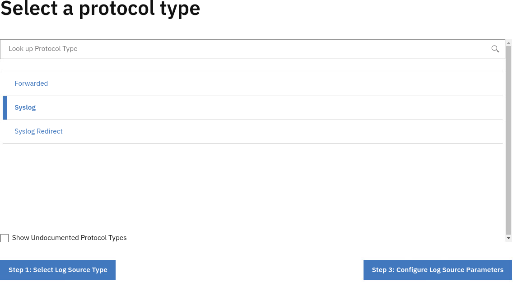

# Log Sources

## Introduction

The core functions of IBM QRadar SIEM are managing network security by monitoring flows and events.

A significant difference between event and flow data is that an event, which typically is a log of a specific action such as a user login, or a VPN connection, occurs at a specific time and the event is logged at that time. A flow is a record of network activity that can last for seconds, minutes, hours, or days, depending on the activity within the session. For example, a web request might download multiple files such as images, ads, video, and last for 5 to 10 seconds, or a user who watches a Netflix movie might be in a network session that lasts up to a few hours. The flow is a record of network activity between two hosts.

### Events

QRadar accepts event logs from log sources that are on your network. A log source is a data source such as a firewall or intrusion protection system (IPS) that creates an event log.

QRadar accepts events from log sources by using protocols such as syslog, syslog-tcp, and SNMP. QRadar can also set up outbound connections to retrieve events by using protocols such as SCP, SFTP, FTP, JDBC, Check Point OPSEC, and SMB/CIFS.

If QRadar has never received events from a log source, the new events are listed with a Low Level Category of "Unknown" in the Log Activity tab. QRadar can autodiscover many log sources, and after a certain amount of time (or processed log events), QRadar will properly assign the correct log source. Sometimes, however, QRadar cannot figure out the proper log source behind the collected data, and those events show a Low Level Category of "Stored".

In this lab, you configure QRadar to recognize an unknown event. You extract additional properties from the raw event payload. You use the Log Source Management (LSM) app to configure and manage single and bulk log sources. You also test a new log source.

## Analyzing an Unknown Event

In this exercise, you will analyze an event received from an unknown log source. When processed by the event pipeline, this type of event is labeled as KNOWN. When events are detected for the wrong log source type, they are assigned the STORED low level category. After they are analyzed, you might decide what new log sources you need to create.

To simulate sending the log sources to QRadar, you log in to the QRadar Console by using the SSH terminal and running a script.

> If you are using the Wireguard VPN configured in **101: QRadar Demo Setup** to access the demo environment then you can perform the following activities from your workstation. If you have not configured VPN access you can perform the activities from the jump server.

1. Open the browser and access the Console at the following URL:

 ```bash
 https://172.16.60.10
 ```

2. Log in by using the admin account and password "Q1d3m0.Demo".

3. To load default search filters, double-click the **Log Activity** tab.

 > These exercises classic QRadar UI and not the New QRadar UI.
 >
 > If you need to return to the classic UI, go to the URL: [https://172.16.60.10](https://172.16.60.10).

1. Do NOT close the browser. While your browser is waiting to display real-time events, open the SSH terminal and log in to QRadar as root by using the following command:

  ```bash
  ssh root@172.16.60.10
  ```

1. At the password prompt, type "Q1d3m0".

1. To generate events, type the following commands:

 ```bash
 cd /labfiles/extended/labfiles/logsources
 ```
  
 ```bash
 /opt/qradar/bin/logrun.pl -f checkpoint1.syslog 1
 ```

 > The /labfiles/extended/labfiles directory was uploaded to the QRadar server in the **103: Advanced Lab Setup** exercises.

1. Go back to the browser window.

 > **Note:** The Console detected three events with the STORED Low Level Category. Because we use the localhost context for these events (127.0.0.1), the Event Name can vary. In the screen captures below you see an Event Name of "Search Results Message", but it can also be "Anomaly Detection Engine" or others.

1. To open any of the events, click the **pause** icon in the upper-right part of the Console. This action pauses the real-time event capturing.

1. To review the event details, double-click any of the three events.

 

1. On the Event details page, scroll down to the Payload Information section and click **Wrap Text**.

 

1. Analyze the raw payload and note that the source and destination IP addresses are not parsed correctly by comparing the addresses with the ones listed in the Source and Destination Information section.

At this point, you conclude that QRadar did not correctly process this event. You can determine the source of the generated log and create a proper log source. Also, on many occasions, if QRadar receives enough log events to process, it can autodiscover the log source and decide on the log source that best matches the events.

## Viewing Autodiscovered Log Sources

QRadar autodiscovers many log sources after it receives several logs of a specific type. You don't need to configure the log source for QRadar to recognize the events from that log source. In this exercise, you analyze an autodiscovered log source.

1. Start with the Console. To load default search filters, double-click the **Log Activity** tab.

2. Then, in the QRadar SSH terminal, run the following script from the /labfiles/extended/labfiles/logsources directory:

 ```bash
 /opt/qradar/bin/logrun.pl -f checkpoint.syslog 10
 ```

3. Go back to the browser window and observe the events that are displayed in the Console.

4. After about 30 seconds, you notice that the Event Name column starts to show Firewall Permit, the LogSource is named Check Point, and Low Level Category is updated to Firewall Permit.

 

5. To pause the real-time events, in the upper-right part of the Console, click the **pause** icon.

6. Double-click any **Firewall Permit** event, and note that the parsed Source IP and Destination IP match the IP addresses in the raw payload.

 

 You learned that QRadar can autodiscover some logs after it receives some events. However, not all logs are autodiscovered, and for these, you must create log sources manually by using the Log Source Management app. If you do not want to lose some of the information in the early events while you wait for QRadar to parse them, you can also use this method for the autodiscovered log sources.

## Use Log Source Management App to Configure a Log Source

In this exercise, you configure a Symantec Endpoint Protection log source and analyze the events from this log source. To configure a log source, you must use the Log Source Management (LSM) app.

1. From the browser, go to the Admin Console.

2. In the Admin Console, scroll to the Apps section and click **QRadar Log Source Management**.

3. In the LSM app, click **Log Sources.**

4. In the LSM app dashboard, in the upper-right part of the window, click **New Log Source**.

 

5. Click **Single Log Source**.

 

    > Stop and browse through the long list of available log sources. This shows you all the log sources QRadar can integrate with out of the box.

6. In the Select a Log Source Type step, in the **Look up Log Source Type** field, type "Symantec".

 

7. From the list, select **Symantec Endpoint Protection**.

8. Click **Step 2: Select Protocol Type**.

9. In the Select Protocol Type step, confirm that **Syslog** is highlighted.

 

10. Click **Step 3: Configure Log Source Parameters**.

11. In the Configure Log Source Parameters step, complete the parameters by using the following table.

    | **Parameter**     | **Value**                    |
    | ----------------- | ---------------------------- |
    | Name              | Endpoint Protection          |
    | Description       | Symantec Endpoint Protection |
    | Coalescing Events | OFF (disabled)               |

12. Click **Step 4: Configure Protocol Parameters**.

13. In the **Log Source Identifier** field, type `172.16.60.10`

14. Click **Finish**.

15. Close the **Log Source Management** app.

16. In the Admin Console, you see the message that "There are undeployed changes." Click **Deploy Changes**.

> **Hint:** Deploying changes in the lab environment can take \~ 1-2 minutes.

You manually created a new log source that uses the syslog protocol. After you create a new log source, you must deploy changes to the Console.

## Summary

This has been a very quick introduction to QRadar log sources. You have seen

* How to view QRadar's raw log stream
* How to analyze an event that does from an unrecognized source
* How to configure a log source

To view applications that provide log sources for QRadar visit the X-Force App Exchange at: [https://exchange.xforce.ibmcloud.com/hub?br=QRadar&con=CO31&ippc=64&ippr=64](https://exchange.xforce.ibmcloud.com/hub?br=QRadar&con=CO31&ippc=64&ippr=64).
