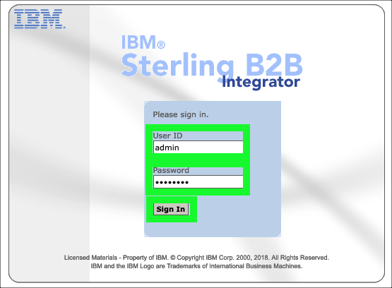
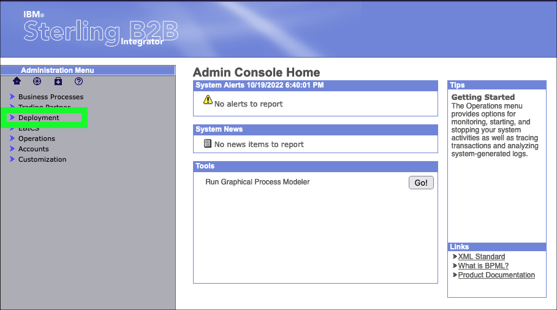
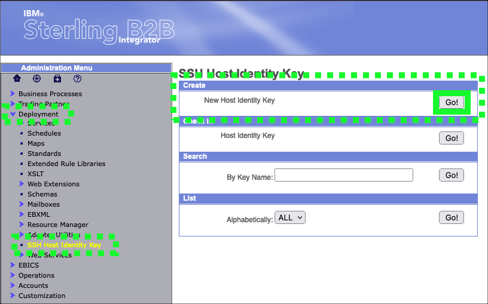
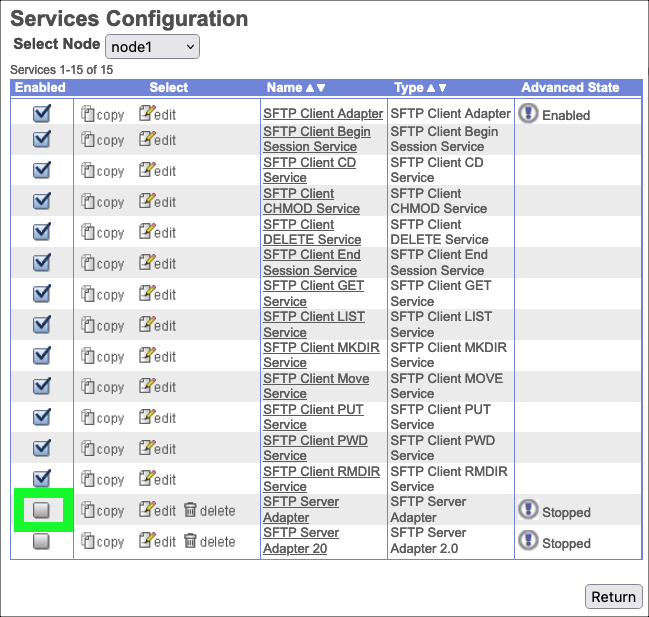

# B2Bi Configuration Part 1

In this chapter, learn how to configure a Secure File Transfer Protocol (SFTP) adapter using the containerized B2Bi deployment.

:red_circle: **PLEASE NOTE THAT THIS FIRST LAB WILL BE LEAD AND COMPLETED BY THE INSTRUCTOR ONLY** :red_circle:

This will be a group exercise to complete B2Bi Configuration Part 1 since there is only 1 SSH Host identity and 1 SFTP Server adapter needed for the full workshop. However, you may follow along with the steps shown as they are performed by the workshop leader. When repeating this setup for a client demonstration on your own, complete both B2Bi Configuration Part 1 **and** B2Bi Configuration Part 2.

## Open the B2Bi dashboard

The B2Bi dashboard runs as an application on Red Hat OpenShift. These steps will guide you in the OpenShift console to find and launch the B2Bi dashboard from the OpenShift Route.

1. In the OpenShift web console, click **Routes** under the **Network** section in left-hand panel.

   

1. Click the **All Projects** pull-down menu and click the **b2bi** project.

   

   :green_circle: Several BP quiz questions will come from the **OpenShift web console**. When taking the BP quiz make sure the ITZ environment is still active and keep this demonstration script open.

1. Notice all the routes that are currently defined in the b2bi Project, there are 15 of them

   

1. To start the setup of the SFTP adapter, launch the IBM Sterling B2Bi dashboard by clicking on the route for the **sterling-fg-b2bi-asi-internal-route-dashboard** route in the **Location** column. Do not click the Route name, rather click the Route link in the **Location** column of the table.

   

   > As this is a new install, in this demonstration simple adminstrative user ids and passwords will be used. To keep things simple in this demonstration, all passwords will be set to **password#**. Not secure, but this will be a short lived demonstration environment.

1. Enter **admin** in the **User ID** field and **password#** in the **Password** field, and then click **Sign In**.

   

## Create a SSH Host Identity key

First, a **SSH Host Identity** needs to be created. The Host Identity Key is a Private/Public key pair used to identify the Application SFTP Server to remote clients. Note, for this demonstration, default values will be used where possible, but production deployments may use other values depending on client requirements.

:green_circle: Several BP quiz questions will come from the **B2Bi dashboard**. When taking the BP quiz make sure the ITZ environment is still active and keep this demonstration script open.

1. Click the **Deployment** menu item in left-hand menu bar.

   

1. Click the **SSH Host Identity Key** menu item in the left-hand menu bar.

   

1. Click the **Go!** button in the **Create: New Host Identity Key** box.

   

1. Enter **demo** in the **Host Name:** field of the "New Host Identity Key" form and then click the **Next** button.

   

1. Click **Finish**.

   

1. Click **OK**

   

1. Wait until the completed message is received and the click the **Return** button.

   

## Create a SFTP adapter

Next, an SFTP adapter must be created which will utilize the OpenShift service port for B2Bi.

1. Click the **Services** menu item under **Deployment** in the left-hand menu bar.

   

1. Click the **Configuration** menu item under **Services**.

   

1. Enter **sftp** in the **Service Name** field and click the **Go!** button in the **Search** box.

   

1. Locate the **SFTP Server Adapter** entry in the table and click the **edit** button.

   

1. Review the default settings and click **Next**.

   

1. Review the settings on the **SFTP Server Adapter: Configuration** form.

   

   The default **SFTP Server Listen Port** must be changed to the B2Bi service port configured in OpenShift.

1. Switch back to the OpenShift web console browser window or tab and click **Services** under the **Networking** in the left-hand menu bar.

   

1. Find and click the **sterling-fg-b2bi-asi-backend-svc** link.

   

1. Locate and copy the **Node Port** number for **adapters-1** in the **Service port mapping** table.

   

1. Record the **Node Port** number, it will be used several times during this demonstration.

1. Switch back to the **B2Bi Dashboard** browser window or tab.

   

1. Enter or copy the recorded **Service Port** number into the **SFTP Server Listen Port** entry field and click **Next**.

   

1. Review the default settings on the **SFTP Server Adapter: Configuration: Document Storage** page and click **Next**.

   

1. Review the default settings on the **SFTP Server Adapter: Add Policies** page and click **Next**.

   

1. Review the default settings on the **SFTP Server Adapter: Configuration** page and click **Next**.

   

1. Review the default settings on the **SFTP Server Adapter: Extractability** page and click **Next**.

   

1. Review the **SFTP Server Adapter: Confirmation** page and click **Finish**.

   

1. Click **Return** after the new SFTP adapter has been created.

   

1. Click the **checkbox** next to the **SFTP Server Adapter** to start the adapter.

   

1. Click the  icon next to the **SFTP Server Adapter**.

   

1. Verify the **SFTP Server Adapter** is **Running**.

   

1. Close the **Adapter Information** pop-up window.

   

1. Click the **Logout** link to log out of the **B2Bi dashboard**.

   

Now that the SFTP adapter is running, it time to move to the next step in the configuration of B2Bi.
