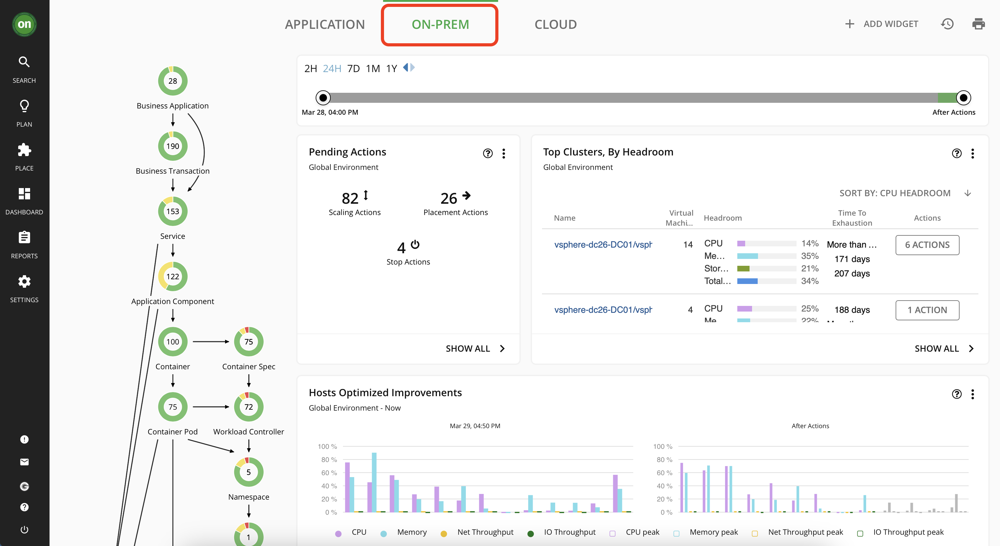
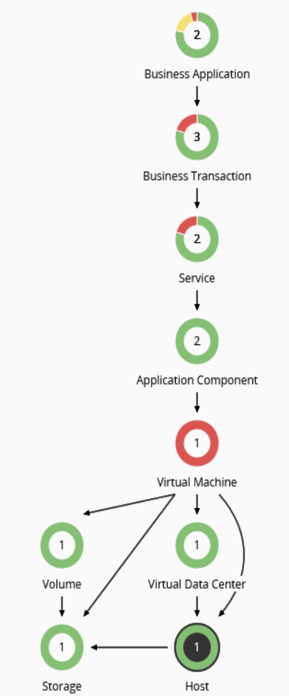
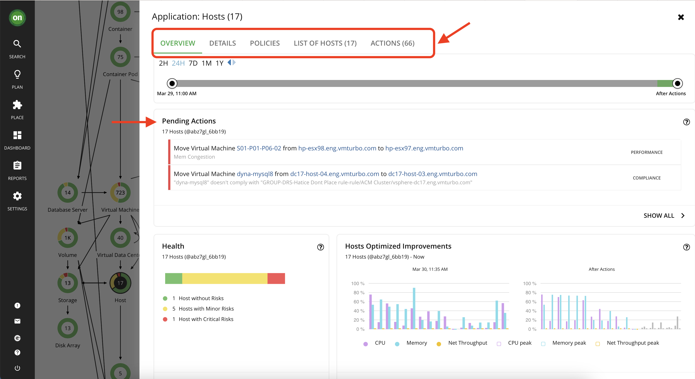
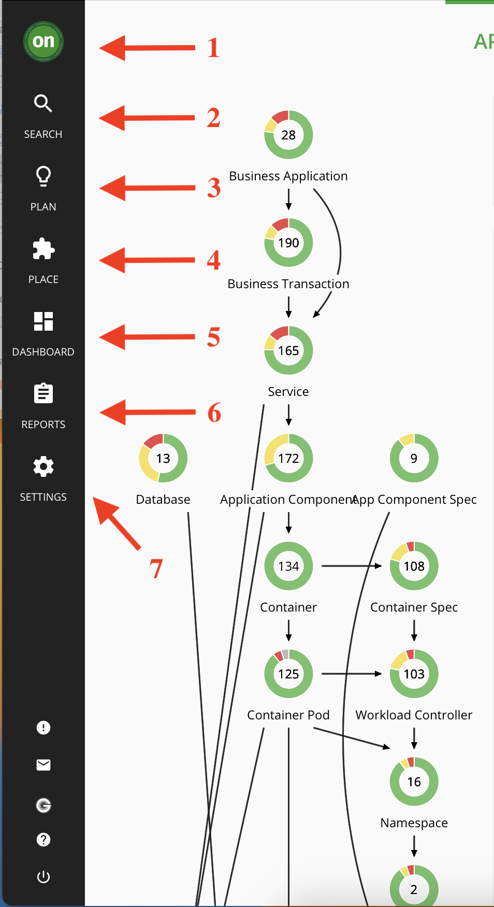

## Objetivo

¡Bienvenido a Turbonomic! En este laboratorio, explorará el interfaz de usuario de Turbonomic y se familiarizará con sus diferentes partes.

_**Nota:** Ha iniciado sesión con un usuario administrador, por lo que podrá ver todo el ambiente supervisado por Turbonomic. Una vez que pase por el laboratorio de **Administration**, aprenderá que se pueden establecer diferentes niveles de acceso para los usuarios y que su panel de control será diferente del que ve aquí._

<QuizAlert text="El contenido del cuestionario L3 está marcado en verde"/>

# Panel principal

Al iniciar sesión, aparecerá el panel principal de Turbonomic.

1. Las tres pestañas de la parte superior le dan acceso a las vistas globales (del ambiente entero).
2. La cadena de suministro de la izquierda le muestra las entidades que Turbonomic ha descubierto y su estado.
3. 3. Las acciones pendientes le muestran las acciones que debe realizar para optimizar su ambiente y asegurar el rendimiento. Exploraremos esto más a fondo en el laboratorio de **Acciones**.
4. Estos son Widgets. Son paneles que contienen información relativa a tu ambiente.
5. En el extremo izquierdo se encuentra el Navegador: puede utilizarlo para acceder a otras funciones de Turbonomic.
   <QuizAlert text="Quiz Material"/>

Haga clic en **On-Prem** en las pestañas de arriba para ver el estado de todo su ambiente on-prem.

Ahora haga clic en la pestaña **Cloud** para centrarse en todos los ambientes de nube que se están supervisando.

Dado que las instancias de Cloud suelen tener valores en dólares asociados, Turbonomic puede proporcionarle un informe detallado de las inversiones necesarias que debe realizar para garantizar el rendimiento y cuál sería el ahorro total de costes como resultado de tomar todas las medidas.

Tenga en cuenta que la cantidad total en dólares es SI toma TODAS las acciones generadas por Turbonomic para las instancias de Cloud. Como puede ver en el siguiente ejemplo, el ahorro de costes es significativo en comparación con las inversiones necesarias. Y todo ello garantizando el rendimiento de la aplicación.

Haga clic en **Show All** bajo **Necessary Investments** y **Potential Savings** para explorar las acciones relativas a cada uno. Repasaremos las acciones a fondo en el laboratorio de **Acciones**.

# Cadena de suministro

Echemos un vistazo más de cerca a la **Cadena de suministro**. En las tres pestañas anteriores, haga clic en **Applications** para volver al panel principal. Las aplicaciones empresariales están formadas por múltiples componentes de aplicación que se ejecutan en muchas infraestructuras diferentes. Cada círculo de la cadena de suministro representa una entidad. Cada entidad tiene un nombre, un número y está rodeada por un círculo de colores. El verde es el estado deseado, el amarillo representa acciones de eficiencia y el rojo muestra que los recursos están congestionados. Véase el ejemplo siguiente.

   <QuizAlert text="Quiz Material"/>

La dirección de las flechas también es significativa. Muestran la dirección de los recursos de la compra. Turbonomic ve los recursos disponibles como un mercado. Cada entidad puede vender recursos y/o comprarlos. Por ejemplo, una máquina virtual compra recursos al host en el que reside y luego los vende a los componentes de la aplicación que se ejecutan en ella. En este escenario, una VM es tanto un consumidor de recursos (del host físico) como un proveedor de recursos (para los componentes de la aplicación). Véase la imagen siguiente.

Haga clic en la entidad Host de la cadena de suministro. Se abrirá una página con información sobre todos sus anfitriones, las políticas que se les aplican y una lista de acciones para ellos.

Explore cada pestaña. La sección de acciones pendientes le muestra las acciones que Turbonomic le recomienda acometer para asegurar el rendimiento, ahorrar costes, etc. Analiza su ambiente una vez que lo añade como objetivo y comienza a proporcionar las acciones. Profundizaremos en las acciones en el laboratorio **Acciones**.

# Navegador

El Navegador le proporcionará un acceso rápido a diferentes partes de Turbonomic. Esta barra de herramientas permanecerá constante a medida que explore diferentes partes del ambiente.

1. El botón **ON** siempre le devolverá a la vista principal del panel de control. El dashboard principal puede ser diferente dependiendo de los permisos de acceso de los usuarios y de las personalizaciones - aprenderás más sobre esto en los laboratorios de **Dashboard Personalizado**.
   <QuizAlert text="Quiz Material"/>

2. Utilice la página **Buscar** para encontrar las entidades que está buscando. Esta página le dará una vista categorizada de sus entidades y también le brindará filtros para acotar la entidad que está buscando.

3. La página de planificación de Turbonomic se utiliza para ejecutar simulaciones de escenarios hipotéticos que le ayudarán a conocer los resultados de determinados cambios antes de realizarlos. Un plan no afecta a los ambientes en tiempo real. Aprenderá más sobre esta importante función en el laboratorio de **Planificación**.

4. En la página Colocación de la carga de trabajo, puede configurar reservas para guardar los recursos que necesitará para implementar máquinas virtuales en el futuro. Turbonomic calcula la ubicación óptima para estas máquinas virtuales y, a continuación, reserva los recursos de host y almacenamiento que necesitan.

5. La pestaña Dashboard (panel de control) le permitirá crear paneles de control personalizados que se adapten a sus necesidades. Aprenderá más sobre esto en el laboratorio **Panel de control personalizado**.

6. La pestaña **Reportes (Reports)** le permitirá generar diferentes reportes de su ambiente y recursos. Al hacer clic en **Reportes** se abrirá una nueva ventana que contiene una lista de reportes predefinidos bajo la carpeta **General**. Explore los diferentes reportes.

7. La página **Configuración** incluye enlaces importantes como Políticas, Licencias, Administración de usuarios, Targets, etc. Usted explorará **Objetivos (Targets)**, **Políticas (Policies)** y **Administración de Usuarios (User Management)** extensivamente en sus laboratorios correspondientes.

