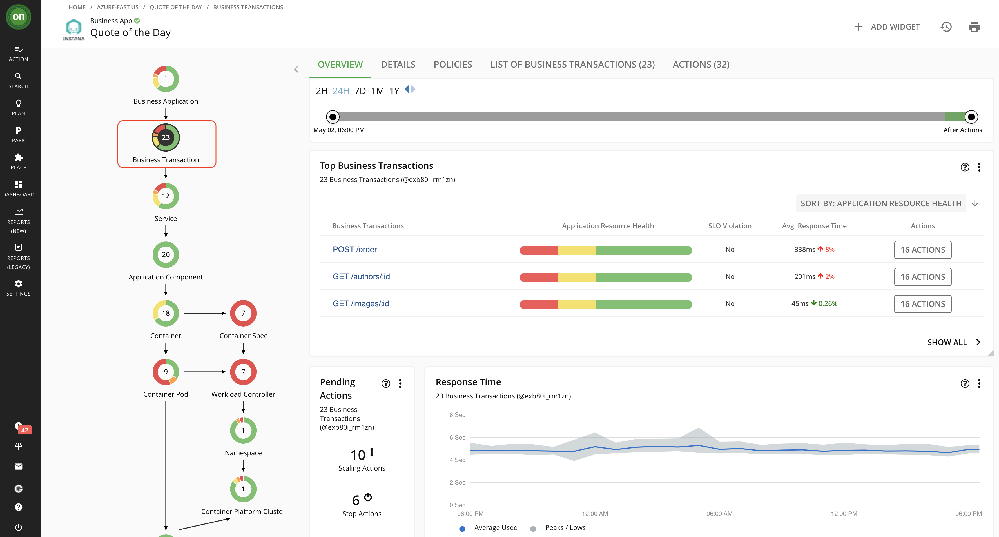
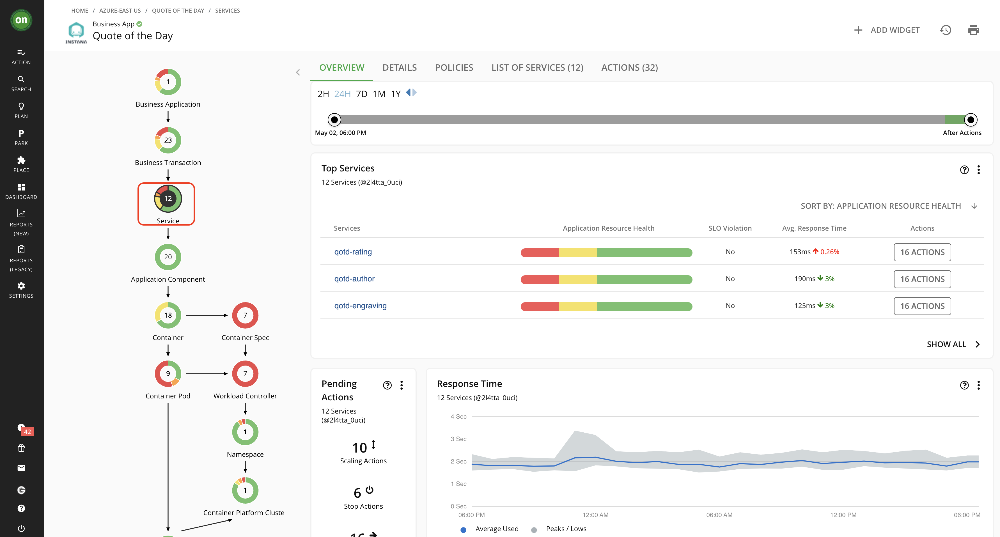
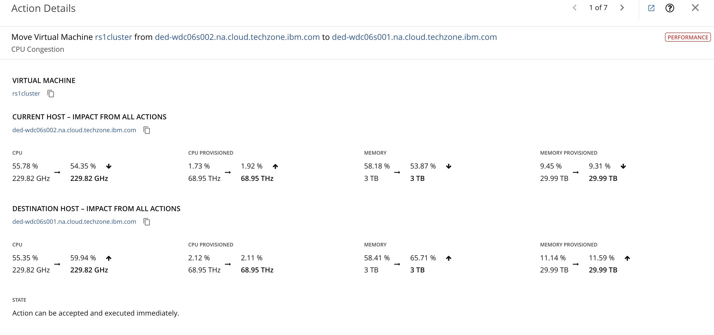

# 103: Business Application Drill Down

let’s see how Turbonomic helps Site Reliability Engineers with their tasks. Compared to the SRE Manager role, an SRE is usually interested in a specific application status and actions that can be taken to assure its performance, mitigating any risks before they impact end-users.

> Note: The business application that you choose may differ from what is presented in this script. Please adjust your story accordingly

Click any of the applications listed in the Top Business Applications Widget, for example “Quote of the Day”. If it is not listed on the main view, click **SHOW ALL** to open the full list. 

When you scope to this business application, the supply chain has changed from showing all the entities in the global environment to only the entities that are relevant to the selected application. This business application consists of 23 business transactions **(A)**, 12 services **(B)**, and 20 application components **(C)** running in 18 containers **(D)** that sit on top 2 virtual machines **(E)**. This virtual machine is connected to 2 storage volume **(F)**. Notice that the entities may have different colors where:
- “red” indicates performance risk where entities need to be moved to a more optimal host or scaled up because of resource congestion or under-provisioning
- “yellow” indicates efficiency opportunities where resources can be reclaimed due to overprovisioning; and 
- “green” indicates entities in their desired state, which is what we are after. 

The result is that by scoping to the specific application, you can quickly see where there is any congestion risk or where the resources are potentially wasted. 

You see the metrics for response times **(G)** and transactions per second **(H)** along with their service level objectives (SLO) that you can set in the policy section in Turbonomic. These information comes from the connected APM tool – in this case Instana, what is indicated in the upper left corner **(I)**.

The structure of supply chain was also imported from Instana, where Business Application is defined as a logical grouping of Business Transactions, Services and Application Components.

Click the **Business Transaction**

If you scope to the Business Transaction, it represents a capability within your Business Application that fulfills a response to a user-initiated request. Its performance directly impacts user experience.

Click the **Service**

The Service entity is made up of one or more Application Components that perform a defined, measurable function as part of an internal or user-initiated request. Its performance is key to understanding application performance, but only indirectly impacts user experience. 

Click the **Application Component**

Finally, if you scope to the Application Component you will see a software component, application code, or a unit of processing within a Service that consumes resources to enable it to perform its function for the Business Application. Turbonomic can recommend actions to adjust the amount of resources available to Application Components.

Turbonomic does not recommend actions for a Business Application, Transactions, or Services, but it does recommend actions for the underlying Application Components and infrastructure entities, thus providing visibility into the risks that have a direct impact on the Business Application's performance. For example, you can see here the actions to resize down both the heap (memory allocation) for a Java Virtual Machine (JVM) and the virtual machine (VM) that hosts that JVM.

Let’s explore the Turbonomic actions in more detail.

Click the green **ON** button in the top-left corner to return to the Turbonomic home page. Click **SHOW ALL** at the bottom of the **Pending Actions** widget.

You can see here in the Pending Actions widget the types of actions that are generated. These can be:
- “placement” actions to move a virtual machine to the most desirable host or storage from one tier to another
- “delete” actions to remove storage volumes that have been orphaned
- “scaling” actions to resize a virtual machine, container, or database
- “stop” or “suspend” actions to turn off idle resources to avoid unnecessary charges, and
- “start / buy” actions to turn on new VMs, provision a new host, or buy reserved instances (RIs) in the cloud.

In this example, there are more than 500 actions that can be taken to move this hybrid environment into the optimal or what we call the desired state. You can see there are actions to scale up the virtual CPU or virtual memory of virtual machines, provision actions to add a host in a cluster where resources are low and move actions to move a virtual machine from one host to another.

Because there are hundreds and sometimes thousands of actions in an environment, Turbonomic allows you to apply filters to the list of actions to help you quickly sort the list. Clicking ADD FILTER and opening the dropdown, you can filter the actions by action type, action mode, action category, action prerequisite, or entity type.

You may ask “How does an SRE know that these are the right actions to take?” For each action, Turbonomic not only shows you the current state of the environment, but it also shows the positive impact on the environment if the suggested action is taken. Let’s expand a couple of actions to showcase this starting with a move action.

Expand **Move** -> **Virtual Machines** (or **Move**  -> **Container Pods** if the other is not visible).  Click the **DETAILS** button on any record.

> Note: Depending on the action selected the risk detected (a reason for action to be generated) – PERFORMANCE in this case – may be different. Adjust your narration accordingly.

If you look at the description of this move action, the VM (or Container Pod) is moving to a new host due to memory congestion on the current host. For each of the metrics shown, the value on the left is the current state while the value on the right is the projected state after the action is taken. 

Next, let’s look at a VM scaling action.

Expand **Scale** -> **Virtual Machines**. Click **DETAILS** of any VM scale action.

> Note: Depending on the action selected, the associated graphs and action details may be different. Adjust your narration accordingly.

For virtual machine scaling, Turbonomic uses percentile calculations to measure virtual CPU and virtual memory utilization more accurately, and drive scaling actions that improve overall utilization and reduce cost for cloud VMs. When you examine the details for a pending scaling action on a VM, you will see charts that highlight virtual CPU and/or virtual memory utilization percentiles for a given observation period, and the projected percentiles after you execute the action. Turbonomic’s aggressiveness setting is 95th percentile with an observation period setting of 30 days. This means that in this example, Turbonomic shows that the vCPU utilization is below 93% for 95% of the time over the last 30 days. Because this is well above the current setting for the desired state of 70%, there is an action to resize up the vCPU. You can see that after this resize action is taken, the vCPU percentile utilization is projected to be below 62% for 95% of the time. The reason that you see the vMem percentile increasing is because there is a corresponding resize down action for vMem that is not shown here.

An important point to highlight here is that these actions are not simply recommendations on what a user should do; these are actions that can be taken within the Turbonomic platform. 
For example, if the action mode is set to manual, an SRE can click on this checkbox, scroll up, and click **EXECUTE ACTIONS** and this VM will move to the new host, or in the case of the resizing action, the VM will be resized. Taking this even further, you can create automation policies so that Turbonomic takes a preventative approach to automatically take these actions before issues occur. 

This keeps the environment in the desired state without human intervention and minimizes the amount of time that IT teams must spend debugging application resourcing issues after they occur and assures that the applications get the resources they need exactly when they need them. 

In other words, Turbonomic assures that the demand of the applications is met in real-time by the supply of available IT resources. Finally, these actions can be scheduled to execute during a maintenance window and even get approvals via change requests through Turbonomic’s integration with ServiceNow. Let’s explore how SRE can set up automation policies.

Let’s create a single automation policy for virtual machine placement and resize. In addition, let’s assume that you want placement actions to execute anytime the action is generated and you want resize up and down actions for vCPU and vMem to occur nightly. 

1.	Navigate to **Settings** > **Policies** > **NEW POLICY** > **Automation Policy** > **Virtual Machines**.

2.	Give the policy a name: e.g. “VM_placement_resize”. 
3.	Scope this policy to a group of VMs and in this case, let’s automate within a single cluster(select **ad_win**).
4.	Under **AUTOMATION WORKFLOW**, click **ADD ACTION**. You can choose the action type to **Move** to automate placement, **Action Generation** to **Automated**, then **Submit**. 
5.	To add resize automation, click **ADD ACTION** again. You can choose the four action types **vCPU Resize Up**, **vMem Resize Up**, **vCPU Resize Down**, and **vMem Resize Down** to automate VM resizes.
6.	Set Action Generate to Automatic. 
7.	For resizes, we said you wanted to do them on a schedule between midnight and 5 am, which can be done with an Action Execution Schedule. Let’s add the schedule. 
8. 	Click on **ADD SCHEDULE** from **Execution Schedule**. Select **12AM to 5AM** and click on **SAVE**.

9.  Click on **SUBMIT** in **Automation Workflow**.
10. Click on **SAVE POLICY** and **APPLY** to apply the policy. 

You can see that there is a lot of flexibility in the setting of policies, and you have full control if those actions are taken manually or fully automated.
