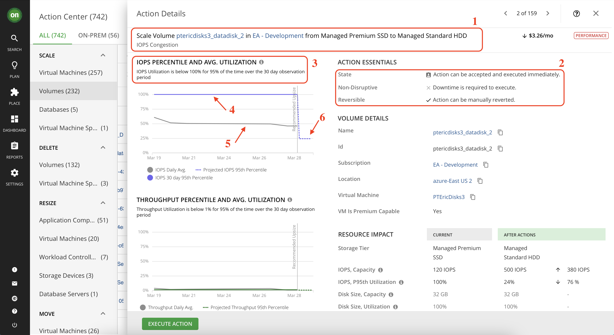
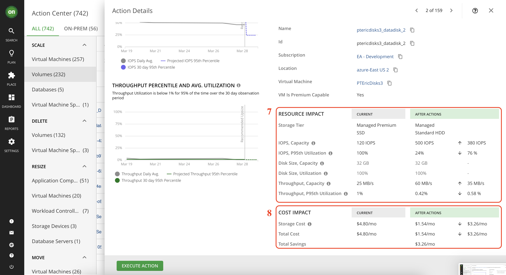
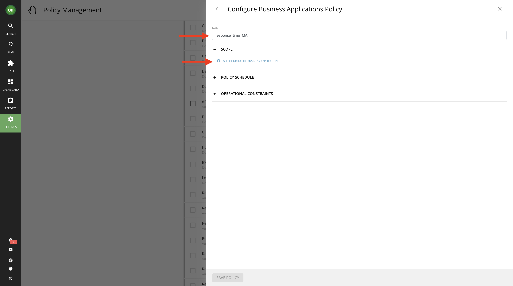
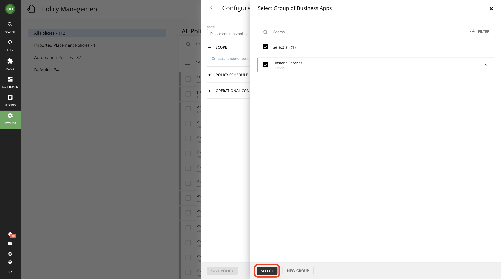
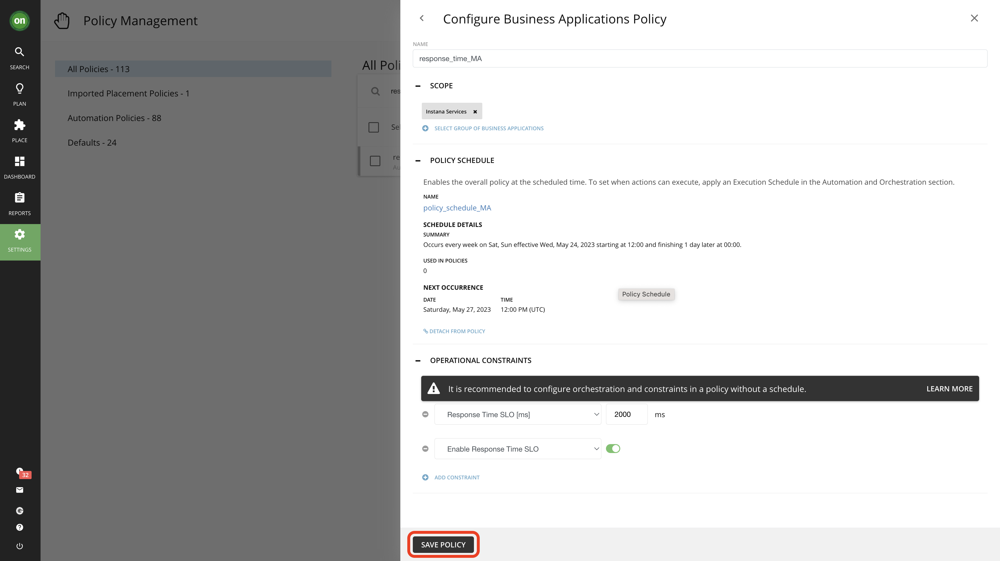

# 104: Acciones y políticas de Turbonomic

## Objetivo

En este laboratorio va:

- Explorar diferentes tipos de acciones
- Explorar las políticas existentes
- Crear una política de automatización
- Programar una política de automatización

**Tenga en cuenta que el número y los tipos de acciones pueden variar en función de su ambiente**.

1. Navegue al panel de control principal haciendo clic en el botón **On** del navegador. Luego seleccione **Show All (Mostrar todo)** en la sección **Pending Actions (Acciones pendientes)**.

2. En esta página verá todas las acciones pendientes, incluidas las de la nube y las locales. Si mira a la lista de la izquierda, verá que las acciones están clasificadas por tipo. Dedique unos minutos a explorar las acciones yendo a las pestañas on-prem o Cloud.

3. Mientras exploras las acciones, notarás que cada tipo de acción tiene múltiples entidades a las que afecta. Por ejemplo, el tipo **Scale (Escala)** - que es básicamente una acción de redimensionamiento para entidades Cloud - afecta a VMs, bases de datos, almacenamiento VM y volúmenes. Veremos más de cerca algunas de estas acciones.

Navega a **Volumes (Volúmenes)** bajo el tipo de acción **Scale (Escala)**.

Seleccione la pestaña **Azure**. Luego haga clic en **Details (Detalles)** para una acción que es el mercado **Performance (Rendimiento)** y reduce su coste. Es posible que tenga que desplazarse hacia la derecha para localizar el botón.

Esta página muestra todos los detalles sobre esta acción, incluyendo por qué se generó, cuál es el impacto si se toma, los costes o ahorros de costes asociados con la toma de esta acción, e información importante sobre si causará tiempo de inactividad si se toma y si es reversible o no. Miremos más de cerca a la información especificada en el detalle de esta acción.

1. Esta sección le informa de la acción, la entidad a la que afecta, la ubicación en la que existe la entidad y el motivo. En esta imagen, tenemos una acción de escalado de volumen para la entidad denominada **ptericdisks3_datadisk_2** en el despliegue denominado **EA - Development** y el motivo es Congestión de IOPS.

2. La sección de elementos esenciales de la acción ofrece una visión rápida de lo que necesita saber para llevar a cabo esta acción.

- La acción puede ser aceptada y ejecutada inmediatamente significa que actualmente no hay restricciones que te impidan tomarla ahora mismo. Exploraremos más a fondo lo que esto significa cuando hablemos de los modos de acción.
  - Si hay o no tiempo de inactividad asociado con la toma de esta acción. En nuestro ejemplo, este cambio requiere un periodo de inactividad, por lo que cuando se considere realizarlo se debe planificar con antelación e informar a los usuarios de este volumen de inactividad previsto.
  - Si esta acción es reversible o no.

3. En esta sección aprenderá por qué se genera esta acción. Normalmente, Turbonomic observa la entidad durante un periodo de tiempo y captura el percentil 95 de la misma. Considerando el ejemplo que se muestra en la siguiente imagen, Turbonomic nos dice que la utilización de IOPS es aproximadamente del 100% el 95% del tiempo durante un periodo de observación de 30 días. Esto significa que hay una congestión de IOPS en este volumen, por lo que se genera una acción de escalado para esta entidad para moverla a un volumen más adecuado.

4. El gráfico del percentil 95 de IOPS.

5. Gráfico del promedio diario de IOPS.

6. La línea punteada representa el percentil 95 proyectado después de tomar esta acción.

7. Comparación detallada entre el estado actual de los recursos y el resultado proyectado después de tomar la acción.

8. Comparación detallada del ahorro de costes si toma esta medida. Observe cómo el escalado a un volumen diferente dará como resultado una mayor IOPS, una menor utilización e incluso un ahorro de dinero. Entonces, ¿por qué no tomarla?

### Optimizar los recursos locales

En esta sección, usted tomará acciones que optimizarán sus recursos on-prem asegurando el rendimiento. Tomar dichas acciones resultará en la liberación de recursos por parte de entidades o VMs que no estén utilizando lo que tienen durante el periodo de observación (por defecto 30 días) para que puedan ser asignados a cargas de trabajo que necesiten dichos recursos.

1. Navegue a la pestaña **On-Prem** desde su página de acciones. Luego, en **resize (redimensionar)** seleccione **Virtual Machines (máquinas virtuales)**.

2. Desplácese por la lista y seleccione una acción para reducir el tamaño de la memoria virtual que tenga **Efficiency (Eficiencia)** como categoría de acción. Haga clic en **Details (Detalles)**.

3. Compruebe los detalles, observará que la utilización de la memoria virtual de esta máquina virtual estuvo por debajo del 1% durante el 95% del tiempo a lo largo de 30 días. Esto significa que esta máquina virtual ha sobreasignado memoria que no consume. Por tanto, puede reducir con seguridad la capacidad de memoria sin dejar de ofrecer un rendimiento óptimo. Fíjese en los resultados previstos de la acción: la utilización aumentará del 1% al 2%, lo que es perfectamente aceptable.

Una vez que apruebe todos los detalles y se asegure de que esta acción es segura, haga clic en el botón **Execute Action (Ejecutar Acción)** en la parte inferior de la página de detalles. Una vez que ejecute esta acción, Turbonomic utilizará llamadas a la API para ajustar la memoria virtual de esta máquina virtual por usted. Por lo tanto, no necesitará iniciar sesión en su ambiente vCenter. Si la acción se ejecuta correctamente, verá una marca de verificación verde junto a esa acción.

## Políticas de Turbonomic

Ha aprendido a realizar acciones manualmente. Pero, ¿y si quisiéramos automatizar esto? Una vez que validamos que es seguro y bueno tomar una determinada acción y confiamos en ella, podemos permitir que las entidades actúen por decisión propia.

### Explorar las políticas existentes

Como recordatorio, por favor asegúrese de que está conectado con un usuario **Administrador**. Si no está conectado como usuario administrador, no tendrá los permisos necesarios para ejecutar los laboratorios.

1. Acceda a **Settings (Configuración)** y, a continuación, a **Policies (Políticas)**. En esta página, verá una lista de todas las políticas existentes.

2. En la lista de la izquierda, seleccione **Defaults (Valores predeterminados)**. Esto mostrará una lista de todas las políticas por valores predeterminados del sistema.

_**Consejo:** Estas políticas por valores predeterminados permanecen efectivas a menos que el usuario cree una política que afecte a los mismos recursos pero con criterios diferentes. La política definida por el usuario anula la política predeterminada._

3. Desplácese hacia abajo en la lista de políticas por valores predeterminados y haga clic en **Storage Defaults**. Ahora observe que esta política establece la aceptación de la acción **Resize (Redimensionar)** se establece en recomendar. Esto hará que todas las acciones de cambio de tamaño generadas para el almacenamiento se establezcan solo como recomendadas y no se puedan ejecutar en Turbonomic.

4. Respectivamente, para la acción que exploró para una máquina virtual Cloud en la que podría aceptarla manualmente y ejecutarla dentro de Turbonomic, hay un conjunto de políticas por valores predeterminados que lo define:

Vaya a la política **Virtual Machine Defaults** de la lista de políticas por valores predeterminados. Puede ver que todas las acciones de escalado de Cloud están configuradas como **Manual**, lo que permite aceptarlas y ejecutarlas (suponiendo que no haya requisitos previos para ellas).

### Crear una política de automatización

Creará una política de automatización para definir cómo desea que Turbonomic trate las acciones a medida que aparecen. Tenga en cuenta que las políticas definidas por el usuario anularán las políticas por valores predeterminados del sistema que afecten a la misma entidad.

#### Añadir restricciones de objetivos de nivel de servicio (SLO) de tiempo de respuesta

1. Vaya a **Policies (Políticas)** desde **Settings (Ajustes)**. A continuación, haga clic en **New Automation Policy (Nueva política de automatización)** en la parte superior derecha de la ventana.

2. Haga clic en **Business Application (Aplicación de negocio)**. Una vez hecho aparecerá la ventana del Editor de Políticas.

3. En el editor de políticas, asigne a su política un nombre único como response_time_TusIniciales. A continuación, en **Scope (Ámbito)**, haga clic en **Select group of business applications (Seleccionar grupo de aplicaciones empresariales)**. Esto especificará qué grupo de aplicaciones de negocio se verá afectado por esta política.

4. Una vez que haya hecho clic en **Select group of business applications (Seleccionar grupo de aplicaciones de negocio)**, aparecerá la ventana del Editor **Select Group of Business Apps (Seleccionar grupo de aplicaciones de negocio)**.

5. Haga clic en el botón **New Group (Nuevo grupo)**. Aparecerá la ventana del editor **Add members to a new group (Añadir miembros a un nuevo grupo)**.

6. (1) Nombra tu grupo **Instana Services**. Cambia el tipo a (2) **Static (Estático)** en el menú desplegable **Type (Tipo)**. (3) Selecciona **RobotShop** y (4) **Quote of the Day (Cotización del día)**. Luego (5) haga clic en el botón **Save Group (Guardar grupo)**.

7. Seleccione el grupo **Instana Services (Servicios de Instana)** y haga clic en el botón **Select (Seleccionar)**.

8. En el editor de políticas, añada las restricciones **Enable Response Time SLO** y **Response Time SLO (ms)** y haga clic en **Save Policy**. Puede que reciba un mensaje diciendo que la política puede tardar 10 minutos en hacerse efectiva, haga clic en **Yes** para continuar.

9. Para comprobar si su política se ha creado, intente buscar el nombre de su política en la lista. también puede realizar cambios y editarla según sea necesario desde aquí.

### Programar una política

Puede establecer una programación para una política de automatización, que establece una ventana de tiempo en la que la política entra en efecto. Además, una política programada puede incluir acciones programadas. Cuando la política está en efecto, Turbonomic recomienda o ejecuta automáticamente esas acciones a medida que se generan. Algunas de esas acciones podrían ser perjudiciales, por lo que es posible que desee aplazar su ejecución a una ventana de tiempo no crítica. En este caso, deberá establecer un calendario de ejecución de acciones dentro de la política programada.

1. Haga clic en la política de automatización, response_time_TusIniciales, que acabamos de crear.

2. Despliegue **Policy Schedule** y haga clic en **Attach Schedule**. Luego haga clic en **New Schedule (Nuevo Horario)**.

3. Esta sección definirá cuándo está en efecto su póliza.

   A. Asigne a la programación de su política un nombre como policy_schedule_SusIniciales.

   B. Seleccione **Weekly (Semanalmente)** abajo de Recurrence (Recurrencia).

   C. Establezca que se repita cada semana sólo los **Saturdays (sábados)** y **Sundays (domingos)**.

   D. Seleccione la fecha de hoy como fecha de inicio y **None (Ninguna)** como fecha de finalización.

   E. Establezca 12:00 como hora de inicio y 12 para las horas de duración. Por favor, tenga en cuenta que si usted está completando este laboratorio por la tarde hora local, es posible que desee ajustar este tiempo de 12:00 a unas horas después de su hora actual. La razón es que el sistema no le permitirá crear una política en el pasado.

   F. Seleccione su zona horaria.

   G. Compruebe el Resumen y haga clic en **Submit (Submitir)**.

4. Seleccione su horario recién creado y haga clic en **Set (Ajustar)**.

5. Ahora debería estar de vuelta en la página **Configure Business Applications Policy (Configurar Política de Aplicaciones de Negocio)**. Compruebe toda la información y asegúrese de que es correcta. Una vez hecho esto, haga clic en **Save Policy (Guardar política)**.

