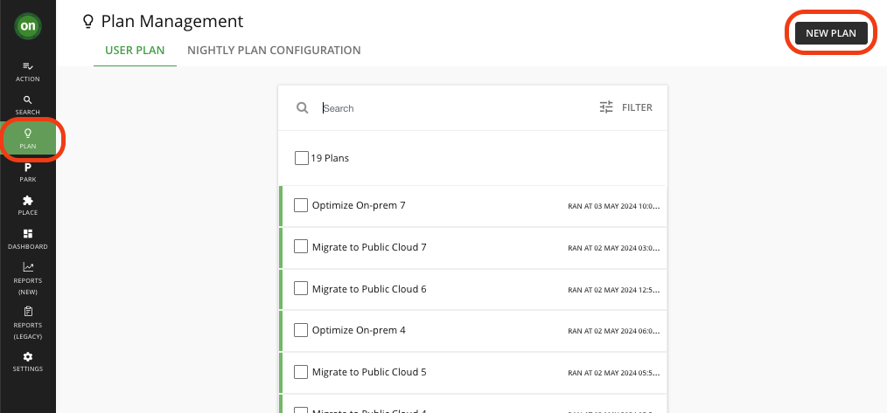
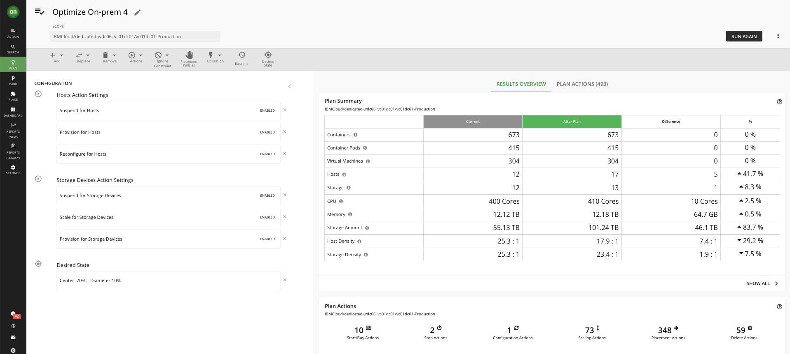
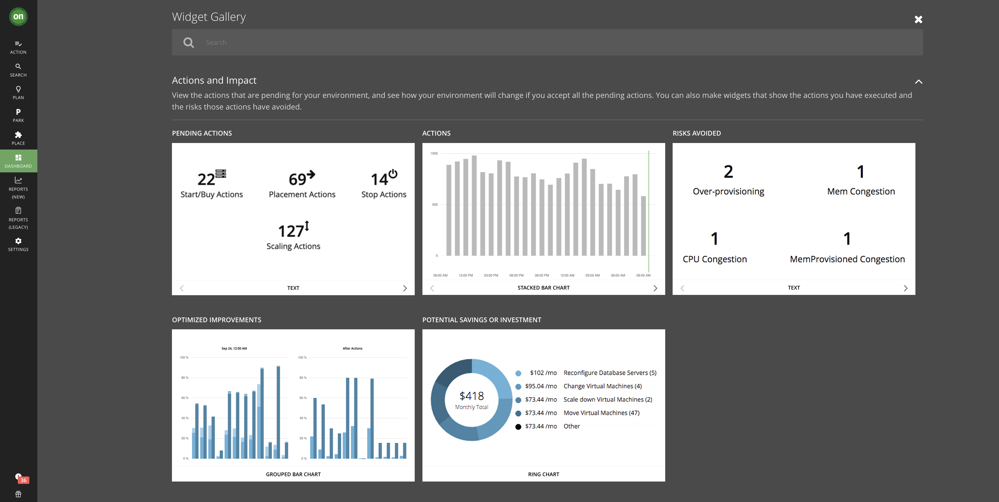

# 104: Cambios en las infraestructuras Planificación

## Plan

Veamos cómo Turbonomic ayuda a los gestores de infraestructuras a planificar cambios en la infraestructura, optimizaciones o migraciones a la nube.

Haga clic en el icono **PLAN** del menú de la izquierda y, a continuación, en el botón **NUEVO PLAN** de la esquina superior derecha.

Junto con los cuadros de mando que se han explorado anteriormente, Turbonomic ofrece una herramienta de planificación específica para ayudar a los gestores de infraestructuras a decidir los cambios de infraestructura.

Puede ver que hay varios tipos de planes disponibles, para infraestructura local, para clústeres Kubernetes y para nubes públicas.

Veamos un ejemplo de plan para optimizar la infraestructura.

1.  Haga clic en **NUEVO PLAN**
2.  Seleccione **Optimizar en local**

3.  Seleccione **Host Cluster** y seleccione todos los clusters listados
4.  Haga clic en **Siguiente** y mantenga el valor predeterminado en toda la pantalla.

5.  En la última pantalla, haga clic en **EJECUTAR PLAN**
6.  Revisar el resultado

## Cuadro de mandos

Un panel de control personalizado es una vista que se crea para centrarse en aspectos específicos de su entorno. Puede crear paneles privados para su cuenta de usuario o paneles visibles para cualquier usuario que inicie sesión en su implementación de Turbonomic.

1.  Para crear un cuadro de mando personalizado, haga clic en **Cuadros de mando** en el menú de navegación de la izquierda.

2.  Haga clic en **NUEVO CU** ADRO DE MANDO para añadir un nuevo cuadro de mando a su sesión de Turbonomic.
3.  El panel de control aparece con un nombre predeterminado y sin widgets de gráficos. El intervalo de tiempo en el deslizador de tiempo se establece en 24 horas por defecto, como se muestra a continuación

4.  Añada widgets de gráficos al cuadro de mandos pulsando **AÑADIR WIDGET**

Personalizaremos este panel para mostrar ciertas métricas de la aplicación Cita del Día.

5.  Verá la pantalla por defecto con múltiples Galerías de Widgets como se muestra a continuación:

6.  Escriba **Salud** en la barra de búsqueda como se muestra a continuación y seleccione ese widget haciendo clic en cualquier lugar del espacio en blanco.
7.  En **Ámbito**, **haga clic en para cambiar el ámbito**
8.  A continuación, **seleccione Alcance**, asegúrese de que está en **Entidades** y seleccione **Aplicación de Negocio** como se muestra en la siguiente imagen.
9.  A continuación, seleccione **Cita del** día en **Aplicación empresarial**.

10. A continuación, seleccione **Componentes de Aplicación** en **Tipo de Entidad** y seleccione **Gráfico de Anillos** en **Tipo de Gráfico**
11. A continuación, haga clic en el botón **Actualizar vista previa** para ver el resultado y luego haga clic en **Guardar** en la parte inferior

12. Por último, verá su widget publicado en su panel personalizado

Para obtener más información sobre los tipos de gráficos/widgets disponibles, consulte nuestra documentación [haciendo clic aquí](https://www.ibm.com/docs/en/tarm/8.12.2?topic=views-chart-types).
