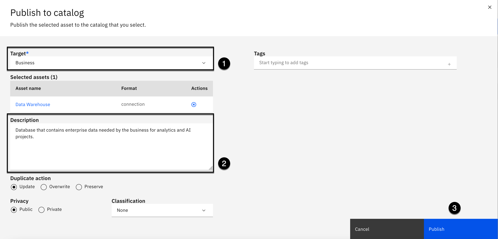
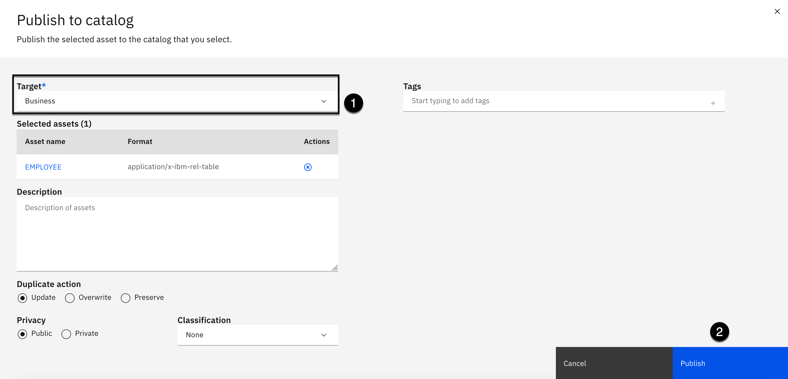

# 104: Catalog the Data

The data curation process is complete and you are now ready to create the governed catalog and publish the fully enriched data assets to the catalog so they are ready for use by the analytics project team to accomplish their data and AI analytical objectives.

## 1. Create the Catalog

This section creates the **governed** catalog that you will use to publish the fully enriched data assets that you just curated. This catalog will be named the **Business** catalog, so make sure you do not have a catalog in your environment, that you created and own, by the same name.

1. Select the **Navigation** menu (the 4 stacked horizontal lines in the upper left corner).

2. Select the **Catalogs > View all catalogs** menu.

3. Click the **Create Catalog** button.

4. Copy the text below and paste it into the **Name** field:

<CopyText text="Business"/>

5. Copy the text below and paste it into the **Description** field:

<CopyText text="This catalog stores governed assets used by the business for analytical and AI projects."/>
    
6. Using the **Object storage instance** dropdown, select a Cloud Object Storage instance in your environment where you want to create the catalog.

7. Select the checkbox next to **Enforce data policies**.

8. Click the **OK** button when prompted to confirm you want to **Permanently enforce data policies ?**.
    
This is **mandatory** and must be selected to create a **governed** catalog!

9. Select the **Update original assets** option in the Duplicate asset handling section.

10. Click the **Create** button.

You will see a message: **Creating Business, this might take a minute...**. When the creation of the catalog is complete, you are taken into the new **Business** catalog.

11. Select the **Catalogs** breadcrumb at the top of the page to get back to the catalog home page.

You should now see the new **Business** catalog, and the **Platform assets catalog** you were instructed to create in the **Data fabric lab** [Getting started](https://vest.buildlab.cloud/en/wkc/getting-started) section.

12. Select the **Navigation** menu (the 4 stacked horizontal lines in the upper left corner).

13. Select the **Projects > View all projects** menu.

14. Select the **Business Catalog Enrichment** project.

## 2. Publish Connections

In this section, you will publish the connections, one at a time, and in the order listed in the instructions below, to the governed **Business** catalog before you publish any data assets. This will place them at the end of the **Recently added** category list in the catalog, leaving room for the data assets to appear front and center, in order of importance, so they are easily found and viewable.

1. Select the **X** in the top right corner of the information panel to close it.
2. From the **Assets types** section on the left, select **Data access > Connections**.

3. Select the checkbox next to the **Cloud Object Storage** connection.

4. Select the **Publish to catalog** button on the toolbar.

5. Select the **Business** catalog as the **Target** catalog (It should be selected by default).

6. Copy the text below and paste it into the **Description** field:

<CopyText text="IBM Cloud Object Storage bucket that contains data files used for analytics and AI."/>

7. Click the **Publish** button.

8. Uncheck the checkbox next to the **Cloud Object Storage** connection.

9. Select the checkbox next to the **Data Warehouse** connection.

10. Select the **Publish to catalog** button on the toolbar.

11. Select the **Business** catalog as the **Target** catalog (It should be selected by default).

12. Copy the text below and paste it into the **Description** field:

<CopyText text="Database that contains enterprise data needed by the business for analytics and AI projects."/>
    
13. Click the **Publish** button.

## 3. Publish Data Assets

In this section, you will publish the data assets to the **Business** catalog. As you did with the connections, the data assets are published in a specific order, so that the **Recently Added** category in the catalog gets populated properly. You will publish the **WAREHOUSE\_SHIFTS**, **WAREHOUSE\_STAFF**, and **WAREHOUSE\_STAFFING** data assets together, in one publication step, and then publish the **EMPLOYEE** data asset last.

1. Uncheck the checkbox next to the **Data Warehouse** connection.

2. From the **Assets types** section on the left, select **Data > Data assets**.

3. Select the checkbox next to the **WAREHOUSE\_SHIFTS** data asset.

4. Select the checkbox next to the **WAREHOUSE\_STAFF** data asset.

5. Select the checkbox next to the **WAREHOUSE\_STAFFING** data asset.

6. Select the **Publish to catalog** button on the toolbar.

7. Select the **Business** catalog as the **Target** catalog (It should be selected by default).

8. Click the **Publish** button.

9. Uncheck the checkbox next to the **WAREHOUSE\_SHIFTS** data asset.

10. Uncheck the checkbox next to the **WAREHOUSE\_STAFF** data asset.

11. Uncheck the checkbox next to the **WAREHOUSE\_STAFFING** data asset.

12. Select the checkbox next to the **EMPLOYEE** data asset.

13. Select the **Publish to catalog** button on the toolbar.

14. Select the **Business** catalog as the **Target** catalog (It should be selected by default).

15. Click the **Publish** button.

You have successfully published the connections and data assets to the **Business** catalog, and are finished working from the project. This project is very valuable, and reusable, and the data curation process is repeatable. You can modify the metadata imports to add or remove assets, and modify the metadata enrichment process to improve the business term, and data class assignment accuracy, and learn from the results. You can also make changes upstream, to the business glossary governance artifacts, to improve the data curation accuracy, rerun metadata enrichment, review the results, and re-publish existing assets, or publish new assets, to the governed catalog. Which is why you were instructed to change the **Duplicate asset handling** option to **Update original assets** when you created the catalog.

16. Uncheck the checkbox next to the **EMPLOYEE** data asset.
17. Select the **Navigation** menu (the 4 stacked horizontal lines in the upper left corner).

18. Select the **Catalog > View all catalogs** menu.

19. Select the **Business** catalog (Make sure it is the one you own and can administer).

