# 105. Aumentar datos catalogados

En esta sección, añadirá metadatos adicionales a los activos de datos catalogados que acaba de publicar, al igual que las clasificaciones, los activos relacionados, las etiquetas y las revisiones, para que los usuarios puedan comprender y confiar mejor en el contenido de los datos, y para contribuir más a la base de conocimiento del motor de búsqueda, para facilitar a los usuarios encontrar lo que están buscando.

**Nota:** Revisiones de pedidos de Watson Knowledge Catalog en el **Altamente calificados** de la categoría más alta a la más baja. Si más de un activo tiene la misma calificación, ordena las mismas revisiones tarifadas en el orden en que se introdujeron en el catálogo, por lo que está enriqueciendo los activos catalogados en el orden tal como se enumeran a continuación.

Al entrar en el catálogo, se le presenta el **Activos destacados** categorías del catálogo. Observe que el **Recientemente añadido** tiene todos los activos y conexiones de datos listados en el orden en que se han publicado.

1.  Haga clic en **Ocultar activos destacados** para ocultar la sección.

Ocultar el **Activos destacados** Las categorías proporcionan un acceso más fácil a la lista de activos de catálogo que utilizará para completar las tareas restantes de todos los activos del catálogo.

## 1. Conexión de almacenamiento de objetos

1.  Haga clic en **Almacenamiento de objetos de nube** de la lista de activos.

### Añadir activos relacionados

1.  Seleccione la opción **Añadir activos +** en el botón **Activos conexos**.

2.  Seleccione **Contiene** como la relación.
3.  Haga clic en **Siguiente**.

4.  Seleccione la casilla de verificación junto a la **WAREHOUSE_TURNOS** activo.
5.  Seleccione la casilla de verificación junto a la **WAREHOUSE_STAFF** activo.
6.  Seleccione la casilla de verificación junto a la **WAREHOUSE_PERSONAL** activo.
7.  Haga clic en **Añadir**.

### Añadir código

1.  Desplácese **Abajo** en el **Acerca de este activo** panel a la **Etiquetas**.
2.  Haga clic en **Editar** botón (parece un lápiz) en el **Etiquetas**.

3.  Utilización de la **Etiquetas de búsqueda** desplegable, seleccione la opción **Depósito**.

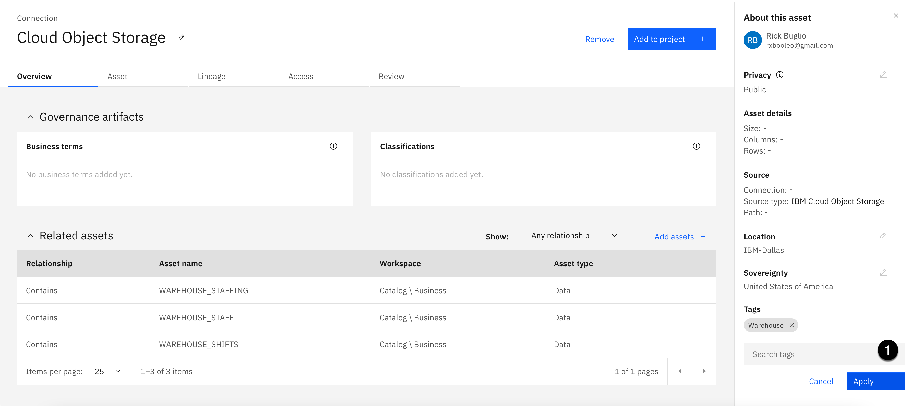

4.  Haga clic en **Aplicar**.

## 2. Conexión de depósito de datos

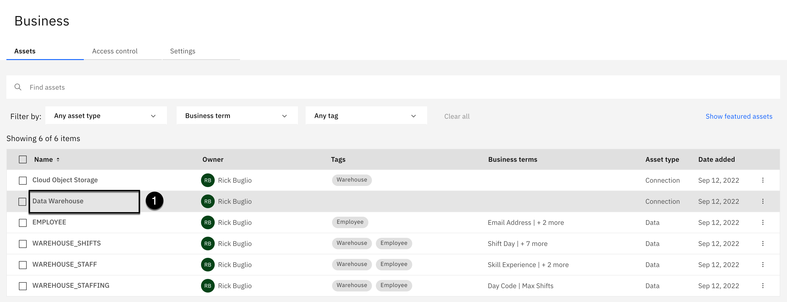

1.  Haga clic en **Depósito de datos** de la lista de activos.

### Añadir clasificaciones

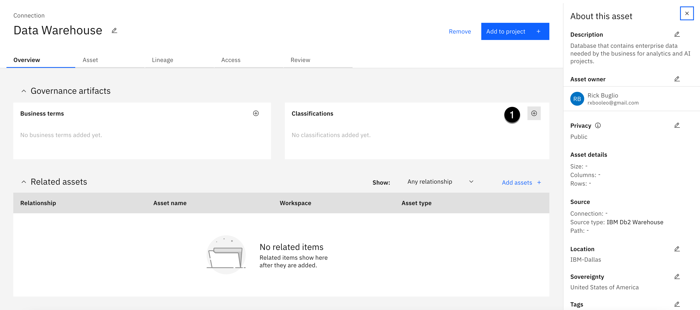

1.  Seleccione la opción **+** signo más en el **Clasificaciones**.

2.  Seleccione la casilla de verificación junto a la **Información de identificación personal** clasificación.
3.  Seleccione la casilla de verificación junto a la **Información Personal** clasificación.
4.  Seleccione la casilla de verificación junto a la **Información sensible personal** clasificación.
5.  Haga clic en **Añadir**.

### Añadir activos relacionados

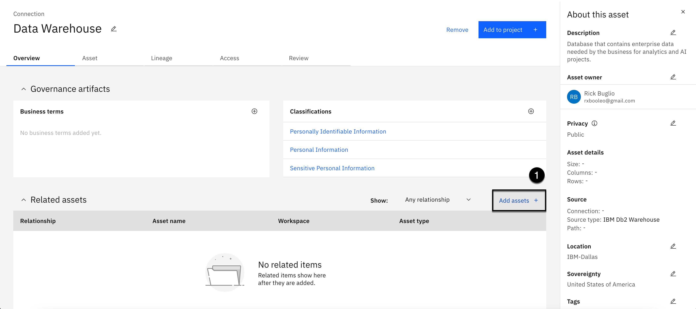

1.  Seleccione la opción **Añadir activos +** en el botón **Activos conexos**.

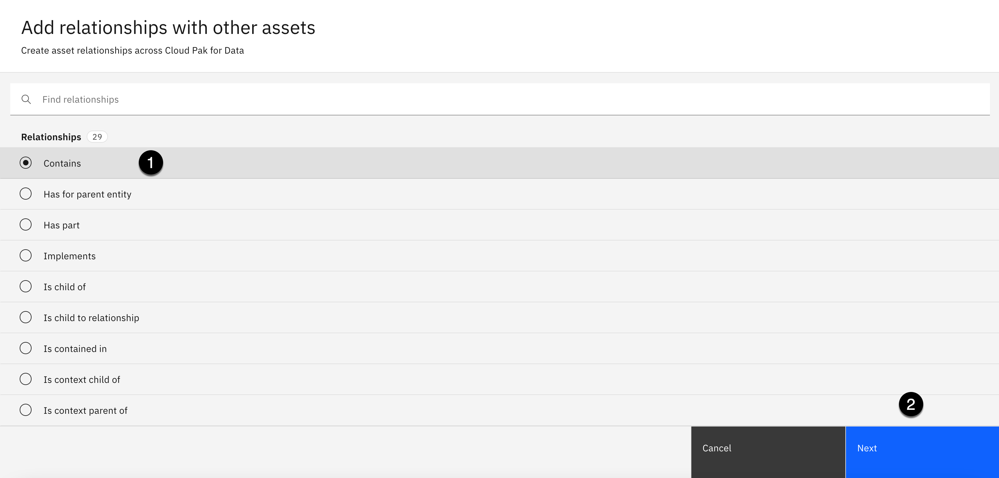

2.  Seleccione **Contiene** como la relación.
3.  Haga clic en **Siguiente**.

4.  Seleccione la casilla de verificación junto a la **EMPLEADO** activo.
5.  Haga clic en **Añadir**.

### Añadir código

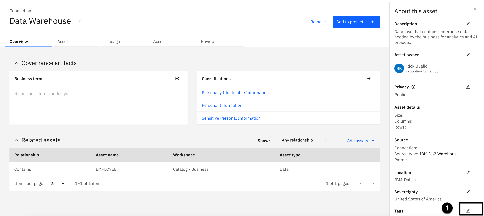

1.  Haga clic en **Editar** botón (parece un lápiz) en el **Etiquetas**.

2.  Desplácese **Abajo** en el **Acerca de este activo** panel hasta que vea el **Etiquetas de búsqueda** desplegable.
3.  Utilización de la **Etiquetas de búsqueda** desplegable, seleccione la opción **Empleado**.

4.  Haga clic en **Aplicar**.

### Añadir revisión

1.  Seleccione la opción **Revisión**.
2.  Haga clic en **5.** estrella a la derecha para asignar un **5 Estrellas** calificación.
3.  Copie el texto siguiente y péguelo en el **Observaciones** área:

<CopyText text="Contiene todos los datos gobernados, de confianza y de calidad aprobados y publicados por el equipo de gobierno de datos para utilizar para proyectos de análisis e IA. Algunos de los datos son sensibles, pero existen reglas de protección de datos para gobernarlo."/>

4.  Haga clic en **Presentar**.
5.  Haga clic en **Empresas** miga de pan en la barra de herramientas para volver a la lista.

## 3. Activo de datos de empleado

1.  Haga clic en **EMPLEADO** activo de datos de la lista de activos.

### Añadir clasificaciones

1.  Seleccione la opción **+** signo más en el **Clasificaciones**.

2.  Seleccione la casilla de verificación junto a la **Información de identificación personal** clasificación.
3.  Seleccione la casilla de verificación junto a la **Información Personal** clasificación.
4.  Seleccione la casilla de verificación junto a la **Información sensible personal** clasificación.
5.  Haga clic en **Añadir**.

### Añadir activos relacionados

1.  Seleccione la opción **Añadir activos +** en el botón **Activos conexos**.

2.  Utilizando el área de búsqueda, introduzca la palabra **relacionado**.
3.  Seleccione **Está relacionado con** como la relación.
4.  Haga clic en **Siguiente**.

5.  Seleccione la casilla de verificación junto a la **WAREHOUSE_STAFF** activo.
6.  Seleccione la casilla de verificación junto a la **WAREHOUSE_PERSONAL** activo.
7.  Haga clic en **Añadir**.

### Añadir código

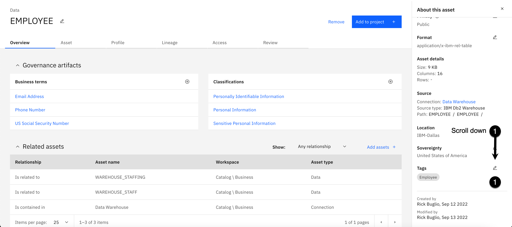

1.  Desplácese **Abajo** en el **Acerca de este activo** panel a la **Etiquetas**.
2.  Haga clic en **Editar** botón (parece un lápiz) en el **Etiquetas**.

3.  Utilización de la **Etiquetas de búsqueda** desplegable, seleccione la opción **Depósito**.

4.  Haga clic en **Aplicar**.

### Añadir revisión

1.  Seleccione la opción **Revisión**.
2.  Haga clic en **5.** estrella a la derecha para asignar un **5 Estrellas** calificación.
3.  Copie el texto siguiente y péguelo en el **Observaciones** área:

<CopyText text="Contiene datos de empleados gobernados y de confianza para utilizar para proyectos de análisis de negocio. Este es el maestro de registro de empleado completo de la empresa. Contiene información sensible y personal, pero la oficina de gobierno de datos ha definido reglas de protección de datos para gobernar esa información."/>

4.  Pulse en **Presentar**.
5.  Haga clic en **Empresas** miga de pan en la barra de herramientas para volver a la lista.

## 4. Activo de datos de personal de almacén

1.  Haga clic en **WAREHOUSE_STAFF** activo de datos de la lista de activos.

### Añadir activos relacionados

1.  Seleccione la opción **Añadir activos +** en el botón **Activos conexos**.

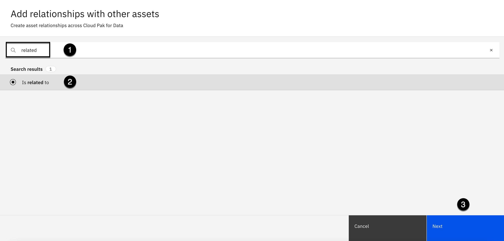

2.  Utilizando el área de búsqueda, introduzca la palabra **relacionado**.
3.  Seleccione **Está relacionado con** como la relación.
4.  Haga clic en **Siguiente**.

5.  Seleccione la casilla de verificación junto a la **WAREHOUSE_TURNOS** activo.
6.  Seleccione la casilla de verificación junto a la **WAREHOUSE_PERSONAL** activo.
7.  Haga clic en **Añadir**.

### Añadir revisión

1.  Seleccione la opción **Revisión**.
2.  Haga clic en **4.** estrella, segundo desde la derecha, para asignar un **4 Estrellas** calificación.
3.  Copie el texto siguiente y péguelo en el **Observaciones** área:

<CopyText text="Contiene información actualizada sobre todos los empleados que son miembros del personal que trabajan en el almacén de pedidos del cliente. Se puede utilizar para la analítica y la IA pero no contiene el nombre del empleado por lo que debe combinarse con los datos EMPLEADO."/>

4.  Pulse en **Presentar**.
5.  Haga clic en **Empresas** miga de pan en la barra de herramientas para volver a la lista.

## 5. Asset Staffing Data Asset

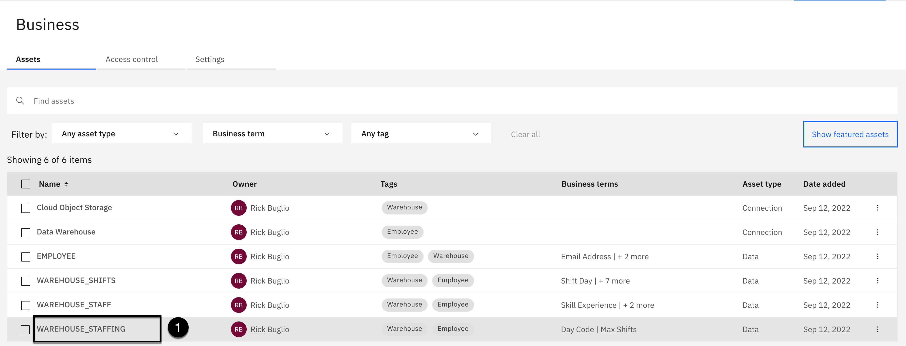

1.  Haga clic en **WAREHOUSE_PERSONAL** activo de datos de la lista de activos.

2.  Seleccione la opción **Añadir activos +** en el botón **Activos conexos**.

3.  Utilizando el área de búsqueda, introduzca la palabra **relacionado**.
4.  Seleccione **Está relacionado con** como la relación.
5.  Haga clic en **Siguiente**.

6.  Seleccione la casilla de verificación junto a la **WAREHOUSE_TURNOS** activo.
7.  Seleccione la casilla de verificación junto a la **WAREHOUSE_STAFF** activo.
8.  Haga clic en **Añadir**.

### Añadir revisión

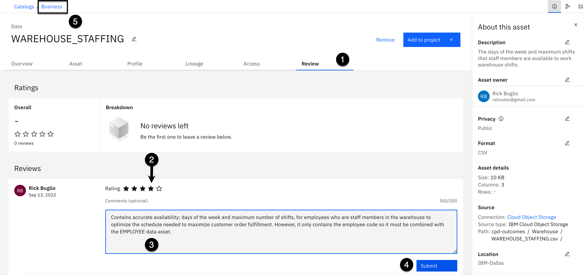

1.  Seleccione la opción **Revisión**.
2.  Haga clic en **4.** estrella, segundo desde la derecha, para asignar un **4 Estrellas** calificación.
3.  Copie el texto siguiente y péguelo en el **Observaciones** área:

<CopyText text="Contiene disponibilidad precisa; días de la semana y número máximo de turnos, para los empleados que son miembros del personal en el almacén para optimizar la planificación necesaria para maximizar el cumplimiento de la orden del cliente. Sin embargo, sólo contiene el código de empleado, por lo que debe combinarse con el activo de datos EMPLEADO."/>

4.  Pulse en **Presentar**.
5.  Haga clic en **Empresas** miga de pan en la barra de herramientas para volver a la lista.

## 6. Activo de datos de envío de almacén

1.  Haga clic en **WAREHOUSE_TURNOS** activo de datos de la lista de activos.

### Añadir activos relacionados

1.  Seleccione la opción **Añadir activos +** en el botón **Activos conexos**.

2.  Utilizando el área de búsqueda, introduzca la palabra **relacionado**.
3.  Seleccione **Está relacionado con** como la relación.
4.  Haga clic en **Siguiente**.

5.  Seleccione la casilla de verificación junto a la **WAREHOUSE_STAFF** activo.
6.  Seleccione la casilla de verificación junto a la **WAREHOUSE_PERSONAL** activo.
7.  Haga clic en **Añadir**.

### Añadir revisión

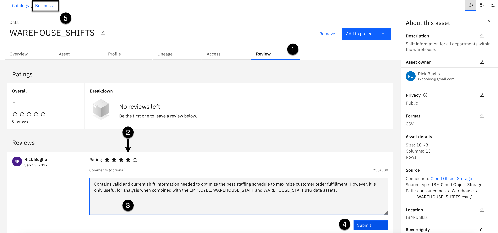

1.  Seleccione la opción **Revisión**.
2.  Haga clic en **4.** estrella, segundo desde la derecha, para asignar un **4 Estrellas** calificación.
3.  Copie el texto siguiente y péguelo en el **Observaciones** área:

<CopyText text="Contiene información de turno válida y actual necesaria para optimizar la mejor planificación de personal para maximizar el cumplimiento de la orden del cliente. Sin embargo, sólo es útil para el análisis cuando se combina con los activos de datos EMPLEADO, WAREHOUSE_STAFF y WAREHOUSE_STAFFING."/>

4.  Pulse en **Presentar**.
5.  Haga clic en **Empresas** miga de pan en la barra de herramientas para volver a la lista.

## Revisar el catálogo

Ahora que ha catalogado las conexiones y los activos de datos curados, y los ha aumentado con metadatos adicionales, revisemos los resultados.

1.  Haga clic en **Mostrar activos destacados** para visualizar las categorías de activos destacados.

2.  Seleccione la opción **Altamente calificados** categoría de activos destacados.

**Aviso** que los activos de datos de esta categoría se ordenan por calificación de mayor a menor, y que los activos que tienen el mismo **5** o **4** la calificación de estrella está en el orden en que se han especificado. Todas las conexiones y activos de datos del catálogo se han curado. Usted puede revisar todos ellos por su cuenta, pero por ahora, vamos a revisar los resultados de la curación de datos de la **EMPLEADO** activo de datos.

3.  Haga clic en **EMPLEADO** activo de datos.

*   El **Términos de negocio** que fueron añadidos durante **Enriquecimiento de metadatos**, aparecer en el **Visión general**, por lo que los consumidores de datos pueden comprender inmediatamente el contenido del activo de datos sin obtener una vista previa de los datos.
*   El **Clasificaciones** que fueron añadidos durante **Aumento de catálogo**, aparecer en el **Visión general**, por lo que los consumidores de datos pueden entender inmediatamente que el activo de datos contiene información personal, personal, identificable y confidencial.
*   El **Activos conexos** que fueron añadidos durante **Aumento de catálogo**, aparecer en el **Visión general**, por lo que los consumidores de datos pueden comprender inmediatamente las relaciones con otros activos de datos, y las conexiones de origen de datos, para dirigirlos a otros activos en los que puedan estar interesados.
*   El **Etiquetas** que fueron añadidos durante **Curaciones de datos**, y **Aumento de catálogo**, aparecer en el **Acerca de este activo**, por lo que los consumidores de datos pueden utilizar las etiquetas como criterios de búsqueda para ayudarles a encontrar los datos o localizar datos similares en el futuro.

4.  Haga clic en **X** sobre la **Acerca de este activo** para cerrarla.
5.  Seleccione la opción **Activo** para obtener una vista previa de los datos.

6.  Haga clic en **Información de columna** indicador (Parece un ojo) en la esquina superior derecha del **FIRST_NAME**.

El **Nombre:** término de negocio que se ha asignado durante **Enriquecimiento de metadatos** ha finalizado con el activo cuando se ha publicado en el catálogo. Todas las demás columnas tienen los términos empresariales que se han asignado durante el proceso de enriquecimiento de metadatos.

7.  Haga clic en **Cierre**.

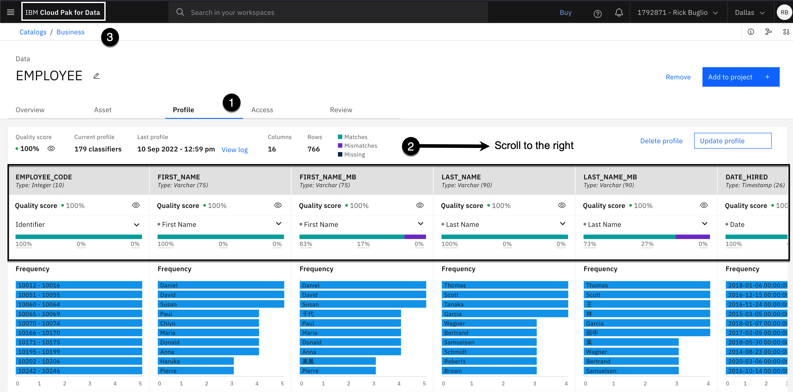

8.  Seleccione la opción **Perfil**.

**Aviso** que cada columna tiene un **Puntuación de calidad**, **Clase de datos** y a **Tipo de datos** perfilado.

9.  Desplácese hasta el **Derecha** para ver las columnas restantes.
10. Haga clic en **IBM Cloud Pak for Data** para volver a la página de inicio de Cloud Pak for Data.

## Resumen

¡Felicidades Ha completado correctamente el **Gobernanza de datos** laboratorio.

Ha utilizado el completo, automatizado y asistido por IA **Gobernanza de datos** capacidades de la solución de tejido de datos de IBM, Cloud Pak for Data, que proporcionan **Catálogo de conocimientos de Watson**, para satisfacer la solicitud de datos enviada por el equipo del proyecto de análisis. El equipo ahora es capaz de buscar rápidamente, encontrar y acceder a los datos que necesitan, comprender y confiar en que su contenido, que es de la más alta calidad, sin riesgo de estar expuesto a información sensible, para realizar las tareas de análisis e IA para entregar sus objetivos de negocio y producir resultados valiosos para el negocio.

Todo esto se ha realizado realizando las tareas siguientes:

*   Ha llenado el glosario empresarial con un conjunto completo y significativo de artefactos de gobierno.
*   Ha creado las reglas de protección de datos para proteger la información personal y sensible.
*   Ha descubierto y añadido los activos de datos que eran necesarios utilizando la importación de metadatos.
*   Ha curado los activos de datos y las columnas utilizando Enriquecimiento de metadatos para perfilar, acceder a la calidad de los datos y asignar términos empresariales y clases de datos.
*   Ha publicado las conexiones y los activos de datos en un catálogo gobernado que ha creado.
*   Ha aumentado los activos catalogados con metadatos adicionales: Clasificaciones, Activos relacionados, Términos y revisiones.

Esto concluye el **Gobernanza de datos** laboratorio técnico. La sección siguiente es: **OPCIONAL** y es **NO** un requisito del núcleo **Gobernanza de datos** laboratorio.
