# 105. Augment Cataloged Data

In this section you will add additional metadata to the cataloged data assets you just published, like classifications, related assets, tags, and reviews, so users can better understand and trust the data content, and to contribute further to the knowledge base of the search engine, to make it easier for users to find what they are looking for.

**Note:** Watson Knowledge Catalog orders reviews in the **Highly rated** category from highest to lowest rating. If more than one asset has the same rating, it orders the same rated reviews in the order they were entered into the catalog, which is why you are enriching the cataloged assets in the order as they are listed below.

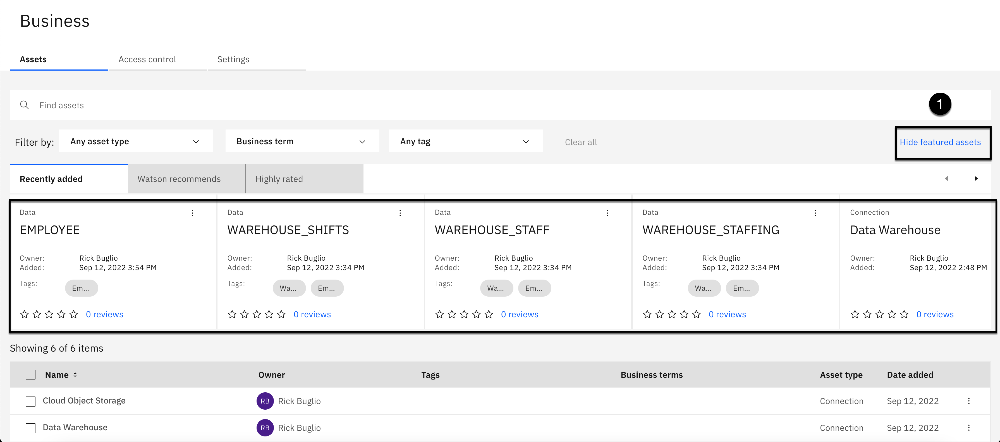

Upon entering the catalog, you are presented with the **Featured assets** categories of the catalog. Notice that the **Recently added** category has all of the data assets and connections listed in the order they were published.

1. Click the **Hide featured assets** button to hide the section.

Hiding the **Featured assets** categories provides easier access to the catalog asset list that you will use to complete the remaining tasks for all the assets in the catalog.

## 1. Object Storage Connection

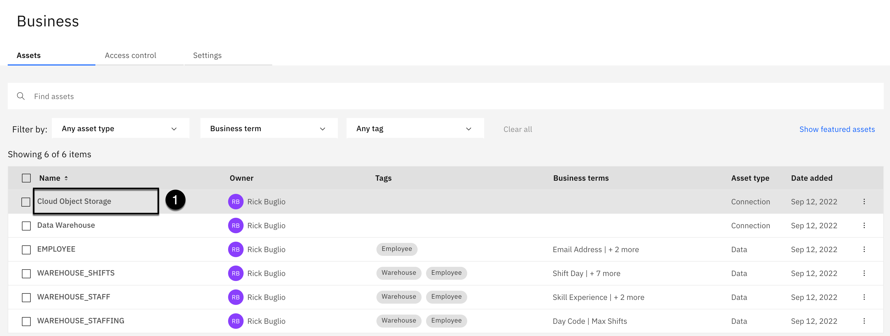

1. Click the **Cloud Object Storage** connection from the asset list.

### Add Related Assets

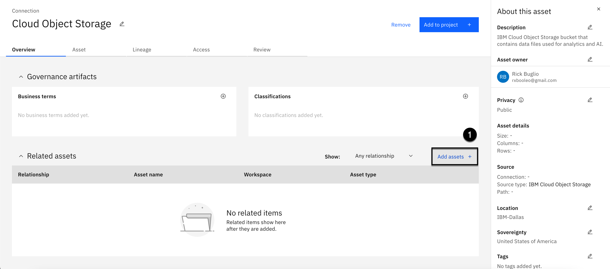

1. Select the **Add assets+** button in the **Related assets** section.

2. Select **Contains** as the relationship.

3. Click the **Next** button.

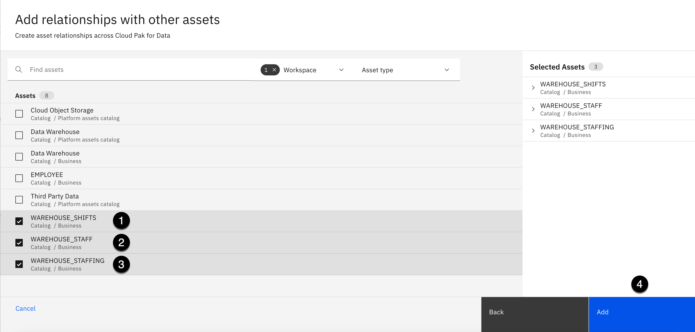

4. Select the checkbox next to the **WAREHOUSE\_SHIFTS** asset.

5. Select the checkbox next to the **WAREHOUSE\_STAFF** asset.

6. Select the checkbox next to the **WAREHOUSE\_STAFFING** asset.

7. Click the **Add** button.

### Add Tag

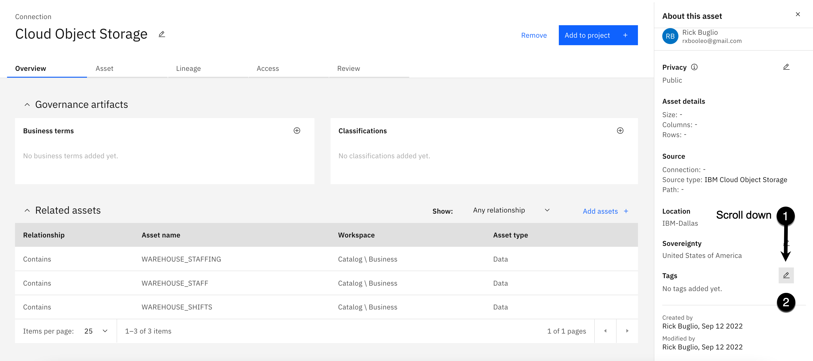

1. Scroll **down** in the **About this asset** panel to the **Tags** section.

2. Click the **Edit** button (looks like a pencil) in the **Tags** section.

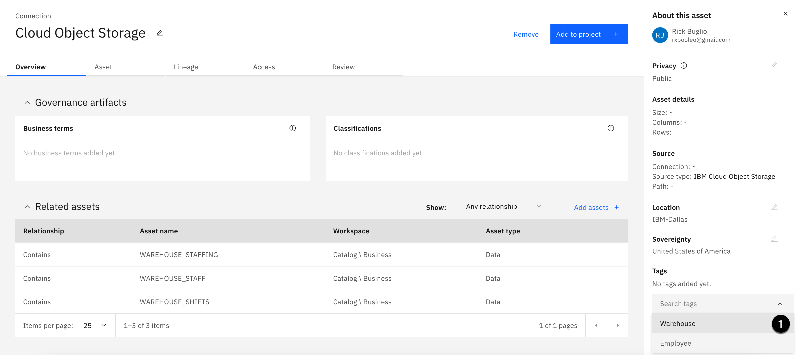

3. Using the **Search tags** dropdown, select the **Warehouse** tag.

4. Click the **Apply** button.

## 2. Data Warehouse Connection

1. Click the **Data Warehouse** connection from the asset list.

### Add Classifications

1. Select the **+** plus sign in the **Classifications** section.

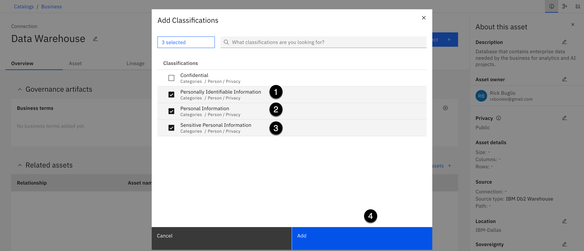

2. Select the checkbox next to the **Personally Identifiable Information** classification.

3. Select the checkbox next to the **Personal Information** classification.

4. Select the checkbox next to the **Personal Sensitive Information** classification.

5. Click the **Add** button.

### Add Related Assets

1. Select the **Add assets+** button in the **Related assets** section.

2. Select **Contains** as the relationship.

3. Click the **Next** button.

4. Select the checkbox next to the **EMPLOYEE** asset.

5. Click the **Add** button.

### Add Tag

1. Click the **Edit** button (looks like a pencil) in the **Tags** section.

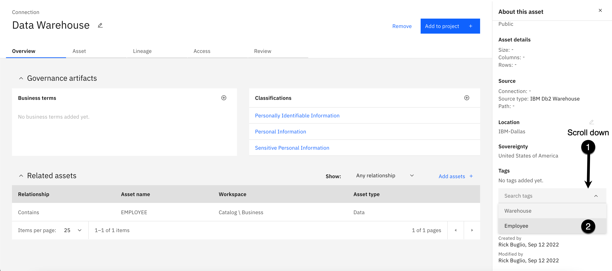

2. Scroll **down** in the **About this asset** panel until you see the **Search tags** dropdown.

3. Using the **Search tags** dropdown, select the **Employee** tag.

4. Click the **Apply** button.

### Add Review

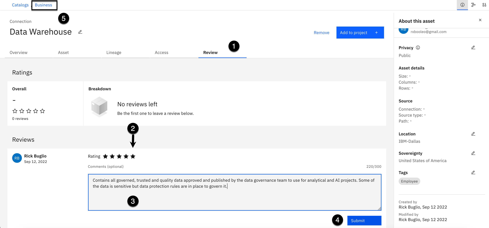

1. Select the **Review** tab.

2. Click the **5th** star to the right to assign a **5 Star** rating.

3. Copy the text below and paste it into the **Comments** area:

<CopyText text="Contains all governed, trusted and quality data approved and published by the data governance team to use for analytical and AI projects. Some of the data is sensitive but data protection rules are in place to govern it."/>

4. Click the **Submit** button.

5. Click the **Business** bread crumb on the toolbar to get back to the list.

## 3. Employee Data Asset

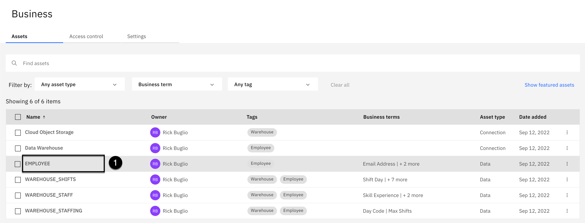

1. Click the **EMPLOYEE** data asset from the asset list.

### Add Classifications

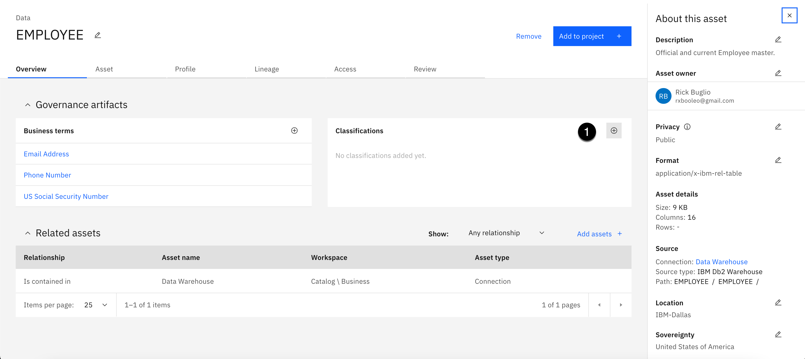

1. Select the **+** plus sign in the **Classifications** section.

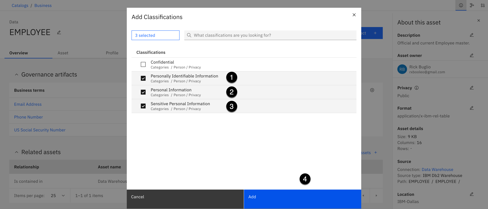

2. Select the checkbox next to the **Personally Identifiable Information** classification.

3. Select the checkbox next to the **Personal Information** classification.

4. Select the checkbox next to the **Personal Sensitive Information** classification.

5. Click the **Add** button.

### Add Related Assets

1. Select the **Add assets+** button in the **Related assets** section.

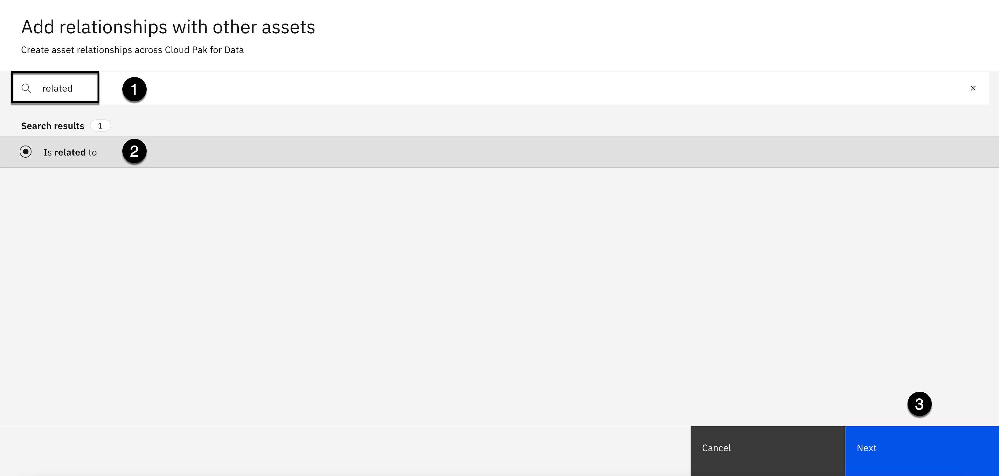

2. Using the search area, enter the word **related**.

3. Select **Is Related to** as the relationship.

4. Click the **Next** button.

5. Select the checkbox next to the **WAREHOUSE\_STAFF** asset.

6. Select the checkbox next to the **WAREHOUSE\_STAFFING** asset.

7. Click the **Add** button.

### Add Tag

1. Scroll **down** in the **About this asset** panel to the **Tags** section.

2. Click the **Edit** button (looks like a pencil) in the **Tags** section.

3. Using the **Search tags** dropdown, select the **Warehouse** tag.

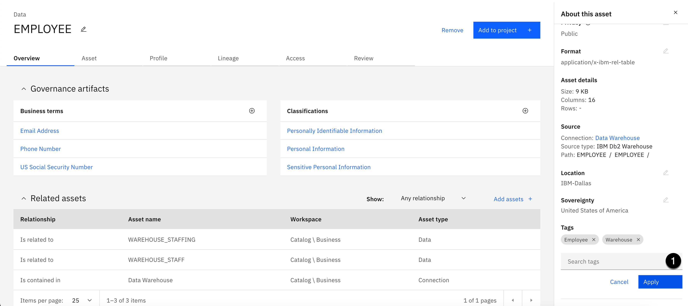

4. Click the **Apply** button.

### Add Review

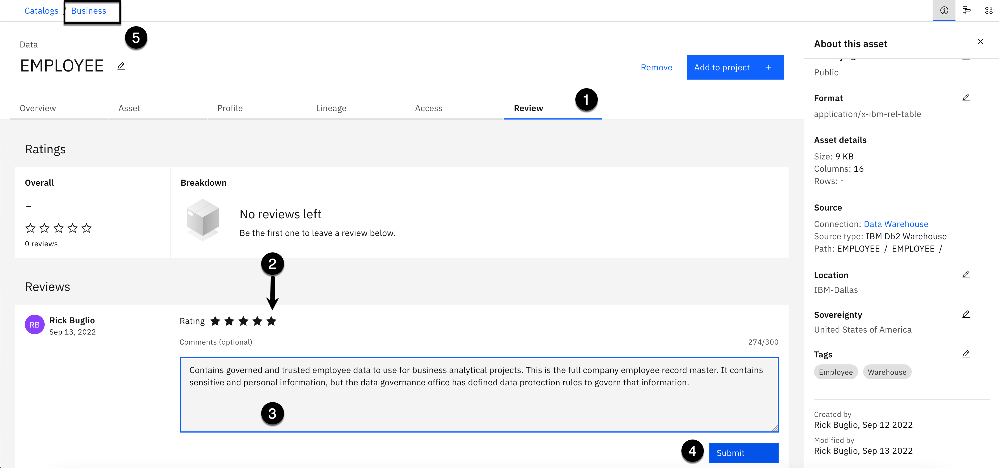

1. Select the **Review** tab.

2. Click the **5th** star to the right to assign a **5 Star** rating.

3. Copy the text below and paste it into the **Comments** area:

<CopyText text="Contains governed and trusted employee data to use for business analytical projects. This is the full company employee record master. It contains sensitive and personal information, but the data governance office has defined data protection rules to govern that information."/>

4. Click **Submit**.

5. Click the **Business** bread crumb on the toolbar to get back to the list.

## 4. Warehouse Staff Data Asset

1. Click the **WAREHOUSE\_STAFF** data asset from the asset list.

### Add Related Assets

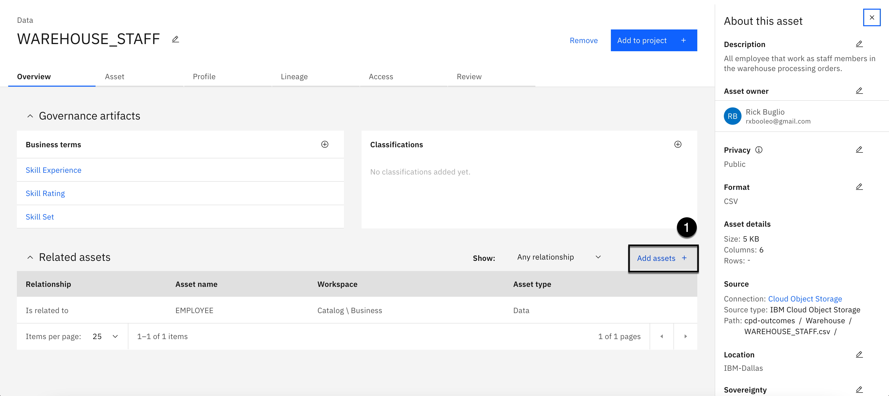

1. Select the **Add assets+** button in the **Related assets** section.

2. Using the search area, enter the word **related**.

3. Select **Is Related to** as the relationship.

4. Click the **Next** button.

5. Select the checkbox next to the **WAREHOUSE\_SHIFTS** asset.

6. Select the checkbox next to the **WAREHOUSE\_STAFFING** asset.

7. Click the **Add** button.

### Add Review

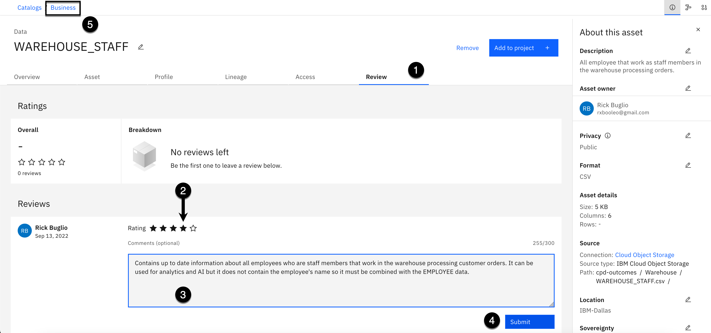

1. Select the **Review** tab.

2. Click the **4th** star, second from the right, to assign a **4 Star** rating.

3. Copy the text below and paste it into the **Comments** area:

<CopyText text="Contains up to date information about all employees who are staff members that work in the warehouse processing customer orders. It can be used for analytics and AI but it does not contain the employee's name so it must be combined with the EMPLOYEE data."/>

4. Click **Submit**.

5. Click the **Business** bread crumb on the toolbar to get back to the list.

## 5. Warehouse Staffing Data Asset

1. Click the **WAREHOUSE\_STAFFING** data asset from the asset list.

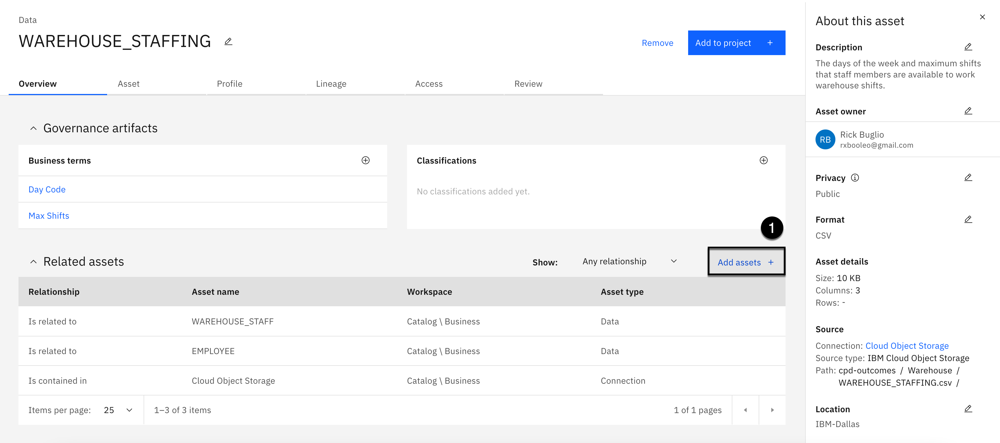

2. Select the **Add assets+** button in the **Related assets** section.

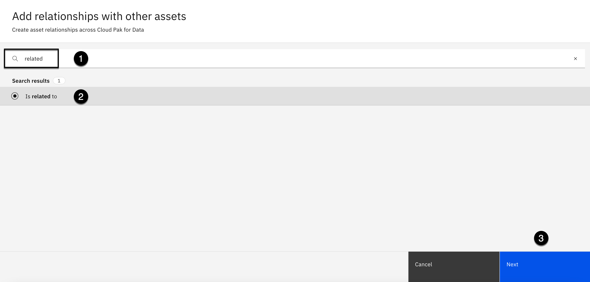

3. Using the search area, enter the word **related**.

4. Select **Is Related to** as the relationship.

5. Click the **Next** button.

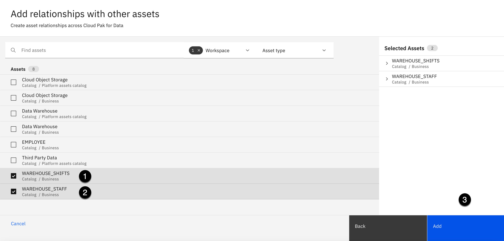

6. Select the checkbox next to the **WAREHOUSE\_SHIFTS** asset.

7. Select the checkbox next to the **WAREHOUSE\_STAFF** asset.

8. Click the **Add** button.

### Add Review

1. Select the **Review** tab.

2. Click the **4th** star, second from the right, to assign a **4 Star** rating.

3. Copy the text below and paste it into the **Comments** area:

<CopyText text="Contains accurate availability; days of the week and maximum number of shifts, for employees who are staff members in the warehouse to optimize the schedule needed to maximize customer order fulfillment. However, it only contains the employee code so it must be combined with the EMPLOYEE data asset."/>
    
4. Click **Submit**.

5. Click the **Business** bread crumb on the toolbar to get back to the list.

## 6. Warehouse Shifts Data Asset

1. Click the **WAREHOUSE\_SHIFTS** data asset from the assets list.

### Add Related Assets

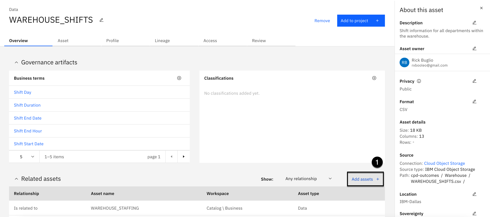

1. Select the **Add assets+** button in the **Related assets** section.

2. Using the search area, enter the word **related**.

3. Select **Is Related to** as the relationship.

4. Click the **Next** button.

5. Select the checkbox next to the **WAREHOUSE\_STAFF** asset.

6. Select the checkbox next to the **WAREHOUSE\_STAFFING** asset.

7. Click the **Add** button.

### Add Review

1. Select the **Review** tab.

2. Click the **4th** star, second from the right, to assign a **4 Star** rating.

3. Copy the text below and paste it into the **Comments** area:

<CopyText text="Contains valid and current shift information needed to optimize the best staffing schedule to maximize customer order fulfillment. However, it is only useful for analysis when combined with the EMPLOYEE, WAREHOUSE_STAFF and WAREHOUSE_STAFFING data assets."/>

4. Click **Submit**.

5. Click the **Business** bread crumb on the toolbar to get back to the list.

# Review the Catalog

Now that you have cataloged the curated connections and data assets, and augmented them with additional metadata, let's review the results.

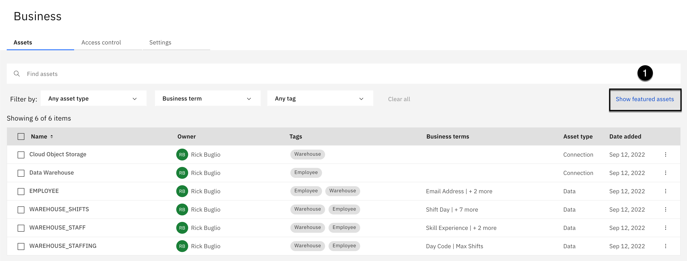

1. Click the **Show featured assets** button to display the featured assets categories.

2. Select the **Highly rated** featured assets category.

**Notice** that the data assets in this category are ordered by rating from highest to lowest, and that assets that have the same **5** or **4** star rating are in the order they were entered. All of the connections and data assets in the catalog were curated. You can review all of them on your own, but for now, let's review the data curation results of the **EMPLOYEE** data asset.

3. Click the **EMPLOYEE** data asset.

* The **Business Terms** that were added during **Metadata Enrichment**, appear in the **Overview** section, so data consumers can immediately understand the data asset content without previewing the data.

* The **Classifications** that were added during **Catalog Augmentation**, appear in the **Overview** section, so data consumers can immediately understand that the data asset contains personal, personally identifiable, and sensitive personal information.

* The **Related assets** that were added during **Catalog Augmentation**, appear in the **Overview** section, so data consumers can immediately understand the relationships to other data assets, and data source connections, to direct them to other assets they might be interested in.

* The **Tags** that were added during **Data curation**, and **Catalog Augmentation**, appear in the **About this asset** section, so data consumers can use the tags as search criteria to help them find the data, or locate similar data, in the future.

4. Click the **X** on the **About this asset** section to close it.

5. Select the **Asset** tab to preview the data.

6. Click the **Column information** indicator (Looks like an eye) in the upper right corner of the **FIRST\_NAME** column.

The **First Name** business term that was assigned during **Metadata Enrichment** was carrier over with the asset when it was published to the catalog. All the other columns have the business terms that were assigned during the metadata enrichment process as well.

7. Click the **Close** button.

8. Select the **Profile** tab.

**Notice** that every column has a **Quality score**, **Data class** and a **Data type** profiled.

9. Scroll to the **right** to see the remaining columns.

10. Click the **IBM Cloud Pak for Data** label to return to the Cloud Pak for Data home page.

# Summary

Congratulations! You successfully completed the **Data governance** lab.

You utilized the comprehensive, automated, and AI assisted **Data governance** capabilities of IBM's data fabric solution, Cloud Pak for Data, that are provided by **Watson Knowledge Catalog**, to satisfy the data request submitted by the analytics project team. The team is now able to quickly search, find and access the data they need, understand and trust it's content, that is of the highest quality, with no risk of being exposed to sensitive information, to perform the analytics and AI tasks to deliver on their business objectives and produce valuable outcomes for the business.

This was all accomplished by performing the following tasks:

* You populated the business glossary with a complete and meaningful set of governance artifacts.

* You created the data protection rules to protect personal and sensitive information.

* You discovered and added the data assets that were needed using Metadata Import.

* You curated the data assets and columns using Metadata Enrichment to profile, access data quality, and assign business terms and data classes.

* You published the connections, and data assets, to a governed catalog that you created.

* You augmented the cataloged assets with additional metadata: Classifications, Related Assets, Terms and Reviews.

This concludes the **Data governance** technical lab. The following section is **OPTIONAL** and is **NOT** a requirement of the core **Data governance** lab.

