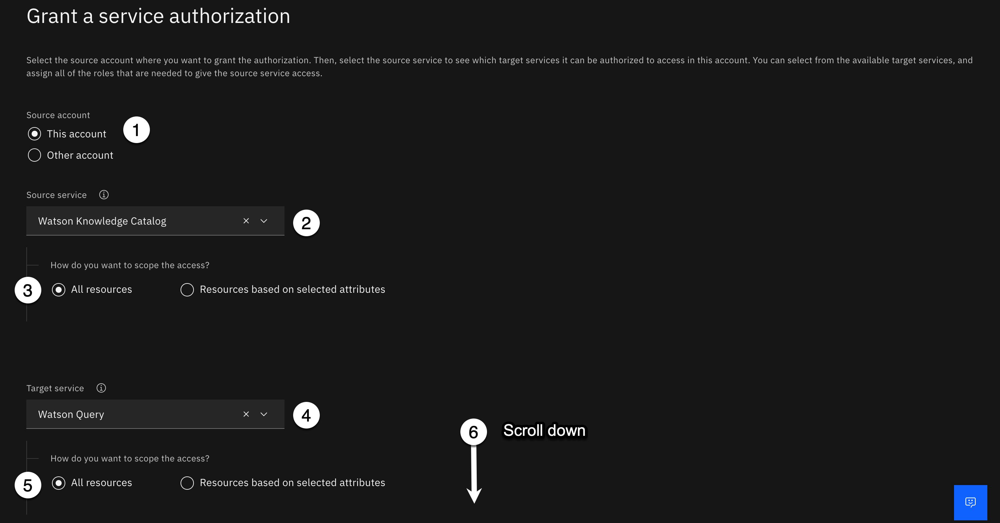
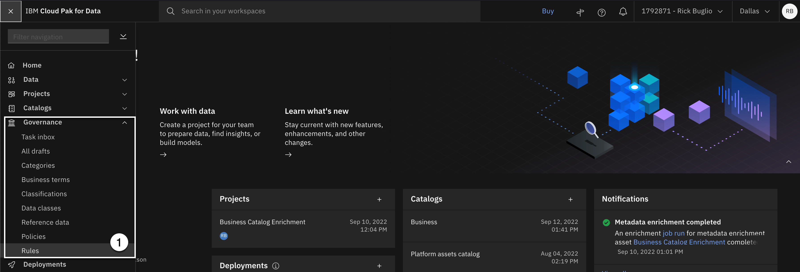
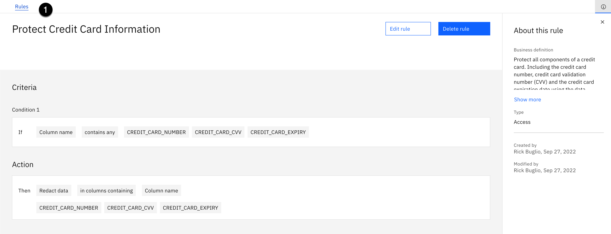

# 106: Governing Virtual Data

Watson Query can integrate with Watson Knowledge Catalog to govern the virtual data that is published to a governed catalog. This section is **optional** for technical sellers and business partners that are interested in learning how to govern virtualized data in **Watson Query** using the data governance features of **Watson Knowledge Catalog**. This section uses a very simple masking example based on column names using the **Redaction** masking method, to demonstrate the integration between the two services with the least amount of setup and configuration. It **does not** use the **advanced data privacy** masking methods that are defined in the [Create Data Protection Rules](https://vest.buildlab.cloud/en/wkc/102#7-create-data-protection-rules) section of this **Data governance** lab above.

#### Provision a Watson Knowledge Catalog Service

Before you proceed, you must have a **Watson Knowledge Catalog** service provisioned in the same cloud account, and cloud region where your **Watson Query** service is provisioned. If not, go to the **Provision the Services** step of the [Getting started](https://vest.buildlab.cloud/en/wkc/getting-started) section of the **Data fabric lab** and follow the instructions to provision one.

## 1. Create Service Authorizations

In order for **Watson Query** to publish to a governed catalog and enforce **Watson Knowledge Catalog** data protection rules, a service to service authorization has to be created in your IBM Cloud account using **Identify and Access Management** (IAM).

Go to the [IBM Cloud](https://cloud.ibm.com/login) Log in page.

1. Enter your IBM Id.

2. Select the **Continue** button.

When prompted, enter your password and any additional authentication requests you are presented with.

3. Select the **Manage** menu on the toolbar.

4. Select the **Access (IAM)** menu item.

5. Select the **Authorizations** menu item from the **Manage access** section of the menu on the left.

6. Select the **Create** button.

7. Select **This account** as the Source account. (It should be selected by default).

8. Using the **Source service** dropdown, start typing **watson know** into the search area, select **Watson Knowledge Catalog** from the service list.

9. Select the **All Resources** radio button for how you want to scope the source service access.

10. Using the **Target service** dropdown, select **Watson Query** from the service list. (It should be the only service listed).

11. Select the **All Resources** radio button for how you want to scope the target service access.

12. Scroll **down** to the bottom of the authorizations page.

13. Select the checkbox in the **Service access** section next to **DataAccess (For Service to Service Authorization Only)**.

14. Click the **Authorize** button.

You will see the new service to service authorization in your cloud account in the **Manage authorizations** table.

15. Select the **IBM Cloud** label in the upper left corner to get back to the home page.

## 2. Create Governed Catalog

In order to govern virtual data in **Watson Query**, you will need a **governed** catalog that is created in the same account that your **Watson Query** service is deployed. This is a catalog that was created with the **Enforce data policies** option enabled. You can not use the **Platform assets catalog** because it is **not** a governed catalog and it cannot be modified to become one.

If you have done the **Data governance** technical lab, you should have a governed catalog created in your account. If not, you can use an existing governed catalog, in the same account and region that your **Watson Query** service is deployed, or create a new governed catalog.

If you need to create a governed catalog, go to the [Create the Catalog](https://vest.buildlab.cloud/en/wkc/104#1-create-the-catalog) section of this lab for instructions on how to create one.

## 3. Create Data Protection Rule

In this step, you will create a data protection rule to protect sensitive credit card information in the **CUSTOMER** virtual data asset, by using the **Redaction** masking method, so the values are not visible to those who do not have the authority to view the information. You will create the data protection rule using **Column name** as the criteria for the rule condition for columns named: **CREDIT\_CARD\_NUMBER**, **CREDIT\_CARD\_CVV** and **CREDIT\_CARD\_EXPIRY**.

1. Select the **Navigation** menu (the 4 stacked horizontal lines in the upper left corner).

2. Select the **Governance > Rules** menu.

3. Using the **Add rule** dropdown, select **New rule**.

4. Select **Data protection rule**.

5. Select the **Next** button.

6. Copy the text below and paste it into the **Name** field:

<CopyText text="Protect Credit Card Information"/>
    
7. Copy the text below and paste it into the **Business definition** field:

<CopyText text="Protect all components of a credit card. Including the credit card number, credit card validation number (CVV) and the credit card expiration date using the data privacy redaction masking method."/>
    
Specify the rule **Criteria** for **Condition 1** as follows:

8. Using the **If** statement dropdown on the left, select **Column name**.

9. Using the **If** statement dropdown on the right, select **contains any**.

10. Copy the text below and paste it into the **Column name** field:

<CopyText text="CREDIT_CARD_NUMBER, CREDIT_CARD_CVV, CREDIT_CARD_EXPIRY"/>
    
11. Press the **Enter** or **Return** key on your keyboard.

Specify the rule **Action** as follows:

12. Using the **then** statement **Action** dropdown on the left, select **mask columns**.

13. Using the **then** statement **in columns containing** dropdown on the right, select **Column name**.

14. The **CREDIT\_CARD\_NUMBER**, **CREDIT\_CARD\_CVV**, and **CREDIT\_CARD\_EXPIRY** columns will automatically be filled in for you.

15. Select **Redact** as the masking method in the **Select masking method** section.

16. Click the **Create** button.

You should see a **Successfully created!** message and see the new rule created.

17. Select the **Rules** breadcrumb in the upper left corner to return to Rules main page.

Data governance is now setup for **Watson Query** to use **Watson Knowledge Catalog** to protect sensitive credit card information.

