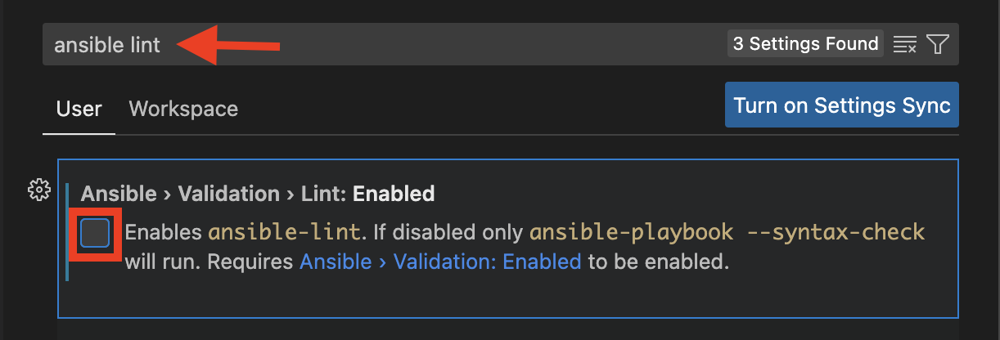
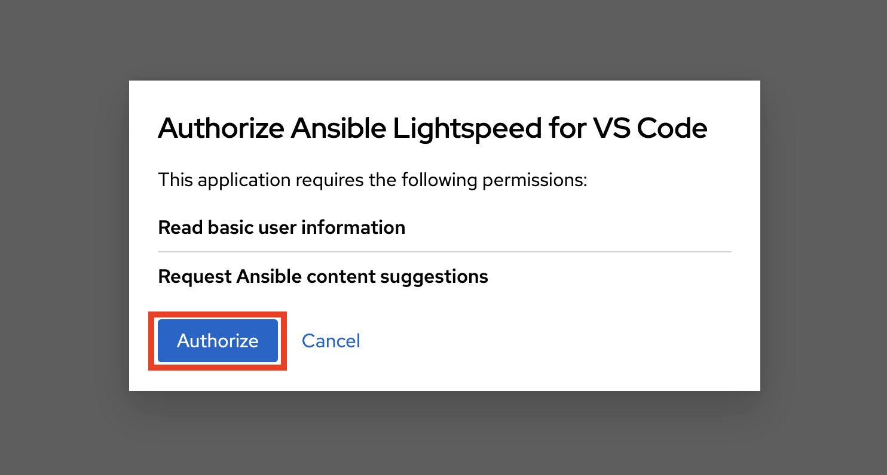

# 101: Configuración del entorno Ansible Lightspeed en VS Code

## Objetivo

El objetivo de este laboratorio es instalar la extensión Ansible Lightspeed y habilitar y autenticar la extensión en VS Code. 

## Instalar la extensión Ansible en VS Code

1. Abra la aplicación VS Code.
2. Haga clic en el icono **Extensiones** de la barra lateral izquierda.

    
3. Busque **Ansible** en el cuadro de búsqueda y haga clic en el botón **Instalar**.

    

## Habilitar la extensión Ansible Lightspeed

1. Después de instalar la extensión Ansible, haga clic en el pequeño icono de engranaje y seleccione la opción **Configuración de la extensión**.

    
2. En la barra de configuración de búsqueda, escribe **lightspeed**.
3. Si aún no están seleccionadas, marca todas las casillas siguientes:
 - Ansible > Lightspeed: **Habilitado**
 - Ansible > Lightspeed > Sugerencias: **Activado**.

    

**Nota:** Para el propósito de esta demo, deshabilitaremos Ansible Lint y Ansible Execution Environment.

1. En la barra de configuración de búsqueda, escriba **ansible lint**. 2. Si aún no está deseleccionada, *desmarque* la casilla **Ansible > Validation > Lint: **Enabled****.

    

2. En la barra de configuración de búsqueda, escriba **ansible execution**. Si aún no está deseleccionada, *desmarca* la casilla **Ansible > Entorno de ejecución: **Enabled****.

## Autenticar Ansible Lightspeed con GitHub

1. Abre el icono de extensión de Ansible en la parte izquierda de la interfaz de Visual Studio Code y haz clic en **Connect**.

    

2. Siga las instrucciones para iniciar sesión en Ansible Lightspeed con IBM watsonx Code Assistant utilizando sus credenciales de GitHub.

    a. Haga clic en el botón **Allow**.

    

    b. Haz clic en el botón **Abrir**.

    

    c. Haz clic en el enlace **Log in to Tech Preview**.

    > NOTA: Si tiene una suscripción paga a Red Hat Ansible Lightspeed, elija **Log in with Red Hat**

    

    d. Haga clic en el botón **Autorizar**.

    

    e. Haga clic en el botón **Autorizar ansible**.

    

    f. Una vez completado con éxito el flujo de inicio de sesión, debería ver un mensaje **Logged in as your GitHub id** en la barra lateral de Ansible como el que se muestra a continuación:

    
    

Ahora estás listo para continuar con la siguiente parte de este taller.
