# 101: Ansible Lightspeed environment setup in VS Code

## Goal

The goal of this lab is to install the Ansible Lightspeed extension and enable and authenticate the extension in VS Code. 

## Install Ansible extension in VS Code

1. Open the VS Code application.
2. Click the (1) **Extensions** icon on the left sidebar. Then search for (2) **Ansible** in the search box and then click the (3) **Install** button

    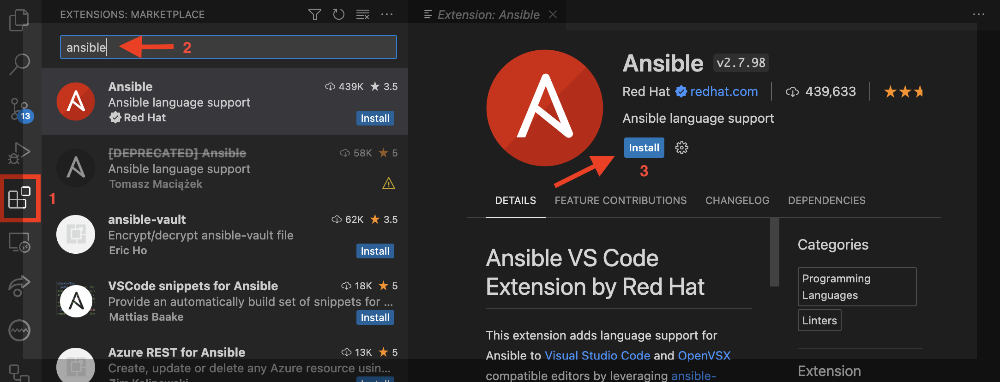

## Enable the Ansible Lightspeed extension

1. After installing the Ansible extension, click on the little gear icon and select the **Extension Setting** option.

    **Note:** *You may need to restart VS Code before the full set of ansible options is available*

    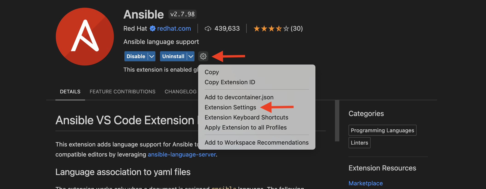
2. In the Search settings bar, type **lightspeed**
3. If they are not already selected, check all of the following boxes:
 - Ansible > Lightspeed: **Enabled**
 - Ansible > Lightspeed > Suggestions: **Enabled**.

    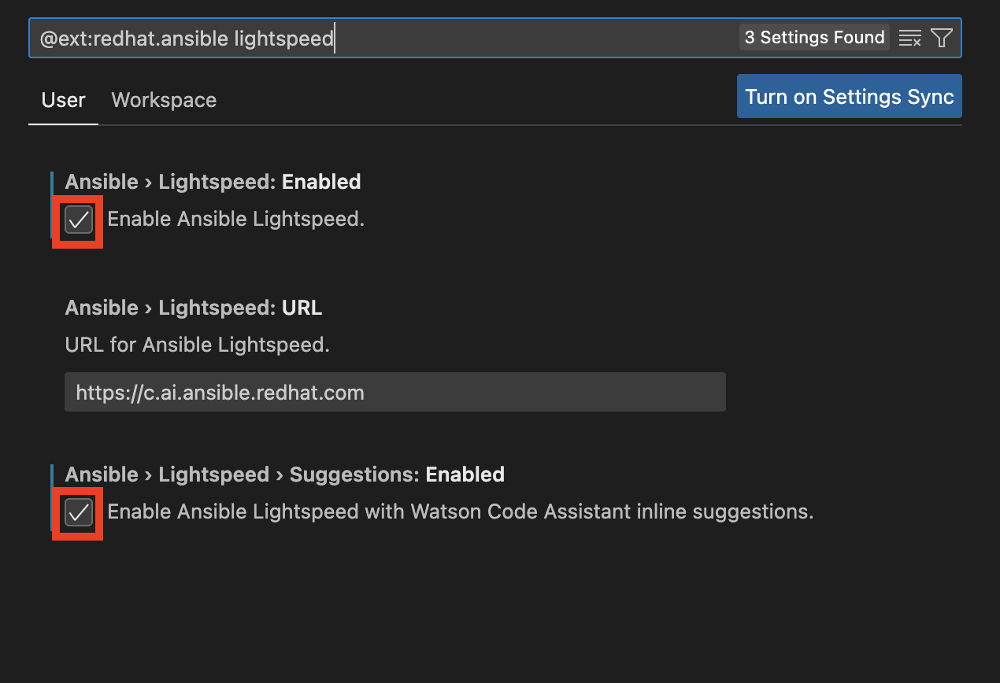

**Note:** *For the purpose of this demo, we will disable Ansible Lint and Ansible Execution Environment.*

1. In the Search settings bar, type **ansible lint**. If it is not already unselected, *uncheck* the **Ansible > Validation > Lint: **Enabled**** box.

    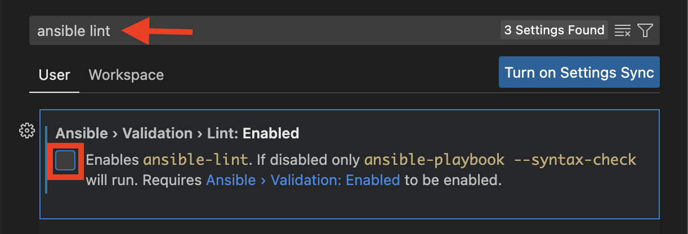

2. In the Search settings bar, type **ansible execution**. If it is not already unselected, *uncheck* the **Ansible > Execution Environment: **Enabled**** box.

    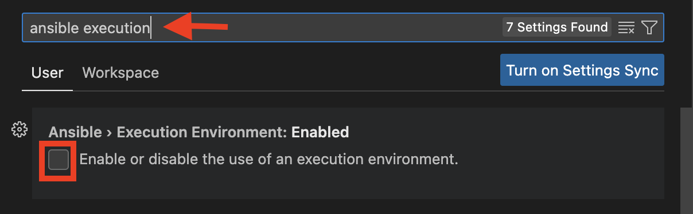

## Authenticate Ansible Lightspeed with GitHub

1. Open the Ansible extension icon on the left-hand side of the Visual Studio Code interface and click **Connect**.

    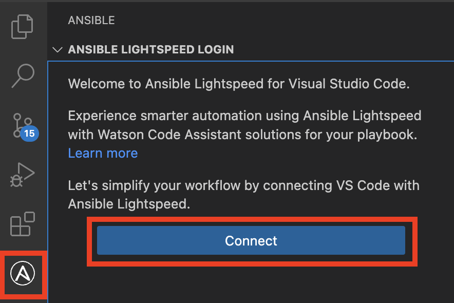

2. Follow the prompts to sign in to Ansible Lightspeed with IBM watsonx Code Assistant using your GitHub credentials.

    a. Click on the **Allow** button.

    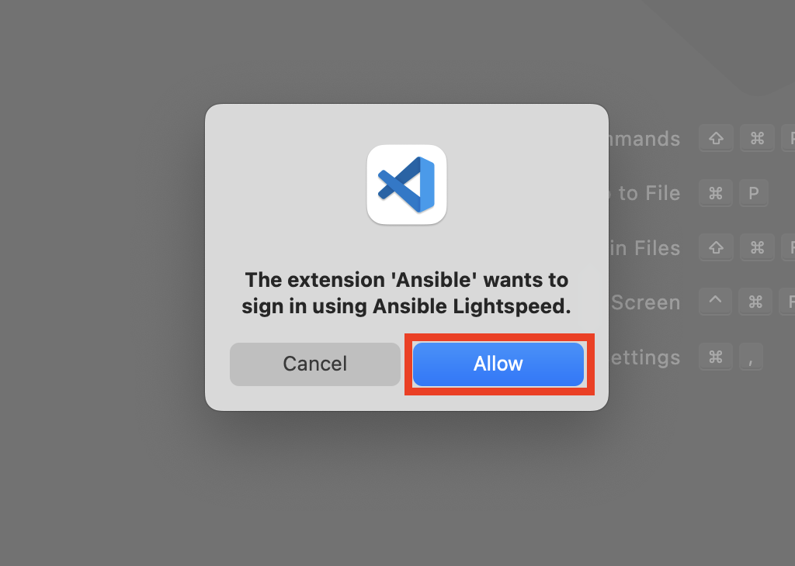

    b. Click on the **Open** button.

    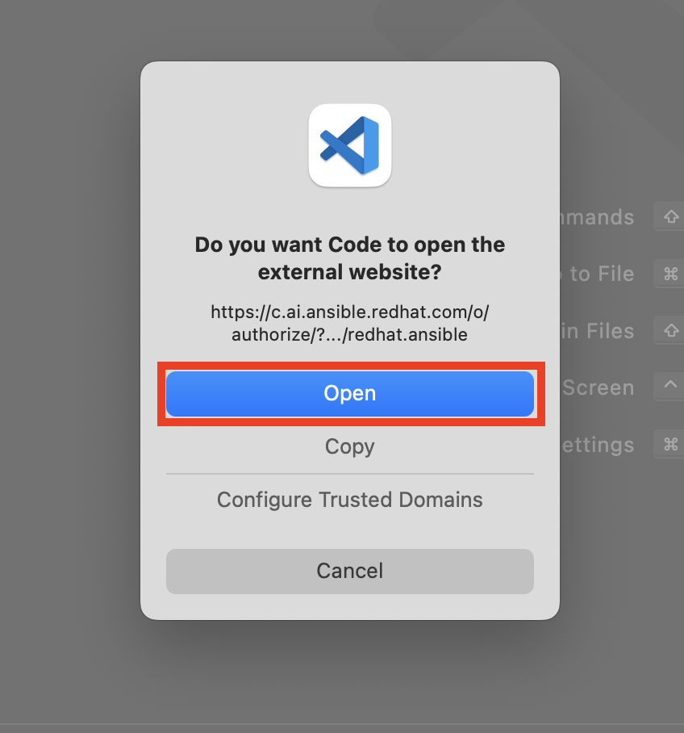

    c. Click on the **Log in with GitHub** button.

    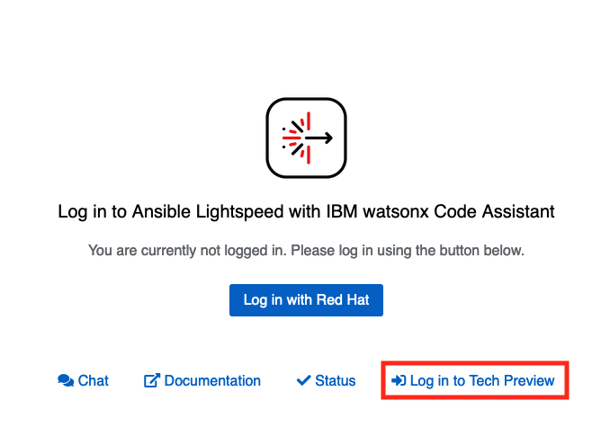

    d. Click on the **Authorize** button

    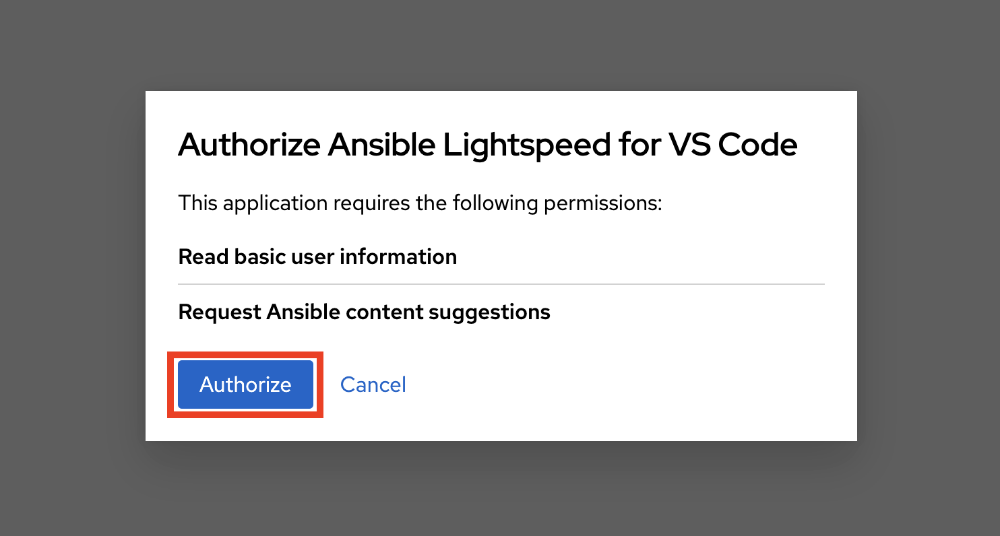

    e. Click on the **Authorize ansible** button

    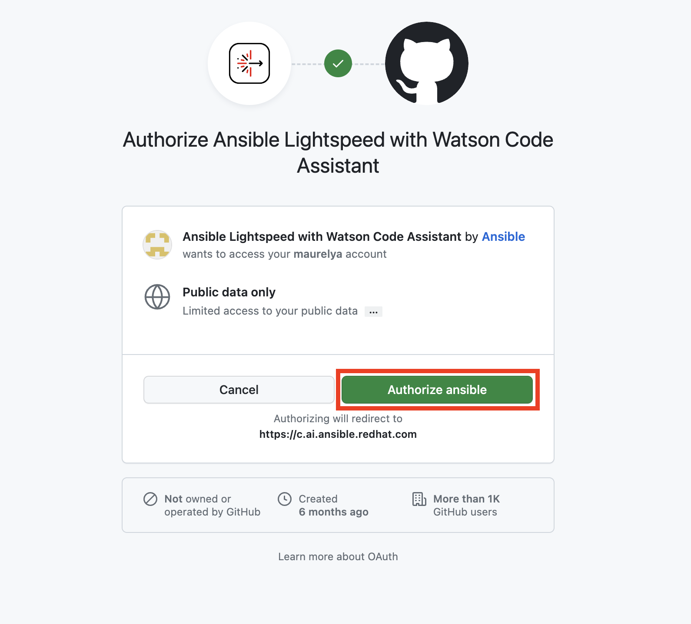

    f. Upon successful completion of the login flow, you should see a **Logged in as your GitHub id** message in the Ansible side bar like the one below:

    **Note:** *You may be prompted to allow access to VS Code from your browser and vice versa. Make sure you allow this.*

    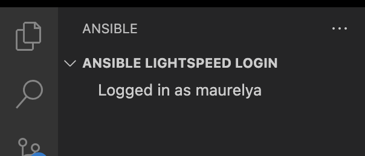
    

Now you are all set to continue to the next portion of this workshop!
