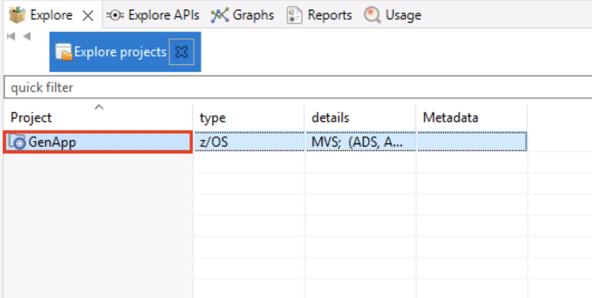
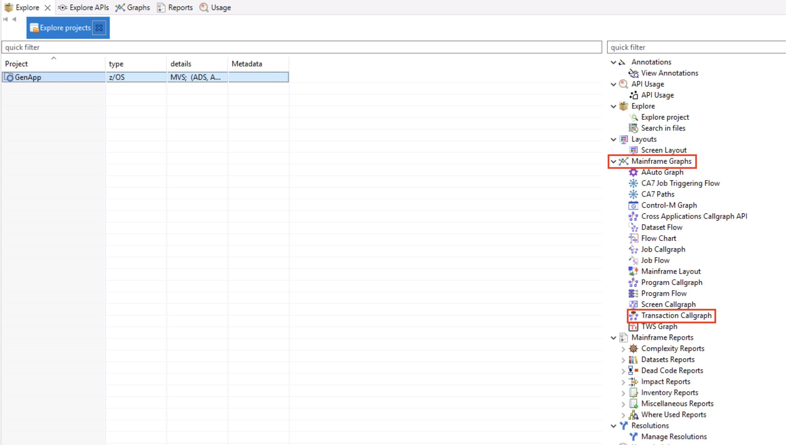
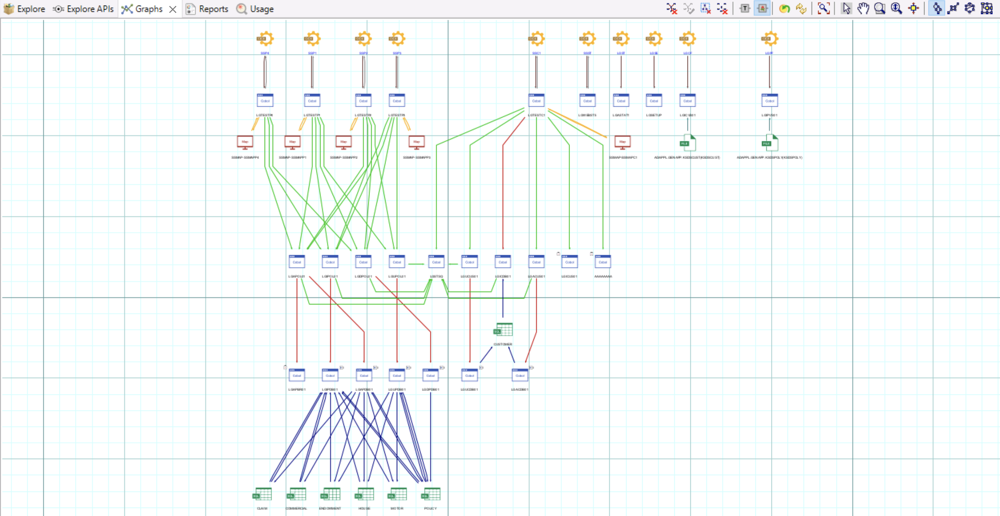
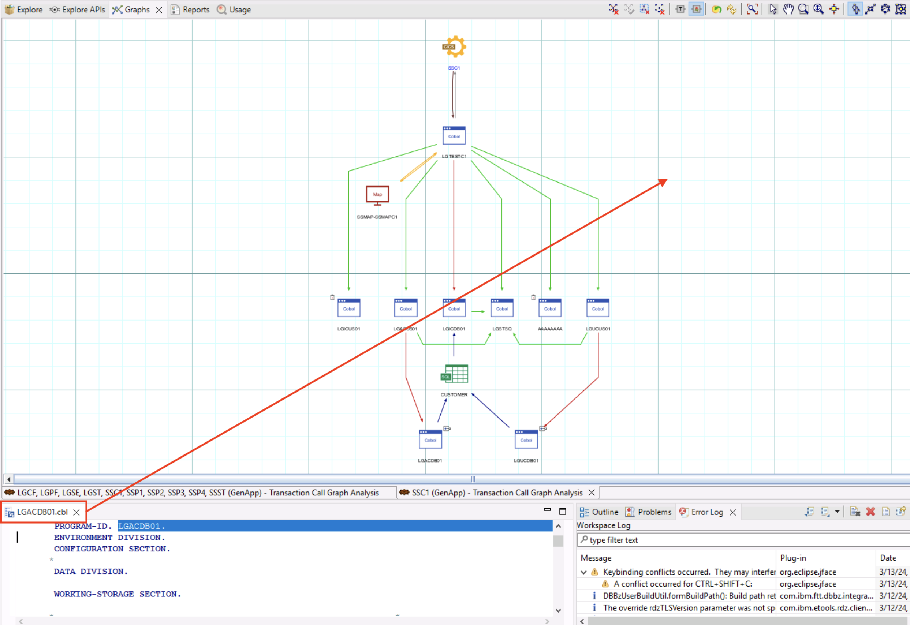

<QuizAlert text="¡Aviso! ¡El material del cuestionario se marcará así!" />

# 112: IBM watsonx Code Assistant (WCA) para Z Application Discovery

### Objetivo

El objetivo de este laboratorio es centrarse en la fase de **comprensión** del ciclo de vida de modernización de aplicaciones de mainframe para aplicaciones z/OS. Pasar por un proceso de descubrimiento de aplicaciones para comprender todas las dependencias y relaciones de una aplicación es un primer paso importante en cualquier viaje de modernización de aplicaciones. Los arquitectos y desarrolladores pueden pasar semanas o meses perdidos intentando comprender todos los cambios necesarios revisando millones de líneas de código, cientos de dependencias y documentación obsoleta. El uso de una herramienta de descubrimiento de aplicaciones ayuda a descubrir las relaciones entre los componentes de la aplicación y permite a los desarrolladores analizar visualmente esas relaciones, de modo que puedan realizar cambios de forma más rápida y segura para un amplio conjunto de lenguajes y entornos.

## Descubrimiento de aplicaciones

1.  Haga clic en el icono **IBM Developer for z/OS** de la barra de tareas para abrirlo.

2.  Aparecerá una ventana emergente pidiéndole que seleccione un directorio como espacio de trabajo. Mantenga el directorio predeterminado y pulse el botón **Iniciar**.

> **Nota:** Puede tardar un par de minutos en cargarse.

3.  **IBM Developer for z/OS** se abre en la pestaña **Explorar proyectos**. Haga clic con el botón derecho en cualquier lugar bajo el campo de **filtro** rápido y seleccione **Obtener lista de** proyectos.

4.  Seleccione **GenApp** en la nueva columna " **Proyecto** ".

5.  Un nuevo campo con una lista de opciones aparecerá en la parte derecha de la pantalla con su propio filtro rápido en la parte superior. En este nuevo campo, despliegue el twistie **Mainframe Graphs**, si no está ya desplegado, y haga doble clic en la opción **Transaction Callgraph**.

> **Nota:** Puede tardar un momento en aparecer la ventana emergente necesaria para realizar el siguiente paso. Verá la **ejecución de Transaction Callgraph** en la parte inferior con una barra verde.

6.  Cuando se abra **GenApp - Transaction Call Graph Analysis**, seleccione todo lo que vea en el cuadro **Available transactions (Transacciones disponibles** ) utilizando el botón **add all items (añadir todos los elementos** ) (parece un botón de avance rápido) para moverlos al cuadro **Selected transactions (Transacciones seleccionadas** ). A continuación, haga clic en el botón **Finalizar** para cargar todas las transacciones.

Se cargará un gráfico de llamadas con todas las transacciones de esta aplicación perfilada.

> **Nota:** el gráfico puede tardar unos minutos en formarse.

7.  Acérquese para poder ver la **transacción SSC1**. Esta transacción está relacionada con la tabla **CLIENTE (CUSTOMER)**. La transacción **SSC1** se utiliza para Añadir, Insertar y Actualizar la tabla CLIENTE (CUSTOMER). **SSC1** se utilizará en la siguiente fase.

> **Nota:** en la esquina superior derecha de la vista del gráfico hay algunas herramientas que le ayudarán a navegar y hacer zoom.

8.  Seleccione la **pestaña Explorar**.

9.  Repita **el paso 5** y haga doble clic en la opción **Transaction Callgraph**.
10. Esta vez (a diferencia del **paso 6**), seleccione sólo la **transacción SSC1** y esta vez utilice el icono de **añadir elementos seleccionados** (parece un botón de reproducción) para añadir sólo esta transacción al cuadro **Transacciones seleccionadas** de la derecha. A continuación, haga clic en el botón **Finalizar** para cargar la transacción.

Se cargará un gráfico de llamadas con la transacción **SSC1** en esta aplicación perfilada.**(Nota:** el gráfico puede tardar unos minutos en construirse).

Un gráfico de llamadas de transacciones tiene diferentes componentes (utilice las herramientas de panorámica y zoom detalladas anteriormente para ver más de cerca estos componentes). Por ejemplo:

1.  Las transacciones CICS del SSCI
2.  El programa de transacción principal (**LGTESTC1**). Este programa llama al mapa **SSMAPC1**.
3.  Dependiendo de la función seleccionada, puede realizar diferentes operaciones. En este ejemplo:

*   Añadir/insertar cliente (LGACUS01)
*   Consultar cliente (LGICUS01)
*   Actualizar cliente (LGUCUS01)

4.  Estos programas llaman a programas de acceso a datos que interactúan con la tabla **CLIENTE (CUSTOMER)**. Por ejemplo:

*   Añadir/insertar cliente (LGACDB01)
*   Consultar cliente (LGICDB01)
*   Actualizar cliente (LGUCDB01)
*   Devuelve mensajes al usuario (LGSTSQ)
*   Programa desconocido sin información sobre el código fuente (AAAAAAAA)

11. Haga doble clic en el cuadro blanco y azul **COBOL LGACDB01**. El código se abre en la parte inferior.

12. Arrastra la pestaña de código **LGACDB01** en la parte inferior, a la derecha del gráfico para que puedas ver el código junto a la vista de navegación. Antes de soltar el botón, verás unas barandillas donde se colocará esta ventana.

13. En el código **LGACDB01.cbl**, desplácese hacia abajo hasta la sección **INSERTAR-CLIENTE (INSERT-CUSTOMER)** (está a unos dos tercios del camino), la función principal es insertar un registro en la tabla **CLIENTE (CUSTOMER)**. Este código se utilizará en la siguiente fase.

Ha completado con éxito la fase de **Comprensión** del ciclo de vida de modernización de aplicaciones mainframe. Utilizará todo lo aprendido aquí en los pasos **Refactorizar** y **Transformar** en los siguientes laboratorios. En este laboratorio:

<QuizAlert text="Hay una pregunta en el cuestionario sobre la fase Comprensión." />

*   Comprobó el gráfico de llamadas de la aplicación **GenApp** que mostraba sus transacciones. A continuación, ha profundizado en la transacción **SSC1** para comprender su flujo y los componentes relacionados.
*   Has visto el programa de acceso a datos **LGACDB01** y has observado cómo se utiliza este programa para insertar un registro de cliente en la tabla de datos **CLIENTE (CUSTOMER)**

### Enhorabuena, has llegado al final del laboratorio 112 utilizando IBM watsonx Code Assistant (WCA) para Z Application Discovery.

Haga clic en, **[laboratorio 113](/watsonx/codeassistant/z/113)** para iniciar el siguiente laboratorio.
