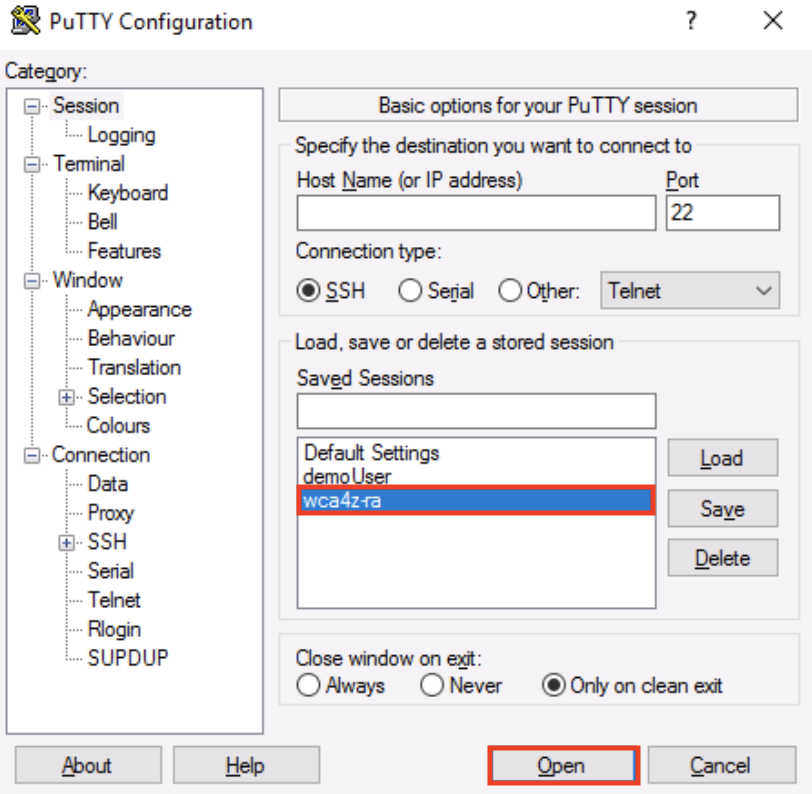
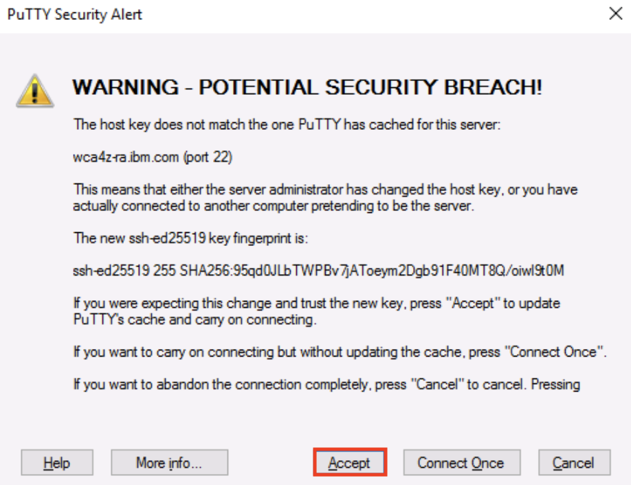
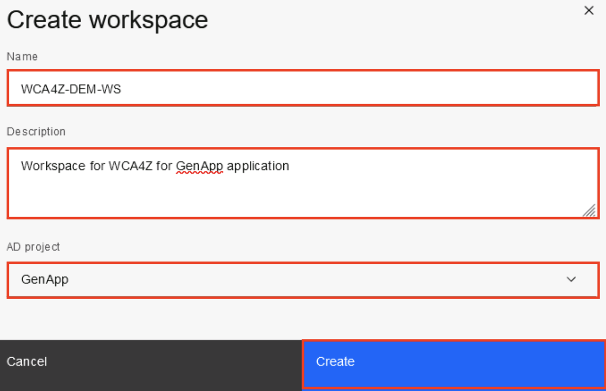
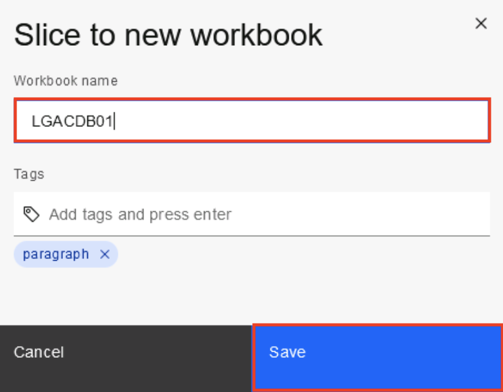
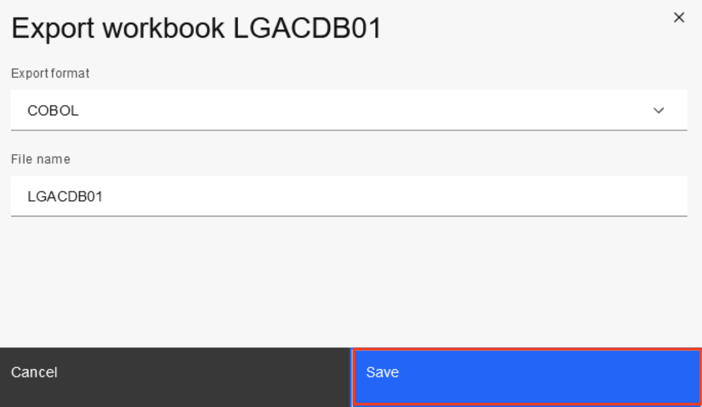
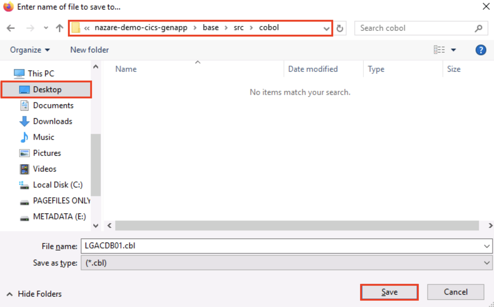

# 112: IBM watsonx Code Assistant (WCA) for Z Auto Refactoring

### Goal

The goal of this lab is to focus on the **Refactor** phase of the mainframe application modernization lifecycle. IBM applies new automated refactoring technology to quickly identify the parts of the application to refactor, in the **Refactor** step of the application modernization journey. Code is then extracted into modular, reusable services via deep functional analysis of the source code. By automating the ”code slicing” process, the accuracy is improved, and the developer time and skill required is reduced. Once the targeted code is extracted into business services, architects and developers can make decisions relative to maintain the code in COBOL or to convert the code to Java.

## Auto Refactoring

1. Open the **Putty** app from the taskbar at the bottom.

  

2. Select **wca4z-ra** from the **Saved Sessions** box (A) and click **Open**.

  

3. After clicking **Open** in the previous step the following warning message will pop-up. Click **Accept**. This warning will only be displayed once if you do this demo again.

  

4. A script will run in Putty to start the Refactoring Assistant. When you see the text **IBM Watson code assistant for Z Refactoring Assistant started** at the bottom of the Putty window, you can close it by clicking the **X** button in the top right corner. You will be asked **Are you sure you want to close the session?**. Click **OK**.

  

5. Click on the **Firefox** icon in the taskbar to open it.

  

6. Click the **IBM watsonx Code Assistant for Z Refactoring Assistant** link in the **Favorites bar** at the top.

  

7. Click **Log in** to proceed to the IBM watsonx Code Assistant for Z Refactoring Assistant with the prefilled credentials.

8. After building a project in the **Understand** phase, you can create a workspace to work on that project with **IBM watsonx Code Assistant for Z Refactoring Assistant**. In the **My workspaces** tab, click the **Create workspace** button on the right.

  

9. In the **Create workspace** dialog window, fill out the information below and then press the **Create** button:

  - **Name:** `WCA4Z-DEM-WS`
  - **Description:** `Workspace for WCA4Z for GenApp application`
  - **AD project:** select **GenApp**

  

10. The GenApp workspace’s **Graph** tab is displayed. Click in the **Search** bar at the top. You will see the **Artifact type** drop-down menu.

  

11. Select **All artifact types** (it’s likely the default) to see a dropdown list of the different artifact types. Select **CICS transactions**.

  

12. From the dropdown list of transactions, double-click on the **SSC1** artifact to open it.

  

13. The **SSC1** transaction graph opens. Zoom out by 30% using the magnifying glass icon (bottom left) until you can see the complete callgraph in the window. The entire graph should be displayed after zooming out. Locate and click on the **CUSTOMER** table to highlight the flow of program dependencies for this table.

  

14. In the last lab for the **Understand** phase, you checked the callgraph for **SSC1** transactions and then looked at the **INSERT-CUSTOMER** query in the **LGACDB01** code. Now click on the ellipsis icon (3 dots) beside **LGACDB01**. You are presented with the following actions:

  - View properties
  - Identify conditional statements
  - Identify paragraphs
  - Identify tables/file access statements

  Select the **Identify paragraphs** option to display all paragraphs in the code in the order of importance.

  

15. The screen will switch to the Workbook tab with a paragraph identification form. You can see 3 sections:
  
  - **Workbook details** on the left
  - **Key conditions** in the middle section, showing the paragraphs in the code in the order of importance/complexity
  - **Artifact’s code** in the right section

  Click on **INSERT-CUSTOMER** in the **Key conditions** box to jump to this code on the right.

  

16. Click on the **INSERT-CUSTOMER** text (line 232) in the code, then right-click to see the **Slice on paragraph to new workbook** option. Click the **Slice on paragraph to new workbook** option.

  

17. The **Slice to a new workbook** pop-up window will appear. Enter `LGACDB01` in the **Workbook name** field, then click the **Save** button.

  

  The selected paragraph of code will be sliced into a new workbook (called **LGACDB01**) and displayed on the left. Note how the selected code is marked with a dotted blue line in the code editor on the right.

  

18. In the **Workbook details** section, click the ellipsis icon (3 dots) beside **Status**. Select the **Export** option to export the sliced code. An **Export workbox LGACDB01** window will appear. Click **Save**.

  

  

19. A pop-up window will appear with a default location to save the exported sliced code. Click **Desktop** on the left and navigate to the following: **Desktop\WCAZ Lab Data\nazare-demo-cics-genapp\base\src\cobol**. Then click **Save** to save the exported code. This exported workbook will be used in the next lab for the **Transform** phase.

  

You have successfully completed the **Refactor** phase of the mainframe application modernization lifecycle. In this lab: 

  - You used information from the **Understand** phase to select the **SSC1** transaction

  - You used **IBM watsonx Code Assistant for Z Refactoring Assistant** to refactor the **INSERT-CUSTOMER** functionality by slicing code from the **LGACDB01** artifact into a workbook

  - You exported this workbook to be used in the next lab for the **Transform** phase

### Congratulations, you've reached the end of lab 113 using IBM watsonx Code Assistant (WCA) for Z Auto Refactoring.

Click, **[lab 114](/watsonx/codeassistant/z/114)** to start next lab.
