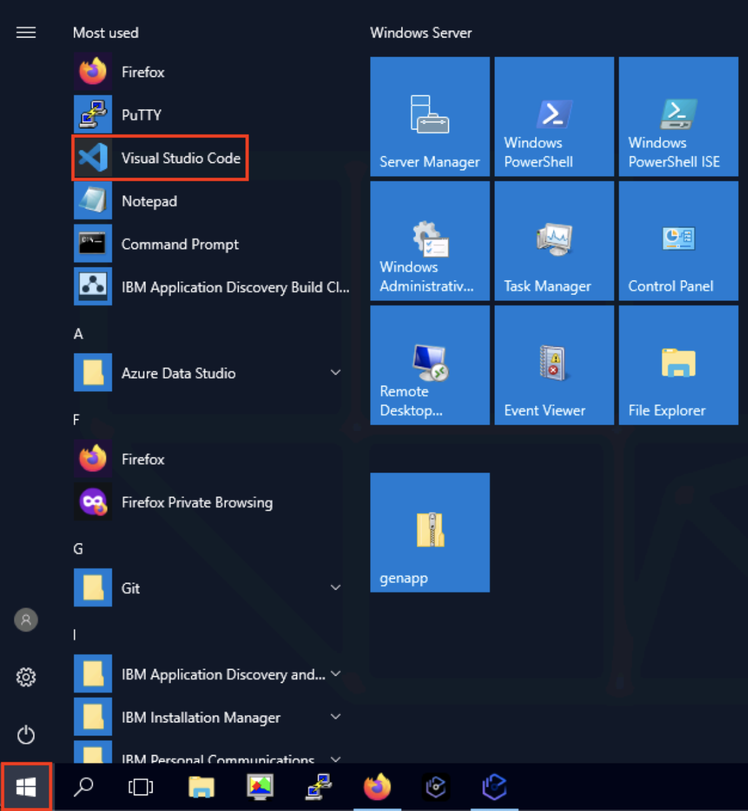
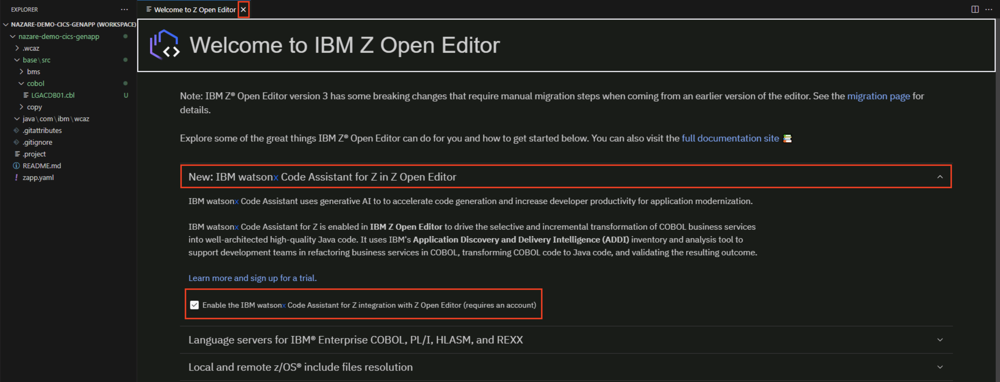
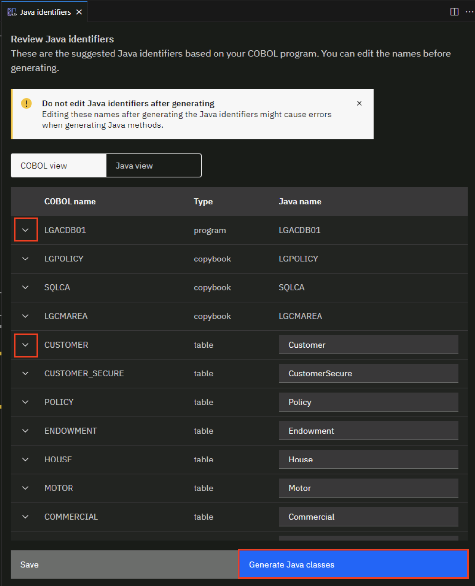

<QuizAlert text="¡Aviso! ¡El material del cuestionario se marcará así!" />

# 114: IBM watsonx Code Assistant (WCA) for Z Transformar código COBOL a Java

### Objetivo

El objetivo de este laboratorio es centrarse en la fase de **transformación** del ciclo de vida de modernización de aplicaciones de mainframe para aplicaciones z/OS. La conversión del código de COBOL a Java aprovecha las capacidades de IA generativa que forman parte de Code Assistant for Z para generar código Java a partir del código COBOL refactorizado. El código Java producido es un Java orientado a objetos con una buena arquitectura que se ha optimizado para los tiempos de ejecución y las calidades de servicio de IBM Z con la interoperabilidad, integración y estandarización necesarias.

## Transformación de código COBOL a Java

1.  Haga clic en el botón **Inicio de** Windows (el logotipo de Microsoft Windows en la esquina inferior izquierda de la pantalla de demostración) y seleccione el entorno de desarrollo integrado (IDE) **Visual Studio Code**.

2.  Expanda el twistie **Nuevo: IBM** **watsonx Code Assistant** **for Z en Z Open Editor**, y seleccione **Habilitar la integración de IBM watsonx Code Assistant for Z con Z Open Editor (requiere una cuenta)**, si no está ya seleccionada. A continuación, cierre la ventana **Bienvenido a** Z Open Editor haciendo clic en la **X** situada en la parte superior del nombre de la pestaña.

3.  En el panel **Explorador** de la izquierda, expanda **IBM WATSONX CODE ASSISTANT FOR Z** en la parte inferior. Verá una advertencia de que al IDE le falta una clave de API. Haga clic en la advertencia **Falta la clave watsonx** API (el texto amarillo).

4.  En la parte superior de la pantalla IDE - Visual Studio Code aparece el cuadro **Introducir clave API watsonx (Pulse 'Enter' para confirmar o 'Escape' para cancelar)**. Introduzca `ABCDEFGH` y pulse la tecla **Intro** de su teclado.

> **Nota:** **ABCDEFGH** es una API falsa sólo para esta demostración. En un entorno real, se debe utilizar una clave de API real.

5.  En el panel **Explorador** de la izquierda, expanda el twistie **NAZARE-DEMO-CICS-GENAPP (WORKSPACE)**, y haga clic en **LGACDB01.cbl** bajo la sección cobol. Una nueva pestaña se abre a la derecha mostrando el código COBOL. Desplácese hasta la **línea 151** para ver la parte **INSERT CUSTOMER** del código. Usted notará que este es el código COBOL que se exportó desde el libro de trabajo de la fase de **Refactorización** del laboratorio anterior.

6.  En el panel **Explorador** de la izquierda, haga clic con el botón derecho en **LGACDB01.cbl** y seleccione **Importar** programa COBOL. **Nota:** El programa COBOL se importa a **IBM WATSONX CODE ASSISTANT FOR Z** como **base\LGACDB01.cbl**.

1.  En el panel **Explorador**, en **IBM WATSONX CODE ASSISTANT FOR Z**, expanda el twistie **base\LGACDB01.cbl**. Verá dos entradas: Generar identificadores **Java** y **Generar métodos Java**. Haga clic en **Generar identificadores Java**.

8.  Aparecerá una barra de entrada **Generar Clases** Java en la parte superior central de la pantalla IDE - Visual Studio Code. Introduzca `java` como el directorio relativo dentro del área de trabajo para generar las clases java, y pulse la tecla **Intro** de su teclado.

9.  Se abre una nueva barra de entrada en el mismo lugar. Introduzca `com.ibm.wcaz` como nombre del paquete Java utilizado por las clases Java generadas y pulse la tecla **Intro** del teclado.

10. Aparece una nueva pestaña de **identificadores Java** en la parte derecha de la ventana. Haga clic en los twisties para expandir los artefactos **LGACDB01** y **CUSTOMER**. Puede ver las variables que se utilizan en los artefactos **LGACDB01** y **CUSTOMER**. A continuación, haga clic en **Generar clases Java**.

En el panel **Explorador**, observará las clases java recién generadas en el directorio **java\com\ibm\wcaz**.

11.  Haga doble clic en la clase **Customer.java** para abrirla.**Customer.java** se abre en una nueva pestaña. En la clase **Customer**.java, puedes ver los getter, setters, y variables overrides (Puede que tengas que desplazarte para ver todo el código).

1.  Ahora haz doble clic en la clase **CustomerRequest.java** para abrirla. **CustomerRequest.java** se abre en una nueva pestaña. En la parte inferior de **CustomerRequest.java** (puede que tenga que desplazarse para ver todo el código), haga clic con el botón derecho en el nombre del método **insertCustomer**. A continuación, haga clic en **IBM Watsonx Code Assistantfor Z** y seleccione **Generate Method**.

13. Se abre una nueva pestaña **java-generate** a la derecha. Haga clic en **Insertar** en la parte inferior derecha de la pestaña **java-generate** para insertar el método Java en el archivo de código **CustomerRequest.java**.

Observe que los detalles del método Java se añaden al archivo de clase **CustomerRequest.java** en el método **insertCustomer**.

Ha completado con éxito la fase **Transformacíon** del ciclo de vida de modernización de aplicaciones de mainframe. En este laboratorio:

<QuizAlert text="Hay una pregunta de prueba sobre la fase de Transformacíon." />

*   Ha utilizado el libro de trabajo **LGACDB01** que exportó en la fase de **Refactorización** para insertar la funcionalidad de cliente
*   Ha importado este libro de trabajo utilizando IBM watsonx Code Assistant para z
*   Has generado clases Java y métodos Java

### Enhorabuena, ha llegado al final del laboratorio 114 utilizando IBM watsonx Code Assistant (WCA) for Z Transform COBOL Code to Java.

Ya puedes **[completar el cuestionario](https://learn.ibm.com/course/view.php?id=16039)** de IBM watsonx Code Assistant for Z for Technical Sales Level 3 Quiz.

Una vez completado el cuestionario, haga clic en **[IBM watsonx Code Assistant for Z](/watsonx/codeassistant/z)** para ir a la página de inicio de IBM watsonx Code Assistant for Z.
