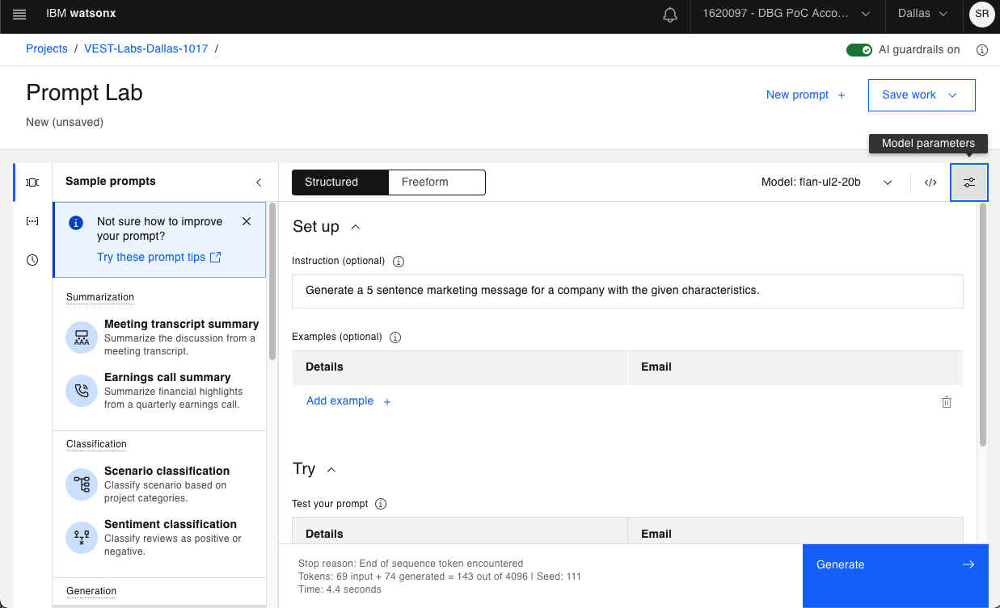
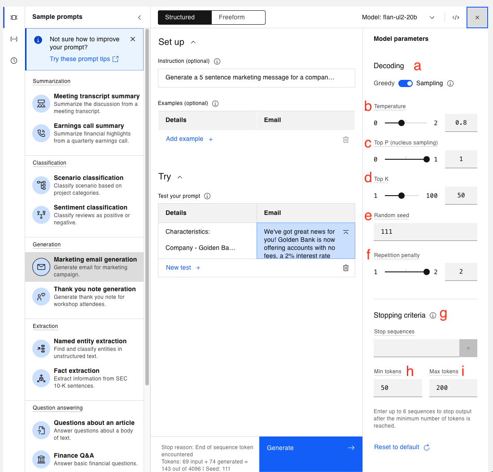
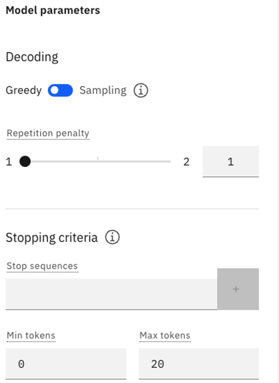
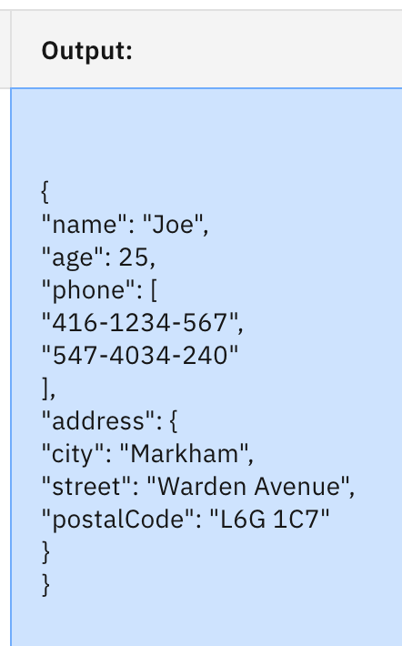

<QuizAlert text='¡Atención! ¡El material del cuestionario se marcará así!' />

# watsonx.ai L3 parte 2: Parámetros del modelo y solicitud de formatos de salida

Esta parte 2 del laboratorio de insignias watsonx.ai L3. En el laboratorio anterior experimentamos con diferentes modelos básicos y vimos cómo los ajustes en un mensaje de disparo cero pueden marcar una gran diferencia en el resultado generado.

En esta práctica de laboratorio exploraremos otras técnicas para obtener los mejores resultados de un modelo de base.

## Modificando parámetros

En esta práctica de laboratorio continuaremos trabajando en Prompt Lab y experimentaremos con parámetros de modelo configurables. Si es necesario, [regrese a la pantalla de inicio de watsonx.ai](/watsonx/watsonxai/100#accessing-watsonxai-from-ibm-cloud) y acceda a la interfaz de usuario de Prompt Lab.

Si ya ha estado trabajando en Prompt Lab, [abra una nueva sesión de Prompt Lab](/watsonx/watsonxai/100#creating-a-new-prompt-lab-session)

1. En la interfaz de usuario de Prompt Lab, seleccione el icono **]&#8414;[** del panel izquierdo para que aparezca la lista de mensajes de muestra. Haga clic en el ejemplo **Generación de correo electrónico de marketing** de la sección Generar. Utilice el modelo **flan-ul2-20b** si aún no está especificado.

2. Comenzaremos nuevamente con indicaciones ligeramente modificadas. Edite los detalles de la sección **Probar** y agregue "No agregue ninguna información adicional". como instrucción final. Haga clic en **Generar**.

     Deberías ver el mismo resultado que antes, con la URL alucinada.

     

3. A continuación modificaremos algunos parámetros de inferencia para ver el impacto en el resultado generado. Primero una explicación de los parámetros configurables. Abra el panel de configuración haciendo clic en el icono **Parámetros del modelo** que se muestra a continuación.

     

4. Esto abre una lista de parámetros que se pueden actualizar. Todos los modelos utilizan los mismos parámetros de inferencia. Expliquemos el propósito de cada uno.

     

     <QuizAlert text='¡Pregunta del cuestionario relacionada con los parámetros del modelo!' />

     - **a. Codicioso** versus **Decodificación de muestreo**: así es como el modelo elige los tokens para la salida. Los primeros 4 parámetros siguientes (b a e) solo son visibles en el modo **Muestreo**.
    
         - En el modo **Codicioso**, el modelo selecciona los tokens de mayor probabilidad en cada paso de la decodificación, y un modelo es menos creativo en ese modo.
    
         - En el modo **Muestreo**, el modelo elige el siguiente token de un grupo de los siguientes tokens más probables, por lo que hay más creatividad, pero también un mayor riesgo de que el resultado no tenga sentido.


     - **b. Temperatura**: un número de coma flotante que oscila entre 0,0 (que hace que el modelo funcione de la misma manera que si se seleccionara la decodificación Greedy) y 2,00 (que es la máxima creatividad).
    
         - Cuanto mayor sea el valor de **Temperatura**, más “creativo” será el modelo.
    
         - El valor predeterminado suele ser 0,7, pero en este caso se establece en 0,8. Esto significa que al modelo se le permite cierta creatividad.


     - **C. Top P (muestreo de núcleos)**: un número de coma flotante que oscila entre 0,0 y 1,0. En un nivel alto, al generar una finalización, un modelo calcula la probabilidad de la siguiente palabra en función de todas las palabras anteriores. **Top P** decide si el modelo siempre elegirá el resultado más probable o permitirá más aleatoriedad para las siguientes palabras. El muestreo de **Top P** elige entre el conjunto más pequeño posible de "siguientes" palabras cuya probabilidad acumulada excede el valor proporcionado para **Top P**.

     - **d. Top K**: un número entero del 1 al 100. A diferencia de **Top P, Top K** no analiza la probabilidad de los tokens. En cambio, el modelo elige la siguiente palabra de los **Top K** tokens más probables para el siguiente resultado.

         - **Top K** = 3, significa que el modelo elegirá aleatoriamente entre las 3 siguientes palabras más probables.

         - Cuanto mayor sea el valor de **Top K**, más aleatorio será el resultado.

     - **e. Semilla aleatoria**: un número entero en el rango de 1 a 4.294.967.295. En el modo de muestreo, si todo lo demás permanece igual, la actualización de la semilla aleatoria producirá resultados diferentes.

         - Si la semilla aleatoria sigue siendo la misma, debería obtener los mismos resultados, por eso dejamos el valor igual para estos laboratorios.

         - En resumen, la semilla aleatoria es útil para la replicabilidad de los experimentos.

     - **f. Penalización por repetición**: un valor entre 1 y 2 (un valor de 1 permite la repetición y 2 la prohíbe). Esto se utiliza para contrarrestar la tendencia de un modelo a repetir el texto del mensaje palabra por palabra o quedarse atascado en un bucle al generar el mismo resultado.

     -**g. Secuencias de parada**: secuencias de caracteres (texto, caracteres especiales, retorno de carro, etc.) utilizadas como indicador de parada por el modelo. La secuencia de parada en sí seguirá incluida en el resultado del modelo, pero esa será la última parte del resultado.

     - ** h. Tokens mínimos**: un número entero que especifica el número mínimo de tok

     ## Solicitar diferentes formatos de salida

Al solicitar un LLM, a menudo es beneficioso obtener el resultado en un formato específico. Para facilitar la lectura o para agilizar la integración con otra herramienta.

### Solicitar listas

Recuerde que un modelo básico no lee ni interpreta una indicación como un humano. Más bien, consume una serie de palabras tokenizadas y calcula el mejor token siguiente. El concepto de lista es fácil de entender para un humano. Aquí veremos cómo responden algunos LLM.

1. [Abra una nueva sesión de Prompt Lab](/watsonx/watsonxai/000#creating-a-new-prompt-lab-session) y seleccione la pestaña **Forma libre** en lugar de la pestaña predeterminada **Estructurada**. Elija "Cambiar modo" cuando se le solicite Cambiar al modo de forma libre.

     > Nota: En el modo Forma libre, aún tiene acceso a todos los ejemplos, modelos y configuración, pero no hay una guía estructural para el mensaje.

2. Abra el panel **Parámetros del modelo**. En el modo **Forma libre**, los valores predeterminados de los parámetros se parecen a los siguientes si **no ha seleccionado** una muestra rápida.

     

3. Verifique que esté utilizando la decodificación **Greedy** y cambie el valor de **Tokens máximos** a 100.

4. Asegúrese de estar utilizando el modelo **flan-ul2-20b**. Copie y pegue el siguiente texto en el campo de entrada:

    ```txt
    The following paragraph is a consumer complaint. 

    Read the following paragraph and list all the issues.   I called your helpdesk multiple times and every time I waited 10-15 minutes before I gave up. The first time I got through, the line got cut suddenly and I had to call back. This is just ridiculous. When I finally got through like after 3 days (yes, 3 days) your agent kept going over a long checklist of trivial things and asking me to verify, after I repeatedly told the agent that I am an experienced user and I know what I am doing. It was a complete waste of time. After like an eternity of this pointless conversation, I was told that an SME will contact me. That – was 2 days ago. What is the problem with your support system?

    The list of issues is as follows:
    ```

     Haga clic en **Generar**. Debería ver un resultado similar al siguiente:

    

     > **Tenga en cuenta lo siguiente:**
     <br />- El modelo no generó una lista.
     <br />- El modelo simplemente repitió el texto ingresado palabra por palabra.
     <br />- La salida finaliza debido al límite de 100 tokens.
     <br /><br />Los modelos de flan (tanto el **flan-ul2-20b** como el **flan-t5-xxl-11b**) parecen percibir "lista" como una instrucción para contar lo que fue dicho anteriormente.

5. Un método común para obtener resultados de listas es guiar el modelo iniciando la lista. Elimine el resultado anterior y agregue un "1". hasta la última línea del texto del mensaje. Las dos últimas líneas deberían verse así:

    ```txt
    The list of issues is as follows:
    1. 
    ```

     Haga clic en **Generar**. Deberías ver un resultado como el siguiente:

    

     Esto es sólo una ligera mejora. Los modelos de flan no parecen adecuados para generar una lista con indicaciones de tiro cero.

6. Cambie el modelo al modelo **mpt-7b-instruct2**. Quita el "1". desde el mensaje y haga clic en **Generar**. Deberías ver lo siguiente:

    

     Esto se parece más a lo que esperaría un humano. Para este tipo de solicitudes, el modelo **mpt-7b-instruct2** es mucho mejor que los modelos de flan. Además, el modelo interpretó correctamente que el cliente estaba frustrado con el sistema de soporte, aunque esto no se indicó explícitamente.

### Solicitar salida JSON

Cuando se utilizan LLM mediante programación, puede resultar ventajoso recuperar los datos generados en un formato que el lenguaje de programación pueda consumir fácilmente. Intentemos utilizar Prompt Lab para generar un archivo JSON simple.

1. [Abra una nueva sesión de Prompt Lab](/watsonx/watsonxai/000#creating-a-new-prompt-lab-session) en el modo predeterminado **Estructurado** y asegúrese de que está utilizando el **flan- Modelo ul2-20b**.

2. Asegúrese de estar utilizando el modo **Codicioso** y establezca **Tokens máximos** en **100**.

3. Copie y pegue lo siguiente en el campo **Entrada** en la sección **Probar**
    ```txt
    Create a JSON file output with the following information

    name: Joe
    age: 25
    Phone: 416-1234-567
    Phone: 547-4034-240
    Address: City: Markham, Street: Warden Avenue, Postal Code: L6G 1C7
    ```

     Haga clic en **Generar**. El modelo **flan-ul2-20b** devuelve lo siguiente:

     

     El modelo de flan respondió con salida de lenguaje natural, que es el punto fuerte del modelo de flan. Pero claramente este no es el JSON solicitado.

4. Seleccione el modelo **mpt-7b-instruct2** y haga clic en **Generar**. Debería ver el siguiente resultado.

     

     Este es el JSON válido que estamos buscando. Nuevamente, el modelo mpt-7b-instruct2 más pequeño parece mejor para el caso de uso.

5. Ahora probemos con el modelo **starcoder-15.5b**, que está entrenado para la generación de código. Seleccione este modelo y haga clic en **Generar**. Debería ver:

     

     Aquí tenemos un JSON válido, pero con 3 comillas dobles (") en la parte inferior. Esto puede deberse a que el código Python usa comillas triples para delinear cadenas de varias líneas.

6. Si aún queremos usar **starcoder-15.5b**, podemos usar **Detener secuencias** para eliminar las comillas dobles triples. Abra el panel **Parámetros del modelo** e ingrese `}<retorno de carro>}` en el cuadro de texto Detener secuencias.

     <QuizAlert text='¡Pregunta del cuestionario sobre secuencias de parada!' />

     Debería ver lo siguiente, luego haga clic en el botón azul **+** para agregar la secuencia.

     

     Con la secuencia de parada agregada, verá esto:

     

7. Haga clic en **Generar**. Deberías ver el siguiente resultado:

     

     Ahora tenemos una salida JSON válida. Puedes eliminar una **Detener secuencia** haciendo clic en **X**.

     

## Resumen de laboratorio
- Experimentamos con los siguientes parámetros de configuración:
     - **Temperatura**: un valor más alto genera más creatividad
     - **P superior**: un valor más bajo significa menos variabilidad
     - **Top K**: un valor más bajo significa menos variabilidad
- **Top P** y **Top K** limitan la cantidad de fichas que el modelo elegirá al determinar la siguiente ficha en la secuencia.
- Usamos indicaciones de forma libre y decodificación Greedy para solicitar una lista.
- Generamos resultados JSON y utilizamos secuencias de detención para detener la salida del modelo.
- Es importante elegir el modelo adecuado para la tarea en cuestión, que no es necesariamente el modelo más grande. El modelo **mpt-7b-instruct2** era el más adecuado tanto para listas como para salida JSON. Aunque es más pequeño que los modelos de flan, IBM lo entrenó para seguir las instrucciones del usuario.
