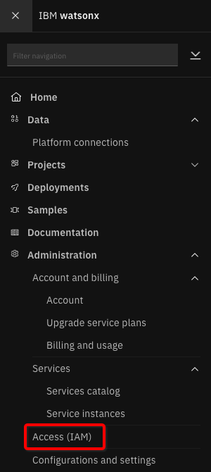
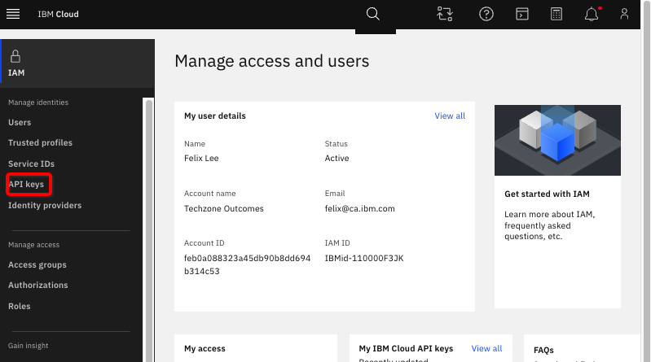
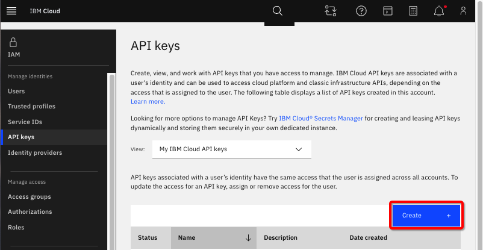

# 104: Utilización de notebooks de Jupyter con solicitudes

En secciones anteriores ha estado trabajando con la ingeniería de solicitud a través de la consola. Sin embargo, no es así como suelen funcionar los ingenieros de datos e IA. En esta sección, creará un cuaderno Jupiter para una solicitud y trabajará con solicitudes en un cuaderno de Jupiter en **watsonx.ai**.

## Obtención de una clave de API

Para ejecutar un cuaderno de Jupiter necesitará su clave de API. Si no ha generado uno antes, puede hacerlo siguiendo los pasos que se indican a continuación.

1.  Inicie sesión en IBM Cloud Console, o si está utilizando el Prompt Lab, puede pulsar el icono en la esquina superior izquierda.


Seleccione la opción **Acceso (IAM)** del menú emergente (es posible que tenga que iniciar sesión en la consola de nube).



2.  Seleccione **Acceso (IAM)** para poner en marcha el **Panel Gestionar acceso y usuarios**. Buscar y seleccionar el elemento de claves de API del panel de la izquierda.



3.  Sobre la **Teclas de API** panel, pulse **Crear**.



En el siguiente panel-necesita proporcionar un nombre. Puede utilizar cualquier nombre. En el ejemplo aquí, el nombre **Clave de api watsonx.ai** se utiliza. Haga clic en **Crear**.


4.  Se creará una clave de API para usted. En el panel resultante, tiene varias opciones:

*   Seleccione el icono "ojo" azul de la derecha para ver la clave
*   Copiar la clave
*   Descargar la clave


**Se recomienda** que usted descarga su llave. Esta clave se descargará en un archivo llamado **apikey.json**. Es posible que desee cambiar el nombre de este archivo para asegurarse de que se acuerda de lo que es. Si es necesario, siempre puede crear otra clave de API.

Es posible que vea este mensaje:


Simplemente cierre esta ventana y el **Teclas de API**.

Ahora que tienes la llave, estás listo para trabajar con el cuaderno de Jupiter.

Para obtener más información, consulte [Creación de una clave de API ](https://cloud.ibm.com/docs/account?topic=account-userapikey\&interface=ui#create_user_key).

## Creación de un cuaderno Jupiter desde una solicitud

Si recuerda desde el ejercicio de sesión de solicitud y solicitud, hay una tercera opción cuando elige guardar una solicitud, esto es lo que hará ahora.

1.  Abra el laboratorio de solicitud watsonx.ai y desplácese hasta el **Proyectos** y seleccione para abrir el proyecto que estaba utilizando. En un taller que establece el proyecto se le proporcionará. Si usted está ejecutando el laboratorio por su cuenta, lo más probable es que sea **Caja de seguridad de \[su nombre]**.


2.  En la lista de activos (bajo el **Activos**), seleccione la pestaña `{uniqueid}\_Flan\_ul2\_prompt\_session\_v1` sesión de solicitud que ha guardado en el laboratorio 103.


3.  Haga clic en **reloj**de la izquierda para abrir el historial de esta sesión de solicitud.


4.  Si el **Ahora** la versión no está resaltada, púlselo ahora.
5.  Seleccione **Guardar trabajo** y, a continuación, seleccione **Guardar como**.


Seleccione la opción **Cuaderno** teja y rellena los campos de la siguiente manera:

*   Utilice el **Nombre** `{uniqueid}_Flan_ul2_notebook_v1`
*   Utilice el **Descripción** `Jupyter notebook, Flan ul2 prompt`
*   Seleccione **Ver en el proyecto después de guardar**
*   Pulse en **Guardar**


6.  **Watsonx.ai** abrirá el cuaderno Jupiter con el contenido de la solicitud.


7.  Haga clic en **lápiz** en la barra de menús superior para ir a la modalidad de edición.


<Warning text="Ahora puedes trabajar con el cuaderno Jupyter" />

8.  Inspeccionar el cuaderno y las distintas celdas

La primera celda es la celda de configuración. **Watsonx.ai** ha rellenado automáticamente todos los datos necesarios, como wml\_url, y configura una clase de inferencia que realiza una llamada REST API al modelo **watsonx** foundation para generar una salida a partir de tu entrada. Esta parte del cuaderno no es el objetivo de este laboratorio, por lo que no dedicarás más tiempo a esta celda.

9.  La siguiente celda define las credenciales necesarias para trabajar con la API watsonx. Cuando ejecutes esta celda, se te pedirá que introduzcas tu clave API.


Debe introducir su clave API y "pulsar enter" como se le indica, antes de ejecutar la siguiente celda. Se le pedirá cada vez que introduzca su clave API. Como solución alternativa, puede modificar el código cambiando la línea `apikey`:

```py
# from
apikey = getpass.getpass("Please enter your api key (hit enter):"),
# to
api = "[your API key]"
```

Por ejemplo, puede tener este aspecto:


Después de este cambio, no necesitará proporcionar su clave para cada sesión de ejecución del bloc de notas.

10. La siguiente celda identifica el modelo que está utilizando. Para los 5 modelos disponibles, estos son los nombres respectivos que debe utilizar para **model\_id** en un cuaderno Jupyter:

*   **flan-ul2-20b** model\_id="google/flan-ul2"
*   **flan-t5-xxl-11b** model\_id="google/flan-t5-xxl"
*   **gpt-neox-20b** model\_id="eleutherai/gpt-neox-20b"
*   **mpt-7b-instruct2** model\_id="ibm/mpt-7b-instruct2"
*   **mt0-xxl-13b** model\_id="bigscience/mt0-xxl"
*   **starcoder-15.5b** model\_id="bigcode/starcoder"
*   **llama-2-70b-chat** model\_id="meta-llama/llama-2-70b-chat"

11. La siguiente sección contiene una lista de los parámetros del modelo que puede actualizar. Son los mismos que desde la interfaz de usuario.

*   **decoding\_method** greedy or sample
*   **min\_new\_tokens** 0 o mayor
*   **max\_new\_tokens** entero positivo
*   **temperatura** 0,0 a 1,0
*   **top\_k** 0 a 100
*   **top\_p** 0,0 a 1,0
*   **pena\_repetición** 1,0 a 2,0

Ahora que has puesto tu clave API en el cuaderno, puedes experimentar fácilmente cambiando estos parámetros de configuración de tiempo de ejecución y ver cómo pueden afectar a la salida.

Por ejemplo, pruebe a cambiar los valores de **max\_new\_tokens** en combinación con diferentes valores de **repetition\_penalty**; y cambiando los valores de **top\_p** y **top\_k**.

12. La siguiente sección define el id del proyecto, no deberías necesitar tocarlo.


13. La siguiente sección es su "prompt" - su entrada en el motor de inferencia.


*   Desde el punto de vista del modelo, todo lo que hay entre el par de comillas dobles triples ("") es la solicitud.
*   Tenga en cuenta que éste era el ejemplo de pregunta de una sola vez en el que trabajó anteriormente. Al hacer esto (de forma similar para few-shots), simplemente lo inserta antes de la sección de la que desea obtener resultados.
*   Puede utilizar este cuaderno para probar rápidamente un ejemplo de *"pocos disparos*": sólo tiene que insertar otra sección de muestra en la celda.
*   Otro punto importante que debe recordar es que aquí las palabras **Entrada** y **Salida** no son *"fijas"* y puede cambiarlas. Debería intentar cambiar Output por algo diferente como Summarize o Conclusion. Si lo cambias, podrías cambiar también el Output en el one-shot (en medio del cuadro de texto), o tu respuesta podría ser sorprendente.
*   Tenga siempre en cuenta que NO se trata de un humano leyendo la entrada como lenguaje natural. Un modelo ve la entrada como una serie de tokens, y está calculando la probabilidad - cambiar palabras en lugares clave (como la última palabra en el prompt) puede tener impactos interesantes.

## Resumen de la sección

*   En esta sección, has aprendido a crear un cuaderno Jupyter desde el Prompt Lab.
*   Necesitas tu propia clave API para utilizar el cuaderno, puedes introducir la clave API en el cuaderno, por lo que no necesitas proporcionarla en cada ejecución.
*   Puede utilizar el bloc de notas para probar rápidamente a cambiar el indicador, el modelo o cualquiera de los parámetros de configuración.
